    Civilization VI Content Creation        

# Civilization VI Content Creation

Animation

Animation (.anm)

Animations consist of animation track information for one or more bones. Currently we support importing geometry directly from 3DSMax and Maya

Using the Asset Editor

-   In the Asset Editor go to 'File > New' and select Animation from the list.
    

-   In the Class Name dropdown select the class that you want (1). It can be tricky to change the class for entities after they are created, so try to make sure you have the correct class.
    

-   Click on the line for '_**Source File Path**_' (2), and browse to the Max or Maya file that has your animation.
    

-   When you select your file, the editor will parse the file and find which animation objects are available for export. This will fill out the '_**Source Object**_' dropdown (3) with all the available animations for you to pick from, so click the dropdown and select the animation object that you want.
    

-   The '_**Name**_' (4)of the animation will get set automatically to the name of the source object, but you can change it to whatever you want before saving the Animation.
    

-   Go to "_**File > Save**_" and you're done.
    

ArtDefFiles

Working with ArtDef Files

ArtDef files are XML files that tell the engine how to use assets and entities packaged in BLP files.

ArtDef files reference XLP entries and add meta information needed by the engine to correctly render the XLP entry. Because each engine system requires different information ArtDef files are structured differently for each system.

You can edit ArtDef files using the Asset Editor. Simply click the Open an existing art definition document and select the ArtDef file you wish to edit. Most of the ArtDef files you will need have been created already for you.

Generally, ArtDef files consist of **Collections** and **Parameters**. Collections are unbounded lists of elements which you create. Each element has a finite number of Parameters which you edit. An element can also contain one or more Collections.

A Collection can be identified by a triangle to the left of it, which is used to expand it. You can **right click** on a Collection and add a new element to it, which is automatically named after the Collection and appended a running count.

Parameters cannot be expanded and upon selecting them the right-hand pane allows you to edit their value. ArtDefs support different Parameter types:

-   **Integer** (a whole number, e.g. 42),
    
-   **Float** (a decimal number, e.g. 4.2),
    
-   **String** (ASCII text, e.g. "forty two"),
    
-   **Boolean** (true or false),
    
-   **Enumeration** (drop-down selection from a pre-set set of values, e.g. 2 from 1, 2, or 3),
    
-   **RGB** (red-green-blue color values 0-255 for each color, e.g. R:122 G:255 B:34),
    
-   **2D Coordinate** (a two-dimensional coordinate along X and Y axes, e.g. X:0.5 Y:1.2),
    
-   **BLP Entry** (the identifier from an XLP file referencing an asset or entity, e.g. Features\_Marsh),
    
-   **ArtDef Reference** (a reference to another ArtDef entry in the same file, e.g. Collection1), and
    
-   **Collection** (an array of Parameters, e.g. \[42, 13, 55\]).
    

ArtDef files are parsed directly by the engine, so the only way to discover any mistakes made is to save your changes and run the game. ArtDef errors usually manifest through so-called assertions, which are pop-up dialogs with a red X. Usually they tell you what is wrong and sometimes even how to fix it.

BuildingsProcess

Concept Process

Monday, July 13, 2015

1:23 PM

Steps 

1.  Talk with Design, or make sure you understand the design purpose of the structure. – Discussion with team (Kat, Matt and Brian – Design if necessary)
    
2.  Loose thumbnails – rough layouts and shapes. 6 -10 at least. These shouldn’t take much time. General massing and rough shapes. – Approval
    
3.  Thumbnail that incorporates feedback. – Approval Needed
    
4.  Move onto final B/W line art – Approval Needed
    
5.  Final Color - Small tweaks may be necessary at this point, but nothing major. Final Approval Needed
    

Points to keep in mind

1.  Hex point should be on bottom of page.
    
2.  Lighting source is from the SW (See game)
    
3.  Safe frame should be indicated.
    
4.  Thumbnails should really push the shapes of the buildings for each thumbnail. Try multiple different shapes for buildings and not just focus on arrangement of one set.
    
5.  Want to see it in reference to other buildings for scale purposes.
    
6.  Moving on to other tasks is fine when waiting on feedback.  
      
      
      
    \-When concepting a building always make an effort to include scale context using screenshots or other existing buildings for comparison. How big will this structure ACTUALLY appear to be on our map? For example:
    
7.  
    

_What to consider when asking for or providing Feedback:_

_\-Does it hit our art style?_

_\-Does it solve the visual problem it needs to solve?_

_\-What are the reasons behind your visual choices?_

**Concept Stage and Timeframe:**

When a piece is emailed out for crit the concept artist should make an effort to clearly state the _**Stage**_ of the assignment and their best estimate of a _**Timeframe**_ for delivery if they have one. For example, “These are my _early exploratory sketches_ **(Stage)** for X so I’m exploring some pretty wild pie in the sky things. However, I have about a week left **(Timeframe)** before we want to try to zero in on a final design for X,” or “This is my final design **(Stage)** for Y. Our goal is to send it to the modeling team this afternoon **(Timeframe)**”

Try not to let emails asking for feedback go unanswered. Even a simple “Looks great! Keep going!” is better than silence. If you believe the piece hits all the marks it needs to hit then say so. If you have thoughts or feedback but need some time to formulate them before sending them over then say so. “Hey Beth, I’m pretty bogged down in my own painting at the moment, but I have some thoughts about your vampiric empire hovercraft assignment. How about we round up about it later?”

**Email Sucks For Conveying Concept Feedback:**

When possible, all feedback or critique should be conveyed in person, verbally. If goals or changes are decided on during the verbal communication they should then be documented in a succinct email so that no one forgets what was said and they can get right back on track after their week long vacation to wrestle ice gators in Antarctica where they will probably forget all about what concepts they’d been working on. “Frank and I talked about the laser cannons on his giraffe creature concept this morning. We agreed that they need to be much bigger and maybe he should try green lasers instead of purple lasers. Well, folks, I’m off to wrestle some ice gators. See you in a week.”

When giving someone feedback you should be clear about what you believe is a must-do and what is merely a suggestion. “I think you definitely need to change the size of the dragon’s horns. It needs to have horns larger than the other dragons because our design team has specified this as the _Great Horned Dragon_. Maybe you could also try adding some spines to make it look more menacing?”

_Documentation_

**Tell a Story:**

All concepts have a narrative from their early stages to their completion. Document this story somewhere! It can be informally in an email, or formally via One Note or Discourse or whatever documentation platform the team has agreed upon for the project but DO write it down somewhere and do it consistently for each piece you produce as the narrative unfolds. This will come in handy months down the line when you’ve long forgotten why that purple dolphin helicopter went through so many iterations. A good example in our One Note right now is John Curtin's Leader Concept page: (link following )Concept

“**First** I began by gathering reference images (link to ref image folder) **then** I drew a few pages of rough sketches (link to the rough sketches.) **After that** I spoke with my lead and art director and they both agreed that sketch #16 was the strongest. **Next**, I refined that sketch (link to the sketch) and presented it again. My art director liked where it was going but decided that the design needed more laser cannons. **Next**, I revised the design to include more laser cannons (link to revised design) **and then** worked it up to a final stage (link to final concept)”

**Save Your Ref:**

_Always_ save all of the reference images you used in a little folder with your concept. This is particularly important if you photobashed anything or borrowed closely from an existing design in a photo or painting. Do the same for fonts or other resources.

**Folder Structures and Naming Conventions:**

![Machine generated alternative text: Organize Computer New Volume (D:) projects 8ALW-K8ERKLEY virtual_clv6-Art ArtDev Buildings Villages Barbarian Village 01 Concept Industrial Barb Architecture Include in library Share with REF Slide show New folder Favo rites Desktop Downloads Recent Places Libraries Documents Music AOY Pictures OSEO Videos Computer os CG New Volume (D:) Network CSX2kgames.t2.corp) (N:) Barb Architecture ScaKlI Barb Architecture SketchesKBOI Barb Architecture SketchesK 2 Barb Architecture Sketch C oncepr 06 kberkley CN12kgames.t2.corpXNetworkX2KGBALXUsel ](BuildingsProcess/media/image2.png)

Buildings Art Style Breakdown

Monday, August 29, 2016

2:21 PM

The shapes of our buildings are **simple**, **exaggerated** and **chunky**!  
  
Remember that our players will often be looking at these buildings from really far away. They may have hundreds of buildings on the screen at once and they need to be able to pick them out of a crowd. A good rule of thumb is to imagine them as little toy models rather than representations of real world buildings.  
  
\-Big, simple shapes  
\-Roof detail is important because of the player camera angle. Avoid blank roofs  
\-Focus on shape clusters. Groups of 2-3 with varied heights work well  
\-Keep things simple. Avoid too much visual noise

\-Avoid straight lines where possible  
\-Avoid making all of your shapes the same size  
 

_**_SHAPES:_**_  
Divide forms into _**Big Shapes**_, _**Intermediate Shapes**_ and _**Fine details**_ with a 3, 2, 1 ratio. Your _**Big Shapes**_ are things like the entire body of the house or the entire roof. Your _**Intermediate Shapes**_ are things like awnings or really big beams or balconies or chimneys. Your _**Fine Details**_ are things like itty bitty planks of wood or individual bricks or clumps of thatch.  
  
Example:  
 

The **Big Shapes** and **Intermediate Shapes** should be the only ones that that really affect the silhouette of your buildings. Don't focus too much on the fine details. Think about the _**Big Shapes**_ of your buildings first.  
  
 

\-Break the silhouette with your **Big Shapes** and **Intermediate Shapes**  
\-Keep your shapes fun and wonky. Avoid boring straight lines  
\-Avoid making all of your shapes the same size  
\-**If you dropped a marble on it would it rest there quietly or would it roll? It should roll!  
  
  
  
  
**Concept Checklists

Wednesday, September 21, 2016

11:17 AM

**Improvements  
**1)Are you considering the hex tile safe frame boundaries?  
2)Are there any opportunities for animation?  
3)How will you distinguish between a Worked state vs an Unworked state?  
  
 

Building Modeling Pipeline

Monday, August 10, 2015

10:42 AM

This section will describe many areas of the building pipeline, from texturing to setting it up in engine.

List of resources:

Hex with safe zone

\\ArtDev\\Reference\_Files\\Official\_Hex.max

3dsmax Unit Setup

Building Textures

Thursday, July 17, 2014

4:27 PM

Texturing, in most cases, should be done using a modular, atlased approach, which results in a mostly grid-like texture set. Obviously there will be things which need explicit mapping or peaks which might stray from that but try to keep it as modular as possible. The typical texture size is roughly 128 pixels per story. While we are using a PBR model for the game, because our assets are so small on the screen, real-time shadows and ambient occlusion are often tough to see. As a result, placing shadows in the textures still seems to be a viable method that works. Below are a few examples: (left, industrial city), (mid-left, modern city), (mid-right, encampment), (right, Big Ben), bottom (Mughal with color variants).

Using a gray diffuse and gradient ramp for gloss only. White: more gloss, Black: less gloss. Notice you don't really get any shine till you hit about 50% gray.

Asset name: Material\_Gloss\_Test

Using the same map for gloss and metalness at the same time. Notice metalness makes your basecolor black (+ ambient). The more metalness the more chrome-like it becomes. Asset: Material\_Metalness\_Test

Gloss Left, Metalness/Gloss Right

Gloss map example, Barracks - the value variation creates more contrast in the way the light hits the shingles on the roof.

Normal map generation seems to work quickest through Ndo or Crazybump. The normal map support is generated by taking the basecolor and removing any lighting, simplifying the shapes and considering the heightmap of the texture. There shouldn't be any situations where the normal support is made by just desaturating the basecolor.

Below samples - Left: Basecolor, Middle: Normal support correct, Right: Normal support incorrect

Ndo workflow order

One last consideration: normal maps are our friends!

We have basic functionality for tint masks on Districts. The TintMask texture is simply a black and white texture assigned to the TintMask slot in the asset. The color can be previewed in the Lighting tab and assigned in the Landmarks > District artdef.

New functionality has been added for AO maps. We now can assign ambient occlusion to the _asset_ instead of on each material contained within that asset. Asset-level AO will overwrite any material based AO on that particular asset. Otherwise it will default to the individual material AO maps. This is an important tool for multi-sub assets. (this is also outlines in Building Naming Conventions).

District/Improvement Setup

Wednesday, August 17, 2016

1:38 PM

There are typically 7 elements when it comes to setting up Districts and Improvements

1.  **_Tilebases_ (TB)** - These are the base asset which hold any combination of attachments and herobuildings and typically are paired with a matching decal.
    
2.  **Attachments** - An individual asset which is referenced by a tilebase. Has terrain following and culling.
    
3.  **Herobuildings (HB)** - Main building assets which are usually referenced by gameplay and are part of a tilebase.
    
4.  **Decals** - Can be part of a tilebase or an attachment - a second geometry added to an asset.
    
5.  **Obstruction Blockers (OBs)** - Used to cull out resources (or curve a road around them in the case of certain improvements). The do not prevent roads from entering into the hex.
    
6.  **Road Connection Points (RoadCP)** - Use to connect roads to a district/improvement at given points. Usually try to shoot for 1 per hex-edge.
    
7.  **FX Nodes** - Can be placed on tilebases, attachments, or herobuildings.
    

Let's look more in depth at each one:

**Tilebases**

Below illustrates a typical district setup. This is the production (PRD) district, industrial era.

Improvement tilebases (not pictured here) do not usually contain herobuildings and therefore are typically limited to only era tilebases (4). Districts, on the other hand, have a progression of herobuildings and will require many more tilebases to accommodate both them and the era changes. The only way you can save time and energy when it comes to district tilebases is if your layout doesn't change in the Ancient > Industrial eras where you can make all adjustments on decal materials in editor.

All models you see here are attachments.

The TB on the far left is one which has no herobuildings in it. 1. indicates where the first HB (Workshop) will go and so the attachments have been removed from this area to accommodate for it. The third TB makes allowances for both the Workshop and 2. where the (Factory) will go.

1.  Tilebase attachment point helper object (DIS\_PRD\_Industrial\_Base\_01)
    
2.  Tilebase decal point helper object (DIS\_PRD\_Industrial\_Base\_01\_Decal) (this is typical for decal naming conventions)
    
3.  Road Connection Points
    

**Resource Assets**

Tilebases that get various resources added to them are done a little differently.

First, you need resource attachments. (See more on attachments below).

Attachments will ultimately get their resource name culled from the attachment. In this example, I have a Deer asset named RES\_Deer\_Bld\_A and a Fox named RES\_Fox\_Bld\_A. So my attachment helpers get that name with the resource name culled (RES\_Bld\_A). On import, you will be asked what type of resource tilebase you are using if the Editor finds 'RES' in the tilebase asset attachments anywhere.

**Attachments**

These can either be assets that live in the tilebase Max file or in another Max file. General rule of thumb is if they are specific to a certain improvement or tilebase then keep the attachments in that file.

The above example shows an attachment in the PRD district file. Windmill on the left (DIS\_PRD\_Windmill) is the Worked version in the game (with bones for animation). The pivot is place where you want the object to sit. The windmill on the right (DIS\_PRD\_Windmill\_PIL) is the pillaged version. It should have the same pivot. Most attachments do not get CON (construction) states.

Original attachment names are **extremely important**. These are the name the cloud uses to reference that asset and its references. Once these are created they're locked in (unless you go through the painstaking task of deleting from the database and creating a new asset). After naming the original attachment (and making sure its transforms are reset), you can copy the attachment around on the tilebases, making references. Later in the editor, PROP\_Barrel023 will have its numbers removed, making it PROP\_Barrel and looking for PROP\_Barrel in an XLP (which references the original asset).

**Herobuildings**

Similar to attachments, herobuildings typically live inside the Max file they're referenced by. They differ in that their pivots are typically located based on their placement inside the hex/district and they typically have both PIL and CON states. Example:

Far left: Worked state. (DIS\_AQD\_Bath) Middle: PIL and CON building state (DIS\_AQD\_Bath\_PIL) Right: CON scaffolding (DIS\_AQD\_Bath\_CON)

By using the same geometry for the PIL and CON states, we save time and performance/memory. It also saves us texture space for AO maps.

**Decals**

As indicated above, decals are a separate geometry within an asset. Therefore, they get their own point helper in which their parented to (\_decal). We'll get into the setup later, but each decal usually includes an ancient era decal and then an additional era decal above it.

Building Decal Heights

Ancient Decals: 6-10 units +Z from pivot

Classical-Modern Road Decals:  11-15 units +Z from pivot

Other decals which sit on top of the road: 16-20 units +Z from pivot

Burn/Damage Decals: 21-25 units +Z from pivot

**Obstruction Blockers (OBs)**

As started above, OBs do the following:

1.  Prevent city buildings from entering into an area and culling out any attachments inside that area (Districts only)
    
2.  Remove resources from the covered area
    
3.  Make roads wrap around the given area (Improvements only, if no CPs are present)
    

Example of OB used in Pasture improvement (in this case road would wrap around that OB). OB (pink) can be turned on and off in the Editor.

Blockers do not get made for individual attachments, just tilebases.

Blockers are generally made quickly my drawing out the borders with a spline in the top view and assigning an Edit Mesh modifier to it. They should be 2D, no height information, pivot centered to the tilebase Point Helper object, and ended with the \_OB suffix. (example IMP\_Pasture\_AN\_OB)

**Road Connection Points (RoadCP)**

As described above - try for 1 per hex. Made with Point Helpers. Road connects and is aligned on the Y+ direction. These should be named Road\_CP(XX) in Max.

**FX Nodes**

When possible, put FX nodes on the attachments, not the tilebase (as they instance as well). FX nodes can be turned on and off in any state and can receive any sorts of transforms. They can be parented to any portion of the asset but typically are parented to the helper object of the asset.

FX nodes are usually labeled FX\_(effecttype). (example FX\_Smoke)

District/Improvement Import

Wednesday, August 17, 2016

1:38 PM

As a reminder from before, these are the elements you will typically find in a district or improvement:

1.  **_Tilebases_ (TB)** - These are the base asset which hold any combination of attachments and herobuildings and typically are paired with a matching decal.
    
2.  **Attachments** - An individual asset which is referenced by a tilebase. Has terrain following and culling.
    
3.  **Herobuildings (HB)** - Main building assets which are usually referenced by gameplay and are part of a tilebase.
    
4.  **Decals** - Can be part of a tilebase or an attachment - a second geometry added to an asset.
    
5.  **Obstruction Blockers (OBs)** - Used to cull out resources (or curve a road around them in the case of certain improvements). The do not prevent roads from entering into the hex.
    
6.  **Road Connection Points (RoadCP)** - Use to connect roads to a district/improvement at given points. Usually try to shoot for 1 per hex-edge.
    
7.  **FX Nodes** - Can be placed on tilebases, attachments, or herobuildings.
    

Typical importing workflow:

**Import Attachments**

First, import your attachments. The longhand method would be to go under File > New in Asset Editor and select Asset from the list. This only does one asset at a time.

That method is longer and serves only as a backup in the event scripts are broken.

Instead, use File > Run Scripts and navigate to _C:\\Program Files\\Civ6\\Asset Cloud - Civ6\\AssetEditor\\Scripts._ This will do one or multiple assets at a time.

Run _Create\_Assets\_From\_Source\_File.py_

The next dialog will give you a list of classes to choose. Tilebase attachments (which are used in Districts, Improvements, and Wonders) will always be the Tilebase class. After this, you will be prompted for a Max File and assets within that Max File which you would like to make attachments out of. Select the assets you want (as Landmarks) and import. The time it takes for this is dependent on how many assets you're importing.

After import it will prompt you to put the assets in an .xlp. Tilebases go in the Tilebase.xlp. If that .xlp is open in the Asset Editor, it will automatically added them without prompt. As always, _**_make sure you have the latest .xlp before adding your new assets to it_**_.

**Import Tilebases**

Tilebases are imported the same way attachments are except they should have their attachments flagged in Max with _Export as Bone_.

![Machine generated alternative text: Firaxis Model Manager Objects In Scene Objects To Export Clear List Advanced IJVW Remo ve Perspective Ma tch Selected Object DIS PRO ald A002 V Ex»rtasaone Llse Granny Tangents Clean Scene TileBase Cleanup o o o o o o o o o o o o o o o o o o o o o o o o o o) DIS DIS DIS DIS DIS DIS DIS DIS DIS DIS DIS DIS DIS DIS DIS DIS DIS DIS DIS DIS DIS DIS DIS DIS DIS DIS Pot Pot Pot Pot Pot Pot Pot Pot Pot Pot Pot Pot Pot Pot Pot Pot Pot Pot Pot Pot Pot Pot Pot Pot orange007 Orange012 Orange014 OrangeOIS Orange016 orange017 Orange018 OrangeOIg orange020 Orange021 orange022 Orange024 orange025 orange026 orange027 orange028 orange02g orange030 Orange031 orange032 orange033 Orange034 orange035 orange038 ald A ald 4001 DIS DIS DIS DIS DIS DIS DIS DIS DIS DIS DIS DIS DIS DIS DIS DIS DIS DIS DIS Pot Pot Pot Pot Pot Pot Pot Pot Pot Pot Pot Pot Pot Pot Pot Pot Pot OrangeOIg (Bone Only) Orange020 Gone Only) Orange021 (Bone Only) Orange022 (Bone Only) Orange024 (Bone Only) Orange025 (Bone Only) Orange026 (Bone Only) Orange027 (Bone Only) Orange028 (Bone Only) Orange02g Gone Only) Orange030 (Bone Only) Orange031 (Bone Only) Orange032 (Bone Only) Orange033 (Bone Only) Orange034 (Bone Only) Orange035 (Bone Only) _Orange038 (Bone Only) ald A ald 4001 (Bone only Granny Models in Expy t List DIS DIS DIS DIS DIS Num PRO Factory PRD Classical Base 01 PRD Classical Base 01 Decals PRD Classical Base 02 Decals PRD Industrial Base 03DecaI of Granny Models: 169 V Auto-sync Selecton ](BuildingsProcess/media/image33.png)

Notice the difference. Attachments will have geometries listed as well as meshes listed under that.

![Machine generated alternative text: Properties Name IMP SILO Launch Pad Class Name Tile Base Desc ri pticn Landmark Activated M... M... Last Refreshed At: 3:34:45 pm Time Of Day: Day Text (I items) Tile Base Animations Particles Behaviors Burn Defat Categorization Tags Cook Params Geometries Attachments IMP SILO Launch _ Pad (IMP SILO Launch _ Pad); Vettex Count: ICE2; Primitive Count: 738; Bone Count 2 IMP SILO Launch Pad PIL (IMP SILO Launch Pad PIL). Vertex Count: ISO. Primitive Count: 1065. Bone Count IMP SILO Launch Pad PIL Decal (IMP SILO Launch Pad PIL Decal); VertexCount 8. PrimitiveCount 4. BoneCount 2 Mesh IMP IMP IMP IMP IMP SILO SILO SILO SILO SILO Launch Launch Launch Launch Launch Pad Pad Pad Pad Pad Group IMP SILO IMP SILO IMP SILO IMP SILO IMP SILO B... Worked U nwor ked B.. . Pillaged Constructi Unbuilt State Material IMP SILO IMP SILO IMP SILO IMP SILO IMP SILO Visible v I FOWMateriaI Base B ase Base B ase Base True T rue False False FOW/DefauIt M aterial FOW/DefauItMateriaI FOW/Defau It M aterial FOW/DefauItMateriaI FOW/DefauIt M aterial ](BuildingsProcess/media/image34.png)

Tilebases do not have this. All of their information is contained at the attachment level.

![Machine generated alternative text: IMP SILO.ast IMP SILO Launch Pad. ast et H reviewer Last Refreshed At: 3:3444pm Time Of Day: Day Behaviors Properties Basic Name Class Name Desc ri pticn Animations Particles IMP SILO Tile Base Text C ategorization Tags Cook Params (I items) Tile Base Geometries Attachments IMP SILO (IMP SILO); Vertex Count: O. Primitive Count: O. Bone Count O IMP SILO Decals (IMP SILO Decals); VertexCount 940. Primitive Count 582. Bone Count 73 IMP SILO Launch Pad PIL (IMP SILO Launch Pad PIL). VertexCount 1660. PhmtiveCount 1065. Bone Count IMP SILO Launch Pad PIL Decal (IMP SILO Launch Pad PIL Decal); VertexCount 8. PnmtiveCount 4. Bone Count 2 Mesh Group State ](BuildingsProcess/media/image35.png)

This means that states, covered later, are done at the attachment level (not the tilebase level)

**Import Herobuildings (Districts only)**

Importing is the same as Tilebase assets. Herobuildings, like Tilebases, may contain attachments. Attachments cannot support other attachments, however. Herobuildings get added to the _Herobuildings.xlp_.

**Geometry States and Parameters**

![Machine generated alternative text: Cook Params Geometries Attac h ments Animations Particles Behaviors Burn Material Default Burn M aterial IMP SILO Launch _ Pad (IMP SILO Launch _ Pad:.; Vettex Count: ICE2; Phmitive Count: 738; Bone Count 2 IMP SILO Launch Pad PIL (IMP SILO Launch Pad PIL). Vertex Count: ISO. Primitive Count: 1065. Bone Count IMP SILO Launch Pad PIL Decal (IMP SILO Launch Pad PIL Decal); VertexCount 8. Primitive Count 4. Bone Count 2 Mesh 1M P SILOLaunchPad Mesh Mesh Mesh Mesh Group IMP SILOBase Stat U nwor ked Pillaged Construction U nbuilt Material Visible True T rue False False True FOWMateriaI FOW/DefaultM FOW/DefauItMateriaI FOW/Defau It M aterial FOW/DefauItMateriaI FOW/Defau It Mate rial IMP IMP IMP IMP IMP SILO SILO SILO SILO SILO Base B ase Base B ase Base IMP SILO IMP SILO IMP SILO IMP SILO Launch Launch Launch Launch Pad Pad Pad Pad IMP SILO IMP SILO IMP SILO IMP SILO B ase Base B ase Base ](BuildingsProcess/media/image36.png)

The red circle indicates how to bring in new or existing geometries. You can use this to add decals to your asset (tilebase decals, pillaged decals, etc.) or PIL or CON states (as outlined in District/Improvement Setup)

**Mesh** indicates the name of the geometry in the Max file.

**Group** is the name of the material assigned to the asset in the Max file.

**State** is used for visibility of the asset. In this case our non-destroyed version is set to be visible in the Worked/Unworked/Unbuilt states. The PIL geometry would be set to True for the Pillaged and Construction states. This can vary from asset to asset. Improvements, for example, have specific Worked and Unworked states and may have assets turned on and off during those states.

**FOWMaterial** can usually be left to the default. If an asset has transparent edges there is a "No Lines" version of the material which turns off the transparent geometry edges.

**BurnMaterial** is on Pillaged states by default. It applies a burn shader to the pillaged version of the asset programmatically.

**Adding attachments and parameters**

So how do we get the attachments on the Tilebase?

They are already assigned to the asset, we just cannot see them yet. Currently there is a script which will update attachments on an asset. It will add any new attachments to the tilebase. It is _Update\_Asset\_Attachments.py._ This will look at any bone objects you have parented on an asset and make an attachment for it.

If you are doing an asset which uses resources (meaning, there are bones with the name RES in it) it will ask if you want to assign resources to it by asking you what type of resource asset it is. Setup for this was previously discussed.

The editor _does_ allow us to add our own attachments directly (without having them in Max) but this is typically used by FX artists who don't want to deal with Max files. This button is circled below.

![Machine generated alternative text: Filter: acne Name Position o.o.o Rotation Scale Asset IMP IMP IMP IMP Connection Type NONE NONE NONE NONE Rescu rceTy pe Terrain FollowMode Pivot Height Pivot Height Pivot Height Pivot Height I Cull Mode VI TerrainType RandomizeAnims Model Instance Point Name Fort Truck Modern Fort Truck Modern002 SILO Contr01001 SILO Launch Pad001 IMP IMP IMP IMP IMP IMP IMP Fort Truck Modern Fort Truck Modern002 SILO Contr01001 SILO Launch Pad001 Fort Truck Modern Fort Truck Modern SILO Control SILO Launch Pad IMP IMP IMP IMP SILO SILO SILO SILO DON DON DON DON 'T CARE 'T CARE 'T CARE 'T CARE OPTIONAL OPTIONAL OPTIONAL OPTIONAL DON DON DON DON 'T CARE 'T CARE 'T CARE 'T CARE True T rue True True ](BuildingsProcess/media/image37.png)

Let's look at parameters.

**Attachment Point Name** is the name of the asset in Max. You can rename this without it affecting anything but by default it does use the name in Max.

**Model Instance** is the name of the parent the attachment point is a child of.

**BoneName** is the literal asset name in Max that a bone was created out of. You can assign this to other bones if you want to make the asset appear somewhere else but by default this is typically left alone.

**Position, Rotation, Scale** allow for manual transforms on an attachment in the Editor. This can end up desyncing Max files so use with caution.

**Asset** is the name of the asset being attached to the attachment point. Notice the numbers have been removed as discussed in District/Improvement Setup**.** If it is an effect, it should not have anything here.

**Connection Type** refers to road connections. If you have your helpers named _Road\_CP_ in Max, this will default to _Road_.

**ResourceType** used for resource types if you have an asset which uses a specific asset on a specific resource hex, such as mines and quarries.

**TerrainFollowMode** Pivot is the default and usually what you want. Average and maximum both sample the bounding box and place the asset accordingly. None uses no terrain following.

**CullMode** _Optional_ (default) - makes the asset get removed by city buildings, roads, and bodies of water. _Important_ - only gets culled from water. _Permanent_ - never gets removed.

**TerrainType** will set the asset to render only on certain terrain types.

**RandomizeAnims** offsets animations on a given attachment, creating variation across the same repeated attachment.

**FX**

Any FX nodes you create should show up on the attachment list as stated above. And again, there should be no assets attached to it.

FX can be done manually or with a script.

**Manually**

![Machine generated alternative text: DIS CTY Properties Name Class Name Desc ri pticn MGG Block_LG SQ01ast DIS CTY MGG Block LG C ityB lock Standard Landmark Asset Previewer Last Refreshed At: Time Of Day: Day Type W'avior ktachment P oint Duration TimeSeconds Global Previewer Info CityBIock Base Camera H Knobs Reset Lighting Hide Skybox Text Color Sac kgrcu nd Color Skybox Toggle Joints Toggle Joint Names Toggle Wireframe Show FOW Toggle Decals Expand Decals AlphaFade Graph ics Settings Text (I items) C ityB lock Animations Particles Behaviors Categorization Tags Cook Params Geometries Attachments Filter: Attachment Point Name FX_Light Blink FX Smoke EX Smoke005 Asset Trigger : Properties PILLAGED A H,'ORKEC Acti on ArtOefVFX Asset VFX Asset VFX Light Trans fer Model Instance DIS CTY MGG DIS CTY MGG DIS CTY MGG Position History Bone Name FX_Light Blink EX PIL EX Smoke005 Block LG 01 Default DIS CTY Bock LG SQ_OI Attachment Point EX Smoke005 FX_Smoke LG_SQOI_ Reset To Defat Attac DIS CTY MGG Block LG DIS CTY Base Motion Display Transform Asset VFX FX FX Smoke005 Asset Previewer LOOP Building_Steam (FX SmokeOOö) Light Fader Red Building (FX Light Blink) ](BuildingsProcess/media/image38.png)

You can see the FX attachments on this asset in the middle. Just like animations, you need to have a DSG assigned. First, (1) Create a Timeline. Name it whatever the state is under animations. In this case, the asset has two timelines, Worked State (light blinks at night and steam effects) and Pillaged State (burn smoke). Here was can see the WORKED\_A timeline was created. (2) Beside Asset VFX (where the red line is), R-Click and create a new keyframe. Keyframes can then be selected (3) and have an effect assigned to it (4). Asset refers to the effect that will play and Attachment Point refers to the bone you want that effect to play on. If it is a loopable animation, Duration should be set to -1.

(5) shows options to toggle on the bone and bone names in the event you need to troubleshoot an effect not playing properly.

Currently this system is a little buggy and sometimes requires a close down and re-open of the asset to work.

**Script**

The script can save a ton of time in regards to FX setup. Go to File>Run Script and select _Add\_FX\_To\_Tilebases.py._

![Machine generated alternative text: a Assign FX to Tilebases Fltter AO Emitter Large Archer Amow Trail Balloons FAce Radial 3D Face Velocity AA aplo Aero Windsock ArcraftCamer AntiAr Muzzleflash ArcraftCamer BowWake Wake ArcraftCamer Bow Wake Aircraft Camer Wake Airstrip Windsock AmphitheaterFIag AntiAr Muzzleflash 01 Fltter kt achment P Oint WORKED A Add Assets FXto Add FX Duration - Process Assets Apostle Apostle Apostle Apostle Apostle Apostle Dirt Grass Sand Snow Water ktack Ground O ktack Staff 01 Martyr 01 Shock Ground O Sparkles In 01 Arc Sparks Burst Arc Sparks Continuous Arc Sparks Parent Arc Sparks Wonder Animation Add FXto Selection ](BuildingsProcess/media/image39.png)

First, select _Add Assets_ in the upper right. This will prompt you with a dialog which will allow you to select a group of assets to add FX to. _Important! These assets must already have attachment bones for FX added to it._

![Machine generated alternative text: Assign FX to Tilebases Rher blink 2 02 2 04 2 06 2 08 2sec 'sec 7%ec Animation Fltter ktachmentPoint 02 PIL DIS DIS DIS DIS DIS DIS CTY CTY CTY CTY CTY cry CTY CTY MCG MCG MCG MCG MCG MGG Block Block Block Block Block Block Block Block so SQ SQ SQ SQ so SQ SQ Add Assets FXto Add 01 01 02 02 03 03 Process Assets Ljght Light Ljght Ljght Light Light Ljght Ljght Ljght Light Ljght Blinker Red Blinker White EX WORKED A Light _ Blink Smoke 005 Smoke LG SQ O PIL Smoke are MCG Block LG SQ Light_BIinkCCI SmokeOOE F,re LG SQ 03 PIL Broadway Broadway Broadway Broadway Broadway Broadway Broadway Broadway Bro adway Blink Blink Blink Blink Blink Blink Blink Blink Blink Add FXto Selection ](BuildingsProcess/media/image40.png)

First you select your effect (1). Next you (2) select which attachment points you want that effect to be on. (3) Select your Timeline and Duration (4), remembering what was discussed in the manual method. (5) Assign the effect to the selected attachment points. You can do as many effects and timelines as you want. When ready, Process Assets (6).

Using the script will automatically add the DSG, Timelines, and all FX to selected attachment points.

**Animations**

Setup has been previously documented here - Adding animation to Buildings

**Obstruction Blockers (OBs)**

OBs are added in the Cook Parameters of a tilebase or attachment.

**Obstruction Profile AutoGenerate** is the default if no manual blockers are added. **Obstruction Profile** is where you can add a new or existing profile to an asset for better control.

**Artdef Setup**

After you have your assets set up you need to add your District and Improvement tilebases (not attachments) to the Artdef.

District and Improvements use the Landmarks.artdef.

In this example we will look at the IMP\_Fort setup:

Here you can see the dropdown under the fort has settings for Eras. Most improvements have 2 assets.The fort has 3. In this case the Classical Era fort is used _as long as it isn't the Industrial or Modern_ eras. The industrial fort asset is used during the Industrial Era and the modern fort asset in the Modern Era. Each of these eras was added with the gear+ icon at the top.

In most cases **Name**, **Culture** and **Appeal** will not be used and can be left at default values.

Districts are a bit more complicated:

With Campus selected, you can see a number of parameters. Honestly, you shouldn't need to adjust most of these settings. I do want to highlight:

**TIntColor** - this is the district color. It tints anything with a tint mask that color in that district.

**FlattenTerrain** - this feature _is_ actually available on improvements as well. This softens the hills on terrain and allows the tilebase to have less issues with clipping. An example of something that doesn't use this is farms.

First we add to our Building Sets

This is a list of different configurations we can have on a district. It should follow the order of the Design One Note (City Districts) and use the herobuilding names lower in the Landmarks.artdef. Add new entries with the gear+ icon.

Under each entry on the list, add new buildings with the green + icon, selecting the buildings with the dropdown on the right.

![Machine generated alternative text: Districts DEFAULT DISTRICT DISTRICT DISTRICT DISTRICT DISTRICT ACROPOLIS AERODROME AQUEDUCT BATHS CAMPUS Filter: Name Bu ildingVariants002 B uiIdingVariants004 BuildingVariants005 B uiIdingVariants2 Tag Herc3uiIding Tag Era ARTERA MODERN DEFAULT DEFAULT DEFAULT DEFAU Tag Culture DEFAULT CIVILIZATION DEFAULT DEFAULT DEFAU ARABIA Asset DIS CMP Research DIS CMP Madrasa HB ERROR DIS CMP Library DIS_CM niversity Tag Appeal ANY ANY ANY ANY AN BUILDING BUILDING BUILDING BUILDING RESEARCH LAB MADRASA OBSERVATORY LIBRARY UNIVERS BaseVariants C:' BuildingSets ](BuildingsProcess/media/image46.png)

Next we can fill out the BuildingVariants, adding a new entry with the gear+ icon. Here we can set one of the herobuildings as defined in our BuildingSets, set it to display in a certain era and which art asset we want to use for that entry.

![Machine generated alternative text: DISTRICT DISTRICT DISTRICT DISTRICT AERODROME AQUEDUCT BATHS CAMPUS Name BaseVariantsOOI BaseVariants002 BaseVar iants003 BaseVar iants004 BaseVariants005 BaseVariants005001 BaseVariants006 BaseVar iants007 BaseVariants008 BaseVa nts008001 BaseVar iants009 BaseVariantsOIO BaseVariantsOI I BaseVariantsOIIOOI BaseVariants012 Base VariantsOI 2001 Set Herc3uiIdings Tag _ Era ARTERA ANCIENT ARTERA ANCIENT ARTERA CLASSICAL ARTERA CLASSICAL ARTERA CLASSICAL ARTERA CLASSICAL ARTERA INDUSTRIAL ARTERA INDUSTRIAL ARTERA INDUSTRIAL Tag Culture DEFAULT DEFAULT DEFAULT DEFAULT DEFAULT CIVILIZATION DEFAULT DEFAULT DEFAULT CIVILIZATION DEFAULT DEFAULT DEFAULT CIVILIZATION DEFAULT CIVILIZATION Asset Tag Appeal ANY ANY ANY ANY ANY ANY ANY ANY ANY ANY ANY ANY ANY ANY ANY ANY C MP Ancient EMPTY LIBRARY EMPTY LIBRARY LIBRARY, LIBRARY, EMPTY LIBRARY LIBRARY, LIBRARY, EMPTY LIBRARY LIBRARY, LIBRARY, LIBRARY, LIBRARY, UNIVERSITY MADRASA UNIVERSITY MADRASA UNIVERSITY MADRASA UNIVERSITY, RESEARCH MADRASA REASEARCH LAB LAB ARABIA ARABIA ARABIA ARABIA DIS DIS DIS DIS DIS DIS DIS DIS DIS DIS DIS DIS DIS DIS DIS DIS Base B ase Base B ase Base B ase 01 02 01 02 03 CMP CMP CMP CMP CMP CMP CMP CMP CMP CMP CMP CMP CMP CMP CMP Ancient C lassical C lassical C lassical C lassical BaseVariants Bui Idi ngVariants C:' BuildingSets DISTRICT DISTRICT DISTRICT DISTRICT DISTRICT DISTRICT DISTRICT DISTRICT DISTRICT DISTRICT DISTRICT CITY CENTER COMMERCIAL HUB ENCAMPMENT ENTERTAINMENT COMPLEX HARBOR HOLY SITE INDUSTRIAL ZONE LAVRA MBANZA NEIGHBORHOOD Industrial Base 01 Industrial Base 02 Industrial Base 03 Industrial Base 03 ARTERA ARTERA ARTERA ARTERA ARTERA ARTERA ARTERA INDUSTRIAL MODERN MODERN MODERN MODERN MODERN MODERN M odern Modern Modern Modern M odern Mode r n Base B ase Base B ase Base B ase 01 02 03 04 04 ](BuildingsProcess/media/image47.png)

Lastly is the BaseVariants, for tilebases, which is similar to what we did for BuildingVariants. Here we can select one of our BuildingSets and then set the era and tilebase assets to use.

**Finalizing**

After all of this you should be able to cook the Landmarks.artdef and Tilebases.xlp and see your asset in game.

City Building Setup

Monday, August 22, 2016

4:37 PM

City buildings consist of _**blocks**_ and _**blds**_ (individual buildings). The process works as follows:

City sets are found in the following directory, by era:

\\ArtDev\\Buildings\\Districts\\Cities

When starting a new set, it's best to load up an existing one, to ensure pivots will all be in the right area.

**Filler**

The first step is to create all of the filler buildings which will be both use on their own as well as used in populating the city blocks. Typically you can get away with about 10-15 variations and color variants as well.

Ancient Wood (AW) filler buildings:

Another good reason to use an existing file is to make sure buildings have a similar height and base scale, which grows as eras progress.

Filler buildings should have their pivots centered - pivots will be Z (0) so make sure to extend the buildings down past that to account for hills.

_**Before you actually start make sure to read these other helpful links!**_

Naming conventions for filler buildings are found here - Building Naming Conventions and Sizes

There is also documentation regarding building shapes and sizes and how they relate to setup found here - City Filler IDs

**Decals**

Each filler building gets a decal associated with it, based on era. These should use the same naming convention with an _\_decal_ at the end. Decals should never be more than 2 draws (i.e. 1 classical and 1 ancient under it), so make sure to attach any similar material decals.

**FX**

FX nodes are applied similarly to districts/improvements (good example can be seen here - District/Improvement Import) and should use the _FX\_effectname_ naming convention. These can be parented to the building directly or everything to a point helper with the building name.

**AO**

City blds get their own AO map in UV channel 2, typically at 512x512. If there is only one material being used on the buildings, having the AO in the material works fine. You can have it in the Cook Params as well. It would be recommended to use the script _MultiAssign\_Landmark\_AO.py_ though if you would choose to do that. This applies the AO map to every building's AO cook param slot. When in doubt, use the material method - it requires less setup/overhead in the event you changed which AO map the building was using.

**Blocks**

Blocks are then made up of the individual buildings. On your first time through, it is recommended to parent the buildings as is to the block helper nodes. Once they have been appropriately evaluated in the game then they should be attached and optimized.

Typically a cultural set will have 15 blocks (5 types + 3 variants each).

Ancient Wood Block:

Aside from our current modern set, we wanted to share the blocks amongst a variety of cultural sets and as a result, broke them off into their own geometries. Therefore, they are not included in the parenting/export of a specific block. In the shot above you can see what is group together and what is not. The red node here is the main parent helper of this asset _DIS\_CTY\_LG\_SQ\_Block\_01_. The green nodes are Worked FX nodes (torches in this case) and the black nodes represent Pillaged FX (smoke).

![Machine generated alternative text: perties dame lass Name ripticn DIS CTY AW Block_LG C ityB lock Standard Landmark T Of Dav: Dav Text (I items) C ityB lock C ategorizat ion Cook Params Animations Particles Behaviors Geometries Attachments CTY AW Block LG SQ 01 (DIS CTY AW Block LG SQ 01); 7089. 4064. BoneCo CTY Foundation LG SQ Decal Ancient (DIS CTY Foundation LG SQ Decal Ancient); Vertex Count 8. Primitive CTY Foundation LG SQ LgGrayBIock (DIS CTY Foundation LG SQ LgGrayBIock). Vertex Count 96. Primitive Co Group State ](BuildingsProcess/media/image50.png)

Above shows the setup in Asset Editor. You can see we have three (3) geometries - the buildings/effect nodes as one, the foundation (gray block) as the second, and a decal as the third. You can multi-assign the foundations and the decals to block shapes easier by using the script, _Assign\_Geo\_To\_MultipleAssets.py_.

Block shapes are defined by their naming conventions and should not need to be modified by the user within the Cook Params.

**AO**

AO on city blocks needs to be done at the asset level since it pulls in multiple materials/meshes. City blocks get their own dedicated AO map, on channel 2. Again, using the _MultiAssign\_Landmark\_AO.py_ script can be super helpful in making this quicker.

The block foundations get their UV2 mapping shoved up into roughly the top 16x16 pixels in the upper right hand corner. Therefore, in order to make sure they don't appear too dark in the game, after you generate your block AO map you should make sure at least 32x32 pixels in the upper right corner are made white in Photoshop.

**Importing**

After all of your assets are imported they should be added to the _city\_buildings_._xlp_.

Next open up the _CityGenerators.artdef_ and go to the _Gen\_CityCenter > Block_ section. This is where all of the building assignments are made. To add new buildings to this list, run the script _CreateCityBlocks.py._ This will provide you with buildings in the _city\_buildings.xlp_ and add them to the list. From there you just have to bulk assign the era and culture to the assets.

![Machine generated alternative text: THIS ARTOEF IS INCOMPLETE MAY CHANG Generator DEFAULT Gen CityCenter Block G rcmthStage C:' EraOistribution C:' Gen GenericOistrict PriorityTag GroundingMateriaIs Filter: Name Block001 Block002 Block003 Block004 Block005 Block006 Block007 Block008 Block009 Block010 Block011 Tag Culture Ancient Earth Ancient Earth Ancient Earth Ancient Earth Ancient Earth Ancient Earth Ancient Earth Ancient Earth Ancient Earth Ancient Earth Ancient Earth v I Tag_Era ARTERA ANCIENT ARTERA ANCIENT ARTERA ANCIENT ARTERA ANCIENT ARTERA ANCIENT ARTERA ANCIENT ARTERA ANCIENT Asset City310ck MD B 02 MD B 01 SM B 02 SM B 01 Cabana B 01 XSM B 02 XSM B 01 SM B 03 Tower B 01 Cabana A 01 SM A 03 DIS DIS DIS DIS DIS DIS DIS DIS DIS DIS DIS CTY AE CTY AE CTY AE CTY AE CTY AE CTY AE CTY AE CTY AE CTY AE CTY AE CTY AE Bid Bid Bid Bid Bid Bid Bid Bid Bid Bid Bid ARTERA ARTERA ARTERA ARTERA ANCIENT ANCIENT ANCIENT ANCIENT ](BuildingsProcess/media/image53.png)

Cooking the _CityGenerators.artdef_ and _city\_buildings.xlp_ should allow you to see your new assets in game.

City Filler IDs

Monday, August 08, 2016

12:07 PM

To improve performance, City Filler buildings need to be categorized by size and marked with group IDs in the Asset Editor.

Ted Maselko's overview of the system:

_"The more CityBlock shapes there are, the longer cities take to update when they grow or change._

_CityBlocks can be assigned into one of several specific 'Block' shapes, or one of several generic 'Filler' shapes._

_Blocks are large, so they fill a city quickly. There are 5 (technically 7) of them, and their shapes are fixed._

_Filler are small, so they take much longer to fill a city. The more filler shapes available, the slower it will run. These shapes can change from set to set._

_The optimal range for different Filler shapes in a set is **four or less**."_

To determine the groups for Filler buildings, you need to evaluate the bounding boxes for each model in a City Set.

_Ancient Brick City Filler (bottom) and corresponding bounding boxes (top)_

In the .max file for each city set, select the Filler buildings and run the Edited Bounding Box script to create a corresponding bounding box mesh for each Filler. One handy Maxscript for doing this can be found here:

N:\\2KGBAL\\Users\\tbergantz\\Todd Tools Maxscripts\\TranslatedBoundingBox\_EDIT\_DB.mcr. This will show up as the command "Edited Bounding Box" in the 3DS Max Customize User Interface panel. Once installed, this can be triggered by hotkey or as a toolbar button.

Move these bounding boxes off to the side and create a Layer for them called "BB."

Make sure to use the Unlink Selection (

) button to remove any associations with export models, and remove the bounding box models (all begin with "UBX\_" as their prefix) from the Civ 6 Model Manager.

Evaluate all the bounding boxes and note any whose the major axis is inconsistent with the majority. All Filler for a given City set need to have their long axis in the same direction as the rest. If any are not, rotate the Filler building (and its decals), make sure any affected parts have their Xforms Reset, and repeat the process to capture the bounding boxes.

Sort the bounding boxes by size, grouping them into four or less sets ideally. Any Filler whose dimensions on both side is less than 45 Max Units will automatically be padded up to that by the engine and should be grouped together. No group should have only one Filler building.

_Ancient Earth City Filler (bottom) and sorted bounding boxes (top)_

Once you've sorted the bounding boxes into their respective sets, note the contents of each category (see charts below for the core game City Sets). Reimport any Filler that was rotated for consistency; don't forget to update the decals as well.

In the Asset Editor, open each Filler for the set. In the Cook Parameters tab, set the BlockShape value to the corresponding number for the group, starting with Filler\_0. The actual number for a group doesn't matter, so long as the assignments for the group are correctly set.

_An Ancient Brick Filler building, set to Filler ID 4_

Save the .ast file, cook the game, verify there are no asserts, and you're done.

__FAQ__

Q: Why am I doing this again?

A: Talk to Ted

Q: How do I know if I set the Filler IDs correctly?

A: Talk to Ted

Q: Will anyone appreciate this extra step of work on Cities?

A: Talk to Ted

Q: If Ted leaves the project, who do I talk to about this?

A: Unless Ted was fired and/or is dead, talk to Ted.

If you're having issues getting Ted to come out and answer questions, try luring him with snack foods.

Meanwhile, here are the base game assignments for reference:

DIS\_CTY\_AB\_Base

Filler\_0:

Filler\_1:

Filler\_2:

Filler\_4 (skipped 3):

 

DIS\_CTY\_AB\_Bld\_01\*

DIS\_CTY\_AB\_Bld\_03

DIS\_CTY\_AB\_Bld\_04\*

DIS\_CTY\_AB\_Bld\_05

DIS\_CTY\_AB\_Bld\_08

DIS\_CTY\_AB\_Bld\_11

DIS\_CTY\_AB\_Bld\_18

DIS\_CTY\_AB\_Bld\_12

DIS\_CTY\_AB\_Bld\_13

DIS\_CTY\_AB\_Bld\_14

DIS\_CTY\_AB\_Bld\_15

DIS\_CTY\_AB\_Bld\_16

DIS\_CTY\_AB\_Bld\_19

DIS\_CTY\_AB\_Bld\_02

DIS\_CTY\_AB\_Bld\_09\*

DIS\_CTY\_AB\_Bld\_07

DIS\_CTY\_AB\_Bld\_06

DIS\_CTY\_AB\_Bld\_10

DIS\_CTY\_AB\_Bld\_17

DIS\_CTY\_AE\_CityLayout - 21

Filler\_0:

Filler\_1:

Filler\_2:

Filler\_3:

 

DIS\_CTY\_AE\_Bld\_Cabana\_A\_01

DIS\_CTY\_AE\_Bld\_Cabana\_B\_01

DIS\_CTY\_AE\_Bld\_SM\_A\_03

DIS\_CTY\_AE\_Bld\_SM\_B\_03

DIS\_CTY\_AE\_Bld\_Well\_01

DIS\_CTY\_AE\_Bld\_XSM\_A\_01

DIS\_CTY\_AE\_Bld\_XSM\_A\_02

DIS\_CTY\_AE\_Bld\_XSM\_B\_01

DIS\_CTY\_AE\_Bld\_XSM\_B\_02

DIS\_CTY\_AE\_Bld\_SM\_A\_01

DIS\_CTY\_AE\_Bld\_SM\_A\_02

DIS\_CTY\_AE\_Bld\_SM\_B\_01

DIS\_CTY\_AE\_Bld\_SM\_B\_02

DIS\_CTY\_AE\_Bld\_Tower\_A\_01

DIS\_CTY\_AE\_Bld\_Tower\_B\_01

DIS\_CTY\_AE\_Bld\_MD\_A\_01

DIS\_CTY\_AE\_Bld\_MD\_B\_01

DIS\_CTY\_AE\_Bld\_LG\_A\_01

DIS\_CTY\_AE\_Bld\_LG\_B\_01

DIS\_CTY\_AE\_Bld\_MD\_A\_02

DIS\_CTY\_AE\_Bld\_MD\_B\_02

DIS\_CTY\_AW\_Base - 22

Filler\_0:

Filler\_1:

Filler\_2:

Filler\_3:

 

DIS\_CTY\_AW\_Bld\_A\_11

DIS\_CTY\_AW\_Bld\_B\_07

DIS\_CTY\_AW\_Bld\_A\_02

DIS\_CTY\_AW\_Bld\_A\_05

DIS\_CTY\_AW\_Bld\_A\_06

DIS\_CTY\_AW\_Bld\_A\_07

DIS\_CTY\_AW\_Bld\_A\_10

DIS\_CTY\_AW\_Bld\_B\_01

DIS\_CTY\_AW\_Bld\_B\_02

DIS\_CTY\_AW\_Bld\_B\_05

DIS\_CTY\_AW\_Bld\_B\_06

DIS\_CTY\_AW\_Bld\_B\_09

DIS\_CTY\_AW\_Bld\_A\_01

DIS\_CTY\_AW\_Bld\_A\_03

DIS\_CTY\_AW\_Bld\_A\_09

DIS\_CTY\_AW\_Bld\_B\_08

DIS\_CTY\_AW\_Bld\_B\_10

DIS\_CTY\_AW\_Bld\_B\_11

DIS\_CTY\_AW\_Bld\_A\_04

DIS\_CTY\_AW\_Bld\_A\_08

DIS\_CTY\_AW\_Bld\_B\_03

DIS\_CTY\_AW\_Bld\_B\_04

DIS\_CTY\_RNA\_Base - 12

Filler\_0:

Filler\_1:

Filler\_2:

Filler\_3:

 

DIS\_CTY\_RNA\_Bld\_01

DIS\_CTY\_RNA\_Bld\_09

DIS\_CTY\_RNA\_Bld\_10

DIS\_CTY\_RNA\_Bld\_17

DIS\_CTY\_RNA\_Bld\_11

DIS\_CTY\_RNA\_Bld\_12

DIS\_CTY\_RNA\_Bld\_23

DIS\_CTY\_RNA\_Bld\_24

DIS\_CTY\_RNA\_Bld\_13

DIS\_CTY\_RNA\_Bld\_21

DIS\_CTY\_RNA\_Bld\_22

DIS\_CTY\_RNA\_Bld\_25

DIS\_CTY\_RMED\_Base - 16

Filler\_0:

Filler\_1:

Filler\_2:

Filler\_3:

 

DIS\_CTY\_RMED\_Bld\_01

DIS\_CTY\_RMED\_Bld\_02

DIS\_CTY\_RMED\_Bld\_09

DIS\_CTY\_RMED\_Bld\_04

DIS\_CTY\_RMED\_Bld\_07

DIS\_CTY\_RMED\_Bld\_013

DIS\_CTY\_RMED\_Bld\_014

DIS\_CTY\_RMED\_Bld\_016

DIS\_CTY\_RMED\_Bld\_03

DIS\_CTY\_RMED\_Bld\_05

DIS\_CTY\_RMED\_Bld\_010

DIS\_CTY\_RMED\_Bld\_012

DIS\_CTY\_RMED\_Bld\_015

DIS\_CTY\_RMED\_Bld\_06

DIS\_CTY\_RMED\_Bld\_08

DIS\_CTY\_RMED\_Bld\_011

DIS\_CTY\_RM\_Pieces - 22

Filler\_0:

Filler\_1:

Filler\_2:

Filler\_3:

 

DIS\_CTY\_RMUG\_Bld03

DIS\_CTY\_RMUG\_Bld09

DIS\_CTY\_RMUG\_Bld10

DIS\_CTY\_RMUG\_Bld13

DIS\_CTY\_RMUG\_Bld14

DIS\_CTY\_RMUG\_Bld17

DIS\_CTY\_RMUG\_Bld18

DIS\_CTY\_RMUG\_Bld01

DIS\_CTY\_RMUG\_Bld02

DIS\_CTY\_RMUG\_Bld04

DIS\_CTY\_RMUG\_Bld05

DIS\_CTY\_RMUG\_Bld12

DIS\_CTY\_RMUG\_Bld15

DIS\_CTY\_RMUG\_Bld19

DIS\_CTY\_RMUG\_Bld20

DIS\_CTY\_RMUG\_Bld21

DIS\_CTY\_RMUG\_Bld06

DIS\_CTY\_RMUG\_Bld08

DIS\_CTY\_RMUG\_Bld11

DIS\_CTY\_RMUG\_Bld16

DIS\_CTY\_RMUG\_Bld07

DIS\_CTY\_RMUG\_Bld22

DIS\_CTY\_RSA\_Base - 23

Filler\_0:

Filler\_1:

Filler\_2:

Filler\_3:

Filler\_4:

Filler\_5:

 

DIS\_CTY\_RSA\_Bld\_04

DIS\_CTY\_RSA\_Bld\_22

DIS\_CTY\_RSA\_Bld\_03

DIS\_CTY\_RSA\_Bld\_05

DIS\_CTY\_RSA\_Bld\_11

DIS\_CTY\_RSA\_Bld\_19

DIS\_CTY\_RSA\_Bld\_01

DIS\_CTY\_RSA\_Bld\_06

DIS\_CTY\_RSA\_Bld\_13

DIS\_CTY\_RSA\_Bld\_18

DIS\_CTY\_RSA\_Bld\_21

DIS\_CTY\_RSA\_Bld\_23

DIS\_CTY\_RSA\_Bld\_02

DIS\_CTY\_RSA\_Bld\_09

DIS\_CTY\_RSA\_Bld\_14

DIS\_CTY\_RSA\_Bld\_07

DIS\_CTY\_RSA\_Bld\_10

DIS\_CTY\_RSA\_Bld\_15

DIS\_CTY\_RSA\_Bld\_16

DIS\_CTY\_RSA\_Bld\_20

DIS\_CTY\_RSA\_Bld\_08

DIS\_CTY\_RSA\_Bld\_12

DIS\_CTY\_RSA\_Bld\_17

DIS\_CTY\_RE\_Base - 42

Filler\_0:

Filler\_1:

Filler\_2:

Filler\_3:

 

DIS\_CTY\_RE\_Bld\_Brick\_Tower\_B\_01

DIS\_CTY\_RE\_Bld\_Brick\_Tower\_B\_02

DIS\_CTY\_RE\_Bld\_Brick\_Tower\_B\_03

DIS\_CTY\_RE\_Bld\_Brick\_Tower\_B\_04

DIS\_CTY\_RE\_Bld\_Brick\_Tower\_B\_05

DIS\_CTY\_RE\_Bld\_Brick\_Tower\_B\_06

DIS\_CTY\_RE\_Bld\_Tower\_B\_01

DIS\_CTY\_RE\_Bld\_Tower\_B\_02

DIS\_CTY\_RE\_Bld\_Tower\_B\_03

DIS\_CTY\_RE\_Bld\_XSM\_A\_01

DIS\_CTY\_RE\_Bld\_XSM\_A\_02

DIS\_CTY\_RE\_Bld\_XSM\_B\_01

DIS\_CTY\_RE\_Bld\_XSM\_B\_02

DIS\_CTY\_RE\_Bld\_Brick\_Tower\_B\_7

DIS\_CTY\_RE\_Bld\_Brick\_Tower\_B\_8

DIS\_CTY\_RE\_Bld\_MD\_A\_01

DIS\_CTY\_RE\_Bld\_MD\_A\_02

DIS\_CTY\_RE\_Bld\_MD\_B\_03

DIS\_CTY\_RE\_Bld\_MD\_B\_04

DIS\_CTY\_RE\_Bld\_Tower\_B\_04

DIS\_CTY\_RE\_Bld\_MD\_A\_03

DIS\_CTY\_RE\_Bld\_MD\_A\_04

DIS\_CTY\_RE\_Bld\_MD\_A\_011

DIS\_CTY\_RE\_Bld\_MD\_A\_024

DIS\_CTY\_RE\_Bld\_MD\_B\_01

DIS\_CTY\_RE\_Bld\_MD\_B\_02

DIS\_CTY\_RE\_Bld\_SM\_A\_01

DIS\_CTY\_RE\_Bld\_SM\_A\_02

DIS\_CTY\_RE\_Bld\_SM\_B\_01

DIS\_CTY\_RE\_Bld\_SM\_B\_02

DIS\_CTY\_RE\_Bld\_LG\_A\_01

DIS\_CTY\_RE\_Bld\_LG\_A\_02

DIS\_CTY\_RE\_Bld\_LG\_A\_03

DIS\_CTY\_RE\_Bld\_LG\_A\_04

DIS\_CTY\_RE\_Bld\_LG\_A\_05

DIS\_CTY\_RE\_Bld\_LG\_A\_06

DIS\_CTY\_RE\_Bld\_LG\_B\_01

DIS\_CTY\_RE\_Bld\_LG\_B\_02

DIS\_CTY\_RE\_Bld\_LG\_B\_03

DIS\_CTY\_RE\_Bld\_LG\_B\_04

DIS\_CTY\_RE\_Bld\_LG\_B\_05

DIS\_CTY\_RE\_Bld\_LG\_B\_06

DIS\_CTY\_RJ\_Base - 16

Filler\_0:

Filler\_1:

Filler\_2:

Filler\_3:

 

DIS\_CTY\_RJ\_Bld\_01

DIS\_CTY\_RJ\_Bld\_02

DIS\_CTY\_RJ\_Bld\_04

DIS\_CTY\_RJ\_Bld\_12

DIS\_CTY\_RJ\_Bld\_16

DIS\_CTY\_RJ\_Bld\_06

DIS\_CTY\_RJ\_Bld\_10

DIS\_CTY\_RJ\_Bld\_11

DIS\_CTY\_RJ\_Bld\_14

DIS\_CTY\_RJ\_Bld\_05

DIS\_CTY\_RJ\_Bld\_09

DIS\_CTY\_RJ\_Bld\_15

DIS\_CTY\_RJ\_Bld\_03

DIS\_CTY\_RJ\_Bld\_07

DIS\_CTY\_RJ\_Bld\_08

DIS\_CTY\_RJ\_Bld\_13

DIS\_CTY\_RC\_Base - 16

Filler\_0:

Filler\_1:

Filler\_3 (skipped 2):

Filler\_4:

 

DIS\_CTY\_RC\_Bld\_04

DIS\_CTY\_RC\_Bld\_07

DIS\_CTY\_RC\_Bld\_12

DIS\_CTY\_RC\_Bld\_13

DIS\_CTY\_RC\_Bld\_16

DIS\_CTY\_RC\_Bld\_01

DIS\_CTY\_RC\_Bld\_03

DIS\_CTY\_RC\_Bld\_11

DIS\_CTY\_RC\_Bld\_14

DIS\_CTY\_RC\_Bld\_05

DIS\_CTY\_RC\_Bld\_15

DIS\_CTY\_RC\_Bld\_02

DIS\_CTY\_RC\_Bld\_06

DIS\_CTY\_RC\_Bld\_08

DIS\_CTY\_RC\_Bld\_09

DIS\_CTY\_RC\_Bld\_10\*

DIS\_CTY\_RSS\_CityLayout - 27

Filler\_0:

Filler\_1:

Filler\_2:

Filler\_3:

 

DIS\_CTY\_RSS\_Bld\_01

DIS\_CTY\_RSS\_Bld\_02

DIS\_CTY\_RSS\_Bld\_12

DIS\_CTY\_RSS\_Bld\_13

DIS\_CTY\_RSS\_Bld\_14

DIS\_CTY\_RSS\_Bld\_23

DIS\_CTY\_RSS\_Bld\_24

DIS\_CTY\_RSS\_Bld\_26

DIS\_CTY\_RSS\_Bld\_04

DIS\_CTY\_RSS\_Bld\_07

DIS\_CTY\_RSS\_Bld\_08

DIS\_CTY\_RSS\_Bld\_10

DIS\_CTY\_RSS\_Bld\_18

DIS\_CTY\_RSS\_Bld\_19

DIS\_CTY\_RSS\_Bld\_21

DIS\_CTY\_RSS\_Bld\_03

DIS\_CTY\_RSS\_Bld\_06

DIS\_CTY\_RSS\_Bld\_09

DIS\_CTY\_RSS\_Bld\_15

DIS\_CTY\_RSS\_Bld\_17

DIS\_CTY\_RSS\_Bld\_20

DIS\_CTY\_RSS\_Bld\_25

DIS\_CTY\_RSS\_Bld\_27

DIS\_CTY\_RSS\_Bld\_05

DIS\_CTY\_RSS\_Bld\_11

DIS\_CTY\_RSS\_Bld\_16

DIS\_CTY\_RSS\_Bld\_22

DIS\_CTY\_INDCL\_Base - 9

Filler\_0:

Filler\_1:

Filler\_2:

 

 

DIS\_CTY\_INDCL\_Bld\_07

DIS\_CTY\_INDCL\_Bld\_01

DIS\_CTY\_INDCL\_Bld\_04

DIS\_CTY\_INDCL\_Bld\_05

DIS\_CTY\_INDCL\_Bld\_06

DIS\_CTY\_INDCL\_Bld\_09

DIS\_CTY\_INDCL\_Bld\_02

DIS\_CTY\_INDCL\_Bld\_03

DIS\_CTY\_INDCL\_Bld\_08

 

DIS\_CTY\_IC\_Base - 18

Filler\_0:

Filler\_1:

Filler\_2:

Filler\_3:

 

DIS\_CTY\_IU\_Bld\_Tall\_04

DIS\_CTY\_IU\_Bld\_Tall\_06

DIS\_CTY\_IU\_Bld\_Tall\_07

DIS\_CTY\_IU\_Bld\_Tall\_08

DIS\_CTY\_IU\_Bld\_Tall\_09

DIS\_CTY\_IU\_Bld\_Tall\_12

DIS\_CTY\_IU\_Bld\_Tall\_13

DIS\_CTY\_IU\_Bld\_Tall\_14

DIS\_CTY\_IU\_Bld\_Tall\_15

DIS\_CTY\_IU\_Bld\_Tall\_16

DIS\_CTY\_IU\_Bld\_Tall\_18

DIS\_CTY\_IU\_Bld\_Tall\_01

DIS\_CTY\_IU\_Bld\_Tall\_03

DIS\_CTY\_IU\_Bld\_Tall\_05

DIS\_CTY\_IU\_Bld\_Tall\_11

DIS\_CTY\_IU\_Bld\_Tall\_10

DIS\_CTY\_IU\_Bld\_Tall\_17

DIS\_CTY\_IU\_Bld\_Tall\_02

DIS\_CTY\_MG\_Base - 19

Filler\_0:

Filler\_1:

Filler\_2:

Filler\_3:

 

DIS\_CTY\_MG\_Bld\_01

DIS\_CTY\_MG\_Bld\_03

DIS\_CTY\_MG\_Bld\_05

DIS\_CTY\_MG\_Bld\_06

DIS\_CTY\_MG\_Bld\_10

DIS\_CTY\_MG\_Bld\_11

DIS\_CTY\_MGG\_Bld\_03

DIS\_CTY\_MGG\_Bld\_04

DIS\_CTY\_MGG\_Bld\_07

DIS\_CTY\_MGG\_Bld\_08

DIS\_CTY\_MG\_Bld\_04

DIS\_CTY\_MG\_Bld\_07

DIS\_CTY\_MG\_Bld\_08

DIS\_CTY\_MGG\_Bld\_02

DIS\_CTY\_MG\_Bld\_02

DIS\_CTY\_MG\_Bld\_09

DIS\_CTY\_MGG\_Bld\_05

DIS\_CTY\_MG\_Bld\_12

DIS\_CTY\_MGG\_Bld\_01

Building Naming Conventions and Sizes

Thursday, May 07, 2015

11:21 AM

_Naming Conventions_

For all districts and cities:

DIS\_CTY\_XX\_Base is the basis for the max file, max file material setup, in game materials, textures, where XX corresponds to era and culture (i.e. DIS\_CTY\_AW\_Base for _a_ncient _w_ood DIS\_CTY\_RE\_Base for _r_enaissance _E_uropean)

Max files would be called DIS\_CTY\_XX\_Base.max

Models can drop the ‘base’ since they’re more specific.

Block meshes should be named:

_Rectangular_

DIS\_CTY\_XX\_Block\_REC\_01

DIS\_CTY\_XX\_Block\_REC\_02

DIS\_CTY\_XX\_Block\_REC\_03

_Large Square_

DIS\_CTY\_XX\_Block\_LG\_SQ\_01

DIS\_CTY\_XX\_Block\_LG\_SQ\_02

DIS\_CTY\_XX\_Block\_LG\_SQ\_03

_Small Square_

DIS\_CTY\_XX\_Block\_SQ\_01

DIS\_CTY\_XX\_Block\_SQ\_02

DIS\_CTY\_XX\_Block\_SQ\_03

_Wedge Right_

DIS\_CTY\_XX\_Block\_WR\_01

DIS\_CTY\_XX\_Block\_WR\_02

DIS\_CTY\_XX\_Block\_WR\_03

_Triangle Right_

DIS\_CTY\_XX\_Block\_TR\_01

DIS\_CTY\_XX\_Block\_TR\_02

DIS\_CTY\_XX\_Block\_TR\_03

Individual meshes (examples) should be named:

_DIS\_CTY\_AE\_Bld\_01_

_DIS\_CTY\_AE\_Bld\_02_

_DIS\_CTY\_AE\_Bld\_03_

Main Textures would be:

DIS\_CTY\_XX\_Base\_B (basecolor)

DIS\_CTY\_XX\_Base\_A (ambient occulsion)\*

DIS\_CTY\_XX\_Base\_O (opacity)

DIS\_CTY\_XX\_Base\_N (normal)

DIS\_CTY\_XX\_Base\_G (gloss)

DIS\_CTY\_XX\_Base\_M (metalness)

DIS\_CTY\_XX\_Base\_E (emissive)

DIS\_CTY\_XX\_Base\_L (lightmaps)

DIS\_CTY\_XX\_Base\_T (tintmaps)

\*Ambient Occlusion can be applied at the single material level or at the asset level. In the case of any asset where you have more than one material being used (City Blocks being a great example), you will want to use ambient occlusion at the Asset's Cook Parameter level, which overrides the material AO.

Note here where there is an AO map being used in the _DIS\_CTY\_RMED\_Base_ material for the individual buildings (which are only one material)

Where blocks, because there are more than one material, use it at the Asset's Cook Parameter level.

Wonders, and improvements should follow similar, swapping out the DIS\_CTY part. Example WON\_Great\_Library.\*

\*Wonders have an additional file for their animation states which should be named similar with "Wonder\_Movie" added at the end. Example WON\_Great\_Library\_Wonder\_Movie.max

Districts use DIS but then a 3-letter naming convention which identifies with the actual district.  Examples:

DIS\_CMP (Campus)

DIS\_ENC (Encampment)

_Texture Sizes_

These are basic texture sizes and may be subject to change depending on the amount of assets being baked.

**_Cities_**

1024x512 – Basecolor, Normal, Metalness, Gloss, Opacity

1024x1024 – City Block AO

512x512 – Building (Individual) AO

512x512 – Lightmap

256x256 – Emissive

512x512 (Max) – Basecolor, Normal, Metalness, Gloss on Bases

256x256 - Palace AO

**_Districts_**

1024x1024 – Basecolor, Normal, Metalness, Gloss, Opacity

1024x1024 – AO

512x512 – Lightmap

256x256 – Emissive

**_Improvements_**

1024x512 – Basecolor, Normal, Metalness, Gloss, Opacity

512x512 – AO

512x512 – Lightmap

256x256 – Emissive

**_Wonders_**

1024x1024 – Basecolor, Normal, Metalness, Gloss, Opacity

1024x1024 – AO

1024x1024 – Basecolor, Normal, Metalness, Gloss, Opacity (Construction Props/Shared)

1024x512 – Basecolor, Normal, Metalness, Gloss, Opacity (Brick/Shared)

512x512 – Lightmap

256x256 – Emissive

P4 Folder Structure

**01\_Concept**

•         The root folder is where the final (approved) concept lives.

•         There is also an **“InProgress”** sub-folder that holds PSDs, conceptual dead-end, thumbnails, etc.

•         This folder can also showcase feedback mockups, mood-boards, and off-site contactor kickoff information.

**02\_Model**

•         The root folder is where the final or most up to date max files lives.

•         There is also an **“InProgress”** sub-folder where you can put all your working files or any other modeling related files

**03\_Texture**

•         The **“PSDs”** folder is where you can store your master PSDs.

•         The root folder will have you final .tgas for export

Night/Lens Lighting

Wednesday, August 03, 2016

4:59 PM

This page details the process for setting up models for nighttime or specialty lens use. In most cases, only an emissive map is used on buildings, but some assets (particularly Wonders) benefit from a lightmap, either instead of emissive or in conjunction with it. Alternatively, the analytic lighting system can also be used to light assets sparingly.

_Anatomy of Asset UVs_

Building assets in the game make use of 2-3 UV channels, dependent on their need for lighting.

This example uses the IMP\_Chateau\_Main model from //civ6/main/ArtDev/Buildings/Improvements/Chateau/02\_Model/IMP\_Chateau.max

_The Chateau asset in game, with emissive and dynamic light applied_

UV Channel 1 - this is the base art channel handling Basecolor, Metalness, Gloss, Normal, etc.

UV Channel 2 - this channel is used primarily for Ambient Occlusion (AO), but if a Lightmap is necessary for the asset, the Lightmap also uses UV2

UV Channel 3 - this channel is only used for Emissive maps.

A model in an asset should only have UV3 if it needs to be lit

with Emissive.

_Chateau - UV1 over Basecolor texture_

_Chateau - UV2 over AO texture_

_Chateau - UV3 over Emissive texture_

_Chateau - Editor view: normal daytime_

_Chateau - Editor view: AO daytime_

_Chateau - Editor view: night time with emissive enabled_

In 3DS Max, you can view the channel information for a model or group models via Tools>Channel Info…

_The Map Channel Info dialog for IMP\_Chateau\_Main_

In order for Emissive to display on an asset in game, the geometry must have three UV channels. Our editor doesn't understand the numbering of UV channels, only the quantity. If an asset only has UV1 and UV3, the emissive would not function within the editor or the game because it would be interpreted as UV1 and UV2.

It's not uncommon to encounter an asset with all three channels, despite not having been processed for emissive or even needing it. This will cause the entire asset to light up as if it has an emissive checkerboard applied, as the default UV layout for an added channel in 3DS Max is a top down projection of variable size:

_Image showing what IMP\_Chateau\_Main UV3 would look like by default_

If you encounter an asset that should not have material lighting, you can clear the 3:map channel via the dialog above by right clicking on the channel and choosing Clear:

_Image showing the right-click options for Map Channel Info_

After doing this, a _**UVW Mapping Clear**_ modifier will be added to the Modifier Stack. Collapse the stack to resolve this or delete the modifier to restore the channel information.

_Emissive_

_Examples of assets using only Emissive lighting_

The primary goal of Emissive maps is to provide the impression of interior lighting on a structure. The Emissive can also be used to fake the look of projected lighting, taking on the role of the Lightmap and thus saving texture memory. The Emissive texture, however, visually overrides the Basecolor texture, so the use of the Emissive for fake projected lighting should be limited.

The setup for one or more models in a given asset to use Emissive mapping varies depending on the type of asset, but the general procedure is the same:

1.  Select the model or models in a given file that need emissive and that share materials
    
2.  Set up UV Channel 3 on those models to isolated faces that need emissive lighting, secluding non-lit faces to the top left pixel
    
3.  Bake the resulting UV3 channel's basecolor to a reference image
    
4.  Pick the appropriate size Emissive template file and add the reference image
    
5.  Use the layer masks in the template file to define and detail the Emissive image
    

These steps are described in detail later in this section.

The type of asset will largely determine how the Emissive texture is focused:

**Improvements and Districts:** Select the model or models in the Max file which should receive the emissive treatment. Isolate those models and evaluate their material usage both in Max and in the Asset Editor. Ideally, they will all share the same material, but particularly in Districts sharing of models from one file to another is common. You will need to make sure the Emissive texture is only applied to materials in use in the given scene, or accidental lighting can occur on other assets.

_Example: The Entertainment District's set of Emissive models. Despite having 18 different tilebase layouts and almost 3000 parts in the .max file, only these 12 models need to share the emissive UV layout._

**Cities:** Cities require that all building parts - the city blocks (not including foundation or ground plates), filler buildings, and the related Palace - are included in a shared UV3 layout. This is true even if the Palace uses a unique texture set. Due to the high amount of geometry in use, especially on Ancient sets, it is sometimes necessary to process the UVs in groups. This is most easily broken down into quadrants of the Emissive texture layout.

_Example: The Renaissance/Chinese Population Building Set - All of the parts shown, including the Palace, share a single Emissive texture and UV layout._

**Wonders:** Wonders are usually only require one model to be processed for Emissive. This model is not pulled from the individual model directory, but from the final frame of the Wonder movie. This is due to the fact that Wonder models often change in the course of being cut up for the movie, and thus have differing UV1/UV2 changes to accommodate those cuts. It is necessary to work with the Wonder movie artist (currently Rambo) to ensure that a single, optimized model (or main model with attachments) is available through that Wonder movie file. Once the final movie components are selected, the process for creating the Emissive is the same, but less sharing of faces (see below) is typically performed since the Wonders are showcase models seen closer in game.

_Example: Bolshoi Theatre final frame model and Emissive texture layout_

Detailed process:

__Select the model or models in a given file that need emissive and that share materials__

The first step, as mentioned above, is to decide which models in the .max file you're working with is meant to receive emissive. Outside of Ancient buildings, this is usually a straightforward choice, as you're looking for windows , open doors, and parts of the model that represent light sources (lamp posts, lanterns, etc.) predominantly. Open archways, notable inset detail, or even the opportunity to add projected light without using a lightmap are options as well. The latter is especially important, as emissive maps tend to be cheaper than lightmaps, which should be used sparingly. The most expensive setup is a model with both emissive and lightmap, reserved for only a few Districts and Wonders as necessary.

We'll use the DIS\_AQD\_Base\_Bath model as an example and walk through the process. The final result for this model has window detail, recessed arches, and faked projection:

_The mesh for DIS\_AQD\_Base\_Bath model, with Composite emissive enabled in 3DS Max_

__Set up UV Channel 3 on those models to isolated faces that need emissive lighting, secluding non-lit faces to the top left pixel__

Once you've determined which models need Emissive, you'll need to get the lit faces of each model onto a shared UV layout. After selecting the models in the Max viewport, apply a shared Unwrap UVW to all of the them. Unwrap UVW defaults to Map Channel 1. Set the Map Channel value to 3 on the modifier panel rollout, and then choose "Move" from the Channel Change Warning dialog that pops up. "Move" will actually copy the UV information from your current channel (1) to the new channel (3).

_Example of two selected models with a shared Unwrap UVW being set to Channel 3_

Once this is complete, Open the UV Editor and you'll use the UV1 layout as your starting point. It's often beneficial to use the Basecolor texture to locate and select openings for Emissive. This method creates your initial groups of faces for emissive, and also helps with locating hidden geometry or partially cut detail that you don't want to light up. Faces may need to be manually selected if there is significant overlap, or if you're intentionally lighting an area that is not an opening.

As a general rule, avoid applying Emissive to a face that shows off an error in the texturing of a model - windows that are cut in half, areas with extreme UV distortion, etc. This is also a good chance to evaluate the model geometry and look for errors and optimization.

_The two components of the Aqueduct District are slated for Emissive. Window openings on the Bath and archways on both structures were selected via the texture layout, so all instances of those opening are captured. Additionally, the floor, walls, and inner column faces of the Bath opening are selected as an area for faux projected lighting._

Once you've isolated the faces you want to light up, invert your selection, Detach the faces to break any possible shared verts or edges, and move the non-lit areas away from the 0-1 space for now. It's best not to leave these parts at the current scale until your UV layout is complete, in case you missed a face or decide you want to light up additional areas.

For the lit areas, your goal is to provide options for variety while maximizing the UV space. Working with each type of opening or area, judge how often the face is used as well as whether there are multiple faces using that section near one another. If a section is used sporadically, one instance on the UV layout may be enough. For windows in particular, it's beneficial to separate a section in three or more groups, so that the same lit window is not side-by-side with itself. The number of times a given group can be split will be determined by how many other elements you have to pack in the UV layout without wasting texture space.

_One of three sections of wall with small arch windows selected, showing which faces are active for that section of the UV layout._

Once you've determined the appropriate number of groups for a given model, pack the UV as normal, making sure that there is some buffer in the corners. In some cases, especially where models have towers with window openings only at the top of a rectangular UV element, you can overlap UV islands to save space. For areas where you plan to fake projected lighting, you may find it better to discreetly unwrap in order to overlay diffuse detail in the texture.

\*All faces that do not receive Emissive lighting are scaled down to the size of one pixel (give or take a few) and are placed in the top left corner of the UV layout. In the screen below, the small green pixel in the top left is all of the unselected faces for both models. Do not skip this step, and again make sure there is sufficient gutter at each corner of the UV layout.\*

Once the UV layout is complete, collapse all the affected models.

_Image showing the final UV3 unwrap for the Aqueduct District models. Note the open archways and window sections are split into trios, and the front entrance walls and ground are discreetly unwrapped with their lighting in mind. This image has the baked Basecolor reference visible in the Unwrap UVW dialog._

__Bake the resulting UV3 channel's Basecolor to a reference image__

With your UV3 layout complete, select all of the affected models and clone them, moving the resulting copies off to one side. Combine these copied meshes into one model. Rename the resulting model "\[Name of Asset\]\_Emissive." (e.g. DIS\_AQD\_Emissive). Add the new model to its own layer called "Emissive."

_Before doing anything else_, perform these two steps:

1.  Unlink the geometry to prevent it from being associated with any export models
    

1.  Open the Civ6 Model Manager and remove the Emissive model from the Object to Export list.
    

This backs up step 1 as well as making sure the entity isn't visible when bringing in new geometry in the Asset Editor

![Machine generated alternative text: Firaxis Model Manager Objects In Scene Tower Tower Tower Tower Tower Decal Decal Mesh Mesh p IL PIL Objects To Export AQD wall 0B bathhfire aox002 aox003 aox004 aoxoos Patch Pat&1001 Pat&1002 Pat&1003 Pat&1004 Pat&oos Pat&1006 Patch007 Pat&1008 Patch Sm Pat&l smool Pat&l sm002 Pat&l sm003 Patch Sm004 Clear List Advanced Selected Object Emissiv e Export as Bone Use Granny Tangents o o o o o o o o o o o o o o o o o o o o o o o o o DIS DIS DIS DIS DIS DIS DIS DIS DIS DIS DIS DIS DIS DIS DIS DIS DIS DIS DIS DIS DIS DIS DIS DIS DIS DIS AQD_ AQD_ AQD_ AQD_ AQD_ AQD_ AQD_ AQD_ AQD_ AQD_ AQD_ AQD_ AQD_ AQD_ AQD_ AQD_ AQD_ AQD_ AQD_ AQD_ AQD_ AQD_ _AQD_ AQD_ AQD_ AQD_ Base Base Base Base Base Base Base Base Base Base Base Base Base Base Base Base Base Base Base Base Base Base Cir de Cirde Cirde Cirde Cirde Cirde Cirde Cirde Cirde Cirde Cirde Cirde Cirde Cirde wallool Wall Decal wall Decal PIL Wall Mesh Wall Mesh PIL Decal Decal Decal Decal Decal Decal Decal Decal Decal Decal Decal Decal Decal Decal ANC ANC ANC ANC ANC ANC ANC ANC ANC ANC ANC ANC ANC ANC wall PIL Waterwheel Waterwheel Waterwheel W a terwh eel Waterwheel Waterwheel Waterwheel Waterwheel Waterwheel Waterwheel Waterwheel Anim Anim Reversed FX001 Mesh Mesh Reversed p IL Rev ersed Rot Bone Rot Sone Reversed Decal 01 01 Decal Granny Models in Export List DIS DIS DIS DIS Num. AQD aase Tower PIL AQD_aase aath CON AQD_aase Gate PIL AQD_aase wall PIL Classical Base 01 of Granny Models: 126 Classical Base 01 Classical Base 01 Constructon Base Constructon Base Auto-sync Selecton ](BuildingsProcess/media/image86.png)

Once this complete, select the combined Emissive model and use Render to Texture to render the UV3's layout as a Basecolor reference texture.

![Machine generated alternative text: Render To Texture Output Path: D: Skip Existing Files Render Settings Netnork Render File Name DIS AQD Emissi... Output Element Name DiffrseMap 512x512 Dele te General Se tnngs AL W -TBERGANTZ2 Civ6-main t V Rendered Fr ame Window Setup... Sub-Object Channel Edge Padding Selected Element Common Settings V Enable Name: DiffseMa File Name and Type: DIS A D EmissiveDiffuseMa 0000 Target Map Slot: Elemen t Type: diffuseMap Elemen t Backgr ound: Use Automabc Map Size Objects to Bake Object and Output Settngs Preset: Name Name DIS AQD Emissive Selected Object Se tings V Enabled Projection Mapping Object Channel Obje... Padding: sub-o. Pick... Width: 512 Height: 512 128K 128 256x256 512x512 768768 1024x1024 2048x2048 Selected Element Linique Settings Ligh ting Shado Baked Ma terial Baked Material Settings • Output Into Source Save Source (Create Shell) Projection Modifier Object L Options... @ Put to Baked Material Put to Baked Material Ful Size Pr opor tonal Mapping Coor dina tes Update Baked Materials Render to Files Only ObJect: Sub-objects: • Use Existing Channel Use Automabc Unwrap use Existing Channel use Automatic unwrap Clear Unwrappers • All Selected Clear Shell Materials Keep Source Ma terials Keep Baked Ma terials Au toma tic Mapping Views Render Unwrap Only Close Original: Baked: All Prepared Render ](BuildingsProcess/media/image87.png)

1.  Choose the destination directory - this should always be the 03\_Texture\\PSDs folder relevant to the asset
    
2.  Add a DiffuseMap to the Output
    
3.  Choose the size of the rendered image. This is where you need to decide what size the Emissive needs to be. For Cities, large Wonders, and complex Districts, start at 1024. For everything else, use 512x512 or less, especially if you're only dealing with a handful windows. There are plenty of references available through the base game's artdev to use as a guide. Remember that you'll be authoring the texture one size up from the final output.
    
4.  Select "Output Into Source" before rendering. This will prevent 3DS Max from creating a Shell material which will alter the material assignment on your target model. The Emissive model doesn't export out, but it's nonetheless easier to avoid the Shell material to begin with. Sadly, this button choice doesn't save with the .max file, so you'll need to set it each time open the file, even if you're repeating a render.
    

When you're done, click "Render" at the bottom right, which will save a file to the PSDs folder like this:

_DIS\_AQD\_EmissiveDiffuseMap.tga_

__Pick the appropriate size Emissive template file and add the reference image__

A set of template for Emissive texture work are stored in Perforce at this location:

**//civ6/main/ArtDev/Buildings/Shared/EmissiveTemplates/**

Pick the size that matches the UV3 Diffuse render, and save that file in the relevant PSDs folder with the name of the original model's material and "\_E" as the suffix. For example, the PSD for Aqueduct District's standard textures is named "DIS\_AQU\_Base.psd," so your Emissive file would be named "DIS\_AQU\_Base\_E.psd"

_The starting layer stack with the DIS\_AQD\_Emissive render added above the Background layer_

Each template has preset layers with layer masks used to create the Emissive mask. The masks for each layer are currently occupied, so you can toggle the layers to get the general idea of how they work. Before commencing work, you'll need to black out all of the layer masks - select each one and fill with 0,0,0.

Paste a copy of your rendered UV3 Diffuse just above the Background layer, outside of the Emissive layer group.

__Use the layer masks in the template file to define and detail the Emissive image__

Once your UV3 Render is installed, turn off the Emissive Base Black layer and work your way up the layer stack from the bottom using the mask:

1.  Base Orange - this is the most important layer, as the mask from this layer is copied up the stack for most of the other effects. This mask defines all of the window and door openings as well as gradients for faux light within archways or across surfaces.
    

1.  Color - the name of this layer is misleading, as the layer mode is actually an Overlay. It is called color, though, because it where you can push the emissive color towards yellow or red, depending on your needs. This layer is where your implied lighting within the opening of your building is defined. Use a copy of the Base Orange layer mask for this layer
    

1.  ANC Red Overlay - The purpose of this layer is to push all of the emissive color towards red, for models that are introduced in the Ancient or Classical (Classical, Renaissance, Medieval) eras. The intensity of this layer should be 30% or less - just enough to nudge it in game towards "fire" instead of "light bulbs." Use a copy of the Base Orange layer mask as a starting point, but remove any features on the texture that apply to parts introduced later in the game. This will come up most often on Districts or Improvement textures where there is a mix of buildings per era. This layer can be changed to the MOD Color layer (see below) for Modern buildings.
    

1.  Multiply - aka "cats in windows" - This layer is where the larger variety in detail in openings is applied. Start by copying the Base Orange layer mask to this layer, then select the mask by holding Ctrl and left clicking the layer mask icon. With 255, 255, 255 as your color, foreground fill this mask twice to add padding to the mask. Deselect, and paint the RGB on this layer using predominantly darker colors, though spots of color (greens, blues, etc.) don't hurt. The goal is to give the impression of shadow within a room, items silhouetted against the frame, and depth.
    

\=

_Examples of using the Multiply layer to vary intensity and color in a set of windows._

1.  Blackout - this layer is available to adjust the value of individual window/door openings in order to adjust the intensity of the Emissive in game. It's not necessary, but can be an easy way to make gross adjustments or correct an errant glow on one edge of an opening. This layer doesn’t use a copy of the Base Orange layer mask. Instead, the layer mask is solely to apply black to the image as needed.
    

When working on Emissive for Modern buildings, it's desirable to push the window color towards a light blue, to emulate fluorescent or LED lighting. For this, you'll need to change the color of the _ANC Red Overlay_ layer (if there is no need for it) or create a new layer. The standard color for MODern Blue is 217, 226, 224, and the blending mode should be set to Color. The opacity for the layer is usually around 40%, varying by subject.

Once the Emissive PSD is ready for implementation, save a TGA copy of it in the 03\_Texture folder. With the exception of complicated cities and a handful of Wonders, reduce the size of this TGA to 50% of your master PSD (e.g. if the PSD is 1024x1024, the TGA should be 512x512). It's important that you always reduced the TGA and not the PSD, as reducing the PSD and then saving out produces pixel color shifting around the texture, which has the side effect of adding color to the areas that should be black. As the unlit parts of your model reside in the top left corner, this will cause them to take on a partial glow if you reduce the texture side in the wrong order.

__Displaying the Emissive texture in 3DS Max__

To see the Emissive texture on the affected models in your .max file, you'll need to set up a Composite map. You can make a copy of the original material or add the Composite to the existing material.

If you copy the material, add "\_COMP" to the name of the material, so it's clear that it's for special use, and don't forget to re-apply the original material before you export.

If you use the existing material, don't forget to turn off the Composite layer (see below) before saving the file for future users.

![Machine generated alternative text: Material Editor -DIS CTY AB Modes Material Navigation Options Utilities ÜQQQQ DIS CTY AB Base Shader Basic Parameters Wir e Face Map alinn Basic Parameters Sel f-lllumina bon Color Opacity: 100 Standard 2-sided Face ted Ambient: Specular Highlights Specular Level: GIO ssiness: Soften: 0.1 Extended Paramete ; Super Sampling Amount Ambient Color . . 100 V Diffise Color . . 75 (DIS CTY AE aase_a.tga) . 100 Specular Color . 100 Specular Level . 100 Glossiness Self-Illumina bon . 100 ](BuildingsProcess/media/image92.png)

![Machine generated alternative text: Material Editor -DIS CTY AB Modes Material Navigation Options Utilities ÜQQQQ Diffise Color: Map #1075 Coordina tes Bitmap icit Map Channel Texture Environ Mapping: Show Map on Back Llse Real-World Scale Offset -riling U: 0.0 v: 0.0 • vw Map Channel : Mirror Vile w: Angle 0.0 0.0 Rotate Blur: 1.0 Bitmap: Blur offset: 0.0 Bitmap Parameters AncientErickIP3 TextureVIS CTY AE aase_a.tga Cropping Placemen t Apply View Image • Crop v: 0.0 Jitter Placement: I O Alpha Source RGB Intensity None (Opaque) Fil tering • pyramidal Summed Area Mono Channel Output: • RGB Intensity RGE Channel Output: • RGE ](BuildingsProcess/media/image93.png)

![Machine generated alternative text: Material/Map Browser Search by Name - 16Grids.mat Diffuse Color: Map #1078 (16grid 1024x512.tga) Diffuse Color: Map #1077 (16grid 512x2 Topaottom.tga) Diffuse Color: Map #1077 (16grid 1024x2.tga) - Maps - Standard Camera Map Per Pixel Cellular Checker IorCorrection mbustion mposite Dent Falloff Flat Mirror Gradient G radient Ramp Map Output Selector Marble . Mask Noise . N ormal Bump . O utput article Age article MBIur Perlin Marble Refl ect/Refract . RG3MuItipIy . RGa Tint Smoke . Speckle . Splat ](BuildingsProcess/media/image94.png)

To set up a Composite map:

1.  Click the existing Diffuse (Basecolor) Map slot in the Max material
    
2.  Select the Map type for that entry
    
3.  Choose Standard>Composite Map from the Material/Map Browser
    
4.  When the Replace Map dialog comes up, choose "Keep old map as sub-map?" and hit OK. This will make the original texture the first layer in the new Composite setup
    
5.  5a: Click the "Add a New Layer" button to…well, you get it. Then click the _left_ "None" box in the new layer and add your Emissive texture as a Bitmap
    
6.  Adjust the blending mode to Addition and set the Opacity to 80, then click the button to _Show Standard Map in Viewport_ to do just that. The small "eyes" next to the texture image will let you toggle this Composite layer on and off.
    

Depending on the .max file and the complexity of the scene, you may find the display of the Emissive is sometimes wrong. Usually this is resolved by toggling _Show Standard Map in Viewport_ off and then on again.

You may also find that the Emissive texture doesn't automatically update in 3DS Max after you've saved the file in Photoshop. Save your file and reload the scene, and that should resolve. This happens on complex scenes in particular, where a lot of geometry is displaying the Composite.

__Adding the Emissive texture and viewing the models in the Asset Editor__

Once your Emissive texture is ready for implementation, you'll need to add it to the corresponding MTL in the Asset Editor.

Open the models you'll be updating with Emissive in the Asset Editor. For this example, we'll use the Aqueduct District Bath. Using the Open function on the model's Material entry, open the corresponding MTL for each affected piece.

_The Aqueduct Bath model's MTL setup, with Emissive noted_

In the Cook Parameters for each MTL is an Emissive slot. Use "Add New" or "Add Existing," as applicable to add your Emissive texture from artdev to the MTL file, creating the new .tex and .dds files as needed.

Below the Emissive slot is an Emissive\_Minimum\_Weight value, which defaults to 0. Unless your name is Arthur, leave it at 0. Seriously, don't touch it.

You'll then need to adjust the Asset Previewer to display texture lighting. There are three parameters in the Global Previewer Info panel which allow this to happen: Sun Scale, Sky Scale, and Light Map Weight.

_Global Previewer Info - Default "Day" Settings_

_Global Previewer Info - "Night" Settings_

Sun Scale and Sky Scale are used to control the Asset Previewer environment. Both default to 1. To change the scene from "Day" to "Night," reduce the Sun Scale to 0 and the Sky Scale to 0.15.

The Light Map Weight is a global value to that controls the overall day/night cycle in the game. The Light Map Weight defaults to 0. To see the Emissive map at full value in the Asset Previewer, set the Light Map Weight to 4.

![Machine generated alternative text: Global Previewer Info Module Landmark Base Camera Hex HUD Lighting Knobs Bounce Color Sun Scale Sky Scale Shadow Bias Spec Enable Diffuse Enable Show Base Color Show Metalness Show AO Scene Exposure .46, 65, 6 Add Asset DefaultGameEn.. I Reset To Default Attached Assets Light Map Weight Day Threshold Night Threshold Time Of Day Culling DIS Base Bath Attachment Point DLBONE BathPool DIS AQD_Base Bath DIS AQD_Base Bath O Base Motion Display Transform Animation Knobs Show Model Center Show Obstructions Asset State Worked ](BuildingsProcess/media/image101.png)

![Machine generated alternative text: Asset Previewer Global Previewer Info FPS: 58.8 Draws: 14 Module Landmark Last Refreshed At: pm Time Of Day: Night Base Camera Hex Knobs Bounce Color Sun Scale Sky Scale Shadow Bias Spec Enable Diffuse Enable Show Base Color Show Metalness Show AO Scene Exposure Light Map Weight Day Threshold Night Threshold Time Of Day Culling H LID Lighting .46, 65, 6 Add Asset DefaultGameEn.. I Reset To Default Attached Assets DIS Base Bath Attachment Point DLBONE BathPool DIS AQD_Base Bath DIS AQD_Base Bath O Base Motion Display Transform Animation Knobs Show Model Center Show Obstructions Asset State Worked ](BuildingsProcess/media/image102.png)

_Asset Previewer comparison of Aqueduct District Bath model at "Day" (Left) and "Night" (Right), showing an enabled Emissive map. Note that the blue lighting inside the bath is from an analytic lighting point (see section below)._

The Asset Previewer is a critical tool for evaluating the color, intensity and placement of the Emissive texture on a given model. It should be noted, though, that the display in this isolated environment is not 100% accurate with the game itself, and the settings provided do not allow you to evaluate the Emissive at anything other than late night. No asset should be considered final without review directly in the game.

If you're working on a Wonder asset, this is where you stop. Wonder\_EM models need to be added to the corresponding Wonder movie file before they can display correctly in game. Talk to you Wonder specialist (Rambo) for further information.

__Reviewing Emissive models in game__

After your model and materials are updated in the Asset Editor and you've cooked latest, you'll be able to see the effects in game. Once you've loaded up a map and placed your buildings, use the tilde (~) key to toggle the debug menu. Click the left (downward) arrow to open the Debug View panel, tick the _Show Time of Day_ option, and click and drag the slider to change the time of day. 0.00 is midnight, where evaluation of Emissive is most useful. You can alter and hotload your Emissive textures.

_Lightmap_

 

_Examples of assets with only a Lightmap (Oracle) or combinations of Emissive and Lightmap (Sydney Opera House, Broadway)_

A Lightmap is similar to an Emissive map in that it adds lighting information to a model, but the process and the application of a Lightmap is different. A Lightmap produces a visual of broad area lighting, but does not override the base color information of a model's textures like an Emissive map. Lightmaps have more of an additive function in game, and tend to result in more subtle color. Lightmaps can be used alone or in conjunction with an Emissive setup.

Unlike Emissive maps, Lightmaps do not use a unique UV channel. They use the UV2 layout of a model or model set which has been previously set up for Ambient Occlusion (AO). This recycled UV2 usage keeps the model itself from becoming more expensive, but there are negatives to consider with Lightmapping:

1.  The shared usage of the UV2 channel means that the UV layout is prone to changing if the asset isn't 100% through its pipeline. Any change to the AO needs of the model will result in the Lightmap having to be rebaked.
    
2.  Lightmaps are expensive in terms of texture memory. The UV2 layout has every face of a model discreetly unwrapped, often including geometry of parts that won't receive lighting like Under Construction or Pillage states or simple sections of the building(s) that are unaffected. As a result, Lightmaps usually need to be 1024x1024, even though only some of the geometry is lit.
    
3.  Lightmaps cannot affect decals or the terrain in game.
    
4.  In the case of Districts, the shifting nature of attachments means that a single Lightmap can't properly affect all of the different tilebase layouts. Lighting in this case needs to be restricted to only affecting an individual structure.
    
5.  In the case of Cities, the random placement and rotation of Blocks and Buildings means the source of light is never set. Thus, Lightmapping will likely produce visual errors instead of enhancing the set.
    

In the three screens provided at the top of this section, you can see that two of the three have specific foundations on which the Wonders sit. This is the best case scenario for Lightmapping, as the asset is self-contained and lighting is isolated from the terrain. Broadway, by contrast, is a city -like asset that does not have randomly rotating parts, so subtle lighting between buildings as well as lighting to and from billboards is possible.

__Setting up a model for Lightmapping__

There are two primary methods for generating a Lightmap in 3DS Max: standard Max lighting and the Architectural material

**Max lighting**

This section assumes you are familiar with the basics of lighting objects in 3DS Max, and will only cover a few particulars.

Mental Ray is produces a good render for Lightmaps, and render time is not long provided you stick with a few specific parameters.

Before moving on, change the Render Preset in the Render Setup menu to _mental.ray.no.gi._

![Machine generated alternative text: Render Setup: NVIDIA mental ray Render Elements Renderer Global Illumina bon Time Output • Single Processing Common Par ame ters Every Nth Frame: Active Time Segment: O To 100 Range: O File Number Base: Frames Area to Render Outp_lt Size Custom Width: Height: Image Aspect: 1.333 V Atmospherics Effects V Displacement Video Color Check Render to Fields Advanced Ligh ting Auto Region Selected Aperture Width(mm): 36.0 320x240 640x480 720x486 800x600 Pixel Aspect: 1.0 Render Hidden Geometry Area Lights/Shadows as Points For ce 2-Sided Super alack V Use Advanced Lighting Compute Advanced Lighting when Required Bitmap Performance and Memory Options Bitmap Proxies / Paging Disabled Render Ou tput Put Image File List(s) in Output Path(s) Setup... Create Now Autodesk ME Image Sequence File Imsq) Legacy 3ds max Image File List ifl) V Rendered Frame Window Skip Existing Images EmF'l , tficabons Kripts Preset: View : 3dsmax scanline no advanced lighting draft 3dsmax scanline no advanced lighting high 3dsmax. scanline radiosity. draft 3dsmax. scanline radiosity high lighting analysis assistant. preset mental. ray. daylightng.high mental. ray daylightng mental. ray. hidden line. contours mental. ray. photometric. lightng. with .gi Load Preset Save Preset ](BuildingsProcess/media/image111.png)

Use Mental Ray Standard lights in your scene, with the shadow casting of your choice. Consistent use of the Far Attenuation parameters will help reduce render time.

Using the final asset model(s), set up a lighting rig that fits the desired look. As the lighting is pre-rendered, you can use as few or as many lights as your prefer, though fewer lights are easier to modify and reduce render time as usual.

_Top Left: Sydney Opera House Basecolor; Top Right: the model's Max lighting result; Bottom Left: Wireframe showing the many lights in use; Bottom Right: Max lighting plus a Light Emitting Object setup (next section)_

**Architectural Material**

_Left to right: The Sydney Opera House model, the model's light rig, and the Light Emitting Object model with an applied Architectural Material._

In addition to using Max lighting, some models can benefit from the use of Light Emitting Object. Usually this Object is a copy of the Emissive parts of a model, which is then set up with an _Architectural_ material in the Material Editor. An Architectural material is a Standard material that can be obtained from the Material/Map Browser.

Using the screens above and below as a reference, you can see the parts of the Sydney Opera House that were detached as a Clone and set up with the Architectural material. While standard lighting could be used to give the same impression of lighting onto the base model, this alternate approach can be faster and more accurate for unusual and oblong shapes (of which there are many on the depicted model).

Once you've changed the Material type to Architectural, you are concerned with two settings in the Physical Qualities section:

Diffuse Map: For this map slot, you'll use the Emissive texture you created for the model. The Emissive texture will provide the color and the beginning intensity for the projected lighting

Luminance cd/m²: This value controls how bright the Light Emitting Object is in the scene. It's not uncommon for values to range from 3000-6000 for a typical Wonder model.

One important note when using this approach: in order to get the Light Emitting Object to render out correctly, you need at least one light in the scene. This light doesn't need to be used for anything; in fact, it can be turned off and the LEO will still render correctly. A light just has to exist for the render to properly acknowledge the LEO contribution.

_Left to right: The Sydney Opera House model lit with standard Max lighting; the same model lit only with the Light Emitting Object geometry; the rendered result of both standard and LEO lighting_

Further information can be found online for this approach. A quick and easy tutorial can be found here: [http://www.cgarena.com/freestuff/tutorials/max/glowingmaterial/](http://www.cgarena.com/freestuff/tutorials/max/glowingmaterial/)

__Rendering the Lightmap in 3DS Max__

Once your lighting is set up, you're ready to render the Lightmap. Refer to the Render to Texture information in the Emissive section for basic setup. Here we'll focus on Lightmap specific parameters.

In the Render Setup panel, go to the _Global Illumination_ tab. This tab only shows up if your preset is set to use Mental Ray.

![Machine generated alternative text: Render Setup: NVIDIA mental ray Renderer Render Elements Common Global Illumina bon Processing Skylights & Environment Lighting (EL) Skyligh t Mode Skylight Illumination from Final Gather (FG) Skylight Illumination from IBI_ Shadow Quaitv Shadow Mode anal Gathering (FG) V Enable anal Ga ther FG Precision Presets: Mulbplier: 1.0 Project FG Points From Camera Position (aest for Stills" Divide Camera Path by Num. Segments: Inital FG Point Density: Rays per FG Point: Interpolate Over Num. FG Points: Diffise Bounces Adv anced Noise Fil tering (Specke Reducto . Draft Mode Co Precalculabons) Final Gathering Trace Depth Stenderd Max. Depth: Max. Refections: Max. Refractions: 5 Llse Falloff (Limits Ray Distance) FG Point Interpolation Llse Radius Interpolaton Method (Instead of Num. FG Points) Racii in Pixels Min. Radius: 0.5 ](BuildingsProcess/media/image123.png)

1.  Change the Skylight Mode to Skylight Illumination from Final Gather (FG). If the Enable Final Gather button in the next section of the panel is not enabled, check it on.
    

1.  The Rays per FG Point can be considered a general quality setting - more rays means better quality. Set it to 600 to begin with. At the scale the Lightmaps are rendered to, you may not see much difference even if you vary this value in increments of 100, but as long as you don't go into the thousands, you shouldn't see a significant impact on render time.
    

1.  The Diffuse Bounces is the other quality settings to look at. Set it to 1 or 2. More bounces will produce more subtle color and light interaction between sections of the model, but will also increase render time. Higher values also tend to make the final render a bit brighter, but again our rendered image size is small enough that the difference may be negligible.
    

![Machine generated alternative text: Render To Texture Objects to Bake Object and Output Settings Preset: Name Name WON Sydney Opera_House... Selected Object Se tings V Enabled Projection Mapping Object Sub-Object Edge Channel Channel Padding Obje... sub-o. Padding: Pick... Options... Projection Modifier Put to Baked Material Put to Baked Ma terial Mapping Coor dina tes ObJect: Sub-objects: File Name WON Sydney WON_Sydney • Use Existing Channel Llse Automatc Unwrap @ Use Existing Channel use Automabc Unwrap Clear Unwrappers • All Selected Output Element Name LightingMap CompleteMap All Pr epared 1024x1024 1024x1024 Dele te a House EMLi( Selected Element Common Settings V Enable Name: ht Ma File Name and Type: WON S dne Target Map Slot: Elemen t Type: Elemen t Backgr ound: bngMap 512x512 768768 1024x1024 2048x2048 Views Render Use Automabc Map Size W'dth: 1024 Height: 1024 128K 128 256x256 Selected Element Linique Settings V Shadows V Direct Light On V Indirect Light On Baked Ma terial Baked Material Settings Output Into Source Save Source (Create Shell) @ D*ate Close Render Unwrap Only Original : Baked: ](BuildingsProcess/media/image124.png)

1.  When you work with the Render To Texture dialog on an asset that hasn't already been set up to use it, the Channel setting will default to the highest UV channel present on the model. If you are working with a model that has already been through the Emissive pipeline, make sure you change this value to 2 prior to rendering.
    

1.  Add a LightingMap to the Output list. A CompleteMap can also be rendered at the same time, and that type of map can sometimes be used as an overlay to the LightingMap to restore detail or adjust colors.
    

1.  Set the texture size for each map in the Output list to 1024x1024
    

1.  Make sure Output Into Source is checked to avoid having a Shell material created and applied to your target model. Remember, this setting does not save with the file in Max 2015.
    

In most cases, the rendered output can simply be saved as a TGA in the corresponding 03\_Texture folder, with a "\_L" suffix (e.g. WON\_Sydney\_Opera\_House\_L.tga). With Wonders in particular, though, you're often working blind, so Photoshop alterations are always an option. You will notice that the Lightmap tends to have lower values than you might expect - keep in mind that this is strictly light value and color, with no information of the model underneath.

_Example: The final Lightmap for Sydney Opera House_

__Lightmap setup in Asset Editor__

The process for adding a Lightmap to an Asset Editor Material is the same as for all texture maps, except that it goes in the Lightmap slot. As with the Emissive map paramaters, do not change the _LightMap\_Minimum\_Weight_ value from the default of 0.

Refer to the Emissive section above for information on viewing models in Night mode to evaluate the asset's Lightmap.

_"Remove Emissive" Script_

After a District, Improvement, or (sometimes) Wonder asset has received its emissive and/or lightmap setup and the asset is working in game, it is necessary to disable the display of lighting for the (Under) Construction and Unworked states. To do this, the Remove\_Emissive.py script is run.

_**\*Close the Asset Previewer BEFORE you run the script\***_

From within the AssetEditor, go to File>Run Script:

From the dialog, choose Remove\_Emissive.py:

![Machine generated alternative text: Open 000 Organize Desktop Computer OSDi5k (C:) New folder Program Files Name cp.6 Asset Cloud AssetEditor Scripts Scrip ts Type py Fi py Fi py Fi py Fi py Fi py Fi py Fi py Fi py Fi py Fi py Fi py Fi py Fi Size 20 KB 27 KB 34 KB 25 KB 10 KB 17 KB Date modified 7/20/20161:11 PM 5/24/2016 6:59 PM 5/27/2016 4:25 AM 7/20/2016 3:42 PM 5/27/2016 4:25 AM 2/23/2016 5:59 PM 5/27/2016 4:25 AM 7/20/20161:11 PM 6/9/2016 3:08 PM 7/20/20161:11 PM 7/28/2016 5:27 PM 2/9/201612:56 PM 5/27/2016 4:25 AM 7/5/2016 3:27 PM Todd Bergantz (Firaxis) Computer OSDisk AMD Autodesk MSOCache PerfLogs Program Files Adobe Autodesk CCIeaner Ci,.6 Asset Cloud - Civ6 AssetCIoudServer AssetEditor Scripts ImportTooI Project8uiIder File name: Add FX To Tilebases.py Assign Geo To MultipleAssets.py Create Assets.py Create Assets From Source File.py CreateCity810cks.py GlobalScriptingVariabIes.py MenuSetupWizardCommand.py MultiAssign Landmark AO.py Nudge_Triggers.py Preview Unit.py Remove Emissive.py ResaveAssets.py UnitMember from Asset.py Update Asset Attachments.py Remove Emissive.py Python Script C.py) Open Cancel ](BuildingsProcess/media/image129.png)

The script will display a dialog of all assets in the Tilebases.xlp:

![Machine generated alternative text: aa Please Pick the Assets to have the emmissive remov... Replace any emissive materials in the given assets wth non-emissive copies Assets AW Monument Ancient AW Monument Classical AW Monument Industhal AW Monument Modem AnimatedWater EM Right Right_EM Right Right_EM Right Right EM Attach Attach Attach Attach Attach Attach Attach Attach Attach Attach Build Build Build Build Build Build Build Build Build Build Left Left Low Low Mid Mid _ Top _ Top _ Top _ Top ktachment Collumn Build Paik Left Mid Build Paik Right Build Paik_Top aty wall MED Tower TEMP Chsto Chsto Chsto Chsto Chsto Chsto Chsto Shub a Shub b Shub c Shub d stone a stone stone ](BuildingsProcess/media/image130.png)

From this list, pick the assets that have not been run before, or that have been altered since the last run. The script will open each file and evaluate the material (MTL) usage on the parts.

If a material with emissive is in use, the script will create a copy of the MTL, append "\_Non\_Emissive" to the name, and remove any emissive or lightmap entries.

The script will then assign the new Non-Emissive MTL to the Unworked and Construction states of any geometry in the file and save it, resulting in a set up like this:

![Machine generated alternative text: Cook Params Geometries Attachments Animations Particles Behaviors DIS DIS DIS DIS DIS DIS DIS DIS SPACE Bid SPACE Bid SPACE Bid SPACE Bid SPACE Bid SPACE Bid SPACE Bid SPACE Bid SPACE Bid Material DIS SPACE DIS SPACE DIS SPACE DIS SPACE DIS_SPACE_ B ase Base B ase Non Non Em issive Em issive Visible True T rue False False A (CIS _ SPACE Bld A); Vertex Count: 183; Primitive Count: Bone Count I A CON (DIS SPACE Bid A CON): VettexCount 5715, Count 2725, Bone Count 2 A DECAL PIL(DIS SPACE Bid A DECAL PIL). Ve,texCount 8. BoneCount4 A PIL(DIS SPACE_81d Ve,texCount 371 Pnmitive Count 723, Bone Count A A A A Group DIS SPACE DIS SPACE DIS SPACE DIS SPACE DIS_SPACE_ B ase Base B ase State Worked U nwor ked Pillaged Construction ](BuildingsProcess/media/image131.png)

Note that the Pillaged state was not affected: The Pillage shader itself does not support emissive or lightmap inputs, so it is not necessary for the material to be altered.

Some Improvements are intended to stay lit during their Unworked state, due to how they're used in game. This list currently includes:

IMP\_Airstrip

IMP\_Fort (Medieval, Industrial, and Modern)

In the cases above, these assets can be placed outside of city borders and are intended to appear active regardless of whether they're actively Worked. After the Remove\_Emissive script is run on any parts that have emissive in this situation, the Material assignment must be manually reverted in the .ast.

If the Remove\_Emissive script processes these parts again, the manual restoration will have to be repeated.

Districts themselves are currently never considered to be Unworked, so gamecore does not pass data to the model in game to change states on those tilebases and their attachments. The Remove\_Emissive script is run on these parts regardless to accommodate a possible change to this approach in the future. As of this writing, it is unclear if Hero Buildings in Districts are affected by Worked/Unworked states, so again the Remove\_Emissive script is run to allow for that function regardless.

If you encounter issues with the script, especially output errors or failure to process errors, please see Arthur.

_Analytic Lighting_

_Examples of assets using Analytic (Dynamic) lighting alone (Oil Well), Analytic Lighting combined with Emissive (Airstrip), and FX Dynamic Lighting with Emissive (Chateau)_

In situations where you only need a small area of light or you want light to affect the ground as well as a model, an Analytic Light (also called a dynamic light) can be used in place of or in conjunction with Emissive or Lightmaps.

Analytic Lights are set up through the Asset Editor, and behave similar to Omni lights in 3DS Max, though with a much smaller range of controls. The Fork FX system also provides an option for dynamic lighting that goes through the same Analytic system, but requires the asset be set up through FX.

The main advantages of Analytic Lighting are a minimal impact on performance if restrictions are observed (see below) and no texture memory usage. The primary disadvantages of Analytic Lighting are the lack of shadow casting, significant performance impact if the system is abused, and limited animation if not set up through the FX system.

__Restrictions__

Before going over setup, it's important to understand the primary restrictions of the system. When looking at assets with dynamic lighting from any source in game, there should be no more than **_four_** dynamic light points in a four-hex area. Cities in particular had a number of dynamic entities added to them late in core development, and core city hexes often go above a count of four on their dynamic FX. Be aware of how your asset will be placed in game.

Analytic Lighting has no shadow-casting properties. When setting up a light, be aware of how the light will go through any nearby geometry, as this may cause visuals that will be counted as errors. This can be mitigated with negative lights (see below) to a limited degree.

__3DS Max setup__

The process for setting up an asset in 3DS Max for Analytic Lighting is the same as it is for effects: Create one or more Point Helpers and link them to a parent mesh or control dummy. Dynamic Lighting-only helpers should be named with the prefix "DLBONE\_" or "DL\_" and a descriptive name.

_Example: The Aqueduct District Bath asset with DLBONE selected, and a Schematic View shot of the hierarchy._

__Creating the Light in Asset Editor__

Before proceeding, an important note: this system is a framework of ideas, and may not behave 100% consistently inside the Asset Editor. At times, the display of lights in the Asset Previewer will fail, even when the light is first created. It's a good idea to create the .lit entity, close the Asset Editor and reopen it before getting too far into tweaking parameters.

To create a new light in the Asset Editor, choose File>New, and select Analytic Light from the Entities panel:

This will create a new .lit entity. Begin by naming the entity with the "DL\_ " prefix and a descriptive name that references the object you'll be using the light on (e.g. DL\_AQDBathGlow.lit)

1.  Once named, you need to set the Class Name for the .lit entity to _Generic\_PointLight_. The Class Name entry will be blank when you first create a new .lit, but fortunately you only have one choice in the pulldown menu. Until you do this, the Cook Parameters for the light will be unavailable.
    

1.  The Behavior section specifies how the light will react to the game's time of day system:
    

1.  _**ApplyLightMapWeight**_ - this flag determines whether your light’s intensity should be multiplied by the current light map weight prior to it being passed to the dynamic light system. You'll usually want this on.
    

1.  _**TimeOfDay**_ - This pulldown menu gives you the option of specifying whether the light is on all the time (All), day time only (Day), or night time only (Night), using the day/night threshold in the game.
    

1.  The Value section specifies the size and color of the light entity:
    

1.  _**Attenuation**_ - Range 0.01 to 100 - This controls the falloff of the light, and adjusts the curve of that falloff from the center of the light the outer edge as defined by the Radius. The 3DS Max equivalent of this control would be _Decay_ set to Inverse Square.
    

1.  _**Color**_ - Range 0,0,0 to 255, 255, 255 - Not surprisingly, this defines the color of the light. When viewing the light only in the Asset Previewer, 255 white will have a yellow halo - this is caused by the blending of the light into the default green hex.
    

1.  _**Intensity**_ - Range -100 to 100 - How bright the light is. 0 is effectively "off." Negative numbers are used to define negative lights (see next section). The 3DS Max equivalent for this setting would be the _Multiplier_.
    

1.  _**Radius**_ - Range 0.025 to 500 - This is the outer bounds of the light. This setting and the Attenuation play off each other to define the size the light appears in game. The 3DS Max equivalent for this setting would be the End value for _Far Attenuation_.
    

When you view the light the Asset Previewer, keep an important fact in mind: the default light objects in the Previewer window is only slightly above the reference hex. Thus, the size, attenuation, and even the color are not quite what you will see when placed properly on a model, unless you're also placing it extremely close to the ground (which you shouldn't do). You'll need to actually apply the light to the model it goes with and make adjustments thereafter to the .lit entity to correctly gauge these Values.

_Left: the DL\_AQDBathGlow.lit entity as shown in the Asset Previewer; Right: the DL\_AQDBathGlow.lit as it looks applied to the Aqueduct District Bath asset. Note the difference in perceived color and size._

After you've created the .lit entity, you'll need to add that new entry to the light.xlp file. While you'll be able to preview and assign the light to assets in the Asset Editor, you will not be able to see the light in game if its entry doesn't exist in the XLP.

![Machine generated alternative text: Edit View Window Help Open Source file DLTEST Negative.lit Light.xlp DI.. AQ.. Ba...as.. DL AQDBathGlow.lit Module Name Light Pac kage Name Light Ljn1A XLP Class Light @ Windows C) Mecos Entity Name DL_AQDBathG D L _ NegativeShar p D rangeG low D L_Ora ngeG low B D L_OrangeGranaryLight DL_StepweIIG low DL YellowAirstipBeacon DL_YeIIowBoatLight DL_YeIIowBoatLightB DLTEST Negative DLTest RedLight LT Warning C) iOS Filter: Entry, ID DL_AQDBathG'ow D L _ NegativeShar p D rangeG low D L_Ora ngeG low B D L_OrangeGranaryLight DL_StepweIIG low DL YellowAirstipBeacon DL_YeIIowBoatLight DL_YeIIowBoatLightB DLTEST Negative DLTest RedLight LT Warning ](BuildingsProcess/media/image141.png)

_The light.xlp listing. Hit the button that the red arrow is pointing to in order to add your new light._

__Negative Light__

Analytic Lights do not (currently) have any properties to allow them to be anything other than point lights. You cannot choose a cone, direct, or hemispherical shape, as the extra calculations to display lights in those shapes was deemed too expensive. You do, however, have the option to use Negative lights, which will mask out any dynamic lighting within their area.

_Left: The DLBONEs for the Oil Well Improvement's Shack. The yellow helper is the positive orange light, and the remainder are negative lights. The circle splines approximate the radius as set in the Asset Editor. Right: The Oil Well Improvement as seen in the Asset Previewer. Without the negative lights, the barrels and ground on all sides of the shack would be lit._

The process for creating a Negative light is the mostly the same, with two exceptions:

1.  Your color should be 255,255,255
    

1.  The Intensity of the light must be negative, and is usually -100
    

When you set up a Negative light in the Asset Editor, you will see nothing in the Asset Previewer.

After setting those two Values, the remainder of the work with setting up Negative lights is position and size. Attenuation will allow you to produce a very sharp or very soft edge to the "mask," as you prefer. As with positive lighting, you'll get your best results by setting up the light entities on the model and using that to guide your choices.

As Negative lights are spherical, it often takes more of them to produce the effect you want (i.e. lighting on the side of a building, masking the underside of a raised structure). Remember the 4x4 rule for dynamic lights, as Negative lights count towards that total.

__Assigning the light to an asset__

Once you've imported the model with associated DLBONEs, make sure to hit the Add Attachment Points to All Bones button (

) in the Attachments tab and verify that the bones are listed.

From there, you'll move to the Asset Trigger Editor:

1.  Verify that the proper state for the asset is defined. For Analytic Lighting, this is typically the _WORKED\_A_ state. If the state you want is missing, define it with the Add Timeline button
    

1.  Open the rollout for the state and locate the Light track.
    

1.  Right click within the timeline for the Light track and choose _Keys>Light_ to add an event
    

1.  Set the duration of the event. For most Analytic Lighting, right-click the event and choose _Set Duration to Infinity_.
    

1.  Within the panel on the right, select the _Asset_ line item and add the specific Analytic Lighting entity that you want to display from the dialog that comes up.
    

1.  The next line item down is _AttachmentPoint_. The pulldown menu will display only valid Attachment Points for the asset you're working with. Choose the appropriate DLBONE entry for the lighting that you're applying.
    

1.  Rinse and repeat the steps above for each Attachment Point you want to assign a light to.
    

After you've set up all of the Analytic Lights you want for a given asset, save the file. Then, click the name of the state you want to view and use the play controls to play the animation. This should display the Analytic Lighting in the Asset Previewer. Each time you adjust the parameters for a .lit entity, the animation will be off when you return to the assigned asset. Press play again to view the updated lighting. When using the Loop function to see lighting on non-animated assets, it is normal to see a skip in the display of the lighting - this will not happen in game, only in the Asset Previewer.

__FAQ__

Q: I set up a light a new light in the editor and added it to a model. In game, it turned into a large blue light. WTF?

A: If a new light isn't added to the light.xlp and cooked, the game will use the "LT\_Warning" .lit instead, which is, in fact, a large blue light.

Q: Is there any way to get these lights to animate other than setting them up as FX?

A: Yes, you can use the timeline in the Asset Trigger Editor to specify when Analytic Lights turn on and off. For instance, the runway lights for IMP\_Airstrip are set up this way. In the case of IMP\_Airstrip, this also serves to keep the number of Analytic Lights in the hex at the maximum of four per hex, as there are two lights that are on permanently, and only two of the six runway lights are on in a given frame.

Adding animation to Buildings

Tuesday, September 08, 2015

4:50 PM

Animation Steps:

(In Max)

\- It can be tricky to edit the model once it's been animated, so whenever possible, try to get it to the right scale and orientation before rigging it.

\- Add all your bones, parent them under the mesh, set up your hierarchy, and skin your mesh to them.

\- You need the skeleton to be part of the geometry that gets imported, so everything needs to be parented to the root of the geometry.

\- Create your animation.

\- Add the animation to the animation manager and give it a good name.

(In Asset Editor)

\- Add the DSG. This is a State Graph that tells the asset to loop a single animation for each state.

\- The animations don't just live in a vacuum, they are associated with different asset states.

\- Click "Add New" which just imports the animations into the cloud.

\- Then assign the animation to the state you want by clicking on the box to the right of the state.

\- Then reimport your geometry because it needs to contain the bones

\- There's two ways to play your animation:

\- On the Asset Knobs tab (the one with the name of the asset) on the right, go to the 'Animation' tab. Where is says "To State" you need to select the state you want to play on the dropdown on the right

Or:

\- Open up the "Trigger Editor" panel (By default it's at the bottom of the Asset Editor). Click on the button to add a Timeline to every state with an animation assigned to it.

\- Double click on the Timeline to play it. You can use the Timeline editor to better scrub through your animation.

\- You may notice that your animation is now off-Center, because that's where the animation is in your Max file. If this is not what you intended, you need to go back into the animation manager, Select your animation, and set its RMA (Root Motion Accumulation) to 1. Then save and reimport the animation.

\- You can assign the same animation to multiple states, or you can have a separate animation per state.

\- You can only have one animation per state, so all the geometries have to contain the skeleton being used in the animation.

(TroubleShoot)

Animation not playing:

\- Make sure you reimport your geometry if you just added some animation, or if the names or hierarchy of bones has changed.

\- Check that the bones are assigned to export in the model manager (they should be by default, but check nonetheless).

\- Make sure the animation is assigned to the correct state.

My object is rotated wrong when the animation is not playing:

\- It could be that you baked the objects rotation into the animation (i.e. you rotated it after you'd animated your object)

I need to modify my mesh but its already animated:

\- You have two options:

\- You can try adding an 'EditPoly' modifier under the 'Skin' modifier and make all your changes in there.

\- You can remove the skin modifier, make your changes and re-skin the mesh.

(Notes)

\- Visibility animation for the Wonder Movies is done on a per-mesh basis, and is independent of the skinned bone animation.

\- Only attachment point animation will contour to the terrain (i.e. donkey).

\- Be careful with trashing effects and sound triggers assigned to animations that already exist by changing the names of things

Approval Process

Tuesday, December 01, 2015

2:45 PM

Each approval stage should be sent to the Lead, Art Director, Concept Artist who created the concept, and the Producer

**_Asset Modeling Checklist_**

_**BLOCK OUT**_

 

Create models according to concept/review

 

Compare to similar assets

 

Block out decals

 

Test all applicable conditions in-game

 

Add to OneNote – email link

 

Approval #1 (Requires lead approval)

 

_**MODELING**_

 

Models/Attachments complete

 

Textures adhere to OneNote guidelines

-   Basecolor
    
-   Normal
    
-   Glossiness
    
-   Metalness
    

 

Tilebase(s) set up per era using models/attachments and in-game

 

Create Obstruction profile

 

Create Road Connection Points (where applicable)

 

Test all applicable conditions in-game

 

Approval #1 – Base tilebases/assets (Requires lead approval)

 

Create construction and pillaged states (where applicable)

 

Create unworked states (where applicable)

 

Create AO map

 

Create emissive/lightmaps

 

Add FX nodes

-   Assign FX if it exists
    
-   If no FX exists, send email to FX lead, building lead, producer to let them know an effect is ready to be added. Nodes should still be ready to go.
    

 

Create animation (where applicable)

 

Test all applicable conditions in-game

 

Add to OneNote – email link

 

Approval #2 (Requires lead approval)

 

Crane

The \* is the ground bases in which assets sit on and include all the decals, road connection points (Districts and Improvements where applicable)

Building Wishlist

Wednesday, August 17, 2016

11:31 AM

\-Tommy

-   Possible variation to the metalness mask, instead of just black and white. Something Subtle.
    
-   A better decal system, I'm still noticing issues with connections points, and even with the newly implemented wraparound system when building custom roads.
    
-   Pillage states for all buildings, even city fillers.
    
-   More variation with filler objects or plants within districts and city blocks.
    

\-Rambo

-   Cloud shadows
    
-   Caustics in shallow water
    
-   Weather
    
-   Larger variety of vegetation
    
-   Building variations for improvements
    
-   Wild animals
    
-   Wider rivers and having the ability to build bridges to cross them
    
-   Map parchment variations
    
-   Seasons. Have a model variation for vegetation, and buildings with a shader to tint it spring, fall, or winter?
    
-   A pile of resources that replaces your WIP wonder model when another leader beats you to that wonder. Currently your wonder just disappears.
    

-   Squirrels running from tree to tree on the wood tiles
    
-   Darker/brighter patches of ancient dirt
    
-   More life in water. (maybe something like algae around the base of the lighthouse)
    

Jerome-

-   Some of the smaller buildings could use a hint of simple plants, small bushes, objects to help break the edges up and connect them to the ground.
    

Wonder Modeling Pipeline

Friday, March 27, 2015

2:56 PM

Here are the instructions on how to set up a wander asset and hook it up in the game

Wonder Movie

Wednesday, February 24, 2016

3:55 PM

**Wonder Movie Buildups**

**Objective**

Create an animation for the specific wonder, using pre made pieces, and textures. The animation should be fluid and be a believable presentation of a building being constructed.

**Visibility Animations**

Wonder movies can support movement and scaling animations but a majority of the animation will be done with visibility. Also the majority of the animations will be done in tangent linear mode (right pic)

Right click on selected object  Go to object properties  Turn visibility to 0 or 100 to animate

A max script will be provided, that will make it so you can bind this action to a key or to a button in max.

**Hot Keying:**

Run script “switchVisibility.ms”  Go to Customize  Customize User Interface  Go to Keyboard tab  Madrid Tools  Bind key to Visibility Switch Hotkey.

**Binding Visibility to a Button:**

Go to Toolbars tab  Click and drag Visibility Switch to max tool bar  Click on button

**_Pipe Line_**

Walls & Ground Frames Scaffolding Wonder Pieces Decals Attachments Camera Animations FX Attaching helpers

When you first open the file you will see the in-game wonder model, ground decals, two dummy attachments, and a hex geo with a safe frame geo. The material editor should contain the standard Max materials used on the model and the decals.

**Before you start**

-   Do not modify material names, because our tools pull those materials from the cloud based on their naming convention.
    
-   Do not modify the wonder low poly geo (Other than cutting it into pieces).
    
-   While building it’s best to rough out the animations a little. Don’t worry too much about timing yet.
    
-   Leave room in the beginning and end of the animations for decals and scaffolding to come in and out.
    
-   Use layers, with a minimum of one layer for each step of the pipe line (i.e. Walls, Frames, etc..).  Refer to sample assets.
    
-   You can create your own pieces as long as you use the same textures. Some texture space has been given for unique textures, but consult with us before doing so.
    
-   You should set the viewport to “Consistent Colors” to avoid lag and help with readability.
    

 

-   
    

**Walls & Ground:**

-   You will be given a Max file named “WON\_Wonder\_movie\_Base” Merge in which ever construction material you are using in the wonder animation. Only merge in the assets from the “Asset\_Library” layer.
    
-   Each wall set has two versions: One that is used for walls that has the bottom faces removed (B and D), and one that can be used for floors or other areas that does not have bottom faces removed (A and C). These objects are labeled in the max file. Any bottom faces that are not needed, from the A and C set, will be optimized at the very end.
    
-   The wall sets currently have 3 different texture swaps. A Red brick, yellow brick, and a modern grey brick texture. Use the texture set directed by our modeler.
    
-   The wall sets are made up of single bricks animating up to the top.  Once the wall fills up, the single bricks are replaced with one of the solid, big wall pieces
    

 

-   
    

 

-   
    

-   Using the wonder low poly as a guide, make sure that the final wonder geometry contains the brick buildup structures. (Right Picture)
    
-   The bricks do not have to be scaled to the wonder’s details.
    
-   Use the single bricks to fill in areas that are too small for the wall sets, such as beveled corners and stairs.
    
-   You can use any modifier to modify the wall sets to fit your wonder. Most of the time you will just use the Bend Modifier. (Left Picture)
    

-   If a wonder has a brick ground, you can use the wall (A and C) set that still has bottom faces and flip it on its side.
    

-   When you are done with the ground level wall sets, you can duplicate the set up and move the duplicated wall set’s animation frames further down the timeline. (Right Picture)
    

 

 

**Wood and Steel Frames:**

-   There are 2 different frames. Metal and wood. The ancient wonders will use wood, but the more modern wonders will use more metal frames. If you are unsure of which one you should use, please let us know.
    

-   
    

Place the frames where frame support should be in real buildings. As a general rule, the frames should be placed just directly inside of a wall.  These frames could be used for roofs, wall beams, and floor supports**.** Modern buildings frame levels should be started (horizontal and vertical pieces) before filling in with brick.

**Scaffolding:**

-   There two different scaffolding sets. Wooden and Metal. (Top Picture)
    
-   The wooden one is for ancient wonders, and the metal one is for modern wonders.
    
-   Have the scaffolding come up before the bricks.
    
-   Like the walls, the scaffolding sets already have animation on them. And again, when you’re done with the first level, you can duplicate the original scaffolding up and move the duplicate set’s animation forward on the timeline. (Bottom Picture)
    
-   Add enough scaffolding to show the wonder is under construction but not too much that it would cover up the wonder’s silhouette.
    
-   The scaffolding also has a deconstruction animation further down the timeline. 
    
-   
    

Once you have your wonder structure movie completed, adjust the key frames for the scaffolding deconstruction so they match up with the finalization of the building finishing

-   You can ungroup the scaffolding sets to create your own sets, but remember about the premade frames.
    

**Wonder Pieces**

-   Cut up the wonder low poly into pieces. Cut out enough pieces so they will animate in smoothly. The more pieces there are, the more smoothly the pieces will animate in.
    
-   The wonder pieces should be animated in, once the construction passes the piece (Right Picture)
    

 

-   
    

 

-   
    

 

-   
    

-   For some wonders you would want to take some of the pieces you cut out, duplicate it, and remap it to the plaster texture, having the plaster version come in before the actual wonder piece. This technique works well for wonder pieces with a lot of paintings on it, making the transitions smoother
    
-   Sometimes you would need to create custom geo pieces. An example would be the gears in the Big Ben wonder movie. In this case, we were able to use already existing textures to kitbash together some gears. That may work for some wonders while others may need custom textures created for them (discussed prior)
    

**Decals**

-   There are 4 decal sets - modern, industrial, classical, and ancient.  Every set should use the ancient set underneath.  As a general workflow, it is usually advised to lay out all of your decals with the ancient set first, make a duplicate, and apply a more modern decal material to the duplicate
    
-   Place the ancient decal at 6 units on the Z axis and for the rest of the decals place them at 11 units.
    

 

 

-   There are two main decal events in the wonder movies. The decal that comes in before and while the construction happens and the final wonder decal. The final wonder decal should already be done and be part of the wonder low poly. So the only decal event you would need to create is the beginning one.
    
-   For the buildup you will pretty much exclusively using the ancient decal set.  You can overlap multiple decals to create more complex shapes.  The culmination of these shapes should not be random and should correlate to the building footprint, giving it the illusion that an excavation took place.
    
-   Animate them coming in before and while the construction starts.
    
-   Make sure the decals are flat and are all in the same Z axis position.
    
-   Do not have the decals go outside of the hex too much.
    
-   When the wonder construction is done. Animate the ancient decal out and have the final decals come in.
    
-   Do not change the size of the decals if you can.
    

**Attachments:**

-   You will be given a Max file named “WON\_Wonder\_movie\_Base” This file will have animated construction clutter. Merge in which ever construction material you are using in the wonder animation. Only merge in assets from the “Attachment\_Library” layer.
    
-   Most wonders will have other assets aside from the main building.  Generally these are referred to as “attachments” and serve two purposes – 1. They terrain conform and 2. They are instanced geometry, allowing for the original to be changed and all instances be affected globally across the game
    
-   All the wonders should have the attachment objects already set up, so you most likely won’t need to do the wonder attachments. But you will need to set up the construction clutter attachments.
    
-   
    

Make sure all the attachment objects are named the same as the ones you referenced from the master file (left pic).  Then add 3 digits after that name – 001, 002, 003 etc (right pic).”

-   Copy and place them around the wonder. Make sure they are not off the Hex or over lapping anything other geo.
    
-   Then you adjusts the animation on the clutter sets to match up with your wonder animations
    

**Camera:**

-   Import the Camera\_Spline from the WON\_Camera\_Movie\_Base max file
    
-   Import the Camera\_Spline from the WON\_Camera\_Movie\_Base max file
    
-   Have the Camera animation follow the spline
    
-   Go to Motion Tab  Add Path  Select Spline
    

**Animation:**

-   Remember to switch back to tangent linear (Left Pic). Most of the time you will be working in that mode.
    
-   Some of the models already have animations on them. All you need to do is just slide the animations on the time line.
    
-   When you are done roughing out the animations, you will most likely want to make changes to the timing.  You can use the scale tool under the timeline to scale the animations to make them longer or shorter, which is quicker than hand moving sets of frames. It is recommended to be careful when scaling more than once as it can scale improperly and you will lose important keys
    
-   Have the objects furthest away from the camera build up faster than the objects closer to create depth.
    
-   Try to keep everything animating at the same speed.
    
-   Have multiple objects animating in the same time to create more depth in the animation. But do not have more than 5000 objects.
    
-   Remember to leave time in the beginning of the animation for decals to come in and at the end for the scaffolding to come down.
    
-   Have everything animate away by frame 499, so that the final wonder will be shown in frame 500.
    
-   Animation can go over 500 if needed, but do not go over 600 frames.
    
-   Have some of the wall sets, and frames disappear when the wonder pieces cover it, to save memory.
    
-   Change up the animation timing in the wall and scaffolding sets so that not everything is animating in the same time.
    
-   The last frame of the wonder movie will be the model you see when the wonder is finished in game.
    

**FX:**

-   You will need to create dummy helpers so FX can be attach to them in the engine.
    
-   Name the nodes “WON\_name\_Movie\_FX” and add numbers after 001, 002 ,003 ,etc..
    
-   Have the helpers animate up with the wonder construction. Not all the helpers will need to be at the very top.
    

-   Have the helpers spread out equally.
    

**_Cranes_**

-   Merge in crane from the WON\_Cranes\_Movie\_Base max file.
    
-   There are 3 different kinds of cranes. Ancient, Industrial, and Modern
    
-   Place 1 or 2 cranes attachments around the wonder.
    
-   Have the cranes only interact with the brick pile attachments.
    
-   Makes sure the cranes do not collide with anything in the scene
    
-   Dummies can’t have visibility animation on them, so swap the crane geo’s name with the crane dummies name.
    
-   Export only the crane geo, and export it as a bone.
    

**_Road point helpers_**

-   If a road decals comes close to the borders of the safe frame hex, put a point helper object on it. Place only one point helper for each edge of the hex.
    
-   Name of the point “Road\_CP001”.. ect
    
-   Have the points Y axis perpendicular to the decal it is on
    

**Attaching helpers**

-   As a reminder, the file we provided should already have two helper objects
    
-   Rename the big helper “WON\_name\_Movie” and rename the other ”WON\_name\_Movie\_Decal”
    
-   “Attach all the models to the “WON\_name\_Movie” helper, using the Select and Link tool in the upper toolbar (above pic) and the decals to “WON\_name\_Movie\_Decal” using the same tool.
    
-   Sometimes there are too many objects to attach all at once. So attach them in groups.
    
-   Attach the Fx helpers to the “WON\_name\_Movie” helper.
    
-   Do not attach the camera to any of the helpers
    

**Exporting models and animations**

-   Before you export you must have the 3DSMax Civ 6 Max tools installed.  Once it is installed you should be able to go to your Utilities Panel > Max Script and under utilities Select Civ 6 Tools from the drop down and click on it.  A list of tools should now be available in the panel below.
    
-   The model manager is a tool which enables/disables models for export.  It is important that any model being exported into the game be in the Objects to Export Window on the right.  A typical workflow could be as follows:
    
-   Clear list in model manager to prevent unwanted files from exporting (clear list button is above Objects to Export Window).
    

-   Select all models and FX nodes you want to export and click the  Arrow to move it. You can also do this in groups, if there are too many.
    
-   Select the models that are **attachments** and check off “Export as bone”
    
-   
    

In the “Granny Models in export List” you should only see the wonder movie camera, wonder movie, and wonder movie decal nodes.

-   Name the animation” WON\_name\_Wonder\_Movie”
    
-   Type in your start animation and ending animations, and click “Add Anim”
    
-   Save Max file
    
-   **Importing:**
    

-   In the engine go to File  New  Create new asset
    
-   Fill out the new asset like shown above (Right picture), but for name replace “test” with the name of the wonder. Then click on Geometries tab, then click on the second icon.
    

-   Import the two helpers and the wonder camera.
    
-   Do not import the Camera Target.
    
-   The textures should come in automatically because all the material in max were named correctly.
    

-   Run script “Update\_Asset\_Attachments.py” and rerun it whenever update the attachment list.
    

-   Click on Animations Tab  Click on Reveal\_A row, and Import animation from your Max file.
    
-   Save the new asset.
    

-   You can view you animations by going to the right side menu.
    
-   Click on Animation tab, select ANY for From State, and REVEAL for To State.
    
-   Then push Play.
    

-   
    

Go to the WonderMovie.xlp and add the new asset you created. This tells the engine to place your asset when the player create that wonder in game.

-    WIP
    
-   Rebake tilebases if you updated it.
    
-   Rebake WonderMovie.xlp and WonderMovie.artdev before launch the game
    

**Idle FX**

Idle FX are FX that will be playing during the construction of the wonder.

Create a box, and name it “FX\_Sparks001, or FX\_Dust001”

Place it when you want to have the fx to turn on when the construction builds up to that point.

Then turn the visibility of the object

Always have at least 1 idle fx on, but have no more than 4 or 5.

Export as bone

**How to view them**

**Ruined States**

Display ruined state

Make sure burn materal is on the objects u want

Creat new attachment

Rename bone, and position it

Create time ruined A

Add asset

Assign asset and attachment point pick fire or smoke

Set loop to -1

**Max Scripts New Scripts**

Delete downward faces

Clean duplicated material

Wonder Merge – do this last, you can’t undo it

**Put in Emissive model**

Have everything turn off at frame 500, then have it replaced by the emmisive model

Make sure the emissive material is on it the object

**Make sure nodes are not scaled**

**Adding fire and smoke to ruined states**

**Artdev stuff like frame starting and frame ending and time of day**

**Needs to 500 frames**

How to author Wonder Movie (3dsMax)

Thursday, July 02, 2015

9:15 AM

Wonder movies need a very specific file organization in order to work with the time-lapse wonder movie system. Some of the instruction here are required, while some are just best practice to make your life easier.

Scene Hierarchy

There's 3 different ways of setting up the scene hierarchy for a wonder movie, depending on how you want it to work:

-   **_Parent Objects to root bone_**: Any objects that are parented to a root bone will keep their relative position to the bone itself. That means that the objects will not conform to the terrain individually. When importing into the engine, all the objects will come in as a single geometry file.
    

-   **_Keep objects separate_**: If you keep all the objects separate in the hierarchy, then they will all conform to the terrain. When importing into the engine, each separate object will be treated as a separate geometry file, which makes it a bit trickier to manage if there are many different objects.
    

-   **_Bring in separate objects as attachments_**: For this to work, you need to create an attachment point for each separate object and then create each attachment as a separate asset and attach them. Each attachment will then conform to the terrain. The main benefit to this method over just using individual geometries is that the same asset can be attached multiple times without paying for the memory of having multiple copies. This really only makes sense if the pieces are not unique, and they will only be used by wonders.
    

-   All the geometry for the wonder and the movie should be under a dummy object. Both the pieces that animate during the wonder movie, and the pieces of the completed wonder.
    
-   Decals should be under their own root dummy as well
    
-   The Camera should be at the top of the hierarchy
    
-   The root dummy for the wonder pieces and the decals should not have any scaling or rotation on them, and they should be at the world origin
    

Materials

Because the wonders have so many separate pieces, it is useful to take advantage of the Asset Editor's automatic material assignment. For the automatic system to work, the materials assigned to the pieces in Max have to have the same name as the materials in the Asset Cloud that will be assigned to the WonderMovie. The automatic matching happens when you add the wonder geometry to your WonderMovie asset, so you should have created your materials in the Editor before adding the geometry to your asset.

![Machine generated alternative text: AssetEditor - D: ro ctsXBALW-AGOULD Civ6 mainXCiv6 n File Edit View Window Open Source file Pyramid Material 01.mtI ateriaIsXP ramid M.. Material Editor - ramid Material 01 Modes Material Ny.:igeticn Opticn: 00000 eeeee eeeee Basic Name Pyramid Material 01 Same erspective) (Realistic Name Pyramid Material 01 Shader Basic Parameters Wir e Face Map alinn Basic Parameters Sel f-llluminabon Color O Opacity: 100 Standard 2-sided Face ted (I items) items) Specular Class Nam Landmark Description C ategorization Tags Groups Landmark o Cook Parameters Value 3aseCcIcr Emissive Gloss LightMap Metal ness Normal Opac ity Document Saved Specular Highligh ts Specular Level: GIO ssiness: Soften: 0.1 Extended Par ame ters Super Sampling mental ray Connection ](BuildingsProcess/media/image200.png)

Wonder Animations

Each wonder needs two animations, an **IDLE** animation and a **REVEAL** animation

The REVEAL animation is the animation that will be played during the wonder reveal when it's built by the player. This is the time-lapse style animation where the visibility of pieces is switched on an off. This animation is also used to show the progress of the wonder while it's being built by the player

The IDLE animation is the animation that get played by the wonder while it's on the map. This animation should be a looping animation of the cranes and the like doing idle work. This animation will be played only on the object that are visible.

You need to set up the two animations in the "Animation Manager". To find the animation manager go to the "Utilities" Tab in the command panel(1), Select the Maxscript button (2), and then select "Civ 6 Tools" under the "Utilities" dropdown (3), there you will find the "Animation Manager" button (4)

That will bring up the "Animation Manager" window where you can add animations that can be exported. To add an animation click on the "(+) Add Animation" (1) button. Then select the animation that just got created, and give it an identifying name (something like "\[Wonder Name\]\_Idle") (2), then select the frame-range where your animation is (3). Once the animation are created you can close the manager. You will need to go back to the Animation Manager if you change the frames of the animation, or decide to add more animations to your file.

TroubleShooting

**\-The wrong materials are showing up on the model:** Make sure that there is a material in the Asset Cloud that has the same name as the materials you have assigned in 3dsMax.

**\-The wrong geometry is showing up or not refreshing:** Make sure that in the model manager in your Max file all the correct objects are flagged for export. Alternatively, make sure that the geometry that is in the Asset Cloud is pointing to the right Max file. You can do that by opening the geometry directly ( 'File>

Hooking up into the game

Friday, March 27, 2015

2:58 PM

1.- Check to see if the Wonder already has a placeholder:

Open the Asset Editor, and open **WonderMovie.xlp**. Check the entry list to see if there is already one entry with the name of your wonder. Most of the wonders are already hooked up, but they are pointing to use the Great Library asset, so all you have to do is point the entry to your wonder asset.

If there was already a placeholder for your wonder and you switched which asset it's pointing to, you can skip to **step 5**. Otherwise you have to move on to **step 2** and follow the rest of the steps.

2.- Finding the Building Type name:

First you need to find the name that gameplay is using to refer to the wonder you want to hook up. This is called the **BuildingType**. To find the building type for the wonder you care about, go to the file:

\[Your Game's project folder\]Civ6\\Game\\installed\_assets\\Gameplay\\Data\\Buildings.xml

And find the wonder that you want to hook up. Say we're trying to hook up the **Oracle** wonder, so we look in the file and find the tag for the Oracle wonder entry:

![Machine generated alternative text: CROW C Row C Row C Row C Row CROW CROW C Row C Row C Row C Row C Row C Row C Row c Row — Medieval Era—— - Wonders n BUILDING AMPHITHEATER" BUILDING CASTLE" BUILDING AMPHITHEATER" BUILDING AMPHITHEATER DESCRIPTION" DRAMA POETRY" Loc BUILDING CASTLE" BUILDING CASTLE DESCRIPTION" FORTIFICATION" BUILDING uurvrnsl'l%'" BUILDING uurvrnsl'l"l'" BUILDING uurvrnsl'l%' DESCRIPTION" EDUCATION" BUILDING WORKSHOP" BUILDING WORKSHOP" BUILDING WORKSHOP DESCRIPTION" METALWORKING" BUILDING ARMORY" BUILDING ARMORY" BUILDING ARMORY DESCRIPTION" MACHINERY" EN BUILDING SHIPYARD" BUILDING SHIPYARD" BUILDING SHIPYARD DESCRIPTION" ASSEMBLY LINE" BUILDING BANK" BUILDING BANK" BUILDING BANK DESCRIPTION" BANKING" coblERCIAL BUILDING STAR PORT" BUILDING STAR PORT" BUILDING STAR PORT DESCRIPTION" MILITARY ENGINEERING" BUILDING MUSEUM" BUILDING MUSEUM" BUILDING MUSEUM DESCRIPTION" preregcivic—ncrv'lc HUMANISM" the following fields should only be used for wondersÄdjacentDistrict, AdjacentRescurce, Coast, RequiresPIacement NCTE: the follow should NOT be use BUILDING BUILDING BUILDING BUILDING BUILDING BUILDING BUILDING BUILDING BUILDING BUILDING BUILDING "BUILDING BUILDING BUILDING BUILDING BUILDING BUILDING BUILDING BUILDING ALHAMBRA" BUILDING ALHAMBRA" BUILDING ALHAMBRA DESCRIPTION" FORTIFICATION" CHICHEN BUILDING CHICHEN BUILDING CHICHEN 1'rzA DESCRIPTION" preregcivic—ncrv'lc GUILDS" ME COLOSSEUM" BUILDING COLOSSEUM" BUILDING COLOSSEUM DESCRIPTION" CONSTRUCTION" COLOSSUS" BUILDING COLOSSUS" BUILDING COLOSSUS DESCRIPTION" SHIPBUILDING" FORBIDDEN cl'l%'" BUILDING FORBIDDEN cl'l"l'" BUILDING FORBIDDEN cl'l%' DESCRIPTION" PRINTING" cost:"' GREAT LIBRARY" BUILDING GREAT LIBRARY" BUILDING GREAT LIBRARY DESCRIPTION" preregcivic—ncrv'lc RECORDED HISTORY" GREAT LIGHTHOUSE" BUILDING GREAT LIGHTHOUSE" BUILDING GREAT LIGHTHOUSE DESCRIPTION" CELESTIAL GREAT ZIMBA_BiE" BUILDING GREAT ZIMBABV,E" BUILDING GREAT ZIMBABV,E DESCRIPTION" BANKING" HAGIA SOPHIA" BUILDING HAGIA SOPHIA" BUILDING HAGIA SOPHIA DESCRIPTION" EDUCATION" HANGING GARDENS" BUILDING HANGING GARDENS" BUILDING HANGING GARDENS DESCRIPTION" IRRIGATION" MAHABODHI TEMPLE" BUILDING MAHABODHI TEMPLE" BUILDING MAHABODHI TEMPLE DESCRIPTION" preregcivic—ncrv'lc THEOLOGY' Lac BUILDING Lac BUILDING DRAY-A '240" Maxi') PETRA" BUILDING PETRA" BUILDING PETRA DESCRIPTION" MATHEMATICS" cost:" 240" MaxWozIdInstances—": PYRAMIDS" BUILDING PYRAMIDS" BUILDING PYRAMIDS DESCRIPTION" MASONRY" STONEHENGE" BUILDING STONEHENGE" BUILDING STONEHENGE DESCRIPTION" ASTROLOGY" TAJ MAHAL" BUILDING TAJ MAHAL" BUILDING TAJ MAHAL DESCRIPTION" preregcivic—ncrv'lc HUMANISM" TENOCHTITIÄN" BUILDING TENOCHTITIÄN" BUILDING TENOCHTITIÄN DESCRIPTION" MILITARY TAcT1csn cost: TERRACOTTA ARMY" BUILDING TERRACOTTA ARMY" BUILDING TERRACOTTA ARMY DESCRIPTION" ENGINEERING" ARSENAL" BUILDING ARSENAL" BUILDING ARSENAL DESCRIPTION" ASSEMBLY ](BuildingsProcess/media/image203.png)

We specifically care about the **BuildingType** of the tag, which is the name that the game will be looking for when trying to figure out how to display the wonder. So in our case it's _**"BUILDING\_ORACLE"**_.

3.- Adding your Wonder Movie Asset to a package:

Now we need to make sure that the wonder we created is added into the wonder movie .XLP file so that the game can use it. Open the Asset Editor, and open **WonderMovie.xlp**. In this file we need to add a new entry for your wonder movie. So in the Entries section, click the 'Add Existing' button, and select your wonder movie asset in the browser.

![Machine generated alternative text: se 'tor - Edit View Window ma I n TER Mountain Base.mtl TER Mountain G.tex GameLighting.artdef WonderMovies.atdef Landmarks.atdef Entity Name Wonde r Movies.xlp Library_Construction movie Library_Construction movie Library Construction movie Library_Construction movie Library_Construction movie Library_Construction movie Library_Construction movie Library_Construction movie Library_Construction movie Library_Construction movie Library Construction movie Library_Construction movie Module Name Package Name XLP Class Entries Add Existing B RARY WonderMovie Wonder Movies Wonder Movie WON WON WON WON WON WON WON WON WON WON WON WON Great G reat Great G reat Great G reat Great G reat G reat G reat Great G reat BUILDING BUILDING BUILDING *BUILDING BUILDING BUILDING BUILDING BUILDING BUILDING BUILDING BUILDING ALHAMBRA CHICHEN ITZA COLOSSEUM COLOSSUS FORBIDDEN CITY GREAT LIGHTHOUSE GREAT ZIMBABWE HAGIA SOPHIA HANGING GARDENS MAHABODHI TEMPLE MONT ST MICHEL ](BuildingsProcess/media/image204.png)

You can change the name of the entry if you want and then save the change to the XLP file.

4.- Hooking up the XLP entry to the Wonder Movies ArtDef:

Still in the Asset Editor, you need to open **WonderMovie.artdef**. You need to add an entry for the wonder to the WonderMovie list, so click on WonderMovie (1) and then go to 'File > Add Element' (2).

![Machine generated alternative text: AssetEditor - D. Edit View Window TER Mountain Base.mtl TER Mountain Alt Definition Template WonderMovie .'.,'orcerMovie G. tex GameLighting.artdef AssetEditor - D: Window Ctrl Ctrl* Ctrl* Ctrl Ctrl* Edit Won View Undo Redo Copy Paste Delete y x v in G.tex GameLighting.artdef EAT LIBRARY ALHAMBRA CHICHEN ITZA COLOSSEUM COLOSSUS FORBIDDEN CITY GREAT LIGHTHOUSE GREAT ZIMBABWE HAGIA SOPHIA HANGING GARDENS MAHABOOHI TEMPLE MONT ST MICHEL ORACL POTALA PETRA STONEHENGE MAHAL TENOCHTITLAN TERRACOTTA ARMY VENETIAN ARSENAL Delete Ctrl*A aulLOI BUILDING BUILDING BUILDING BUILDING BUILDING BUILDING BUILDING BUILDING BUILDING BUILDING BUILDING BUILDING BUILDING BUILDING BUILDING BUILDING BUILDING BUILDING BUILDING BUILDING Select All Add Element Keyboard Shortcuts Load or Save Settings... Reload Project Config Preferences... MAHABOOHI TEMPLE MONT ST MICHEL ORACL POTALA PETRA STONEHENGE MAHAL TENOCHTITLAN TERRACOTTA ARMY VENETIAN ARSENAL a ILOING BUILDING BUILDING BUILDING BUILDING BUILDING BUILDING BUILDING BUILDING BUILDING BUILDING ](BuildingsProcess/media/image205.png)

The new entry will have a name like WonderMovie1, you need to change the name to the BuildingType that we got from step 1. In our case, the name needs to be _**BUILDING\_ORACLE**_. Then Click on the arrow on the left of the entry to expand it, and select the Asset that belongs to the entry. Here we need to assign the wonder movie asset that we set up in the XLP file.

Save the ArtDef and you're done.

5.- Looking at it in the game

In order to see your wonder asset in the game, first it needs to be cooked. In order to cook the Asset, right-click the AssetCloud icon on your System Tray, and click on **'Cook Local Assets… > XLP…'**. In the browser dialog, you need to select the XLP where we added the wonder movie, so select **WonderMovie.xlp.**

Give it a few moments, and you should see a little bubble on the System Tray telling that the cooking has completed. Now you can load the game and plop down your wonder and it should play the animation

ColorKey

Color Keys

ColorKeys are not technically Assets, they are just loose entities (specifically textures) that are used by the game directly.

Viewing Color Keys in Game

We now apply a color key to the worldview.  By default, it is turned off.  To turn it on, enter ‘colorkey’ <xxx> in the console, where <xxx> is the name of the color key you want.   To turn it back off, just type ‘colorkey’

To see a list of the available color key names, type ‘colorkey listnames’

Creating Color Keys

Step 0:  Capture a screenshot from the game using the console.   ‘screenshot colorkey’ or ‘screenshot colorkey noui’ 

This will create a screenshot with a color table embedded in it.  Open the screenshot file in photoshop.  Do whatever you want to it.  Anything that you do to the image

Will be reflected in the color table, as long as it is done to the entire image and not a subset of it.  Save the screenshot someplace in artdev so you can find it later.

Step 1:  Import the texture into the asset cloud

Open asset editor.   File->New.  You will be asked to pick an Entity type.  Choose texture.   Follow directions below:

-   1\. Select ‘ColorKey’ from the drop down
    
-   2\. Browse to the desired file
    
-   3\. If the file is a PSD, select the appropriate group here
    

Step 2:  Add the cloud texture to the color key package

Open Package -> ColorKeys.XLP.  (Located in <YOUR\_PERFORCE\_ROOT>/Civ6/pantry/XLPs)   Follow directions on image below to add the Colorkey to the XLP

-   1\. Click the ‘add existing’ button
    
-   2\. The Entry ID is a name by which the engine will refer to the color key. By default it’s the same name as the ColorKey, but you can change it if you want.
    
-   3\. File->Save your file and then File->Cook. Your ColorKey is now ready to use.
    

Step 3:  Iterating on it

         Open asset editor.  File->Open.  Open the colorkey that you want to change.    File->Reimport will reimport the texture from the original source file (assuming it can find it).  If the source file is checked into perforce under artdev, other people will be able to reimport it if they have synced.    If you have both the Colorkey texture and XLP open, the tools will do an automatic re-cook when a color key is re-imported.  If you also have the game open, it will hotload.    If any of the above do not occur, please let the tools team know.

Step 4: At this point The color key can now be called up by artdefs. Currently the ScreenWashEffects, and the GameLighting artdefs can take colorkeys to be used in the game.

DataDocumentation

Data documentation

Madrid

Exported on Feb 08, 2019

Modders (and your co-workers) need help understanding how our data works. Please go through the following list and write something about each class you know something about.  
Keep in mind these docs should be targetting someone who doesn’t know our tech. For assets and art entities its good to know what other entities they are used with and how ArtDefs refer to them.  
For ArtDefs and XLPs it’s nice to know what systems use them and how.

We are trying to put enough detail in these docs so the modders can answer questions like, if I want to add a building what data do I need to modify?

# Assets

Asset Class

Description

CityBlock

Placed around cities and districts in the form of procedural filler. Considered to be a "Landmark". For process, consult Buildings Process.

Landmark

Used to be used by everything, now only used by DynamicGeometry for splined geometry and towers.

Leader

RouteDoodad

Placed along roads according to certain rules, currently only supports bridges. Considered to be a "Landmark".

StrategicView\_DirectedAsset

Represents StrategicView assets that are placed along a tile (hex) edge and therefore need 12 permutations (6 edges of a tile times two fog-of-war states, visible and revealed). The permutations are cook parameters ([StrategicView\_Sprite](#scroll-bookmark-4) textures) and are named following compass directions, i.e. North-East Revealed, North-East Visible, East Revealed, East Visible, South-East Revealed, etc.) Examples used in game are bridges and cliffs. The [StrategicVIew.artdef](#scroll-bookmark-5)'s TerrainBlends, Features, and Improvements collections reference directed asset XLP entries.

StrategicView\_Route

Represents StrategicView roads, which connect the middle points of each tile (hex) edge. Because the roads can be mirrored and in most cases pass through the tile center, only 8 permutations (4 road segments times two fog-of-war states, visible and revealed) are required. The four road segments are:

-   north-west to north-east tile edge,
    
-   north-east to east tile edge,
    
-   north-west tile edge to tile center, and
    
-   west tile edge to tile center.
    

Examples used in game are roads. The [StrategicVIew.artdef](#scroll-bookmark-5)'s Routes collection references route XLP entries.

StrategicView\_TerrainBlend

Represents a StrategicView terrain blend containing 70 cook parameters that can be filled with 17, 31 or 70 textures representing the different terrain blend categories (see [StrategicView Terrain Overview](https://hub.take2games.com/display/FXSMadrid/Terrain+Overview) and the **Base game's Art OneNote's StrategicView → Generating Terrain Blends section**). The [StrategicVIew.artdef](#scroll-bookmark-5)'s TerrainBlends collection references terrain blend XLP entries.

StrategicView\_TerrainBlendCorners

Represents the shared terrain blend corners containing 4 cook parameters ((see [StrategicView Terrain Overview](https://hub.take2games.com/display/FXSMadrid/Terrain+Overview) and the **Base game's Art OneNote's StrategicView → Generating Terrain Blends section**). The [StrategicVIew.artdef](#scroll-bookmark-5)'s TerrainBlendCorners collection references terrain blend corner XLP entries. It is unlikely that you should need to create or modify any terrain blend corner assets.

TerrainElementAsset

Assets that represent

TileBase

Placed as districts, buildings, improvements, etc. Can be attached to other TileBase assets. Considered to be a "Landmark". For process, consult Buildings Process.

UILensAsset

Describes which lens layers to turn on/off for a given "lens".

Unit

VFX

Represents assets that are managed by the visual effect system or that can be spawned by the particle effect system. It is not required that a VFX asset have a dsg, geometry, animations, or particle efffects.

WonderMovie

Represents assets that are used to represent world wonders in the game. These assets usually have WonderMovie geometry class and camera information from the WonderMovieCamera geometry class. Typically, the camera and base geometry come from the same 3DS Max file, but are in different hierarchies. Geometry from the DecalGeometry asset class may also be added to this asset as well. DecalGeometry added directly to the WonderMovie asset will always be visible when the asset is placed down in game. Additionally, attachment geometry (from the TileBase asset class) can be added to the WonderMovie asset. The attachment geometry (as well as any decals associated with it) will only be visible if the attachment point geometry associated with the attachment point is visible (as defined by the WonderMovie asset state) and the attachment point itself is visible (as defined by the reveal animation visibility). Also note that attachments with a connection type of ROAD will be added as connections points immediately when the asset is placed in game (regardless of the visibility of the attachment point that it is associated with).

Note that wonder movie assets do not require an animation or camera animation in order to be placeable in game; however, at least a base geometry is require in order to be functional.

Visual Progress Change During Construction - While the wonder is being built, the amount of build progress that it has achieved is normalized and used to sample the visibility track associated with its reveal animation in order to determine what geometry should be displayed. In addition, the visibility associated with attachment point bones is used to only show visual effects on attachment points associated with visible bones. This attachment point visibility information is important because it allows the construction animation to loop and cull out the calling of visual effects on invisible bones.

The following information can be used to determine the state that the wonder asset will be in when it is placed down in game:

-   Before the wonder reveal:
    
    -   Asset State: UNWORKED (same for TileBase and all DecalGeometry)
        
    -   DSG State: ANY → CONSTRUCTION (TileBase: ANY → UNWORKED)
        
-   During the wonder reveal:
    
    -   Asset State: UNWORKED (same for TileBase and all DecalGeometry)
        
    -   DSG State: ANY → REVEAL (TileBase: ANY → CONSTRUCTION)
        
-   After the wonder reveal:
    
    -   Asset State: WORKED (same for TileBase and all DecalGeometry)
        
    -   DSG State: ANY → WORKED (TileBase: ANY → WORKED)
        

# Materials

Material Class

Description

BurnMaterial

The Burn material causes an existing material to appear burnt. It contains a set of textures to override the material textures in burnt regions, and a set of parameters which control the procedural noise which is used to blend between the burnt and non-burnt materials. Any asset with a burn material will have the procedural burn effect applied.

The procedural burn effect also depends on a number of asset-level parameters, which are specified as cook parameters for CityBlock and Landmark assets. These parameters are:

-   GradientScale: Controls the speed at which the burn effect blends in. Higher scales result in sharper transitions from burnt to unburnt.
    
-   BurnEdgeBlend:
    
-   BurnHeight: Controls the height from the base of the asset at which the burn effect starts blending in
    

DecalMaterial

Material used for decals placed on the terrain.

FOWLineDrawing

This material controls the types of FOW strokes which will be drawn for the mesh edges on the geometry. The FOW material can be used to disable wing strokes, fin strokes, or both. The default FOWLineDrawing material draws both stroke types. A common usage of the FOW material is to disable FOW strokes on alpha-tested geometry such as wheat. This is necessary to prevent the outlines of the base geometry from being drawn.

You can also prevent geometry from appearing in FOW by omitting the material. If the material is null, then the geometry is completely invisible in FOW.

For more information, see the documentation for the 'LandmarkModel' geometry class.

Landmark

Material used for all assets considered to be 'Landmarks'.

Leader

Leader\_Cloth

Leader\_Glass

Leader\_Hair

Leader\_Matte

Leader\_Skin

RiverWater

Simplified variation of the water material which is used on rivers.

SnowMaterial

The snow material is a placeholder. If a snow material is assigned to a triangle group, it will have the procedural snow effect. Otherwise, it will not. The settings from the procedural snow shader, if present, are specified at the asset level.

TerrainElement

A local hand-built region of terrain that is blended into the procedural terrain.

TerrainMaterial

Terrain material used by either TerrainElement or procedural terrain layer.

UILensMaterial

Simple material used on UI lens model assets, such as the movement ring.

Unit

VFXModel

Represents the more basic version of the material used for VFX related content.

VFXModel\_FX

Represents the more advanced version of the material used for VFX related content. This material contains additional features such as multiple texture layers, uv scrolling, and alpha mode selection.

Water

Material controls for water materials used by oceans, shallows, lakes, and natural wonders.

WaveMaterial

Material which specifies a texture atlas for coastal waves. The wave atlas is treated as a greyscale image. Only the Red channel is used.

# Geometry

Geometry Class

Description

DecalGeometry

Represents the class of geometry that can be used for terrain decals.

LandmarkModel

Represents the class of geometry used for buildings, clutter, city blocks, and other such elements. The LandmarkModel geometry class may be visible in FOW. Landmark models in FOW will render with their BaseColor map, mixed in with a parchment texture. They will also render 'strokes' on mesh edges.

There are two types of FOW strokes:

-   Wing Strokes: The purpose of a wing stroke is to highlight important features on a model, such as sharp corners and roof lines. Wing strokes are generated in the following circumstances:
    
    -   On edges in which connect to only one triangle
        
    -   On edges which connect to 3 or more triangles ("pin-wheels")
        
    -   On edges with two triangles, where the angle between triangles exceeds a given threshold.
        

-   Fin Strokes: Fin strokes are generated for every edge in the mesh which connects two triangles. The purpose of the fin stroke is to highlight the silhouettes of the model. Fin strokes are not rendered unless the edge is a silhouette, meaning that one triangle is back-facing and the other front facing.
    

The FOWLineDrawing material controls the types of strokes which are rendered (wings or fins), while the geometry class defines parameters which control stroke placement:

-   FOWForceThreshold: FOW strokes are "forced" (always drawn) on edges where the angle between the incident faces is larger than this value
    
-   FOWFlatThreshold: FOW strokes are never drawn on edges where the angle between the incident faces is less than or equal to this value. This test is used to prevent spurious edges from appearing between co-planar polygons.
    

LandmarkObstructionProfile

Indicates an area, usually on a TileBase asset, that cannot be occupied by other assets. Must be XY planar, the Z coordinate of every vertex must be the same.

Leader\_ShadowVolume

UILensModel

Unit

VFXModel

Represents the class of geometry that can be added to VFX related content. In the game and AssetEditor, when VFX assets are placed they will be placed in the Default asset state.

WonderMovieCamera

Represents the class of geometry that can be used to represent a camera for wonder related content.

WonderMovieModel

Represents the class of geometry that can be used to represent the base skeleton/mesh for wonder related content.

Additional Export Information - Be sure that objects with visibility information are uniquely named; otherwise, the system will not be able to properly acquire the visibility information. Also, in order to export visibility for bones in 3DS Max, you will need to create a mesh with visibility and then set the “Export as Bone” option on those meshes within the Model Manager.

# Animation

Animation Class

Description

Landmark

Class of animations that can be added to any asset considered to be a 'Landmark'.

Leader

Unit

VFX

Represents the class of animation that can be added to VFX related content.

WonderMovie

Represents the class of animation that can be added to wonder related content.

# DSG

DSG Class

Description

Clutter

Landmark

Class of state graph that can be used with any asset considered to be a 'Landmark'.

LeaderDSG

TerrainElementAsset

Class of state graph that can be used with any asset considered to be a 'TerrainElementAsset'

Unit

VFX

Represents the class of state graph that can be added to VFX related context. In the game and AssetEditor, when VFX assets are placed they will have the ANY to IDLE state graph transition applied.

WonderMovie

Represents the class of state graph that can be added to wonder related content.

# Texture

Texture Class

Description

ColorKey

ColorKey textures are used to implement tabulated color correction. To generate a colorkey, you must first take a special screenshot using the in-game debug console. Open the console and type 'screenshot colorkey'. This will generate an image file in your screenshots directory containing a game screenshot and an embedded color table. You can then color-correct the resulting image, and import it using the asset editor. The asset cooker will extract the color table from the imported image and discard the rest.

Decal\_BaseColor

This texture class defines decal material base color. The base color is used to scale diffuse lighting. It is an sRGB color image with alpha.

Decal\_FOWColor

This texture class defines decal material FOW color. When the terrain is in FOW this texture is used to directly set the color for the terrain with no lighting. It is an sRGB color image with alpha.

Decal\_Heightmap

This texture class defines decal material detail height data to blend into the terrain before the normal map is generated. It is a linear texture where the red channel is the height and the alpha channel is the blend.

Decal\_Spec

This texture class defines decal material gloss. White pixels are shiny, black pixels are dull. This is a linear value which encodes GGX roughness. The Civ6 engine uses a GGX approximation based on a pair of Beckman lobes which are filtered using CLEAN mapping to avoid specular loss in the exceedingly common case of minified textures. The specular results should appear similar to GGX but may not produce a 1 to 1 match.

FOW

This texture class is used for FOW parchment and hatch textures.

FOWGreyscale

A greyscale FOW texture with only one color channel. This may also be used for parchment and hatch textures.

FOWSprite

This texture class is used for FOW sprites.

Generic\_AO

This texture class is used for AO textures. It is a greyscale image interpreted as a linear value by the shader.

Generic\_BaseColor

This texture class is used for base color. The base color is used to scale diffuse lighting. On metal surfaces, diffuse lighting is disabled, and the base color scales specular lighting instead. The basecolor map is an sRGB color image.

Generic\_BurnMap

This texture class defines an alternate base color map which is blended with the base color for the procedural burn effect. It is an sRGB color image which is blended with the base color after conversion to linear color space.

Generic\_Emissive

This texture class is used for emissive surfaces like lit windows. It is an sRGB color image. The emissive color is added verbatim to the shading result AFTER conversion into linear color space.

Generic\_Gloss

This texture class is used for gloss. White pixels are shiny, black pixels are dull. This is a linear value which encodes GGX roughness. The Civ6 engine uses a GGX approximation based on a pair of Beckman lobes which are filtered using CLEAN mapping to avoid specular loss in the exceedingly common case of minified textures. The specular results should appear similar to GGX but may not produce a 1 to 1 match.

Generic\_LightMap

This texture class is used for pre-computed global illumination, which is supported for building textures. It is an sRGB color image which is modulated by base color after conversion to linear space.

Generic\_Metalness

This texture class is used to mark areas of the surface as being metallic. It is a greyscale image which is interpreted as a linear value by the shader.

Generic\_Normal

This is a normal map. It will be post-processed by the asset cooker to produce a CLEAN map.

Generic\_OPAC

This is an opacity map. It is a greyscale image interpretted as a linear value by the shader. Civ6 uses screendoor transparency based on MSAA coverage mask export, so the number of available opacity levels is proportional to the MSAA level which the user has selected in the graphics options. In the limit case, when MSAA is disabled, this technique degrades to classical alpha testing. Therefore, high contrast maps with blended edges are the most effective. Mid-tones and subtle patterns will generally not resolve well.

Generic\_TintMask

This texture class is used to blend between the base color and a "tint color", which is defined externally to the asset. It is a greyscale image which is interpreted as a linear value by the shader. The unit material also supports a translucency mode, which allows for effects such as back lighting and subsurface scattering on sails and such like. In translucency mode, the tint mask is re-purposed as a translucency mask.

Leader\_Anisotropy

Leader\_AO

Leader\_BaseColor

Leader\_BlurWidth

Leader\_Fallback

Leader\_FilmGrain

Leader\_Fuzz

Leader\_Gloss

Leader\_Metalness

Leader\_Normal

Leader\_OPAC

Leader\_Tangent

Leader\_Tint

Leader\_Translucency

Overlay

Textures used by the culture borders, movement lenses, reticules, and various other in-game overlays.

SkyboxTexture2D

Textures used as "skyboxes". This is the background texture which is visible through the top and bottom of the world map. Textures of this type are cooked into the 'SkyboxTexture' XLP.

StrategicView\_CultureBorder

A 2D, 256x256, RGBA8 texture representing the culture-border mask used in [StrategicView\_TerrainBlend](#scroll-bookmark-7) assets.

StrategicView\_Riverbank

A 2D, 256x256, RGBA8 texture representing the riverbank and coastline mask used in [StrategicView\_TerrainBlend](#scroll-bookmark-7) assets.

StrategicView\_Sprite

A 2D, RGBA8 texture of variable size (4x4 - 4096x4096) representing any sprites (features, improvements, buildings, etc.) used in the StrategicView. Mostly referenced through [StrategicView\_Sprite](#scroll-bookmark-16) XLP entries in [StrategicVIew.artdef](#scroll-bookmark-5)'s various collections. See the **Base game's Art OneNote's StrategicView → How to Get Art into the Strategic View → "Photoshop File Organization for Sprites and Terrain Types" and "Importing New Sprites and Terrain Types into the Asset Cloud" sections**.

StrategicView\_TerrainBlend

A 2D, 256x256, RGBA8 texture representing the terrain blend mask used in [StrategicView\_TerrainBlend](#scroll-bookmark-7) assets.

StrategicView\_TerrainType

A 2D, RGBA8 texture of variable size (4x4 - 4096x4096) representing the terrain type (grass, plains, snow, etc.). Mostly referenced through [StrategicView\_TerrainType](#scroll-bookmark-19) XLP entries in [StrategicVIew.artdef](#scroll-bookmark-5)'s TerrainType collection.

Terrain\_BaseColor

This texture class defines terrain material base color. The base color is used to scale diffuse lighting. It is an sRGB color image.

Terrain\_FOWColor

This texture class defines terrain material FOW color. When the terrain is in FOW this texture is used to directly set the color for the terrain with no lighting. It is an sRGB color image.

Terrain\_Fuzz

Terrain\_Heightmap

This texture class defines terrain material detail height data used to generate the normal map. It is a linear texture where the red channel is the height and black is lower, white is higher.

Terrain\_Spec

This texture class defines terrain material gloss. White pixels are shiny, black pixels are dull. This is a linear value which encodes GGX roughness. The Civ6 engine uses a GGX approximation based on a pair of Beckman lobes which are filtered using CLEAN mapping to avoid specular loss in the exceedingly common case of minified textures. The specular results should appear similar to GGX but may not produce a 1 to 1 match.

TerrainElementBlendmap

This texture class defines a blendmap used to drive blending of a TerrainElementHeightmap.

TerrainElementHeightmap

This texture class defines a heightmap used to define the height of the terrain geometry.

TerrainElementIDMap

This texture class defines which terrain materials should be drawn in a specific region of terrain. It is a linear texture with alpha, where the alpha channel is used to identify the material to use for each pixel. The alpha channel must be set to a valid AlphaIdentifier (see TerrainMaterial) or 0 to leave the existing material.

TerrainElementNoise2D

This texture class defines a noise texture used in some of the procedurally generated terrain passes. It is a linear texture with noise in the red and green channels.

UserInterface

UI Textures can be encoded in two different ways:

-   Scalable: the texture is stored in an atlas, using the TexturePadding and IsStandalone parameters to control how it is fit in with other textures. This format is ideal for textures that need to rotate or scale higher than double their original resolution.
    
-   Compressed: the texture is block compressed, dramatically reducing the memory footprint, especially on textures with large regions of a repeating pattern. This format can only do point and bilinear filtering, so textures that need to rotate/scale large amounts should be marked as scalable.
    

VFXParticle\_BaseColor

Color map for VFX texture assets.

VFXParticle\_Mask

Greyscale map used by the VFXModel\_FX material for layer masking.

VFXParticle\_Ramp

Color ramp used by the VFXModel\_FX material for blending color over lifetime. This is a 1D texture, only the top row of pixels is used.

Water\_Color

THIS TEXTURE CLASS IS NO LONGER USED. IT IS DECLARED IN THE PROJECT CONFIG BUT NEVER REFERENCED. DELETE IT!

WaterDensityMap

This map controls how quickly light is absorbed or attenuated at different water depths. It is a one-dimensional texture, only the top row of pixels will be used. Left is at the water surface, right as at the depth specified by the "DensityMapRange" parameter (depths lower than this are clamped). You should set the DensityMapRange based on the degree of fine control you need/want for a particular water type.

High density values will make objects look like the inverted color. This means that a solid blue map will cause the underwater objects to appear yellow, because no blue light is reaching them. The further underwater they are, the yellower they will appear. The color channels are multiplied by the alpha channel to give the actual value of the density map. Color can be used to controle hue, and alpha intensity

# Behaviors

Behavior Class

Description

Unit

# Particle Effects

Particle Class

Description

FireFXParticle

This class is for particles using the new FireFX scripting system. For documentation on understanding the scripting language go [here](https://hub.take2games.com/display/FXSMadrid/Understanding+FireFX+Scripts)

VFXParticle

Represents a class of particle effect that can be added to VFX related content.

# Lights (ANALYTIC)

Light (ANALYTIC) Class

Description

Generic\_PointLight

Represents a class of a point light. This class exposes various properties that allow users to define the way that a light affects the scene and surrounding objects.

Generic\_SpotLight

# Lights (ENVIRONMENT)

Light (ENV) Class

Description

GameEnvironment

Game environment lights are referenced by 'GameEnvironment' light rigs.

LeaderEnvironment

# Light Rigs

Light Rig Class

Description

GameEnvironment

'GameEnvironment' light rigs are referenced by the time of day art def. The time of day system defines a blend between different environment lights over time.

LeaderEnvironment

# XLP

XLP Class

Description

CameraAnimation

CityBuildings

Contains CityBlock assets.

ColorKey

This package contains all of the cooked color keys, which are available for color correction.

DynamicGeometry

Contains Landmark Assets used by Dynamic Geometry system.

FireFX

FOWSprite

Contains FOW sprite textures.

FOWTexture

Contains global FOW textures such as hatch patterns and parchments.

GameLighting

Contains cooked game environment light rights.

Landmark

Contains Landmark Assets used by nobody in particular.

Leader

LeaderFallback

LeaderLighting

Light

References assets created with the Light asset class. It is expected that the entry name and entry value fields will be the same name. This is necessary in order for the Light assets to be correctly referenced by other assets through Light triggers. The LT\_Warning asset is the warning asset for Lights (looks a cyan spot light). The LT\_Warning asset will appear in game (in non-Final Release builds) when a Light trigger is fired on an asset, but there is no Light asset in an cooked xlp with a name that corresponds to the Light triggers asset name.

OverlayTexture

This package contains cooked overlay textures which are used by various in-game UI elements.

RouteDecalMaterial

Contains decal materials used by procedural routes.

RouteDoodad

Contains RouteDoodad assets used by procedural routes.

SkyBoxTexture

This package contains cooked skybox textures which may be used as background images.

StrategicView\_DirectedAsset

References all [StrategicView\_DirectedAssets](#scroll-bookmark-3) that are used by the game. This includes bridges and cliffs. The TerrainBlends, Features, and Improvements collections in [StrategicView.artdef](#scroll-bookmark-5) reference directed assets XLP entries in addition to the default sprite texture XLP entries.

StrategicView\_Route

References all [StrategicView\_Route](#scroll-bookmark-6) assets that are used by the game. The Routes collection in [StrategicView.artdef](#scroll-bookmark-5) references route XLP entries.

StrategicView\_Sprite

References [StrategicView\_Sprite](#scroll-bookmark-4) textures that are used by the game. There are several BLPs using this class, e.g. StrategicView\_Features, StrategicView\_Districts, etc. Most collections in [StrategicView.artdef](#scroll-bookmark-5) reference sprite XLP entries. See the **Base game's Art OneNote's StrategicView → How to Get Art into the Strategic View → "Photoshop File Organization for Sprites and Terrain Types" and "Importing New Sprites and Terrain Types into the Asset Cloud" sections**.

StrategicView\_TerrainBlend

References [StrategicView\_TerrainBlend](#scroll-bookmark-7) assets that are used by the game. The TerrainBlends collection in [StrategicView.artdef](#scroll-bookmark-5) references terrain blend XLP entries.

StrategicView\_TerrainBlendCorners

References [StrategicView\_TerrainBlendCorners](#scroll-bookmark-8) assets that used used by the game. The TerrainBlendCorners collection in [StrategicView.artdef](#scroll-bookmark-5) references terrain blend corners XLP entries.

StrategicView\_TerrainType

References [StrategicView\_TerrainType](#scroll-bookmark-18) textures that are used by the game. The TerrainTypes collection in [StrategicView.artdef](#scroll-bookmark-5) references terrain type XLP entries.

TerrainAsset

TerrainElement

TerrainMaterial

TileBase

Contains TileBase assets.

UILensAsset

UITexture

This package type contains references to [UserInterface](#scroll-bookmark-20) textures used by the game's UI

Unit

VFX

References assets created with the VFX asset class. It is expected that the entry name and entry value fields will be the same name. This is necessary in order for the VFX assets to be correctly referenced by other assets through VFX Asset triggers. The FX\_Warning asset is the warning asset for VFX (looks like a fountain of yellow yield sign icons). The FX\_Warning asset will appear in game (in non-Final Release builds) when a VFX Asset trigger is fired on an asset, but there is no VFX asset in any cooked xlp with a name that corresponds to the VFX Asset triggers asset name.

Water

Contains cooked water materials which are referenced by art definitions.

Wave

Contains cooked wave materials which are referenced by art definitions.

WonderMovie

References assets created with the WonderMovie asset class.

# ArtDefs

ArtDef Class

Description

Appeal

Binds ranges of hex 'Appeal' values to specific names that may be referenced by other artdefs.

Contains Game-Dependent Content.

Buildings

Binds building names to usable assets for various systems.

Contains Game-Dependent Content. "Building" element names must be identical to "type" attribute in corresponding game XML entries.

The StrategicView property creates an association between BuildStates and entries in [StrategicView.artdef](#scroll-bookmark-5)'s Buildings collection.

The BuildStates collection contains valid build states for buildings and have to match the game's hard-coded values.

The BuildingChains contains named collections that are referenced by entries in [StrategicView.artdef](#scroll-bookmark-5)'s Buildings collection. A BuildingChain encodes the progression of district → building level 1 → building level 2 → building level 3 (e.g. Science District → Library → University → Research Center).

While the WorldView draws the district and all buildings in it (in their potentially pillaged states), the StrategicView only draws the most recent (or most recently pillaged) district / building. To accomplish this it needs to know the order in which the districts / buildings appear and be able to move up and down (in case of pillaging) the list.

Note that within a level, specialty items (i.e. civilization-specific districts or buildings) should come after "normal" items, because the game goes through the elements of a level in reverse order and uses the first one it finds.

Also note that DLC and mod versions of this ArtDef append their new elements to the end of each level and overwrite elements only if they are named identically.

Camera

Defines configuration settings for the in game camera. Each entry in the camera artdef is a block of settings, and supports editing the following:

-   FOV, Tilt, and Altitude, as functions of zoom level
    
-   Atmospheric fog parameters, as functions of zoom level
    
-   Near and Far clip distances
    
-   Bloom and exposure parameters
    

The DEFAULT\_CAMERA entry is used by default. There is currently no way to override the camera configuration without using the in-game console.

Cities

Binds eras from the [Eras.artdef](#scroll-bookmark-33) to entries in [StrategicView.artdef](#scroll-bookmark-5)'s Cities collection.

CityGenerators

Defines procedural generation parameters and asset lists that CityGen uses to create the procedural 'City Center' districts and small filler buildings around nearby disticts.

Civilizations

Source for all artdefs that must refer to a civilization.

Contains Game-Dependent Content. "Civilization" element names must be identical to "type" attribute in corresponding game XML entries.

Clutter

Defines a set of clutter assets for randomly scattered models.

Cultures

Groups Civilizations for ease of reference in other artdefs. Why add 15 entries, when you can add one entry and one culture?

Districts

Binds district names to usable assets for various systems.

Contains Game-Dependent Content. "District" element names must be identical to "type" attribute in corresponding game XML entries.

The StrategicView property creates an association between BuildStates and entries in [StrategicView.artdef](#scroll-bookmark-5)'s Districts collection.

The BuildStates collection contains valid build states for districts and have to match the game's hard-coded values.

DynamicGeo

Defines "Walls": sets of dynamic geometry assets with metadata that allows them to be used in game.

Eras

Binds era names to usable assets for various systems.

Binds groups of eras to specific ArtEra names that can be referenced by other artdefs.

Contains Game-Dependent Content. "Era" element names must be identical to "type" attribute in corresponding game XML entries.

Farms

Defines the sets of asset tiles used by the farm system.

Features

Binds feature names to usable assets for various systems.

Contains Game-Dependent Content. "Feature" element names must be identical to "type" attribute in corresponding game XML entries.

The StrategicView property creates an association between Shapes and entries in [StrategicView.artdef](#scroll-bookmark-5)'s Features collection. Shapes can be:

-   1Dot (one tile),
    
-   2Dash (two tiles horizontal),
    
-   2Dash\_East (two tiles horizontal with the east tile being water),
    
-   2Dash\_West (two tiles horizontal with the west tile being water),
    
-   2ForwardSlash (two tiles diagonal left-to-right),
    
-   2ForwardSlash\_NorthEast (two tiles diagonal left-to-right with the north-east tile being water),
    
-   2ForwardSlash\_SouthWest (two tiles diagonal left-to-right with the south-west tile being water),
    
-   2Backslash (two tiles diagonal right-to-left),
    
-   2Backslash\_SouthEast (two tiles diagonal right-to-left with the south-east tile being water),
    
-   2Backslash\_NorthWest (two tiles diagonal right-to-left with the north-west tile being water),
    
-   3Dash (three tiles horizontal),
    
-   3ForwardSlash (three tiles diagonal left-to-right),
    
-   3Backslash (three tiles diagonal right-to-left),
    
-   3V\_North (three tiles in an A-shape, i.e. two tiles in bottom row and one tile in top row),
    
-   3V\_NorthEast (three tiles in a V-shape with the bottom tile's west neighbor being water),
    
-   3V\_SouthEast (three tiles in an A-shape with the top tile's west neighbor being water),
    
-   3V\_South (three tiles in a V-shape, i.e. one tile in the bottom row and two tiles in the top row),
    
-   3V\_SouthWest (three tiles in an A-shape with the top tile's east neighbor being water),
    
-   3V\_NorthWest (three tiles in a V-shape with the bottom tile's east neighbor being water),
    
-   4Z (four tiles in a Z-shape, i.e. two rows of two with the top row offset to the left),
    
-   4S (four tiles in an S-shape, i.e. two rows of two with the top row offset to the right),
    
-   4Diamond (four tiles in a diamond shape, i.e. one tile in the bottom row, two tiles in the middle row, and one tile in the top row),
    
-   4Tail\_NorthEast (four tiles, three in the bottom row one in the top row, with the three bottom tiles pointing north-east),
    
-   4Tail\_East (four tiles, three in the bottom row one in the top row, with the three bottom tiles pointing east),
    
-   4Tail\_SouthEast (four tiles, three in the bottom row one in the top row, with the three bottom tiles pointing south-east),
    
-   4Tail\_SouthWest (four tiles, three in the bottom row one in the top row, with the three bottom tiles pointing south-west),
    
-   4Tail\_West (four tiles, three in the bottom row one in the top row, with the three bottom tiles pointing west),
    
-   4Tail\_NorthWest (four tiles, three in the bottom row one in the top row, with the three bottom tiles pointing north-west),
    
-   6Dash (six tiles horizontal),
    
-   6ForwardSlash (six tiles diagonal, left-to-right), and
    
-   6Backslash (six tiles diagonal, right-to-left).
    

(Any order mentioned above is in game coordinates, which go from lower-left to upper-right in row-order.)

FOWConfig

Defines FOW configuration. The FOW configuration is a laundry list of global controls which govern the appearance of the fogged areas. It also defines the placement rules for the various sprites which are scattered throughout the full-fog and mid-fog.

The FOW artdef references textures cooked into the FOWSprites and FOWTextures xlps

GamePropertyRanges

GenericObjectBLPs

GoodyHuts

GraphicsTweaks

Contains various knobs and switches for low-level control over graphics settings.

Improvements

Binds improvement names to usable assets for various systems.

Contains Game-Dependent Content. "Improvement" element names must be identical to "type" attribute in corresponding game XML entries.

The StrategicView property creates an association between BuildStates and entries in [StrategicView.artdef](#scroll-bookmark-5)'s Improvements collection.

The BuildStates collection contains valid build states for improvements and have to match the game's hard-coded values.

Landmarks

Contains a large amount of metadata describing Districts, the Buildings inside of them, the assets that make up both, and the relationship each has with the other. Also describes 'Landmarks', which are mostly Tile Improvements, with some Resources and Features sprinkled in. Abandon hope all ye who enter here

LeaderFallback

Leaders

Lenses

Minimap

Overlay

Resources

Binds resource names to usable assets for various systems.

Contains Game-Dependent Content. "Resource" element names must be identical to "type" attribute in corresponding game XML entries.

Routes

Binds resource names to usable assets for various systems.

Contains Game-Dependent Content. "Route" element names must be identical to "type" attribute in corresponding game XML entries.

The StrategicView property creates an association between BuildStates and entries in [StrategicView.artdef](#scroll-bookmark-5)'s Routes collection.

The BuildStates collection contains valid build states for routes and have to match the game's hard-coded values.

ScriptedArtSelector

SkyBox

Allows for overriding the background texture.

StrategicView

Controls all drawable content in the StrategicView. Most drawable content requires two fog-of-war states: revealed (aka mid-fog) and visible. Because of this, most drawable content in the StrategicView.artdef is first grouped into "entries" (e.g. FeatureEntries, ImprovementEntries, BuildingEntries, etc.), which are then grouped into the actual drawable "elements" (e.g. Features, Improvements, Buildings, etc.).

_Entries_ group references to texture XLP entries with draw-specific meta information (such as which part of the textures to draw).

_Elements_ group multiple entries together and add usage-specific meta information (such as where and how the entries are supposed to be drawn on the map).

An entry (found in any \*Entries collection) consists of the following:

-   Visible\_XLPEntry,
    
-   Visible\_TopLeft,
    
-   Visible\_BottomRight,
    
-   Revealed\_XLPEntry,
    
-   Revealed\_TopLeft, and
    
-   Revealed\_Bottom\_Right.
    

Visible\_XLPEntry and Revealed\_XLPEntry are XLP references to the visible and revealed textures that represent the drawable content..

Visible\_TopLeft and Revealed\_TopLeft are 2D coordinates representing the top-left corner (in pixels) of the area of the texture that represents the visible and revealed drawable content.

Visible\_BottomRight and Revealed\_BottomRight are 2D coordinates representing the bottom-right corner (in pixels) of the area of the texture that represents the visible and revealed drawable content.

The \*\_TopLeft and \*\_BottomRight 2D coordinates allow you to create atlassed textures containing multiple sprites in a single image and have each ArtDef entry reference only a small rectangular part of that image. If both the \*\_TopLeft and \*\_BottomRight 2D coordinates are identical the whole image is drawn.

An element (found in any other collection except for Properties, PositionSets, PlacementRules, TerrainBlends, and TerrainBlendCorners) consists of the following:

-   PositionSet,
    
-   PlacementRule,
    
-   Render,
    
-   TileCount, and
    
-   Entries.
    

A PositionSet is an ArtDef reference to an entry in the PositionSet collection. This entry determines where the drawable content is placed within a tile.

A PlacementRule is an ArtDef reference to an entry in the PlacementRules collection. This entry determines how the PositionSet values are mapped to the individual entries.

The Render flag is a boolean value that determines whether the sprite will be drawn on screen. This is useful for things like the Palace or Walls, which are drawn in the WorldView but are shown as UI elements only in the StrategicView.

TileCount determines how many in-game tiles will be covered by the entries referenced in the Entries collection. Depending on the selected PlacementRule, this number may or may not need to be equal to the number of elements in the Entries collection.

Entries is a sub-collection of ArtDef references to an entry in the corresponding \*Entries collection. This entry represents the actual visible and revealed textures that will be rendered.

StrategicView.artdef contains the following collections:

-   Properties contain generic values that apply to the whole StrategicView, e.g. the color of coastlines and river water.
    
-   PositionSets contain named collections of 2D coordinates that determine where within the hex something will be drawn. The coordinate system's origin (0.0, 0.0) is aligned with the hex center. The right hex boundary is located at (0.5, 0.0) while the left hex boundary is located at (-0.5, 0.0). The top hex vertex is located at (0.0, 0.57) and the bottom hex vertex is located at (0.0, -0.57).
    
-   PlacementRules are an enumeration of known identifiers that tell the engine how to map the 2D coordinates from a PositionSet to a collection of texture entries. The following values are supported:
    
    -   Centered takes the first texture entry and centers it around the first entry of the PositionSet.
        
    -   Centered\_NotScaled Same as Centered in terms of placement but it does not squish the sprite in vertical direction.
        
    -   AtEdges\_NotScaled takes the first texture entry and places it on the hex edges as provided in 2\_Edges PositionSet.
        
    -   Centered\_NotScaled\_Animate Same as Centered\_NotScaled and has some sort of simple lerp animation.
        
    -   Centered\_Random takes a random texture entry and centers it around the first entry of the PositionSet.
        
    -   GreatWall is used by the Great Wall improvement and combines one texture entry (tower) with one directed asset (wall pieces in different directions)
        
    -   MultipleEntriesPerTile Used by yield icons where each tile can have multiple texture entries of same UI Lens type
        
    -   OneEntryPerTile is used by multi-tile natural wonders and it places each texture entry on a separate tile.
        
-   TerrainBlends contain references to XLP entries of [StrategicView\_TerrainBlend](#scroll-bookmark-7) assets and optionally a [StrategicView\_DirectedAsset](#scroll-bookmark-3) for cliffs (since cliffs have to match the coastline determined by the terrain blend).
    
-   TerrainBlendCorners contain references to XLP entries of [StrategicView\_TerrainBlendCorners](#scroll-bookmark-8) assets.
    
-   TerrainSpriteEntries are [entries](#scroll-bookmark-34) containing references to XLP entries of [StrategicView\_Sprite](#scroll-bookmark-4) textures that are referenced by TerrainSprites.
    
-   TerrainSprites are [elements](#scroll-bookmark-35) referencing TerrainSpriteEntries that contain terrain-related textures that can overlap surrounding tiles (as opposed to [StrategicView\_TerrainType](#scroll-bookmark-18) textures in the TerrainTypes collection, which are drawn only within the borders of the tile). Examples including mountains and hills.
    
-   TerrainTypes contain a category and in-line (i.e. not referenced) [entry](#scroll-bookmark-34) containing references to XLP entries of [StrategicView\_TerrainType](#scroll-bookmark-18) textures. The category can be one of Hills, Mountains, Coast, Ocean, and Default (everything else). The game applies different rules to each category. Additionally, each inline entry can contain a reference to a TerrainSprite. (For example, "Mountains" is a TerrainType, which has a background texture that fills the tile up to its borders, and references a "Mountains" TerrainSprite, which has the actual mountain texture that overlaps the tile borders.)
    

-   FeatureEntries are [entries](#scroll-bookmark-34) containing references to XLP entries of [StrategicView\_Sprite](#scroll-bookmark-4) textures that are referenced by Features.
    
-   Features are [elements](#scroll-bookmark-35) referencing FeatureEntries that contain in-game features (ice, jungle, etc.) and natural wonders (Crater Lake, Mount Everest, etc.). Additionally, Features can reference [StrategicView\_DirectedAssets](#scroll-bookmark-3) (for cliff-based natural wonders like the Cliffs of Dover) and contain a RenderTerrainSprite checkbox and a TerrainTypeOverride list. The RenderTerrainSprite checkbox determines whether the terrain sprite of the underlying game tile will be drawn underneath the feature or not. The TerrainTypeOverride list allows the game to override the underlying terrain type for lake-like natural wonders. (An implementation side-effect of lakes is that their terrain type implicitly changes to coast. In StrategicView, the lake textures have their own coastlines, so the game has to create a non-coast terrain type to fill in the gaps between the tile borders and the lake coastlines baked into the texture. This list allows you to influence which terrain types are created.)
    
-   Routes contain two references to XLP entries, one roads ([StrategicView\_Route](#scroll-bookmark-6) assets) and one for bridges ([StrategicView\_DirectedAssets](#scroll-bookmark-3) assets).
    
-   ImprovementEntries are [entries](#scroll-bookmark-34) containing references to XLP entries of [StrategicView\_Sprite](#scroll-bookmark-4) textures that are referenced by Improvements.
    
-   Improvements are [elements](#scroll-bookmark-35) referencing ImprovementEntries that contain in-game improvements (farms, mines, etc.). Additionally, Improvements can reference [StrategicView\_DirectedAssets](#scroll-bookmark-3) for special-case improvements like The Greal Wall.
    
-   DistrictEntries are [entries](#scroll-bookmark-34) containing references to XLP entries of [StrategicView\_Sprite](#scroll-bookmark-4) textures that are referenced by Districts.
    
-   Districs are [elements](#scroll-bookmark-35) referencing DistrictEntries that contain in-game districts (science, faith, etc.).
    
-   BuildingEntries are [entries](#scroll-bookmark-34) containing references to XLP entries of [StrategicView\_Sprite](#scroll-bookmark-4) textures that are referenced by Buildings.
    
-   Buildings are [elements](#scroll-bookmark-35) referencing BuildingEntries that contain in-game buildings (library, market, etc.). Additionally, Buildings contain a reference to a BuildingChain entry in [Buildings.artdef](#scroll-bookmark-32).
    
-   CityEntries are [entries](#scroll-bookmark-34) containing references to XLP entries of [StrategicView\_Sprite](#scroll-bookmark-4) textures that are referenced by Cities.
    
-   Cities are [elements](#scroll-bookmark-35) referencing CityEntries that contain in-game cities in their various eras.
    
-   ParkEntries are [entries](#scroll-bookmark-34) containing references to XLP entries of [StrategicView\_Sprite](#scroll-bookmark-4) textures that are referenced by Parks.
    
-   Parks are [elements](#scroll-bookmark-35) referencing ParkEntries that contain in-game national parks.
    
-   EffectEntries are [entries](#scroll-bookmark-34) containing references to XLP entries of [StrategicView\_Sprite](#scroll-bookmark-4) textures that are referenced by Effects.
    
-   Effects are [elements](#scroll-bookmark-35) referencing EffectEntries that contain in-game effects (e.g. fallout).
    
-   UILensEntries are [entries](#scroll-bookmark-34) containing references to XLP entries of [StrategicView\_Sprite](#scroll-bookmark-4) textures that are referenced by UILenses.
    
-   UILenses are [elements](#scroll-bookmark-35) referencing UILensEntries that contain in-game UI Lens Textures.
    

TerrainMaterialSet

TerrainStyle

Controls for the procedural terrain layers.

RidgelineMountain: Controls the look of the procedural ridgeline mountains.

StandardHills: Controls the look for hills for the basic terrain types. These hills are controlled with TerrainElement heightmaps that are blended into the terrain.

DuneDesertHills: Controls the desert hills, which are procedurally generated sand dunes.

StandardCoastline: Controls the appearance of the procedural coastlines in the game.

StandardRiver: Controls the appearance of the procedural rivers in the game, as well as a list of TerrainElement entries used for river sources and the Clutter entry used for the randomly scattered river assets.

StandardFlat: Controls the look of flat terrain types in the game. Flat terrain consists of terrain material as well as TerrainElement for subtle height variation.

StandardOcean: Controls the look of the procedural ocean.

StandardIceShelf: Controls the look for the procedural ice shelf around ice terrain tiles.

DesertMountain: Controls the look of the new desert mountain style. Delete this entry to have all mountains use the RidgelineMountain style.

NaturalWonders: List of entries that define natural wonder assets, including the TerrainAsset, TerrainElement, and water style settings. The TerrainElement for natural wonders is required to have either 512 square textures (to cover a single hex) or 1024 square textures (to cover a larger region). The two diagrams below show how these two size textures will line up to hexes in the game. The entries in the Pattern group allow you to define certain properties for hexes 1 - 6, and the game will automatically rotate the asset if require to ensure it lines up properly. These properties are:

1.  BlockingHexN - This natural wonder fills this hex, blocking and overriding the procedural terrain. By default hex 0 (the center hex) is blocking.
    
2.  TerrainTypeN - This natural wonder asset requires special conditions to line up properly, such as being next to water in a specific direction.
    

MaterialSet: List of terrain materials that are referenced by the TerrainElementIDMap entry of a TerrainElement in the NaturalWonders list. If you do not put the material in this list, the game will not load it and the black error error material will be used.

Terrains

Binds resource names to usable assets for various systems.

Contains Game-Dependent Content. "Terrain" element names must be identical to "type" attribute in corresponding game XML entries.The StrategicView property references entries in [StrategicView.artdef](#scroll-bookmark-5)'s TerrainTypes collection.

TimeOfDay

Controls the time of day system. The TimeOfDay setting named 'DEFAULT\_LIGHTING' is used most of the time. The setting named 'WONDER\_TOD' is used when a wonder movie is active. The engine and wonder movies will set time of day using a value between 0 and 24 (midnight to midnight). The time of day system provides the following controls, all of which can be animated over time:

-   Blending environment lights over time: The 'CubeLights' collection defines a set of GameEnvironment light rigs to be used for image-based lighting, and a weight curve to be applied over time to each light. The weight curve can be used to adjust the influence of a given light over time (for example, fading it out at night). The engine supports up to 8 simultaneous non-zero weights.
    
-   Animating the sun direction: The SunAzimuth, SunTilt, SunZenith, and SunColor controls all control the behavior of the sun as a function of time of day.
    
-   Turning lightmaps and emission maps off over time: The 'LightMapWeight' curve specifies a scale factor that is applied to all light maps and emission maps in the shaders. Among other things, this can be used to turn emissive window lights on and off at night time.
    
-   Exposure: This is a camera exposure control which can be animated over time of day. Exposure is measured in f-stops.
    
-   Color Keys correction time: The color key system is under the control of the time of day system. The 'ColorKeys' collection specifies a set of color keys and a weight curve, similar to the environment lights. The engine supports up to 2 simultaneously active color keys.
    

UIPreview

UnitActivities

UnitOperations

Units

UserInterfaceBLPs

VFX

Contains information about globally named visual effects. The visual effects within the NormalVFX collection are typically referenced directly from the game (by name) when particular game conditions occur. These visual effects can also be referenced by assets via ArtDef triggers. The WeaponVFX, TerrainVFX, and MaterialVFX collections contain tables that represent the type of visual effect that should be displayed for each of the named elements when a particular weapon is used, terrain/feature type is hit, or material is encountered. WeaponVFX, TerrainVFX, and MaterialVFX collections are typically referenced by ArtDef triggers on units and the game's unit system takes care of ensuring that the appropriate context for each collection is supplied in order to correctly select the visual effect to be displayed (these typically occur during combat). Note that the DEFAULT entry within the WeaponVFX, TerrainVFX, and MaterialVFX collections will be used in the event that an appropriate match is not found within the named element's table.

WaterMaterials

WaterSettings

Provides global controls for the appearance of river and ocean water. This includes:

-   Specifying the water materials used around ice, and in oceans, lakes, and rivers.
    
-   Controlling the procedural haze effect which is applied around coastlines.
    
-   Specifying global visual settings for the water such as specular power, reflectivity. Certain values are specified globally, rather than in the individual materials, in order to guarantee a consistent water appearance.
    

WaveSettings

Various controls and tweaks for the coastal waves.

WonderMovie

Contains information for each world wonder that can be displayed by the game. Additionally, special buildings such as the small, medium, and large rockets are also represented as wonders. When creating visual representations for buildings, the wonder artdef is checked for the building before checking the buildings artdef.

WorldViewRoutes

Defines materials and models to be used when creating procedural roads in the World View (NOT the Strategic View!). Additionally, defines some parameters that control for shape and formation of procedural roads.

Geometry

Geometry (.geo)

Geometry files contain the 3D data used for units, buildings, leaders, etc. Currently we support importing geometry directly from 3DSMax and Maya

Structure of a Geometry File

Geometry files are organized in a very specific way that the engine relies on to be able to set up assets

-   .Geo File
    
    -   Model
        
        -   Mesh
            
            -   Triangle Group
                
        -   Mesh
            
            -   Triangle Group
                
        -   Mesh
            
            -   Triangle Group
                
            -   Triangle Group
                
        -   Mesh
            
            -   Triangle Group
                

So every Geo File contains only a single Model, which is the logical grouping of all the Meshes in the Geo file, and each Mesh file can have any number of Triangle groups. When orienting a mesh, keep in mind that the pivot of the mesh will be set to 0,0,0 on export. This means that any desired offsets will have to be added to the mesh itself.

However, any child objects of the top mesh in the hierarchy will retain their pivot offsets.

Using the Asset Editor

-   In the Asset Editor go to 'File > New' and select Geometry from the list.
    

-   In the Class Name dropdown select the class that you want (1). It can be tricky to change the class for entities after they are created, so try to make sure you have the correct class.
    

-   Click on the line for '_**Source File Path**_' (2), and browse to the Max or Maya file that has your geometry.
    

-   When you select your file, the editor will parse the file and find which models are available for export. This will fill out the '_**Source Object**_' dropdown (3) with all the available models for you to pick from, so click the dropdown and select the model object that you want.
    

-   The '_**Name**_' (4)of the geometry will get set automatically to the name of the source object, but you can change it to whatever you want before saving.
    

-   Go to "_**File > Save**_" and you're done.
    

IconXML

# Icon Packages and Icon XML Creation

Adding icons is a multi-step process, certain steps can be skipped if a project or icon file(s) have been setup. Steps are the following:

1.  Create Icon Package(s)
    
2.  Add Icon Package(s) to project
    
3.  Edit Icon XML for icon entries.
    

# 1\. Create Icon Package(s)

Open up **AssetEditor** and either open the existing Icons.xlp or create a new XLP by selecting File > New > "XLP" (under packages).

Under the Entries list, choose the "Add New" icon to map an Icon file to a package name. The mapping of names is usually the same asset name as file name.

Above here, the XP1\_UnitActions80 EntryID is mapped the XP1\_UnitActions80.dds file.

(The indexing for XP1\_UnitActions80 icons are setup _in Expansion1\_Icons\_UnitActions.xml_ explained in step 3.)

# 2\. Add Icon Package(s) to project

Open up **Project Builder** and choose from the File menu "Game Art Specification" for that project.

For the base game this is in _$\\Civ6\\pantry\\Civ6.Art.xml_

For XP1 this is in _$\\Civ6\\DLC\\Expansion1\\pantry\\Expansion1.Art.xml_

For XP2 this is in _$\\Civ6\\DLC\\Expansion2\\pantry\\Expansion2.Art.xml_

In the Libraries section, press "Add..." or select the existing "UITexture" Library. A list of packages will show up on the right:

Click the right-most "Add..." next to "Packages" and select the new XLPs.

# 3\. Edit the Icon XML for icon entires

## Step-by-step guide

1.  In the **IconTextureAtlases** section of the corresponding XML file, add an entry that maps from **texture asset name** (from package) to **atlas name**. This file may not exist, and will have to be created and then have its **IconTextureAtlases** section defined. You can map multiple textures of different resolutions to the same atlas name. The correct size will be chosen automatically based on the UI control size.
    

Example -

<IconTextureAtlases>  
<Row Name="ICON\_ATLAS\_POTTERY" IconSize="32" Filename="TechPottery32"/>  
<Row Name="ICON\_ATLAS\_POTTERY" Iconsize="48" Filename="TechPottery48"/>  
</IconTextureAtlases>

Example with hand atlased texture -

<IconTextureAtlases>  
<Row Name="ICON\_ATLAS\_TECH" IconSize="32" IconsPerRow="8" IconsPerColumn="8" Filename="Tech32"/>  
<Row Name="ICON\_ATLAS\_TECH" IconSize="48" IconsPerRow="8" IconsPerColumn="8" Filename="Tech48"/>  
</IconTextureAtlases>

2\. In the **IconDefinitions** section, add an entry that maps **atlas name** to **icon name**. If the icon is hand atlased, you need to specify the atlas location **index**. The icon name is what is used to get the correct texture in the UI.

Example -

<IconDefinitions>  
<Row Name="ICON\_TECH\_POTTERY" Atlas="ICON\_ATLAS\_POTTERY"/>  
</IconDefinitions>

Example with hand atlased texture -

<IconDefinitions>  
<Row Name="ICON\_TECH\_MINING" Index="2" Atlas="ICON\_ATLAS\_TECH"/>  
</IconDefinitions>

Iteration

Iterating on an Entity

Once you've imported an entity into the Asset cloud, there are a few ways of updating it if you make changes to the original source file

File Watches

Whenever you open an entity in the Asset Editor, it creates a file watch on the corresponding source file, so that if you have the instance open in the editor it will attempt to reimport the entity every time it detects a change in the source file. It will also place a watch on any entities that compose the one you have open, so if you open an Asset, it will place file watches on all the entities that compose it.

You can see a list of all the File Watches in the Asset Editor by looking at the File Watches Tab which by default is at the bottom of the editor. If it's not there, you need to enable it by going to **Window > File Watches**

![Machine generated alternative text: AssetEditor - D:XprojectsXBALW-AGOULD Civ6 mainXCiv6Xpa Edit View Window Lig hting_ P robe.geo Basic Name Class Name Desc ri pticn C ategorization Tags Groups Source Source File Path Source Object Imported Time Exported Ti me Data Data Files File Watches Unit Path (I items) Unit items) D:XprojectsXBALW-AGOULD Civ6 1/1/0001 AM 1/1/0001 AM Relative Path Lig hting_P robe.gr2 GR2 CIVE mainlCIvBpantryXGeomethesXLighting_Probegeo D AprojectsXBALW-AGOLlLD CIVE main* DevXLjghtingXHeIper ObjectsXLjghting Probe.max ](Iteration/media/image1.jpg)

Manual Reimport:

Sometimes if the File watch doesn't successfully detect your change, or if you made a change to your source file without the entity open in the tools.

You have two options:

1.  Open the Entity that you need to reimport and go to '_**File > Import**_' (CTRL + SHIFT +I), or hit the Import button on the top toolbar
    

1.  If the Entity you are trying to reimport is being referenced by another Asset or Entity, find where the entity is being referenced, and there will usually be a button to reimport it somewhere near by:
    

1.  
    

_For Geometries, Animations and Particles in an Asset the button is here_

1.  
    

For Cook Parameters (which can be any kind of entity) the button is here

MappingToGameCore

Mapping GameCore IDs to ArtDef Entries

GameCore uses database IDs (row numbers) to reference features, resources, improvements, districts, buildings, and units. So when the player builds something GameCore asks the engine to draw "improvement 14." Depending on the version of the game, which DLCs, expansion packs, or mods are loaded, "improvement 14" can refer to different assets. The engine provides a **translation layer**, commonly referred to as Xref, which translates "improvement 14" into a specific ArtDef entry. A missing entry in the translation layer will cause the asset to not show up (and trigger a red data error), even if a corresponding ArtDef entry exists on the engine side.

GameCore Database IDs

The GameCore database that contains all features, resources, improvement, districts, buildings, and units is created from XML files located in //civ6/main/Civ6/game/assets/Gameplay/Data/… The XML files correspond each to an asset category:

-   Buildings.xml,
    
-   Districts.xml,
    
-   Features.xml,
    
-   Improvements.xml,
    
-   Resources.xml,
    
-   Terrains.xml, and
    
-   Units.xml.
    

You should never edit these files, but by looking at the entries in the <Types> element you can see what "things" GameCore can ask for in each category. **Each of these entries must correspond to an entry in the Xref ArtDef!**

Xref ArtDefs

The engine's translation layer is implemented via ArtDef files in //civ6/main/Civ6/game/ArtDefs/… You will find an Xref ArtDef file for each one of the GameCore database XMLs:

-   Buildings.artdef,
    
-   Districts.artdef,
    
-   Features.artdef,
    
-   Improvements.artdef,
    
-   Resources.artdef,
    
-   Terrains.artdef, and
    
-   Units.artdef.
    

Each of the ArtDef files contains a single collection with entries named exactly like the <Types> element entries in the GameCore XMLs. Any misspellings or missing entries will cause the engine to not find the entry GameCore requested and not render it.

An entry in the Xref ArtDef contains multiple parameters, usually Audio and StrategicView (WorldView will be added later). These parameters are names of entries in other ArtDef files - in the case of the StrategicView it's StrategicView.artdef.

**It is up to the art department to ensure that all GameCore database IDs are represented in their respective Xref ArtDef files and that the ArtDef entries are referencing valid names of type-specific ArtDef entries!**

For example, if Features.xml contains FEATURE\_FLOODPLAINS, then Features.artdef must contain an entry called FEATURE\_FLOODPLAINS whose StrategicView parameter references the Floodplains entry within StrategicView.artdef.

PackagingAssets

Packaging Assets

Once you have created an asset (or free-standing entity, e.g. texture) you will need to package it in order for the engine to be able to load it.

The engine cannot load loose files. All assets and entities have to be "cooked" into a **Binary Library Package (BLP)**, which is a binary file format that contains processed art data organized for fast loading during engine startup.

**ModBuddy** contains the **Cooker**, which is a tool that takes assets and entities from your Mod, processes them according to the game configuration file, and writes the results to a platform-specific file (i.e. a Windows BLP won't work on iOS and vice versa).

The Cooker uses an **XML Library Package (XLP)** file to determine which assets and entities are part of a single BLP. The XLP file lists assets and entities from the Asset Cloud and assigns them identifiers (names). The engine as well as the remaining tools refer only to these identifiers, not the actual asset and entity names from the Asset Cloud.

Editing XLPs

In order to get a new art asset (or entity) into the game you will have to first package it:

-   Open the Asset Editor.
    
-   Most XLP files should already be created for you, so click the **Open an Existing XLP Document** button and select the XLP you wish to edit.
    

-   If you cannot find an appropriate XLP document talk with your lead to ensure that a new BLP is the appropriate place for your new assets.
    

-   In the XLP click either the **Add Existing** button (if the asset or entity you want to add already exists in the Asset Cloud) or the **Add New** button (if the asset or entity you want to add does not yet exist in the Asset Cloud).
    

-   When you click the Add Existing button a new **Asset Browser** window pops up and allows you to select an asset or entity from the Asset Cloud.
    
    -   The Asset Editor may ask you for confirmation that you wish to check out the XLP file from Perforce, which you should do.
        
    -   The newly added entry in the XLP will use the asset's or entity's name by default, which you may want to change.
        
-   Once you have added all assets or entities you wish to add to the game to the XLP file be sure to **save** it and then navigate to **File > Cook** to update the BLP with your newly added changes.
    
    -   Pay attention to the Output window at the bottom to make sure the cook completed successfully.
        

Creating New XLPs:

In most cases you probably want to use an XLP that already exists that is part of the system you're working on, but there are a couple of reasons you might want to create a new XLP:

-   You might want to break apart the Entity packages into logical groups (i.e. you might have a separate for assets for a certain Era) for organizational purposes
    
-   If you want to add content that is specific to a Game Mod or Expansion
    
-   The system you're working in requires BLPs to be separated in such a way that they can be individually loaded (Like the leader system, which only loads the BLPs for leaders that are in your game)
    

ParticleEffects

Particle Effects (.ptl)

Thursday, April 09, 2015

3:14 PM

Particle effects consist of the barebones data that is used by Fork to simulate the procedural animation of a particle system.

Currently the engine is using Fork for its particle system so you must create your particle system in Fork's Particle Studio before bringing it into the engine.

Using the Asset Editor

-   In the Asset Editor go to 'File > New' and select ParticleEffect from the list.
    

-   In the Class Name dropdown select the class that you want (1). Right now all VFX are using just the one 'VFXParticle' Class, but more classes might be created later on.
    

![Machine generated alternative text: AssetEditor - D. Edit View Window Open Source file VT Particle Effect.peb FT Particle Effect.ptr Basic Name Class Name Desc ri pticn C ategorization Tags Groups Source Source File Path Source Object Imported Time Exported Ti me Data Data Files Cook Parameters Value FT Particle Effect VFXParticle (I items) VFXParticle items) Path D:XprojectsXBALW-AGOULD Civ6 mainXArtDevXFunctionaITest 1/1/0001 AM 1/1/0001 AM Relative Path FT Particle Effect.psb FT Particle Effect Texture ](ParticleEffects/media/image2.png)

\-Click on the line for 'Source File Path', and browse to the .PEB file for your particle effect.

\-Once you pick the source file, the 'Cook Parameters' tab will get filled out with the slots for all the textures and model that are used in your effect. If those entities already exist in the cloud, then they will get automatically assigned (3). If they don't exist you will have to create them by clicking the 'Add New' button (4) for each slot and importing the corresponding entity. Go here for further instructions on that.

-   The '_**Name**_' (5)of the Particle Effect will get set automatically to the name of the source file, but you can change it to whatever you want before saving.
    

-   Go to "_**File > Save**_" and you're done.
    

ParticleEffectsWorkflow

Simplified Particle workflow

Monday, September 14, 2015

1:49 PM

Since Particle effect Assets are fairly straight forward, the process of creating one will probably the same (Until you start doing more complex effects that combine multiple Particle effects, meshes, and animations).

You must still create your particle effect in Fork like you would normmally, but once you are ready to bring it into the engine follow these steps:

1.  Ensure that the Asset Cloud is running
    
2.  Open AssetEditor
    
3.  File > New > Asset
    
4.  Select ‘VFX’ Class Name
    
5.  Select ‘Particles’ tab
    
6.  Click ‘Add New’ tool strip button within ‘Particles’ tab to launch the Mini Importer
    
7.  Click the ‘+ Add Source File…’ and navigate to the desired .peb file and click ‘_**OK**_’
    
8.  Ensure that the .peb file selected appears within the text box within the Mini Importer and is checked. And click ‘Import’
    
    1.  If you are re-importing the .peb file you need to ensure that the ‘_**Check Out**_’ button is checked
        
        1.  Alternatively, if you are reimporting a .peb file, you can simply select the item within the ‘Particles’ tab and click the ‘Reimport’ tool strip button (it looks like the recycling sign).
            

1.  Within the Asset Previewer (Window > Asset Previewer) you should see your see particle effect play at least once.
    
    1.  NOTE: That the tools team is looking into a bug where particle effects do not play when first added (mentioned above) and so you’ll need to click the ‘Recook’ button in the top left within the ‘Global Previewer Info’ section in order to see your changes.
        

1.  If the particle effect looks correct within the ‘Asset Previewer’ then all that’s left to do is tweak the cook parameters within the ‘Cook Params’ section to your desired values. If the particle effect does not look correct (typically because of unbound textures), then you’ll need to open the .ptl file via this button:
    

1.  Within the .ptl document, you’ll want to take a look at the cook parameters and import any textures that are not bound. Because the tool automatically binds textures that have been imported previously, any unbound textures are new textures that need to be bound. You can bind the textures quickly using the below button and navigating to the named texture within your ArtDev directory:
    

1.  After all textures have been bound, your vfx asset should now look correct. After this point, you should you should be able to save both your .ptl and save your vfx asset to a new name (and you should be free to close the .ptl – you can re-open it later if you need to bind additional textures, but otherwise, you don’t need to keep it open).
    
2.  You can then go ahead and open the VFX.xlp and add the new asset there or you can open the particle effect in particle studio and tweak it further (using the tools hotload functionality to capture changes or reimporting manually).
    
3.  After you get things to where you’d like them, save all modified documents.
    
4.  If you’d like to see your changes in the game, you just need to ensure that you added your assets to the VFX.xlp and cooked the VFX.xlp (right-click Asset Cloud > Cook Local Assets… > Files… > VFX.xlp). Launch the game and you can use the Asset Preview tab within the FireTuner2 to plop down your vfx in the game.
    

TerrainBounceLighting

# Terrain Bounce Lighting

**Overview**

 

We have the ability to do a crude approximation of bounced lighting of the directional light off of the terrain to help seat models onto the terrain. For visual inspection, this feature can be toggled via the “shaders bounce” console command. Each hex has a representative color that is calculated as a composite of artist supplied colors for terrain type, feature type and improvement type. These values are specified in the ArtDef for each of these different types. The field should be under "Lighting" and then "BounceColor".

**Layering**

Some types also have a "BounceAlpha" which specifies how much that layer should override the layers under it. This feature can be used to:

1) **Blend in the color of a feature** - E.g. Shifting the color towards water color for marshland/flood plains, accounting for dirt decal placed under goody huts

2) **Simulate ambient occlusion** - Having a forest ramp down the bounce color of the terrain type makes sense

**Calculating Lighting**

The bounce lighting is simulated as a light source below the unit. The final bounce lighting color is the final hex color multiplied with the directional light color. The angle of the sun is also taken into account so that the effect is dimmed as the sun reaches the horizon. The effect also fades out vertically from the bottom of the model so large models that penetrate the terrain significantly may look strange as the falloff doesn’t follow the terrain surface

TerrainOverview

Terrain Overview

Madrid

Exported on Jun 30, 2017

The Strategic View uses a modified version of _offset blending_ to render most of its terrain-based elements (i.e. terrain blending and the rendering of rivers, coastlines, the hex grid, and culture borders). Offset blending uses a _blend grid_ to position all render elements. The blend grid is separate hex grid that is offset from the game grid by half a hex on both the Cartesian X and Y axes. In addition, where the game grid’s odd rows are offset along the positive Cartesian X axis, the blend grid’s odd rows are offset along the negative Cartesian Y axis. (Compare the game and blend grid’s plot \[0, 1\] in Figure 1.)

Figure 1 Figure 1: The game hex grid (black) and the blend hex grid (grey).

Each blend hex overlaps three game hexes and conversely each game hex contains parts of three different blend hexes. (Game hex \[1, 1\] consists of blend hexes \[1, 2\], \[2, 2\], and \[2, 1\] in Figure 1.) The animated GIF in Figure 2 depicts the relationship between the blend hexes and the game hexes.

Figure 2 Figure 2: The relationship between the game grid and the blend grid.

Because of this both sides of the edge between game hexes are contained within a single blend hex. This ensures that the blends between different terrain textures will always line up perfectly. The only drawback is that the blends from different blend textures have to line up at three of the hex’s six points (2, 6, and 10 o’clock).

In order to render the terrain system needs six textures:

1.  the Terrain Blend Texture,
    
2.  the Terrain Diffuse Texture covering the lower-right (red) part of the blend hex,
    
3.  the Terrain Diffuse Texture covering the lower-left (green) part of the blend hex,
    
4.  the Terrain Diffuse Texture covering the top (blue) part of the blend hex,
    
5.  the Coastline / Riverbank Texture, and
    
6.  the Culture Border / Hex Grid Texture.
    

Unless noted otherwise the textures are all 256x256 uncompressed DDS files (8.8.8.8. ARGB 32 bpp | unsigned).

# Terrain Blend Texture

The Terrain Blend Texture determines where each of the three Terrain Diffuse Textures gets rendered. The texture uses the red channel to place Terrain Diffuse Texture 1, the green channel to place Terrain Diffuse Texture 2, and the blue channel to place Terrain Diffuse Texture 3. The alpha channel is used to render the actual hex shape and prevent the rendering quads from visibly overlapping.

An example texture using straight lines to separate the three diffuse textures can be seen in Figure 3. A more advanced blending texture can be seen in Figure 4.)

**Channels**

**Description**

R

Bottom-right (red) terrain diffuse texture will be drawn here.

G

Bottom-left (green) terrain diffuse texture will be drawn here.

B

Top (blue) terrain diffuse texture will be drawn here.

A

Hex shape visibility to prevent quad overlap.

# Terrain Diffuse Textures

The three Terrain Diffuse Textures provide color information for the different terrain types. Ideally they are hex-tileable, i.e. each of the six hex edges matches its opposite edge perfectly.

**Channels**

**Description**

R, G , B

Diffuse color information for the terrain type.

A

No information

# The Coastline / Riverbank Texture

The Coastline / Riverbank Texture stores the luminance information for the lines that represent the coastlines and the riverbanks as well as the placement information for the coastal outline / river water. Since the color will be superimposed on top of the terrain blending the location within the texture needs to only roughly follow the terrain blend.

The luminance information is expressed in nine (9) different layers stored in three (3) separate permutation textures:

1.  right inside coastline / riverbank (stored in the first texture’s red channel),
    
2.  right outside coastline / riverbank (stored in the first texture’s green channel),
    
3.  left inside coastline / riverbank (stored in the second texture’s red channel),
    
4.  left outside coastline / riverbank (stored in the second texture’s green channel),
    
5.  top inside coastline / riverbank (stored in the third texture’s red channel),
    
6.  top outside coastline / riverbank (stored in the third texture’s green channel),
    
7.  left-corner dot coastline / riverbank (stored in the first texture’s blue channel),
    
8.  right-corner dot coastline / riverbank (stored in the second texture’s blue channel), and
    
9.  bottom-corner dot coastline / riverbank (stored in the third texture’s blue channel).
    

The direction (right / left) describes which way the coastlines / riverbanks are turning – right means turning towards 2 o’clock, left means turning towards 10 o’clock. Inside / outside describes where the coastline / riverbank is placed in relationship to its respective terrain blend – inside means the coastline / riverbank overlaps the terrain blend, outside means it overlaps the remaining two terrain blends. The dot is required to connect combinations of coastlines / riverbanks that extend into neighboring blend hexes, e.g. two left inside coastlines / riverbanks arranged diagonally. The dots can most likely be authored once and reused.

In addition to the luminance information for the coastline / riverbank lines the Coastline / Riverbank Texture stores placement information for the coastal outline / river water in the alpha channel of each of the three textures.

Rivers can start in one of six directions within a blend hex (see Figure 13). Special variations of the Coastline / Riverbank Texture provide the luminance information for these cases and just like the dots can most likely be authored once and reused.

Figure 3 Figure 13: River source flow directions.

Unfortunately since the coastal outline needs to be wider than the river water area, the coastline textures and river textures cannot be shared.

**Channels**

**Description**

R

Inside coastline / riverbank luminance information.

G

Outside coastline / riverbank luminance information.

B

Dot coastline / riverbank luminance information.

A

Coastal outline / river water placement.

# Culture Border / Hex Grid Texture

The Culture Border / Hex Grid Texture stores the luminance (or possibly gradient lookup) information for culture borders as well as the hex grid luminance information. Since the color will be superimposed on top of the terrain blending or the coastlines / riverbanks the location within the texture needs to exactly match one of the previous two textures.

The luminance / gradient lookup information is expressed in nine (9) different layers stored in three (3) separate permutation textures:

1.  right inside culture border (stored in the first texture’s red channel),
    
2.  right outside culture border (stored in the first texture’s green channel),
    
3.  left inside culture border (stored in the second texture’s red channel),
    
4.  left outside culture border (stored in the second texture’s green channel),
    
5.  top inside culture border (stored in the third texture’s red channel),
    
6.  top outside culture border (stored in the third texture’s green channel),
    
7.  left-corner dot culture border (stored in the first texture’s blue channel),
    
8.  right-corner dot culture border (stored in the second texture’s blue channel), and
    
9.  bottom-corner dot culture border (stored in the third texture’s blue channel).
    

The direction (right / left) describes which way culture border is turning – right means turning towards 2 o’clock, left means turning towards 10 o’clock. Inside / outside describes where the culture border is placed in relationship to its respective terrain blend – inside means the culture border overlaps the terrain blend, outside means it overlaps the remaining two terrain blends. The dot is required to connect combinations of culture borders that extend into neighboring blend hexes, e.g. two left inside culture borders arranged diagonally. The dots can most likely be authored once and reused.

In addition to the luminance / gradient lookup information for the culture border the Culture Border / Hex Grid Texture stores the hex grid luminance information in the alpha channel of each of the three textures.

Figure 4 Figure 17: Hex grid luminance information.

The Culture Border / Hex Grid Texture is tightly coupled to either the terrain blend shapes of the Terrain Blend Texture or the coastline / riverbank shapes of the Coastline / Riverbank Texture and cannot therefore be associated with both of them at the same time.

**Channels**

**Description**

R

Inside culture border luminance / gradient lookup information.

G

Outside culture border luminance / gradient lookup information.

B

Dot culture border luminance / gradient lookup information.

A

Hex grid luminance information.

# Authoring and Runtime

(For a detailed walk-through of how to author the terrain blend textures see the Base game's Art OneNote, StrategicView, Generating Terrain Blends.)

Each terrain blend (with or without corresponding coastline / riverbank) is authored in a single PSD file with many layers. The export process takes care of encoding the layers in different texture channels and assigns them to textures. The cooker then creates all possible permutations of coastlines, riverbanks, and culture borders and stores all of them as separate entries in the BLP. At runtime the engine simply selects the appropriate BLP entry based on the procedurally generated terrain.

In the table below the Group column specifies which layers have to present for a terrain blend PSD to be valid:

-   Base represents a terrain blend that can be applied to any blend tile that has no river banks, sources or coastlines present.
    
-   Channel must include all Base layers in addition to its own and represents a terrain blend that can be applied to a tile that has either coastlines or river banks, but no sources, in addition to any blend tiles that Base can be applied to.
    
-   Source must include all Base and Channel layers in addition to its own and represents the full terrain blend that can be applied to any blend tile, including one with river sources.
    

Group

Layer

Base

TerrainBlend

CultureBorder\_Right

CultureBorder\_Left

CultureBorder\_Top

RiverbankCorners\_CultureBorder\_RightBottom

RiverbankCorners\_CultureBorder\_RightTop

RiverbankCorners\_CultureBorder\_RightTopAndBottom

RiverbankCorners\_CultureBorder\_LeftBottom

RiverbankCorners\_CultureBorder\_LeftTop

RiverbankCorners\_CultureBorder\_LeftTopAndBottom

RiverbankCorners\_CultureBorder\_TopLeft

RiverbankCorners\_CultureBorder\_TopRight

RiverbankCorners\_CultureBorder\_TopRightAndLeft

Channel

RiverbankChannelRight\_ChannelBottomThin

RiverbankChannelRight\_ChannelBottomThin\_CultureBorder\_Left

RiverbankChannelRight\_ChannelBottomThin\_CultureBorder\_Right

RiverbankChannelRight\_ChannelBottomThin\_CultureBorder\_Top

RiverbankChannelRight\_ChannelBottomFat

RiverbankChannelLeft\_ChannelBottomThin

RiverbankChannelLeft\_ChannelBottomThin\_CultureBorder\_Left

RiverbankChannelLeft\_ChannelBottomThin\_CultureBorder\_Right

RiverbankChannelLeft\_ChannelBottomThin\_CultureBorder\_Top

RiverbankChannelLeft\_ChannelBottomFat

RiverbankChannelRight\_ChannelLeft

RiverbankChannelRight\_ChannelLeft\_CultureBorder\_Left

RiverbankChannelRight\_ChannelLeft\_CultureBorder\_Right

RiverbankChannelRight\_ChannelLeft\_CultureBorder\_Top

Source

RiverbankSourceRight

RiverbankSourceRight\_CultureBorder\_Right

RiverbankSourceRight\_CultureBorder\_Top

RiverbankSourceRight\_ChannelBottomThin

RiverbankSourceRight\_ChannelBottomThin\_CultureBorder\_Right

RiverbankSourceRight\_ChannelBottomThin\_CultureBorder\_Top

RiverbankSourceRight\_ChannelBottomFat

RiverbankSourceRight\_ChannelLeft\_ChannelBottomThin

RiverbankSourceRight\_ChannelLeft\_ChannelBottomThin\_CultureBorder\_Top

RiverbankSourceRight\_ChannelLeft\_ChannelBottomFat

RiverbankSourceRight\_ChannelLeft

RiverbankSourceRight\_ChannelLeft\_CultureBorder\_Right

RiverbankSourceRight\_SourceLeft\_ChannelBottomThin

RiverbankSourceRight\_SourceLeft\_ChannelBottomThin\_CultureBorder\_Left

RiverbankSourceRight\_SourceLeft\_ChannelBottomThin\_CultureBorder\_Top

RiverbankSourceRight\_SourceLeft\_ChannelBottomFat

RiverbankSourceRight\_SourceBottom\_ChannelLeft

RiverbankSourceRight\_SourceBottom\_ChannelLeft\_CultureBorder\_Left

RiverbankSourceRight\_SourceBottom\_ChannelLeft\_CultureBorder\_Right

RiverbankSourceLeft

RiverbankSourceLeft\_CultureBorder\_Left

RiverbankSourceLeft\_CultureBorder\_Top

RiverbankSourceLeft\_ChannelRight\_ChannelBottomThin

RiverbankSourceLeft\_ChannelRight\_ChannelBottomThin\_CultureBorder\_Top

RiverbankSourceLeft\_ChannelRight\_ChannelBottomFat

RiverbankSourceLeft\_ChannelBottomThin

RiverbankSourceLeft\_ChannelBottomThin\_CultureBorder\_Top

RiverbankSourceLeft\_ChannelBottomFat

RiverbankSourceLeft\_ChannelRight

RiverbankSourceLeft\_ChannelRight\_CultureBorder\_Left

RiverbankSourceLeft\_SourceBottom\_ChannelRight

RiverbankSourceLeft\_SourceBottom\_ChannelRight\_CultureBorder\_Left

RiverbankSourceLeft\_SourceBottom\_ChannelRight\_CultureBorder\_Right

RiverbankSourceBottom\_Thin

RiverbankSourceBottom\_Thin\_CultureBorder\_Left

RiverbankSourceBottom\_Thin\_CultureBorder\_Right

RiverbankSourceBottom\_Fat

RiverbankSourceBottom\_ChannelRight

RiverbankSourceBottom\_ChannelRight\_CultureBorder\_Left

RiverbankSourceBottom\_ChannelLeft

RiverbankSourceBottom\_ChannelLeft\_CultureBorder\_Right

RiverbankSourceBottom\_ChannelRight\_ChannelLeft

RiverbankSourceRight\_SourceLeft\_SourceBottom

Additionally, the following four textures are part of a separate terrain blend corners PSD, because they do not depend on the individual terrain blends:

Corners

CultureBorderCorners\_All

RiverbankCorners\_All

RiverbankWaterCorners\_All

RiverbankCorners\_CultureBorder\_All

Texture

Texture (.tex)

Texture are the entities that represent pixel data, these are used for the different maps in a material, or they can be used for UI, or as sprites in the strategic view layer.

The engine currently supports two different source formats for creating Textures: TGA, and PSD. You can create textures using either the Asset Editor (one at a time) or using the Asset Importer (many at once as long as they come from the same source file).

Using the Asset Editor

The Asset Editor allows you to create one texture at a time by first creating the entity and then selecting the texture class and other parameters.

From TGA

-   In the Asset Editor, go to **File > New**
    
-   You'll be prompted to pick what type of file you'd like to create. Pick **Texture**, and hit **OK**
    

-   Now you need to pick the Class for the texture you're creating by selecting it from the **ClassName** dropdown
    

-   Now you need to assign your source file to the texture, so click on the **Source File Path** line and the browse button will appear. click the and it will bring up a browser where you can navigate to your .tga file
    

-   Once you pick a source file, you'll see the **Name** of the Texture change to match the name of the source file, it will also attempt to import the source file at this point.
    
-   If you want you can change the **Name** of the texture to whatever you want
    
-   At the bottom of the window you can also tweak the Texture's Export Settings
    
-   Finally you need to save your Texture by going to **File > Save**
    

TextureExportSettings

Texture Export Settings

Thursday, April 09, 2015

12:19 PM

Pixel Format:

This is the actual Texture data format that will get exported and used in the engine. This is decided by the engineer that defined the class and is not modifiable at the import stage

Filter Type:

This is the algorithm that the cooker will use to generate the texture mip maps. Unfortunately it can be tricky to pick the right filter to use because they all have different performance characteristics that depend heavily on the type of content in the image (Some are better for texture with a lot of small details, while others are good for textures with sharp straight edges). The full discussion of what filter to use is beyond the scope of this documentation, but feel free to discuss it with your local graphics engineer if you're interested. By default we use the Box filter which will tend to make things look a bit blurrier at a distance, but it's very fast to compute, and does not tend to produce visual artifacts at a distance.

Sample From Top:

This is used to tell the Mip map generation step to calculate every mip based on the highest resolution rather than the mip step before it. Enabling it will generally produce slightly better results, but can become extremely slow to compute if the texture is large (over 1k per size)

Export Mode:

This lets you pick between the default texture export and mip generation or use the mips set up manually in the source file

_This is how your source file how to look like when setting up manual mips._

Use Mips:

I'm not sure what this does…

Number of Manual Mips:

If you've only created a certain number of mip levels manually you can set that number here.

Complete Mip Chain:

If you generated all the mips levels manually check this box, otherwise it will use the **Number of Manual Mips**

Value Clamp Max/Min:

This sets the maximum and minimum values that are allowed inside the texture, and it will clamp any pixels that go beyond those

Scale:

This lets you override the pixel size at which the texture will be exported (If you authored your texture at a really large size, but you don't mind it being scaled down before getting into the cloud)

The Life of a Leader

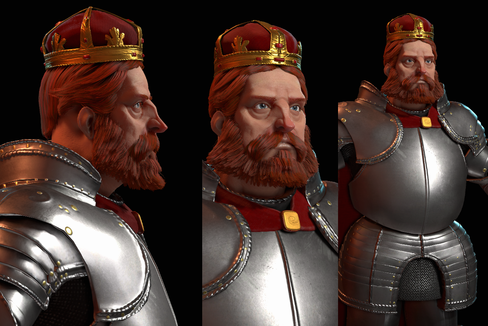

Leaders make up arguably the most expensive aspects of Civ VI. Whether it be through the months it takes to create a fully animated leader, or the complexities of the different cultural costumes, Leaders are a challenge. Within this paper we hope to document the process of creating one of these guys the best we know how.  
  
To begin the creation of such a complicated moving piece, we start like most other concepts in game development: a conversation.

**The Kick Off:  
**  
Once we have the idea of who the civilization is and who the leader for the civ will be, we sit down as a team and go over any and all ideas for production. During this time a rough sketch from concept (or a few) may be presented, and we discuss any and all ideas modeling and animation might have for this leader.

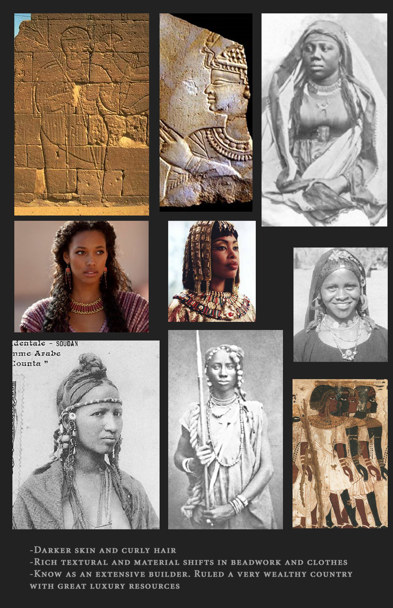

The concept ref folder is very important. This is a folder of images collected by concept and is used throughout the pipeline. Within this folder are general cultural notes on clothing, color, and alternative pieces of props and items that modeling can sort through

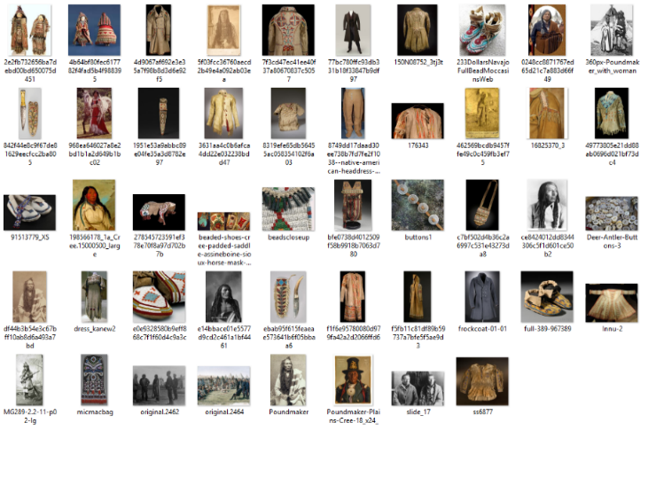

**Voice Work:**

An incredibly important aspect of the pipeline often left towards the end is the VO recording of the leader dialogue. Once we have a personality established and an understanding of the general look of the culture, the writers go and begin assembling the script that the leader will say. The hope in this is that modeling will begin with the line recorded so that we hit the 3D part of the pipeline with all the information we need.

It is important to note here that design is set on the VO lines to be recorded. There should be no lines recorded that design is no longer considering or are ambivalent on. This way, down the pipeline, no time is wasted reviewing and choosing between lines that are not even an option.

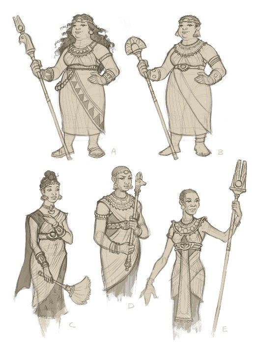

**Concept:**

Once the meeting is over, concept and modeling meet to discuss the next step forward. The usual next step is for concept to begin blocking the more final ideas.

When audition VO is recorded, Animation will start shooting test reference to explore ways in which the Leader might move and behave. This will help inform Concept as they finalize their ideas.

Once we really start to jive on where the concept is going it is presented for final feedback. Usually this is the hand-off stage, a place where modeling can begin. Here modeling deems if there is everything they need (or at least a good chunk of it there), to begin and if there might be any red flags. At this point we should all be on board with the general idea of who this leader is.

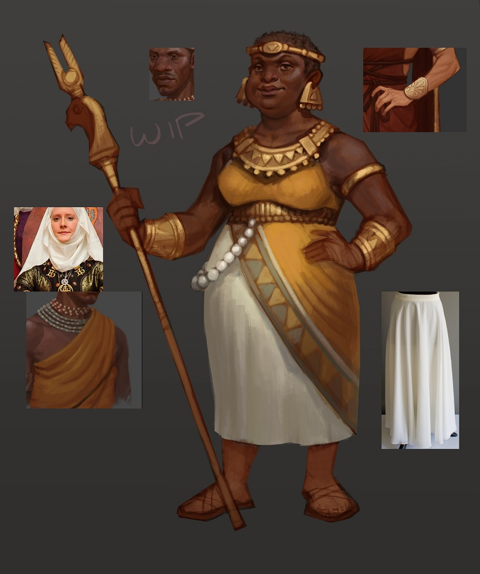

**Final Concept?**

Though we try not to go back to 2D sketches very often, there are chances that concept will continue to refine ideas found within the concept, or attempt new color pallet ideas.

Modeling can pull from the new ideas if need be or use them to try out different versions of the final leader textures.

Also, at times, paint overs will be required for the block-in to feel right, these tend to become the base for more final drawings later on.

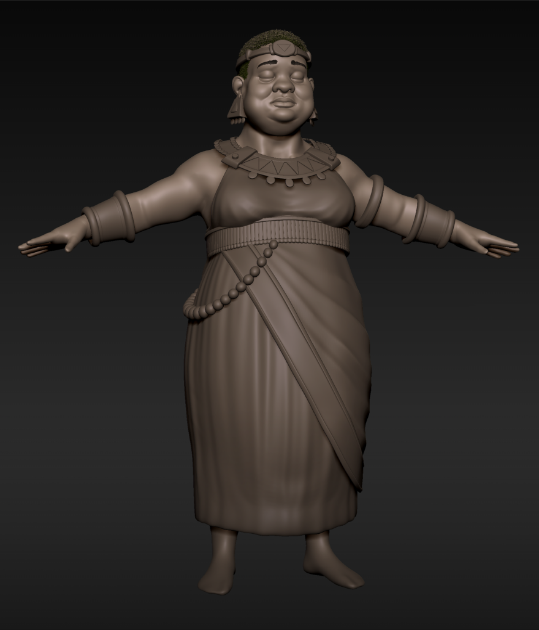

**Modeling:**  
  
Starting with one of the base meshes we use for the leaders, modeling begins to block in a sculpt for which we can give rough feedback on. This block in usually includes a facial pass and a rough estimate of the forms of the clothing. We can begin to break things down here. We decide a bunch of things at this stage as well, like whether or not to use marvelous designer for the clothing, and how much will be done with substance. Usually at the point, during the translation of 2D to 3D the red flags will appear. Concept usually gets pinged again and we go back and forth a bit, but only if there is difficulties in the translation. Modeling attempts to have most forms blocked in rough. Better to have and not need than to miss something.

Once we are good with the blocking we begin the process of the final high poly. This is the stage in which the models become bit more realized. Within Zbrush we attempt to give some material definition in the sculpt itself (not too much as most of the heavy lifting will be done in substance) and clean up any gummy forms. Things are broken out and separated. The modeler begins to think about the low poly form and how he or she will retopo the pieces for the low poly.  
  
Within this section are a many smaller tasks that don’t always happen on all the leaders. If marvelous designer was used, we then go in a cleanup those meshes, as they are usually triangulated and at a much high fidelity than what we can realistically render. One of the things we find is baked in wrinkles don’t look very good if they do not move. If the character has a lot of hard surface pieces (armor), then we begin to separate those out, and figure which parts will be separate or not.

Once we are happy with the high poly we begin the process of generating the lowpoly model. Though software may differ to retopologize, we generally either use topogun or Maya to model on top of the high poly.

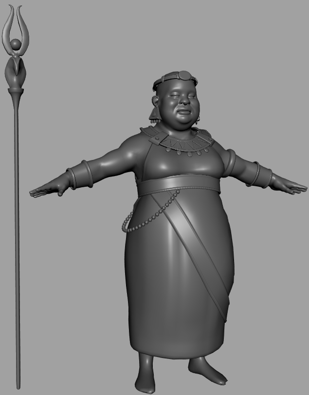

Items that may be mirrored and elements of UVing are thought about. Many times a back and forth is created between the high poly and low poly, reprojecting and adjusting the mesh to generate the cleanest model we can.

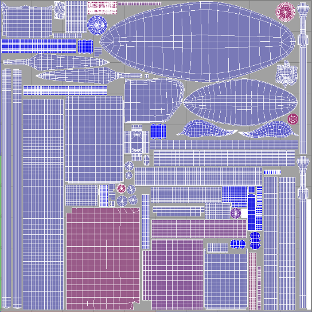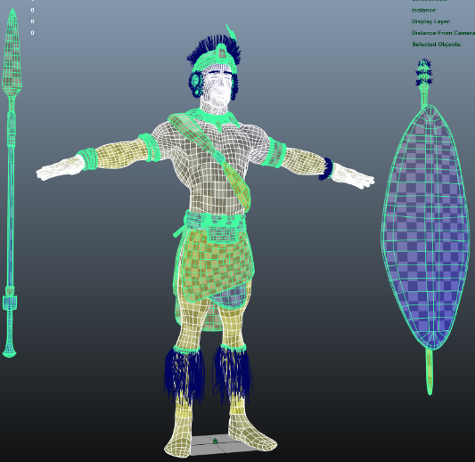

Using a program like UV layout, we quickly jump back and forth between it and Maya, adjusting meshes as we go to get the cleanest UV’s as we can. UVs are done in a linear fashion

The reasoning here is that any and all stretching will be due to the mesh itself will not be noticeable. Also our texture pipeline deals mostly in tiling textures, so they tend to apply better when a linear UV is present.

Once the UVs are done and packed, we throw a Texel texture on there to makes sure everything is around the same density. I say around, because we do cheat at times cramming more detail into items we deem to be POI’s (points of interests). Any POI tends to get a little more Texel resolution.

We make our way over to marmoset where we begin our first HUB program. In our pipeline the art resources are captured into two HUB programs:

Marmoset for all highpoly and lowpoly bake meshes

Substance for all textures and source textures.

This keeps things clean and creates a “living pipeline”.

By this we mean that everything in marmoset is live-linked to the source assets location on the drive, so if that updates so does the marmoset scene, and that in turn cranks out a normal map in real-time, that is then pumped back into substance…etc. etc. Basically each adjustment we make can trickle through the texture pipeline with relative ease, though that’s not always the case.

Baking In marmoset is easy, and is one of the few programs (outside of Maya and substance) that the modeling team is hard locked into using. Bake consistency is everything, and being able to rely on the same kind of normal quality and Ambient occlusion quality (the two maps we bake) makes everything down the line that much easier. After grouping the high polys and the low polys in their respective groups it’s as simple as clicking “Bake” and then adjusting the automated cage mesh and normal skew using the brushed provided to create a clean bake.

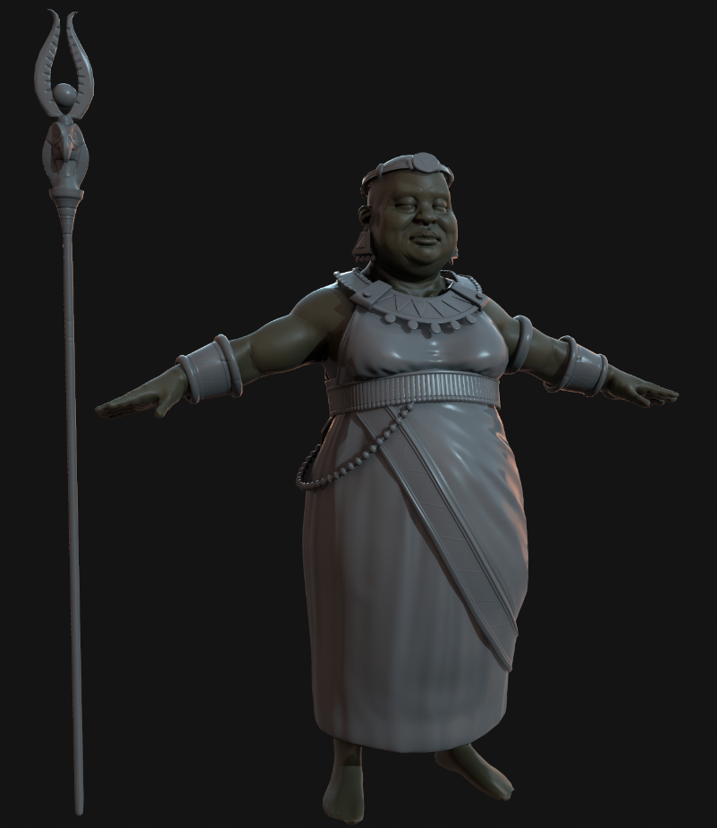

Continuing the modeling pipeline, we plug into substance the low poly and all the source textures we created (normal and AO) and use substance’s internal map converter to create the other maps need. Its cleaner this way, and smart materials assume these maps to be created in this fashion. Then it’s a generic substance workflow in which we are blocking in materials based on concept, and adjusting materials as we need them to be adjusted as ideas hit us. Because we have the civ tech shader inside of painter, this allows us to live a bit inside of substance before we make our way into the engine.

Using our premade civtech export preset, we export our textures after we have blocked them in a bit. After that we load up the asset editor and create a leader asset in the engine. This consists of us selecting the asset type and importing the geometry from Maya into the scene. Then we create a shader for the skin and clothing.

Once modeling sets this all up, we begin to go back and forth between the engine and substance, as all textures update live and can be iterated on fairly easily.

The leaders have two shader types for clothing, a cloth shader and an all-purpose uber-shader for everything else. The mesh definitions for these shaders are done in Maya, by assigning a material to the mesh. Each material in Maya is read as a material group and therefore able to have a material assigned to it.

This leads us to a textured version that is ready for initial feedback.

**Animation:**

Final VO has been recorded by now. Animators choose the lines they will use. Animators re-synch with writers and designers on VO choices. These VO lines and deliveries inform the animators on how to pose the leader in their base set.

**Poses to test:**

Arms across the chest, arms down by their sides, and hands clasped in front to check proportions and to make sure the Leader can look relaxed. This can result in model change requests

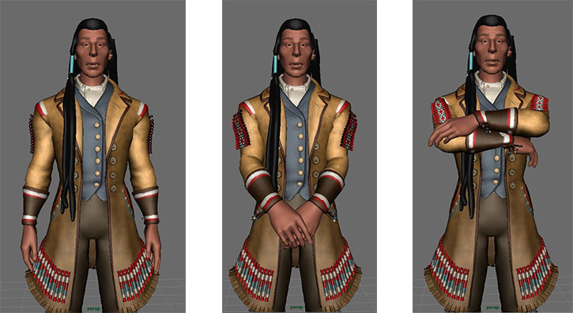

IK and FK switches with props, the torso twists and folds, foot roll, and finger skinning. We do a thorough investigation of every control on the body. Making a fist, facial poses, and mouth shapes. We need to see that the character can make a convincing O, M, and T shape, puff their cheeks, and close their eyes. We want to see that the eyebrows can make appealing shapes.

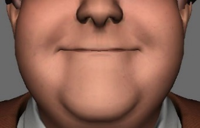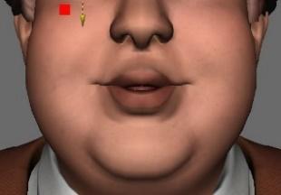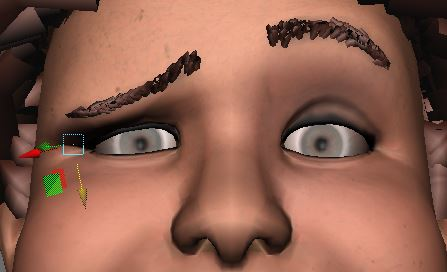

Animation starts to create and evaluate base idle poses with a functional rig. \[happy, neutral, unhappy\].

This is massively informative for a few reasons, such as seeing how the poses react to basic lighting and seeing how the proportions of the character hold up. Around this time, we all meet up and take a look at the poses and discuss changes that need to happen. As stated before, at time this includes modeling changes, as well as rig and weighting adjustments. Rigging and modeling might get another round of notes to finalize the rig.

Lighting does an initial pass here with the base poses.

The animator shoots reference video of VO lines and Base set using chosen idle poses. Acting choices are made and approved by Animation Lead.

**Blocking**

Blocking is when the animator picks their main poses out that describe the acting. They time these poses out approximately. While doing this process discoveries can be made about the limitations and differences between the rig compared to what the reference does. This is the part of the process where we can make big acting changes and timing changes. We can go back and re-shoot reference if needed.

Blocking passes can be in stepped mode or splined and smooth. The thing that makes them a blocking pass is that they lack the detail that a polished pass has. There may be some facial poses but not all. The points at which hands switch from IK to FK may NOT be smoothed. All we need to glean from the blocking pass is the animator’s intent.

**Splining**

After the animator has an approved blocking pass they go on to add in the detail. The lip synch is added, switches are smooth out, and hitches are cleaned up. Timing is tightened. If the blocking pass was in stepped mode the animator changes over to smooth splined. More transitional poses are added to better describe actions.

**Polish**

Now the animation is smooth and has everything it needs to make sense and be workable. What it lacks is the fine tuning. In the polish pass we take another visit to the eyes, the pupils, the eyebrows. We add in fine eye movements. We take another pass on the fingers to make sure all contact points feel believable. We make everything feel like butter

**Testing in Editor and Game**

Throughout animation process animation tests animations out in asset editor and game. This makes sure we are seeing the true aim of their eyes, spot issues with compression and blending. Keep up to date and see what changes the other departments have been making to the character and make sure those changes are working well.

Meanwhile…materials begin to finalize. Lighting continues to be adjusted. We do not animate and texture to a lighting set up, rather the lighting set up is created to what we make.

**Stitching**

When multiple animators have worked on one character that requires dynamics, stitching is required.

This allows for dynamics to be done on the entire string of animations together and provides a massive time savings.

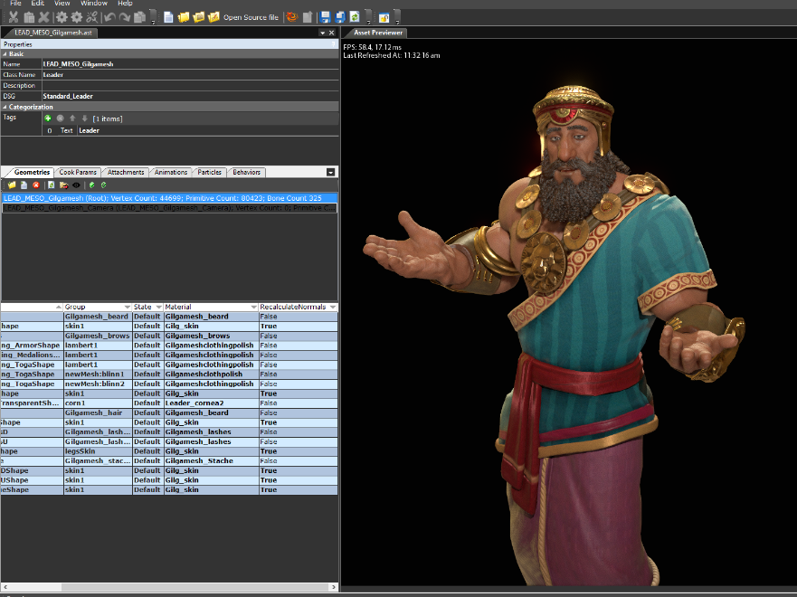

As animation gets closer to being ready for feedback we begin a cycle of adjustments and model tweaks. Usually the animation lead and modeling lead sit down and fine tune things. Modeling gives notes on how they intended things to look, and animation has a more clear presentation with what they intend to do with the character.  
  
With animation going along, lighting begins its process, blocking in something that works with the idle poses. It will continue to be revised as the animations and materials begin to finalize. We do not animate and texture to a lighting set up, rather the lighting set up is created to what we make.

To stitch, animation uses RedNine to bring all animations for VO into one VO file and all animations for the Base set into one Base Set file.

Once the stitching happens, all large form animation changes halt and small form facial and hand tweaks continue. Material work from modeling happens as well, but at this point most modeling tweaks halt, and become on request only. Animators work only in the stitched file to make tweaks.

In Civ none of the dynamic items (cloth, necklaces, etc) are done in realtime. We must bake out simulations done within Maya.

Audio can start a pass of sound effects now. Animation and dynamics are mostly tied down.  
  
Finally, we begin the final polish stages. As Dynamics get finalized, we begin to review how it all fits together. Lighting gets tweaked to the backgrounds (intensity) and we start to lay in the final material tweaks and such. Final bug lists get cleared and hopefully if all is said and done correctly we should be left with a leader scene that doesn’t clash with what we did on the base game.

Audio can now completely have at it now to drive it home.

TileBase

Tile Base

Monday, March 30, 2015

3:54 PM

The Tilebases in Civ 6 have a pretty complex pipeline in order to support the procedural building placement, as well as model and material sharing. Each Tilebase is built out of a Base asset which has attachment point where other Tilebase assets get slotted into in the game.

Following is a set of step to build a Tilebase asset. This is not the only way to build one, but this should explain all the pieces required and from there you can build them in the way that suits the needs of the Tilebase you are building

Prescribed Steps to build a Tilebase:

Step 1: Build your Max scene file:

Build your Max File. The Max scene should be composed of the pieces that the Tilebase is built from, and then copies of those objects, where each copy is named the same thing as the initial piece with a number added at the end. All the object copies should be parented under a root bone that is named the name of the Base Asset (Talk to your lead about what the naming conventions are). Here is an example of what your Max scene should look like:

![Machine generated alternative text: Select Display Edit Name Houseoos House007 LamppostOOI Lamppost002 Lamppost003 PineTreeOOI PineTree003 PineTree004 PineTreeoos PineTree006 PineTree007 PineTreeoog PineTreeOIO PineTreeSmaIOOI PineTreeSma11002 PineTreesma11003 PineTreeSma11004 PineTreeSma11005 PineTreesma11007 PineTreeSma11008 PineTreeSmaIIOOg House Lamppost PineTree PineTreeSmaII Workspace: Default (Perspective) (Realistic) These will become the attachment points of the Base Asset where the Attachment Assets will slot into These will become the Attachment Assets Autodesk 3 cls Max 2015 Tilebase_SampIeA55et.max 0/0 This will become the Base Asset ](TileBase/media/image2.png)

Note: Keep in mind that the engine will try to help you by automatically assigning material to your assets if the name of the material assigned to them in Max/Maya matches the name of a compatible material in the Asset Cloud.

Once you have your scene laid out the way you want, you need to run the **'TileBase Cleanup'** script that will convert all the object copies into Points with the same name so that they get imported as bones into the engine rather than as meshes:

-   Select the Root Bone/Point that has all the piece copies parented to it
    
-   Run the '**TileBase Cleanup**' script which is under '**Civ 6 Tools**' (the image shows one way to get to the script)
    
-   
    
-   Click the '**Do Cleanup**' button in the tool's dialog box.
    
-   You will see a Point appear at the position of every object under the root.
    
-   Save your Max file, it's ready to be imported into the engine.
    

Create an asset for each model in the Max File:

We have a script that will automatically turn each model in you Max file into an asset. Go to '_**File > Run Script**_' and load the script "_**C:\\Program Files\\Civ6\\Asset Cloud - Civ6\\AssetEditor\\Scripts\\Create\_Assets\_From\_Source\_File.py**_". The script will bring up a prompt asking for what asset class should the Assets be, select "**TileBase**" and click **'OK'**

Then you'll be prompter by the Mini importer dialog. Click the "_**\+ Add Source File…**_" button and navigate to your Max file in the file browser. The mini importer will then show you a list of all the models that it found in your Max file. By default it sets all of the to import, but if there is a model that you don't want to import then click on the checkbox to the left of it to disable the import for it. Each model will also show a dropdown on the right indicating what geometry class it should be. 3D models should be "_**LandmarkModel**_" and decal models should be set to "_**DecalGeometry**_". There is a dropdown at the top of the dialog that will let you assign a geometry class to all the models at once, simply pick the class from the dropdown and click the '_**Apply to Selected**_' button

Depending on how may models are in your Max files this could take up to a couple of minutes, but once it's done it will prompt you to add the newly created Assets to an XLP. Click 'Yes Please…' and pick the XLP that you want to add your assets to. For now the tilebases are being added into the 'tilebases.xlp' file (check with your lead if you're unsure about this). Click 'Yes' when getting prompted to check-out the XLP file and then save the XLP file.

Create Attachment points on the base Asset:

Open up the base asset that was created by the script by going to '_**File > Open Entity**_' and finding your asset, selecting it in the browser and clicking '_**OK**_'.

Select the Attachments tab, and click the button to 'Add Attachment Points to all Bones'. This will automatically create an attachment point for every Bone/Point in the Base Asset (these were the bones that were created by the 'TileBase Cleanup' script in Max).

Once the attachment points are created, save your Asset. You can test that the Attachment points and Attachment Assets by going to the Knobs on the right, selecting the tab for the asset (The one that has the same name as your asset followed by "\_0") and click on the "_**Attach by name**_" which will slot in the Asset into their corresponding attachment points.

This does not actually do the connection of the attachments, it's only to preview the attachments. The actual attachment hookups are done in the Landmarks.artdef file.

Hooking up the Attachment Assets to the Base Asset:

The Landmarks.artdef file is where the attachment are associated with the base asset .This information is stored in the artdef because it's possible to have the same Base asset have multiple different sets of attachments. For example Mines will probably use the same base asset, but have different mineral attachment assets associated with the different resource types it could be built on top of.

Because many of the Tilebase Assets have dozens of attachments setting up all the connections by hand can take a significant chunk of time, so there's a script that will automate that step for you. Go to '_**File > Run Script**_' and load the script "_**C:\\Program Files\\Civ6\\Asset Cloud - Civ6\\AssetEditor\\Scripts\\Create\_District\_Base.py**_". This will bring up a dialog prompt showing you a list of all the Assets in the tilebases.xlp file. Pick the Base Asset that you created before from the list and click '_**OK**_'. This will open up the Ladnmarks.artdef file for you and create the tilebase entry with all the attachments.

![Machine generated alternative text: BLP Entry Browser Name CityCent er_ Lg _ Test CityCenter Sm Test CityCent er_Test Asset Path DIS DIS DIS DIS DIS DIS DIS DIS DIS DIS DIS DIS DIS DIS DIS DIS DIS CTY AW CTY AW CItyCenter Sm Test CTY AW CItyCenter_Test DIS DIS DIS DIS DIS DIS DIS DIS DIS DIS DIS DIS DIS DIS Ancient Ancient Ancient Ancient Ancient Ancient Ancient Cross flag Lg aller Sm Banner Sm Filler Stone Patch Wood Ancient Ancient Ancient Ancient Ancient Ancient Ancient Cross flag Lg aller Sm Banner Sm Filler Stone Patch Wood CM p CM p CM p CM p CM p CM p CM p CM p CM p CM p CM p CM p CM p CM p Ancient Base 01 Ancient Base 02 Ancient _ Lg Filler Ancient Base 01 Ancient Base 02 Ancient Lg Filler Base Classical Base Industrial Classical Base Classical Base _ Temp _ Temp 02 Base Classical Base Industrial Classical Base Classical Base _ Temp _ Temp 01 02 ](TileBase/media/image8.png)

As with the previous script, the more pieces there are associated with the Asset, the longer the script will take to process, but in the worst case it'll take a minute or so. You'll get a message box telling you the process was completed so that you know when it's done. Makse sure to Save the Landmarks.artdef file after the script is done.

Hook up the Asset into the game:

This process will be slightly different whether you are hooking up a Improvement/Landmark or a District.

**Landmark**:

If you don't have it open, you need to open the Landmarks.artdef file. On the left there's a tree list of the different entries that the game is using, expand the "_**Landmarks**_" list by clicking on the arrow to the left.

This will show you a list of the entries that are currently being used by the game. If the Asset you are working on doesn't have an entry for it yet you'll need to set it up. The instructions on hooking up an artdef entry to a gameplay element are here: Mapping GameCore IDs to ArtDef Entries. If you need help setting it up ask your lead or the pertinent programmer that's working on your system.

If the entry that you need is already there, expand it out and you'll see an entry under that called '_**Eras**_'. Click on the '_**Eras**_' entry (1), and on the right you'll a grid that maps the tilebase you just created with a specific era. If the Era you need is already there, just click on the '_**Ref\_LandmarkBase**_' item and it will show you a dropdown where you can pick the tilebase that you created in the last step (2). If the Era that you need is not in the list, click the Add Element button on the top toolbar (3). This will add a new element to the grid, and you can set the 'Tag\_Era' for it from the dropdown of available Eras and then assign the tilebase.

![Machine generated alternative text: AssetEditor - D:XprojectsXBALW-AGOULD Civ6 mainXCiv6Xpantry%ArtDefsXLandmarks.artdeff File Edit View Window Landma rtdef* Alt Definition Template Landmarks Open Source file Ref Landmark3ase VIL Tribal Thatch 01 v I Tag Era DEFAULT Filter: Name CAMP Erasl Districts Landmarks DEFAULT M M M M M M M CAMP CHATEAU FARM CMP CMP CMP CMP CMP CMP Ancient Base 01 Ancient Base 02 Base Classical Temp Base Industrial Temp Classical Base 01 Classical Base 02 FISHING BOATS GOODY HUT LUMBER ILL MINE OFFSHORE OIL RIG OIL WEL PASTURE PLANTATION QUARRY STEPWEL ZIGGURAT Dis trictGenerators Tileaase Her08uiIdingTags Res ourceTags Cul tureTags EraTags UsageTags Globals CITY GL08ALS ](TileBase/media/image10.png)

**District**:

If you don't have it open, you need to open the Landmarks.artdef file. On the left there's a tree list of the different entries that the game is using, expand the "_**Landmarks**_" list by clicking on the arrow to the left.

![Machine generated alternative text: AssetEditor - D:XprojectsXBALW-AGOULD Civ6 mainXCiv6Xpa File Edit View Window Landma rtdef* Alt Definition Template Landmarks C.i3trict3 ACROPOLIS AERODROME AQUEDUCT CAMPUS CITY CENTER COMMERCIAL HUB ENCAMPMENT ENTERTAINMENT cot, HARBOR HOLY SITE INDUSTRIAL ZONE MBANZA NEIGHBORHOOD SPACEPORT THEATER DEFAULT DISTRICT DISTRICT DISTRICT DISTRICT DISTRICT DISTRICT DISTRICT DISTRICT DISTRICT DISTRICT DISTRICT DISTRICT DISTRICT DISTRICT DISTRICT DISTRICT Landmarks Dis trictGenerators Tileaase Her08uiIdingTags Res ourceTags Cul tureTags EraTags UsageTags Globals CITY GL08ALS ](TileBase/media/image11.png)

his will show you a list of the entries that are currently being used by the game. If the Asset you are working on doesn't have an entry for it yet you'll need to set it up. The instructions on hooking up an artdef entry to a gameplay element are here: Mapping GameCore IDs to ArtDef Entries. If you need help setting it up ask your lead or the pertinent programmer that's working on your system.

If the entry that you need is already there, expand it out and you'll see an entry under that called '_**BaseVariants**_'. Click on the '_**BaseVariants**_' entry (1), and on the right you'll a grid that maps the tilebase you just created with a specific era, culture, and set of Hero Buildings. If the Era/Culture/HeroBuilding combination you need is already there, just click on the '_**Ref\_DistrictBase**_' item and it will show you a dropdown where you can pick the tilebase that you created in the last step (2). If the combination that you need is not in the list, click the Add Element button on the top toolbar (3). This will add a new element to the grid, and you can set the Era/Culture/HeroBuidling for it from the dropdowns available and then assign the tilebase.

![Machine generated alternative text: AssetEditor - D:XprojectsXBALW-AGOULD Civ6 mainXCiv6Xpantry%ArtDefsXLandmarks.artdef File Edit View Window Open Source file Landmarks.artdef tilebas Alt Definition Template Landmarks Districts Tag Era DEFAULT DEFAULT DEFAULT MCDERN ARTERA MODERN ARTERA MODERN ARTERA_MODERN Tag Culture DEFAULT DEFAULT DEFAULT DEFAULT Ref District3ase DIS HBR Base Classical 01 DIS HBR Base Classical 02 DIS HBR Base Classical (B DIS 01 Filter: Name BaseVariantsOOI BaseVariants002 Var iants003 3aseVariantsDDS BaseVariants006 BaseVar iants007 Set Herc3uiIdings EMPTY LIGHTHOUSE LIGHTHOUSE SHIPYARD LIGHTHOUSE LIGHTHOUSE, SHIPYARD HTHOUSE SHIHARD. SEAPOR ACROPOLIS AERODROME AQUEDUCT CAMPUS CITY CENTER COMMERCIAL HUB ENCAMPMENT ENTERTAINMENT cot, HARBOR DEFAULT DISTRICT DISTRICT DISTRICT DISTRICT DISTRICT DISTRICT DISTRICT DISTRICT DISTRICT DISTRICT City CMP CMP CMP CMP CMP CMP Ancient Base 01 Ancient Base 02 Base Classical Temp Base Industrial Temp Classical Base 01 Classical Base 02 BaseVariants Bull dingVariants C:' BuildingSets DISTRICT DISTRICT DISTRICT DISTRICT DISTRICT DISTRICT Landmarks HOLY SITE INDUSTRIAL ZONE MBANZA NEIGHBORHOOD SPACEPORT THEATER Dis trictGenerators Tileaase Her08uiIdingTags Res ourceTags Cul tureTags EraTags UsageTags Globals CITY GL08ALS ](TileBase/media/image12.png)

Save the artdef file once you're doing hooking up your asset. To see it in the game, you have to Cook the tilebases.xlp and then load up the game and build the tilebase you just added.

Check everything in:

Once you've verified that the tilebase is working in your asset the way you expect, you can either do that through Perforce directly or you can use the Asset Cloud

UnitPreviewingScript

# Civ 6 Unit Previewing Script

This is how to load a Unit from the game with Culture Variants and props into the Asset Editor

From the asset Editor Top Menus select File\\Run Script

Select Preview\_Unit.py in the ..\\Steam\\steamapps\\common\\Sid Meier's Civilization VI SDK\\AssetModTools\\AssetEditor\\Scripts directory

Select your UNIT in the 'Pick the Unit' popup and click OK button

Select your CULTURE in the 'Pick the Culture' popup and click OK button

This will open the Unit\_Bins.artdef, Units.artdef and a random Armor Asset of the unit you picked.

This also Attaches a Hat, Weapon, Head\\Hair combo and body based off of the variations defined for unit and Culture.

Here is the example for Redcoat\\European

**\*\*\* NOTE \*\*\*** Cultural Skin color tinting will not be represented here. An example is that African and Middle Eastern bodies will only show up in the default Pink skin color. BUT the actual Head will be pulled from the defined set of Cultural Heads for that culture, but just not the right skin color. Below shows the correct Head for an African Archer ... just not the correct skin color.

Oddly in the right-hand side Archer unit tab under its _TRANSFORM_ tab is where you can change the tint color. Tint is always White as a default. **BUT** that's not all ... It tints the Head, Boday and the Armor. **NOT** the hands

**OK**

Now if you want to edit this unit's Timeline you will need to open its Behavior. In this case it is the Redcoat.bhv

Once that is loaded you can edit the timeline while the bhv is selected. Plus play the animations.

Have at it!

World Builder

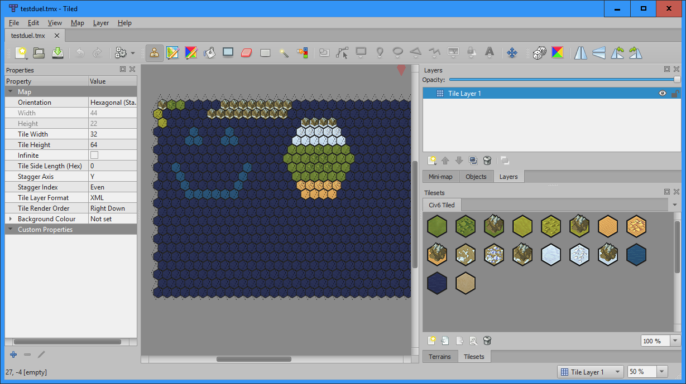

How to use the Tiled Importer for World Builder 

1.  Open Tiled Editor and open up a new map (File -> New -> New Map)
    

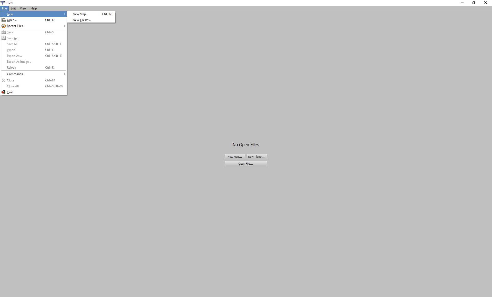

1.  Choose a Hexagonal map, for tile layer format, choose CSV and render order right down
    
2.  Under map size, you may set any dimensions you like, but staying close to existing Civ map dimensions is probably best.
    
    1.  Duel: 44 tiles wide by 26 tiles high
        
    2.  Tiny: 60 tiles wide by 38 tiles high
        
    3.  Small: 74 tiles wide by 46 tiles high
        
    4.  Standard: 84 tiles wide by 54 tiles high
        
    5.  Large: 96 tiles wide by 60 tiles high
        
    6.  Huge: 106 tiles wide by 66 tiles high
        
3.  Under Tile size, choose Width: 32px Height: 64px
    

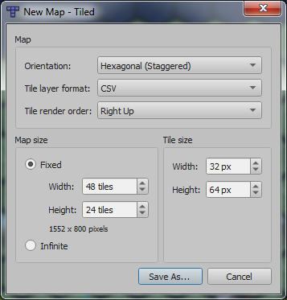

1.  Use Tiled's File→Open function to load the tilesets for each layer you're going to use.  They are currently in Examples/WorldBuilder Tiled Importing.
    
2.  Under Map -> Properties: 
    
    -   Hexagonal (Staggered) 
        
    -   Tile Width: 32
        
    -   Tile Height 64
        
    -   Stagger Axis: Y
        
    -   Stagger Index: Even
        
    -   Tile Layer Format: XML
        
    -   Tile Render Order: "Right Down" or "Right Up" will work.  The importer can tell which is which and flip the map accordingly.
        

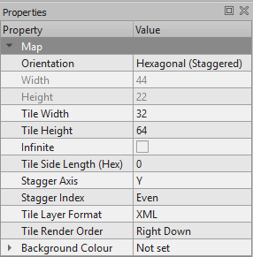

1.  Layers can be a mix of tile layers and object layers.  Object layers are necessary for some types because they allow you to define per-tile parameters that are passed to the importer.
    
2.  In order from the top to the bottom of the layer list, the layers must be: Rivers, Buildings, Districts, Cities, Continents, Improvements, Resources, Features, and Terrain.
    
    1.  Terrain must be a tile layer and you should always define all of the tiles on the terrain layer.  The Bucket Fill tool can be useful to set the whole map to a base type.
        
    2.  You don't have to have all layers in a given map for it to import successfully, but all of the layers below the highest one you have must exist.  For instance, if you want to place improvements on terrain, you must still have resources and features layers.  Just don't place anything on them.
        
    3.  Features can be a tile layer or an object layer.  Unused hexes do not need to be filled in.
        
    4.  Resources should be an object layer.  After you place each resource, click the "+" at the bottom of the Properties column and add a custom property "number" of type "int".  Then set the value to represent the amount of that resource present in that hex.
        
    5.  Improvements should be an object layer.  As with resources, add a custom property named "player" of type "int".  This value sets which civ the improvement will belong to.
        
    6.  Continents should be a tile layer currently.  The tiles for them represent, in order: Africa, Amasia, America, Antarctica, Arctica, Asia, AsiaAmerica, Atlantica, Atlantis, Australia, Avalonia, Azania, Baltica, Cimmeria, Columbia, Congo Craton, EurAmerica, Europe, Gondwana, Kalaharia, Kazakhstania, Kernorland, Kumari Kandam, LaurAsia, Laurentia, Lemuria, Mu, Nena, North America, Novopangea, Nuna, Oceana, Pangaea, Pangaea Ultima, Pannotia, Rodinia, Siberia, South America, Australis, Ur, Vaalbara, Vendia, and Zelandia. 
        
    7.  Cities can be a tile layer or an object layer.  In both cases, the tiles are 1-16 representing up to 16 players in a game.  TIle 1 here is the same as "player 0" in the Improvements layer, 2 is the same as "1", and so on.
        
        1.  If you make this an object layer, you can add a custom parameter named "spawn" of type Bool.  This will show as a checkbox in the list of parameters, and if you check it, this will be the spawn point for the player rather than generating a city on the spot.
            
    8.  Districts should be an object layer with a "player" custom parameter
        
    9.  Buildings should be an object layer with a "player" custom parameter.
        
    10.  Rivers should be an object layer with a custom parameter named "direction" of type String.  Valid values are "NE", "E", "SE", "SW", 'W", or "NW".  TODO: what does this parameter mean?
        
    11.  To set up parameters:
        
        1.  Click here:  
            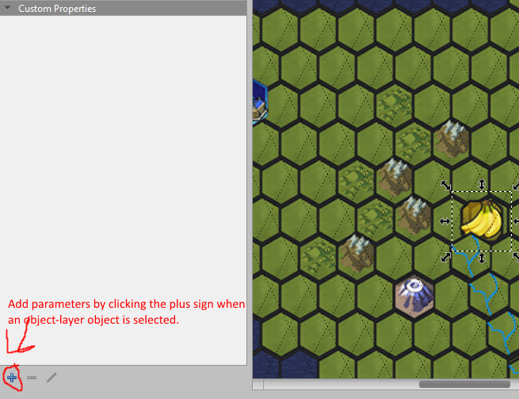
            
        2.  Which brings up this: 
            
        3.  Enter the name in the text field and set the type with the drop-down 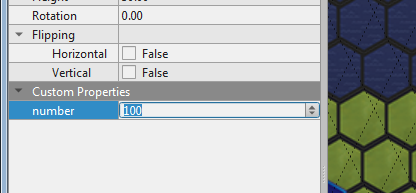
            
        4.  The new parameter will appear in the left-hand column as shown where you may set the value.Buildings should be an object layer with a "player" custom parameter.
            
3.  Each layer must only use tiles from one tileset.  If you use more than one the behavior of the importer is not guaranteed to be correct.
    
4.  Save file as tmx.
    
5.  In Civ VI->Additional Content->World Builder choose "Import Map".
    
    1.  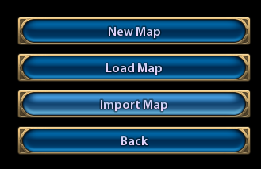
        
6.  The "Advanced Setup" screen will appear, minus the map size options.   Pick the number of players for your map and the specific teams if you want them to be particular civs, as well as any rules changes.
    
7.  Click the "Import Map" button and the Civ file browser will appear, with extra buttons for full drive navigation to anywhere on your computer.  Choose a map and WorldBuilder will load with the selected map.
    
8.  When you're finished viewing/fine-tuning in WorldBuilder, press Esc to bring up the menu and click the "Save Game" button to save a game with your map.
    

Emitter Properties

# Emitter Properties

These are all the emitter properties that can be assigned to a given emitter. This properties must be defined at compile time (they cannot be changed at run-time based using script logic).

The syntax for properties is the keyword "property", followed by the property identifier, followed by the equals (=) sign, followed by the value. For example:

property blend\_type = alpha  
  
  
geometry\_type = \[none, quad\_rotated, quad\_aligned, quad\_fixed, string\_aligned, string\_fixed\]

Default is 'none'.

Only valid on emitters that have a sim block.

Description: Determines the geometry type of the emitter.

material\_type = \[none, quad\_unlit, string\_unlit, quad\_unlit\_masked, string\_unlit\_masked, quad\_unlit\_distorted, string\_unlit\_distorted\]

Default is 'none'.

Only valid on emitters that have a sim block.

Description: DEPRECATED: use combination of other material properties instead.

blend\_type = \[none, alpha, additive\]

Default is 'none'.

Only valid on emitters that have a sim block.

Description: Sets the blend mode for the particle.

distorted = \[true,false\]

Default is 'false'.

Only valid on emitters that have a sim block.

Description: Enable distortion texture slot.

masked = \[true,false\]

Default is 'false'.

Only valid on emitters that have a sim block.

Description: Enable mask texture slot.

normalmap = \[true,false\]

Default is 'false'.

Only valid on emitters that have a sim block.

Description: Enable NormalMap texture slot. Only used if directional lighting is enabled.

material\_lighting = \[none, directional, non\_directional\]

Default is 'none'.

Only valid on emitters that have a sim block.

Description: Set the lighting mode for the particle.

sort\_order = \[emit\_order, reverse\_emit\_order\]

Default is 'emit\_order'.

Only valid on emitters that have a sim block.

Description: Set the sort mode for particles emitter by this emitter.

priority = \[Integer in the interval \[0, 256)\]

Default is 0.

Only valid on emitters that have a sim block.

Description: Determines the rendering order of emitters within the same tree. Lower priority emitters render before higher priority emitters.

layer = \[opaque, blended, underwater, overblended, overlay, primary\]

Default is 'primary'.

Only valid on emitters that have a sim block.

Description: Layer to render the emitter into.

callbacks = \[true,false\]

Default is 'false'.

Description: Enable callbacks for emitter lifetime events. This is expensive, so only enable it if you really need the callbacks.

shadows = \[true,false\]

Default is 'true'.

Only valid on emitters that have a sim block.

Description: Enable shadow casting by this emitter. Not available in the Overlay layer, or with Additive blend mode.

FireFX UI Backend

# FireFX UI Backend Design

The way that the UI maps to the FireFX script will be through code injection where the user can select blocks which map to code blocks that get combined

Tags are used to indicate sections that contain code, or sections where that code should be injected into

< > tags represent a section where code should be copied into that matches the tags identifier

\[ \] tags represent the identifier for the following block of code that should be copied into a section defined by a matching tag

Code should be copied in order from top to bottom

When copying code into a section, any identical lines of code (white space should be ignored for comparison) should not get duplicated and only the first one should remain.

# Block types:

Property blocks: These blocks are unique for each emitter and can define several different code blocks where each code block is mapped to an Enum entry that the user can pick from the UI. There might be additional block parameter meta data for description, tooltips, etc. Different options may or may not also expose UI parameters for the user to pick (not yet clear, but we should assume that we’ll need to).

This blocks are used to defined emitter properties, and also write out the appropriate exports that make the property valid. These blocks will also usually initialize critical variables that will be modified by other blocks. These are usually variables that need to be fed to the exports, for things like Position or Color.

Example:

Code Block 1 Property blocks example 1

Description = "This is determines the way that the particles are blended on the screen (Mesh particles determine their own blending based on their material)"  
\# Property blocks have a UI exposed enum, where each one then maps to a code block  
  
  
#This is the first possible code block, and should be the default when added to an emitter  
Enum1: "additive"  
  
\[PARTICLE\_GLOBAL\]  
varying color p\_color;  
varying float p\_alpha;  
  
\[PARTICLE\_SPAWN\]  
p\_color = color(1,1,1);  
p\_alpha = 0;  
  
\[PARTICLE\_PROPERTIES\]  
property geometry\_type = quad\_rotated;  
  
\[PARTICLE\_RENDER\]  
export( "COLOR", p\_color);  
export( "ALPHA", p\_alpha);

Code Block 2 Property blocks example 2

\# The code block is mutually exclusive from the first  
Enum2: "alpha"  
  
\[PARTICLE\_GLOBAL\]  
varying color p\_color;  
varying float p\_alpha;  
  
\[PARTICLE\_SPAWN\]  
p\_color = color(1,1,1);  
p\_alpha = 0;  
  
\[PARTICLE\_PROPERTIES\]  
property geometry\_type = quad\_rotated;  
  
\[PARTICLE\_RENDER\]  
export( "COLOR", p\_color);  
export( "ALPHA", p\_alpha);

Particle logic blocks: This is the most common type of block that will compose the meat of the logic for the particles. These blocks will only contain one block of code, and additional metadata to indicate the type of block, it’s uniqueness, other logic block prerequisites, and UI exposures.

Example:

Code Block 3 Particle Logic Blocks

\# Flag for indicating whether this block has to be unique across a group of blocks within an emitter (only one lifetime block allowed per emitter)  
Block\_Type = SpawnRate  
Unique = True  
  
\# Flag indicating that this block needs other types of blocks to be present to function,  
Before = none  
After = none  
Anywhere = none  
  
\# Description to be placed somewhere in the UI for users  
Description = "Particles will spawn at a constant rate of N particles per second"  
  
\# This is the section that describes the variables exposed to the UI. This need to describe UI string for the variable, variable name (this is the identifier in the code that will get replaced with the user driven value), type, range, tooltip, and default.  
\# Eventually there might be UI hints available to tell the tools which control to use when displaying  
\[UI: Particles per second, name: PARTICLE\_RATE, float, range:0,1000000, default: 10\]  
\[UI: Initial Particle burst, name: PARTICLE\_BURST, float, range:0,1000000, default: 0\]  
\[UI: Emitter life, name: EMITTER\_LIFE, float, range:-1,1000000, default: -1\]  
\[UI: Delay Min, name: DELAY\_MIN, float, range:-1,1000000, default: 0\]  
\[UI: Delay Max, name: DELAY\_MAX, float, range:-1,1000000, default: 0\]  
  
\# This section then gets converted into code and merged  
\[INCLUDES\]  
  
\[PARTICLE\_GLOBAL\]  
  
\[PARTICLE\_SPAWN\]  
  
\[PARTICLE\_SPAWN\_ARGUMENTS\]  
(  
<PARTICLE\_SPAWN\_ARGUMENTS\_ADDITIONAL>  
float in\_age  
)  
  
\[PARTICLE\_SIM\]  
  
\[PARTICLE\_PROPERTIES\]  
  
\[RENDER\]  
  
  
\[EMITTER\_GLOBAL\]  
varying float p\_age;  
varying float p\_inv\_lifetime;  
  
\[EMITTER\_SPAWN\]  
p\_inv\_lifetime = (EMITTER\_LIFE > 0)? 1.0 / EMITTER\_LIFE : 0;  
p\_age = 0.0;  
  
emit\_count("EMITTER\_NAME" + "\_particle", PARTICLE\_RATE)  
{  
<PARTICLE\_SPAWN\_PARAMETERS>  
export("in\_age",p\_age);  
};  
  
\[EMITTER\_SIM\]  
emit\_rate("EMITTER\_NAME" + "\_particle", PARTICLE\_RATE)  
{  
<PARTICLE\_SPAWN\_PARAMETERS>  
export("in\_age",p\_age);  
};  
p\_age = p\_age + delta\_time() \* p\_inv\_lifetime;  
kill(p\_age > 1);

Blank emitter block: This block gets automatically generated behind the scene for every emitter. It has no User exposures (except for the name), and is just generated to provide the structure for other blocks to build into. The “EMITTER\_NAME+\_particle” bit just indicates that that line should contain the name of the emitter with the “\_particle” suffix.

Code Block 4 Blank emitter block

#Blank emitter  
  
\[PARTICLES\]  
emitter EMITTER\_NAME+\_particle  
{  
<PARTICLE\_GLOBAL>  
SPAWN  
<PARTICLE\_SPAWN\_ARGUMENTS>  
{  
<PARTICLE\_SPAWN>  
}  
SIM  
{  
<PARTICLE\_SIM>  
}  
  
<PARTICLE\_PROPERTIES>  
  
RENDER  
{  
<PARTICLE\_RENDER>  
}  
}  
  
\[EMITTERS\]  
emitter EMITTER\_NAME  
{  
<EMITTER\_GLOBAL>  
SPAWN  
{  
<EMITTER\_SPAWN>  
}  
SIM  
{  
<EMITTER\_SIM>  
}  
  
<EMITTER\_PROPERTIES>  
  
RENDER  
{  
<EMITTER\_RENDER>  
}  
}  
  
\[GROUP\_SPAWN\]  
emit\_count( "EMITTER\_NAME", 1 );

Blank group block: Similar to the blank emitter block, this is just an internal structural block of code for the rest of the code to inject into. There is only one group block per effect, and is the first block that gets used and all other block go into:

Code Block 5 Blank group block

<INCLUDES>  
  
<PARTICLES>  
  
<EMITTERS>  
  
  
group PARTICLE\_SYSTEM\_NAME  
{  
SPAWN  
{  
<GROUP\_SPAWN>  
}  
SIM  
{  
<GROUP\_SIM>  
}  
}

Two special cases:

Template Emitter block: These are highly optimized emitter blocks that are self-contained and just expose a few parameters to the user, but cannot have any other blocks added to them. Internally however it should function very much like a regular Emitter Logic Block, that just gets injected directly into the Group Block.

The main purpose of these blocks is to encompass common use cases, but not used for high volume effects.

Template Effects: This is a case where there is a very optimized emitter that should be shared for high volume effects. Like the Template Emitter, this only exposes a handful of parameters and cannot have additional blocks added to it. Unlike it though, the way that this is expressed internally is slightly different. This will probably be implemented as a special Group Block that gets injected into an existing shared FireFX file so that all the effects that use this template can be compiled together.

# Injection order:

So the order in which block should be combined is:

Each **Blank Emitter Block** emitter block should get all its **Property Blocks** injected into it in order. Then it should get all its Particle Logic Blocks injected into it in order.

Then each finished **Emitter Block** should get injected into the **Blank Group** Block in order.

When injecting the code, any lines of code that are identical to a line that already exists (ignoring white space) should be ignored.

# Types and UI controls:

Float (with an optional 3D Scale Gizmo, 3D Radius Gizmo, or Greyscale color picker)

Float2

Float3

Float4 (With an optional 3D Rotation Gizmo)

Color (With an HDR color picker, or at least a SRGB color picker)

Point2D (With a 2D Position Gizmo, maybe?)

Point3D (With a 3D Position Gizmo)

Int (maps to an equivalent float)

Bool (true = 1, false = 0)

String ( for referencing other emitters, though automatic Enum generation for existing emitters would be even better)

Spline selector (Scope to be determined, but we need some way for the user to be able to specify a 1D function either from a preset of functions, or as a custom spline)

Code block (This would allow the user to type in code snippets)

Example usage:

In the example directory there are a handful of example blocks that should generate the Output.txt script if all the defaults are used, and the Particle System name was “Root” and the Emitter name was “CenterGlowWhite”

Understanding FireFX Scripts

# Understanding FireFX Scripts

FireFX is a language for expressing the motion and rendering of particles, or particle-like things.  
The language is based heavily on C for it's structure and syntax, so this documentation might gloss over some syntax details. This documentation also assumes the readers has some experience programming but should cover everything needed to get you writing your own scripts. If you find any gaps in documentation, please fill them or ask someone else to do so.  
One script file can contain the logic for multiple different particles. Each particle is broken up into a chunk of code that defines the initial conditions and simulation logic for a single particle. It also has code to then feed certain outputs back to the engine so that the engine that define how to render the particle.  
One thing to note is that FireFX doesn't make any distinction between a particle and a particle emitter. All particles can emit other particles (we'll go into the syntax later), so the terms emitter and particle will be used interchangeably in this document.  
A very bare bones particle script would look something like this:

Code Block 1 Simple Script

group My\_First\_Particle  
{  
SPAWN  
{  
}  
  
SIM  
{  
}  
property geometry\_type = quad\_rotated;  
property blend\_type = additive;  
  
RENDER  
{  
export( "BASECOLOR\_UV", float4(0,0,1,1) );  
export( "SCALE", float2(15, 5 ));  
export( "ROTATION", 0 );  
export( "POSITION", float3(0,0,0));  
export( "COLOR", float3(1,1,1));  
export( "ALPHA", 1);  
}  
}

The first line is composed to two parts. The Keyword "group" is used to indicate that this an entry point for the script file, followed by an identifier of your choice, in this case "My\_First\_Particle". All particle systems must define a Group which is the starting code for that particle system. A script file may define multiple groups in it, but only one can be used by a particle system at a time.  
The code for the Group must then be contained within pair of curly braces.  
Inside the Group there are 4 sections, the SPAWN code, the SIM code, the properties, and the RENDER code. This particle isn't defining any spawn or simulation logic, so those sections are empty. The properties section lets you set a handful of engine specific properties that are fixed for each particle that tell the engine what to do with the data that the particle system is going to give it. For a full list of all the properties go here ([https://hub.firaxis.com/display/FXSMadrid/Emitter+Properties](https://hub.firaxis.com/display/FXSMadrid/Emitter+Properties)). Finally the Render section has several lines, where each line is feeding a labeled export back to the engine telling it how to render this particle.  
In Civ 6, this particle will look something like this:

Not much to look at right now, but the language allows for expressing much more complex particle systems.

# Variables and types:

Things get much more interesting once you start using variables rather than fixed values for driving particle behavior. FireFX currently only supports floating point math, so the only variable types that are available are just groupings of floats:  
float, number ( a single float)  
float2, point2d (two floats)  
flaot3, point3d, color (three floats)  
float4 (four floats)  
There are two scopes that variables can exist in: varying and local. A "varying" variable is persistent through the whole life of a particle, and is accessible anywhere within the particle's code. This allows you to initialize the variable in the spawn block, and modify it every frame in the sim block and use it in the render block. Varying variables, also called "varyings", must be defined outside of any of the particle's blocks.  
The syntax for a varying variable is the keyword "varying", followed by the variable type, followed by the name or identifier you want to use followed by a semi-colon. For example:

group My\_Particle  
{  
varying float silly\_variable;  
SPAWN  
{  
silly\_variable = 3;  
}  
SIM  
{  
silly\_variable = silly\_variable + 1;  
}  
property geometry\_type = quad\_rotated;  
property blend\_type = additive;  
RENDER  
{  
export( "BASECOLOR\_UV", float4(0,0,1,1) );  
export( "SCALE", float2(15, 5 ));  
export( "ROTATION", silly\_variable );  
export( "POSITION", float3(0,0,0));  
export( "COLOR", float3(1,1,1));  
export( "ALPHA", 1);  
}  
}

This particle has a variable called "silly\_variable", it is initialized to the value of 3 in the spawn block, and then the variable is increased by one every time the sim block runs (more on that later). The variable is then output in the render block as the ROTATION value for the particle. This would produce a quickly spinning particle:

On the other hand, a "local" variable only exists within the scope of one of the blocks in the particle, and immediately disposed of when that block ends. Local variables are used to temporarily store values within a block and are mostly useful to just make your code more readable or to calculate a value once and reuse it several times in the same block. Local variables within the sim block get re-initialized every time the sim block runs, so the data does not persist across iterations of the block. Local variables in the spawn block are not accessible in the sim block, however local variables in the sim block are accessible in the render block. Internally, the sim block and the render block are merged into one, so that you can more easily pass sim data into the render step.  
The syntax for local variables is similar to varyings. Local variables must be defined inside the block they are going to be used in. use the keyword "local" followed by the type, followed by the variable name, followed by a semi colon. You can also initialize the variable in the same line as you define it the way you might expect.

group My\_Particle  
{  
varying float silly\_variable;  
SPAWN  
{  
silly\_variable = 3;  
}  
SIM  
{  
silly\_variable = silly\_variable + 1;  
local float output\_rotation = silly\_variable / 10;  
local float3 output\_position;  
output\_position = float3(0,0, silly\_variable / 5);  
}  
property geometry\_type = quad\_rotated;  
property blend\_type = additive;  
RENDER  
{  
export( "BASECOLOR\_UV", float4(0,0,1,1) );  
export( "SCALE", float2(15, 5 ));  
export( "ROTATION", output\_rotation );  
export( "POSITION", output\_position);  
export( "COLOR", float3(1,1,1));  
export( "ALPHA", 1);  
}  
}

In this example you can see that in the Sim block we created two local variables "output\_rotation" and "output\_position" which are recalculated every time the Sim loop runs. The two variables are then used in the Render as exports to control the rendering behavior. In this case you could do the calculation for these variables in-line with the export function, but that can get messy once your calculations are more involved.  
NOTE: As a rule of thumb, a bit more math is always preferable to using more varyings. Memory tends to be much slower to access that just recalculating a value every frame. Also, CivTech games tend to be more limited by memory than by CPU performance.

# Spawn:

The Spawn block is the first bit of code executed as soon as a particle is instantiated. The Spawn Block only ever gets executed once per particle and is guaranteed to fully execute before any of the code in the Sim block happens. The Spawn block is where you initialize any varyings that you are going in your particle, and it's also where you handle any of the particle's Spawn parameters (more on Spawn parameters later).

# Sim:

The Sim block is where you define the behavior of a particles through time. The Sim block gets run once per frame for every particle. The only way to pass data from one frame to the next is using varyings, since every local variable will get re-initialized every frame. Also remember that you are writing the logic for a single particle which has no information about other particles.  
Since the Sim code is run once per frame, it means that the Sim block is frame-rate dependent, and you should program accordingly. To help you with that there is a helpful system function delta\_time() which returns the number of seconds since the last frame. So wherever possible you should write your particle logic relative to the result from that function. For example:

group My\_Particle  
{  
varying float3 particle\_position;  
SPAWN  
{  
particle\_position = float3(0,0,0);  
}  
SIM  
{  
local float3 particle\_velocity = float3(15,0,0);  
particle\_position = particle\_position + particle\_velocity \* delta\_time();  
}  
property geometry\_type = quad\_rotated;  
property blend\_type = additive;  
RENDER  
{  
export( "BASECOLOR\_UV", float4(0,0,1,1) );  
export( "SCALE", float2(15, 5 ));  
export( "ROTATION", 0 );  
export( "POSITION", particle\_position);  
export( "COLOR", float3(1,1,1));  
export( "ALPHA", 1);  
}  
}

In this example you can see that we set an initial position in the Spawn block, and then in the Sim block we're changing the position using a velocity. If we just added the velocity value every frame without multiplying it by the delta\_time value the particle would move twice as fast if the game was running at 60 FPS than if it was running at 30 FPS.

# Properties:

Every particle program has a set of particle properties which are used to tell the engine what to do with the data that the program is going to export. A particle's properties are fixed at compile time and cannot be changed at runtime. Some properties require certain exports to be filled out. For example the "quad\_rotated" property for the "geometry\_type" requires the program to export a "ROTATION" value.  
Most of the properties have default values which are the most common based on traditional particle effects. So, if you don't specify a property the default value will be used.  
For more information on which properties are available, and what are their possible values and required exports go here ([https://hub.firaxis.com/display/FXSMadrid/Emitter+Properties](https://hub.firaxis.com/display/FXSMadrid/Emitter+Properties)_)_.  
Each property can only be set once per particle program.

# Exports:

The exports in your program are ultimately the most important part. You can think of the exports as the actual output of the particle program back to the engine. Which exports you need to fill out is dependent on the Properties of the particle program whether explicit or implicit (which would be any properties you don't pick values for which would get their defaults).  
You can fill out exports that you are not required based on the selected properties and that program will still compile but the exported data will be ignored. This can be useful if you're trying to iterate by changing what properties you are using so you can just export valid data into all the required exports. Otherwise you must remember to change your exports every time you change a program's properties.

property geometry\_type = quad\_rotated;  
//property geometry\_type = quad\_aligned;  
property blend\_type = additive;  
RENDER  
{  
export( "BASECOLOR\_UV", float4(0,0,1,1) );  
export( "SCALE", float2(15, 5 ));  
export( "ROTATION", 0 );  
export( "TANGENT", float3(0,1,0) );  
export( "POSITION", particle\_position);  
export( "COLOR", float3(1,1,1));  
export( "ALPHA", 1);  
}

The example shows that you can export the "ROTATION" and "TANGENT" values, even though they are required exclusively for the "quad\_rotated" and "quad\_aligned" properties respectively. That way you could easily try out the different geometry types by just swapping the comments in the properties section.

# Emitting particles:

Up until this point we've been writing logic for a single particle which is not particularly interesting. In FireFX every particle can emit other particles at any point. You need to two things to be able to emit a particle, a particle definition, and an emit statement.  
A Particle definition has the same syntax as a group, the only difference is that you use the keyword "emitter" instead. So for example here is a very basic particle definition:  
emitter My\_Particle  
\\{  
SPAWN  
\\{  
\\}  
\\\\  
SIM  
\\{  
\\}  
\\\\  
property geometry\_type = quad\_rotated;  
property blend\_type = additive;  
\\\\  
RENDER  
\\{  
export( "BASECOLOR\_UV", float4(0,0,1,1) );  
export( "SCALE", float2(15, 5 ));  
export( "ROTATION", 0 );  
export( "POSITION", float3(0,0,0));  
export( "COLOR", float3(1,1,1));  
export( "ALPHA", 1);  
\\}  
\\}  
You can then have your particle system emit particles of this type using an emit statement as follows:  
group My\_Particle\_System  
\\{  
SPAWN  
\\{  
emit\_count("My\_Particle", 7);  
\\}  
\\}  
This group will then emit seven particles of the type "My\_Particle" as soon as it is spawned. There are two emit functions, emit\_count() and emit\_rate(), with the following syntax:  
emit\_count("\\\[name of the emitter to emit\\\]", \\\[number of particles to emit\\\]);  
emit\_rate("\\\[name of the emitter to emit\\\]", \\\[number of particles to emit per second\\\], \\\[Min number to emit, optional\\\]);  
the first one will immediately emit exactly that number of particles on that frame, while the second will emit however many particles in that frame as it needs to try to maintain the emission rate passed in. So if you are running at 30 frames per second, and you have an emit rate of 10 particles per second, it will emit a particle approximately once every third frame.  
The emit\_count() function can be used in both the Spawn, and the Sim block of a particle, while the emit\_rate() function can only be used in the Sim block since that's the only place it makes sense.  
Any particle can emit other particle at any point with a few exceptions:

-   An emitter cannot emit other groups, you can only emit emitters
    
-   An emitter cannot emit emitters of the same type as itself
    
-   An emitter cannot emit emitters that would cause a cyclic dependency
    
-   An emitter can only emit an emitter type once per frame. So you can't call the emit function multiple times in a block with the same emitter type. But you can emit any number of different emitters in a frame
    

## Emit Spawn Parameters:

The emit functions also allow you to pass arbitrary data into a particle when emitting it using the following syntax:

emit\_count("\\\[particle name\\\]", \\\[number of particles to emit\\\])

# {

export("\\\[Parameter name 1\\\]", \\\[Parameter value 1\\\] );

export("\\\[Parameter name 2\\\]", \\\[Parameter value 2\\\] );

# …

export("\\\[Parameter name n\\\]", \\\[Parameter value n\\\] );

# };

\\\\  
When the particles get emitted, those parameters will get passed into them by matching up the parameter names to input parameters that the particles themselves define. Each particle can define what parameters it expects as either required or optional. You can pass in parameters that a particle is not expecting but they won't be used for anything. The order of the parameters does not matter since they are matched up by name. Any Spawn parameters that are exposed by an emitter that are not optional have to be passed in.  
An emitter defines the expected Spawn parameters as a set of function arguments on its Spawn block:  
group My\_Particle  
\\{  
SPAWN(\\\[Parameter type\\\] \\\[Parameter name 1\\\],  
\\\[Parameter type\\\] \\\[Parameter name 2\\\],  
…,  
\\\[Parameter type\\\] \\\[Parameter name n\\\]  
)  
\\{  
…  
\\}  
\\}  
The Spawn parameters are then available as variables within the Spawn block, and will be initialized to the value that got passed in at the time the particle is emitted.  
For example:  
group My\_Particle\_System  
\\{  
SPAWN  
\\{  
emit\_count("My\_Particle", 1)  
\\{  
export("minimum\_size", 5 );  
export("maximum\_size", 10 );  
\\};  
\\}  
\\}  
emitter My\_Particle  
\\{  
varying float size;  
\\\\  
SPAWN( float minimum\_size,  
float maximum\_size  
)  
\\{  
size = mix(minimum\_size, maximum\_size, random());  
\\}  
\\\\  
property geometry\_type = quad\_rotated;  
property blend\_type = additive;  
\\\\  
RENDER  
\\{  
export( "BASECOLOR\_UV", float4(0,0,1,1) );  
export( "SCALE", float2(size, size ));  
export( "ROTATION", 0 );  
export( "POSITION", float3(0,0,0));  
export( "COLOR", float3(1,1,1));  
export( "ALPHA", 1);  
\\}  
\\\\  
\\}  
\\\\  
In this example, the group is emitting a single particle that expects two parameters: "minimum\_size" and "maximum\_size". The particle then uses the mix() function (which linearly interpolates between two values using an interpolant value that goes from 0 to 1) and the random() function (which generates a pseudo random value form 0 to 1) to randomly pick a value between those two values and use that as the size of the particle.  
\\\\  
To define an emitter's Spawn parameter as optional add an equal sign (=) after the parameter name followed by the default value. If the parameter is not passed into the emit function, then the default value is used. Something like this:  
\\\\  
…  
SPAWN( float minimum\_size = 1)  
…  
\\\\

# Killing particles:

Killing a particle allows you to stop the execution of a given particle. To kill a particle you must use the kill() function. The function takes a comparison expression, and the particle will get killed if the comparison evaluates to true.

group My\_Particle  
{  
varying float time;  
SPAWN  
{  
time = 0;  
}  
SIM  
{  
time = time + delta\_time();  
kill(time > 3);  
}  
property geometry\_type = quad\_rotated;  
property blend\_type = additive;  
RENDER  
{  
export( "BASECOLOR\_UV", float4(0,0,1,1) );  
export( "SCALE", float2(15, 5 ));  
export( "ROTATION", 0 );  
export( "POSITION", float3(0,0,0));  
export( "COLOR", float3(1,1,1));  
export( "ALPHA", 1);  
}  
}

This example shows a particle with a time variable that keeps track of how long the particle has been alive. The kill() statement then checks if the time variable is greater than 3, and if it is then it will kill the particle. Effectively this makes the particle exist for three seconds and then disappear.  
The kill statement will get executed at the location that it is in the script, so if a particle is killed it will not execute any lines of code that come after the kill statement. This is especially important for emit calls being done on the frame that the particle will be killed. If you want the particles to be emitted before the particle is killed, then those calls need to be before the kill() statement.  
Note: particles that are no longer being managed by some system in the game will eventually be killed after 10 seconds to avoid flooding the game with particles that weren't killed.

# Flow control:

FireFX does not support any kind of traditional flow control like "if" or "for" statements. The closest thing that is currently available is a ternary selector operator with the following syntax:  
(conditional expression)? expression1 : expression2  
If the conditional expression is true, then the operator returns the first expression, and if the condition is false then the second condition is returned.  
You can use this to mask out certain behavior based on whether a condition is true. For example:

group My\_Particle  
{  
varying float3 particle\_position;  
varying float time;  
SPAWN  
{  
time = 0;  
particle\_position = float3(0,0,0);  
}  
SIM  
{  
time = time + delta\_time();  
local float velocity\_mask = (time < 5)? 1 : 0;  
local float3 particle\_velocity = float3(15,0,0) \* velocity\_mask;  
particle\_position = particle\_position + particle\_velocity \* delta\_time();  
}  
property geometry\_type = quad\_rotated;  
property blend\_type = additive;  
RENDER  
{  
export( "BASECOLOR\_UV", float4(0,0,1,1) );  
export( "SCALE", float2(15, 5 ));  
export( "ROTATION", 0 );  
export( "POSITION", particle\_position);  
export( "COLOR", float3(1,1,1));  
export( "ALPHA", 1);  
}  
}

This example shows a particle that keeps track of how long it's been alive, and then masks whether to apply a velocity to it if the time elapsed is less than 5.

# Includes and defines:

The FireFX scripting system includes a c-style preprocessing step that lets you do things like have Include files and define directives.  
Include files let you write libraries of script functions that are frequently used. Includes must be done in the outermost scope of the script file, grouped together at the top of the file for readability. Syntax is: Pound symbol (#) followed by the keyword "include" followed by the name of the file to be included in quotations:  
#include "Math.FXH"  
Defines let you define commonly used constants readable names and simple functions to be inlined. The define syntax is a little more complicated and will not be covered here. You can look up the syntax for C style preprocessor on the webs.

# System functions:

Here's a few of the more common system functions:  
hash(float x): return a pseudo random value between 0 to 1 that is deterministic based on the input float. So if you give it the same input number you'll get the same random number back.  
max(float a, float b): returns the highest of the two values a or b.  
min(float a, float b): returns the lowest of the two values a or b.  
sin(float angle): returns the sine of he given input angle. Input angle expected in radians.  
cos(float angle): returns the cosine of he given input angle. Input angle expected in radians.  
floor(float x): returns the nearest integer value to the input number rounded down.  
ceil(float x): returns the nearest integer value to the input number rounded up.  
frac(float x): returns the fractional component of the input number  
mix(float a, float b, float time): return the linearly interpolated value between a and b using the value t as the time from zero to one. So if t = 0 then it will return a, if t = 1 it will return b, and t = 0.5 will return a value half way between a and b.

## Spawn specific:

This functions can only be used in the Spawn block of a program  
random(): returns a pseudo random between 0 and 1.  
index(): returns the index of the particle within the system. Each particle in a system is given an ordered index value based on spawn order (the first particle emitted has index 0, the next one has index 1, and so forth). Each emitter in a system has its own set of indices each starting at index 0.  
instance\_id(): returns a unique identifier number for the entire effect instance, and all of its particles.

## Sim specific:

This functions can only be used in the Sim block of a program  
delta\_time(): returns the time in seconds that has elapsed since the last frame.

# Best Practices:

Following are some best practices and paradigms that should help you create scripts that are efficient and easy to understand.

## Particle age:

Divisions are relatively expensive (compared to multiplications and additions), so we try to avoid doing them wherever possible. Having a normalized age value (from zero to one) for a particle is a very common use case. If you know the lifetime of the particle at the Spawn of a particle you can calculate the reciprocal, and then use that to keep your age as a normalized value using only one division in the Spawn block:

group My\_Particle  
{  
varying float age;  
varying float inverse\_lifetime;  
SPAWN  
{  
age = 0;  
local float lifetime = random() \* 10;  
inverse\_lifetime = 1 / lifetime;  
}  
SIM  
{  
age = age + delta\_time() \* inverse\_lifetime;  
kill(age > 1);  
}  
property geometry\_type = quad\_rotated;  
property blend\_type = additive;  
RENDER  
{  
export( "BASECOLOR\_UV", float4(0,0,1,1) );  
export( "SCALE", float2(5, 5 ) \* (1-age));  
export( "ROTATION", 0 );  
export( "POSITION", float3(0,0,0));  
export( "COLOR", float3(1,1,1));  
export( "ALPHA", 1);  
}  
}

In this example the "age" value will start at 0 in the Spawn, and will become 1 at the particle's "lifetime" value which is randomly calculated in the Spawn block.

## Tweens and shaping functions:

## Forces and integration:

## Terrain collision:

## World and local spaces:

## Flipbooks:

Debug Features

UI Debug Features

Friday, December 19, 2014

11:20

**Debug XML Attribute**

All controls derive from <Container> (in code this is "ControlBase") and on <Container> is a special attribute: "d", which stands for "debug". When certain values are put into "d" it will display appropriate debug information for the control, and in some cases it's children.

**Attributes Values 1,2,3,4,5,6 and \***

Fast control bounds coloring based on which number is used or picks a random color if \* is used.

**Attribute Value +**

Using a plus ("+") will tell ForgeUI to cascade whatever debug values are set on this control to its children.

**Attribute Value id**

If the lowercase letters "id" appears, then the identifier (if any) will be displayed in text in the upper left region of the control. Mousing over the text will display a tooltip (using the default style) of the control path.

**Examples:**

An example of using the "d" attribute for debugging.

Set d to a number 1,2,3,4,5 or 6

e.g., **d=”1”**

<Container   Anchor="R,T" Size="512,1" >

      <Image Anchor="R,T" Size="119,119" Texture="HUDBackingCorner.dds" **d="1"** />

      <!-- etc... -->

 e.g, **d=”6”**

<Container   Anchor="R,T" Size="512,1" >

      <Image Anchor="R,T" Size="119,119" Texture="HUDBackingCorner.dds" **d="6"** />

      <!-- etc... -->

Set d to a number and add a plus (“+”) afterward to cascade to children.

e.g., **d=”6+”**

<Container   Anchor="R,T" Size="512,1" **d="6+"** >

      <Image Anchor="R,T" Size="119,119" Texture="HUDBackingCorner.dds" />

      <!-- etc... -->

Or instead of number just use an asterisk (“\*”) and ForgeUI will cycle through 12 random colors:

e.g., **d=”\*+”**

<Container   Anchor="R,T" Size="512,1" **d="\*+"** >

      <Image Anchor="R,T" Size="119,119" Texture="HUDBackingCorner.dds" />

      <!-- etc... -->

e.g., **d=”id”**

<Container  ID="CultureArea"    Anchor="R,T" Offset="100,0" Size="100,140" **d=”id”**\>

  <Image                        Anchor="L,T" Offset="3,20"  Size="71,79"   Texture="TopBarRingCulture.dds">

    <Meter  ID="CultureMeter"   Anchor="L,T" Offset="7,17"  Size="56,56"   Texture="HUDTopBarCultureMeter.dds" />

  </Image>

</Container>

Mouse over the text:

e.g., **d=”id+”**

<Container  ID="CultureArea"    Anchor="R,T" Offset="100,0" Size="100,140" **d=”id+”**\>

  <Image                        Anchor="L,T" Offset="3,20"  Size="71,79"   Texture="TopBarRingCulture.dds">

    <Meter  ID="CultureMeter"   Anchor="L,T" Offset="7,17"  Size="56,56"   Texture="HUDTopBarCultureMeter.dds" />

  </Image>

</Container>

Combining IDs with coloring, and cascading:

e.g., **d=”id\*+”**

<Container  ID="CultureArea"    Anchor="R,T" Offset="100,0" Size="100,140" **d=”id\*+”**\>

  <Image                        Anchor="L,T" Offset="3,20"  Size="71,79"   Texture="TopBarRingCulture.dds">

    <Meter  ID="CultureMeter"   Anchor="L,T" Offset="7,17"  Size="56,56"   Texture="HUDTopBarCultureMeter.dds" />

  </Image>

</Container>

LUA Conventions

LUA Conventions

The below conventions are highly recommended to those writing LUA script which are for Forge.

Use Havokscript type qualifiers

Havokscript offers an extension to LUA where variables can be defined as taking a type (number, string, boolean, ifunction, table).  When possible, use a strongly typed define to potential reap the Havokscript benefits of: preventing invalid types to be assigned, faster execution, less memory.

_Example_

local numPlayers     :number = 0;

local isReady        :boolean = false;

local data           :table = {};

local callback       :ifunction = nil;

Naming LUA variables

Scope

**Use “m\_” to prefix variables scoped to a file.**

At a glance shows meaningful scope of a variable and helps to prevent function vs file name collisions.

_Example:_

local m\_currentPlayer;

**Use “g\_” to prefix variables of global scope.**

Variables without “**local**” that are accessible globally (when included) have their scope known with “g\_”.

_Example:_

g\_debugColor :number  = 0x3344ffee;

Constant Naming

**Prefix**

**Suffix**

**Type**

**Example**

**Description**

COLOR\_

 

number

COLOR\_FILTERED\_NOT

ABGR color number.

m\_debug

 

\*

m\_debugOutputInfo

A setting for some debugging feature.

PIC\_

 

string

PIC\_MARKER\_PLAYER

Name of a texture (either loose .DDS or ID in BLP)

SIZE\_

\_X

number

SIZE\_MIN\_SPEC\_X

Size in pixels for a width.

SIZE\_

\_Y

number

SIZE\_MIN\_SPEC\_Y

Size in pixels for a height.

TXT\_

 

string

TXT\_TO\_BOOST

A constant localized string that has been obtained via Locale.Lookup()

Variable Naming

**Prefix**

**Suffix**

**Type**

**Example**

**Description**

cached

 

\*

m\_cachedPathUnit

A check value that is used locally to prevent extraneous computations and/or C++ calls.

e

 

number

m\_ePlayer

A C++ enumeration (typically 0 based, with -1 being invalid)

k

 

table

m\_kFilters

Generic LUA table.

k

IM

table

m\_kEraLabelIM

Table acting as an Instance Manager (helper for dynamically creating instances of controls for use in a pooled structure.)

m\_

 

 

 

 

max

 

number

m\_maxColumns

Highest number for a range of values.

min

 

number

m\_minMoves

Lowest number for a range of values.

p

 

table

pInputStruct

Table created from C++ (likely has C++ method calls off of it)

is

 

boolean

isHandled

Generic boolean

ui

 

table

m\_uiEraLabels

Table that holds references to UI controls created dynamically.

 

Control

table

civTextControl

A UI control instance

Function Naming

Functions should be in PascalCase; where the first letter of each word is capitalized; avoiding underscores unless part of a group of similarly called functions.

**Prefix**

**Suffix**

**Example**

**Description**

On

 

OnPlayerElected

Function which acts as an Event, LUAEvent, or UI callback.

Define an Initialize function

The equivalent of a CTOR for a LUA context, is having an “Initialize” function, defined near the bottom of the file and executed on context load.

This is useful when initialization off of the file scope may be difficult to determine, especially if it occurs across many lines and the file is particularly large.

_Example:_

function Initialize()

    -- Do setup stuff

end

Initialize();

Place UI callback linkages in Initialize()

Formally UI events linkages were defined immediately after the function they call. This made it more difficult to determine what callbacks were wired up to XML.

_Example:_

function OnExitButtonPressed()

    ExitScreen();

end

function Initialize()

Controls.ExitButton:RegisterCallback( Mouse.eLClick, OnExitButtonPressed);

end

Event Registering

Place broadcast callbacks at the bottom of the file in an “Events” section in Initialize().

These events are either raised by other files (LuaEvents), or the C++ side, and they broadcast so there may be more than one listener, even in the same file.

_Example:_

function Initialize()

    -- Events

    ContextPtr:SetInitHandler( OnContextInitialize );

    ContextPtr:SetRefreshHandler( OnRefresh );

    Events.CitySelectionChanged.Add( OnCitySelectionChanged );

   Events.LocalPlayerTurnBegin.Add( OnLocalPlayerTurnBegin );

Events.UnitOperationsCleared.Add( OnUnitOperationsCleared );

LuaEvent.TestPanel\_AllSectionsClosed.Add( OnAllSectionsClosed );

end

LUAEvents

Name based on the context from where its raised

In order to know who may be raising a LUA event, name the event based on the context that raises it.

If the same event could be raised from two different contexts, the event should either be considered to be moved into the engine or they should be broken out as 2 separate LUA events. 

This mitigates the confusion as to which LUA event is being raised from where in terms of logic being applied to the UI and simplifies debugging LUA event based issues.

_Example:_

LuaEvent.ActionPanel\_OpenChooseResearch();  -- Raised from ActionPanel.lua for any listeners

Only pass simple types

Only strings, numbers, and booleans should be passed as arguments to a LUAEvent. A table can be passed as well, as long as it's not a table returned from the game engine nor a table that, somewhere, holds a game engine object. This includes UI objects.

On first glance it would appear to work but it's dangerous in that when the LUA context, which received the event, is working on the complex type passed in, it's possible for the owning context to have already deleted the backing to the object.

e.g., A button control, that was passed across contexts, will be working fine then all of a sudden become invalid when it's owning context cleans up.

Include Files

Any included files will have all contents copied into the local context. For this reason, include files should minimize any local variables and state utilized in them as this will increase size and could create potential name conflicts.

LUA Input

LUA Input

Wednesday, April 08, 2015

9:53

To receive input in a LUA context, set a function to be a callback handler.

The handler function should return **true** if the input was handled.

The handler function should return **false** if the input was not handled or it was handled but should be considered by other inputs.

Once input is marked as handled (**true**), no other controls (or contexts) within that **_root_** context will receive input. But other controls/contexts within other **_root_** contexts will receive a chance to handle the input, despite if it was marked has handled (**true**) in a different root context.

_(NOTE: Root contexts are set via C++, chances are you are working within a single root context.)_

Only one input handler callback can be set per context.

There are two types of handlers that can receive input.

**Simple Handler**

The simple handler will callback when input occurs passing in 3 parameters:

**function InputHandler( uiMsg, wParam, lParam )**

The uiMsg will be the type of input (keyboard, mouse, pointer, etc…), wParam and lParam will be values that have meaning, based on the type of input that comes in.

To set the handler call **SetInputHandler()** on the context, passing in the name of function to receive input.

ContextPtr:SetInputHandler( InputHandler );

**Example**

function InputHandler( uiMsg, wParam, lParam )

if (uiMsg==KeyEvents.KeyDown) then

if (wParam==Keys.VK\_ESCAPE) then

OnBack();

return true;

end

end

if (uiMsg==MouseEvents.MouseMove) then        

InspectWhatsBelowTheCursor();

return true;

end

return false;

end

ContextPtr:SetInputHandler( InputHandler );

**Extended Handler**

The extended handler works almost the same as the simple handler except that it receives a single parameter which is a table of input information:

**function InputHandler( inputStruct )**

The **inputStruct** is the same one as "**InputStruct**" defined in ForgeUI. It allows for detailed querying of the input through various functions.

To set the input handler:

ContextPtr:SetInputHandler(

InputHandler, true );

**InputStruct** functions include:

**Function**

**Returns**

**Description**

GetFlags

number

Return the low level bit-flags the input system is using.

GetKey

number

Obtain the AppHost key code.

GetMessageType

number

The type of input message contained in this instance of the structure.

Values include:

KeyEvents.KeyDown

KeyEvents.KeyUp

MouseEvents.LButtonDown

MouseEvents.LButtonDoubleClick

MouseEvents.LButtonUp

MouseEvents.MButtonDown

MouseEvents.MButtonDoubleClick

MouseEvents.MButtonUp

MouseEvents.PointerDown

MouseEvents.PointerUp

MouseEvents.RButtonDown

MouseEvents.RButtonDoubleClick

MouseEvents.RButtonUp

GetMouseDX

number

Obtain the horizontal delta for the mouse since the last frame of input.

GetMouseDY

number

Obtain the vertical delta for the mouse since the last frame of input.

GetTouchID

number

The unique ID associate with this touch generating an event.

GetWheel

number

Get mouse wheel value

GetX

number

Horizontal coordinate for this mouse or touch event.

GetY

number

Vertical coordinate for this mouse or touch event.

IsShiftDown

bool

Is the shift key held down?

IsControlDown

bool

Is the control key held down?

IsLButtonDown

bool

Is the left mouse button (or touch equivalent) down?

IsRButtonDown

bool

Is the right mouse button down?

IsMButtonDown

bool

Is the middle mouse button (commonly the mouse wheel) down?

IsAnyButtonDown

bool

Is the left, right, or middle mouse button down?

**Example**

function KeyHandler( key:number )

if (key == Keys.VK\_ESCAPE) then Close(); return true; end

return false;

end

function InputHandler( inputStruct:table )

local uiMsg = inputStruct:GetMessageType();

if (uiMsg == KeyEvents.KeyDown) then return KeyHandler( inputStruct:GetKey() ); end;

return false;

end

ContextPtr:SetInputHandler( InputHandler, true );

LUA Reference

LUA Reference

Wednesday, October 08, 2014

3:12 PM

Common attributes of a control can be changed and edited during runtime using specific methods in LUA. For example, changing the size of a window, showing or hiding it, changing its screen location, etc. can all be done in this manner.

_Examples:_

Controls.MyControl:SetSizeVal(width, height);

Controls.MyControl:SetHide(false);

**Control Operations**

**ContextPtr:LookUpControl( path )**

Looks up a control based on it's placement in the UI control tree. If found returns the control itself; otherwise returns NIL.

The path uses forward slashes ("/") between contexts and controls in the tree.

If the context being used has to step up the tree, from where it's at, two dots ("..") can be used to jump up to the parent.

Wildcards via an asterisk ("\*") can be used anywhere in the path except for the controls name. If there are more than two controls with the same name, the first control found with a matching name will be returned. When possible, avoid wildcard lookups, as they can be expensive.

**Examples:**

local a = ContextPtr:LookUpControl("/FrontEnd/FrontEndPopup/CloseButton"); -- Start at root

local b = ContextPtr:LookUpControl("../FrontEndPopup/CloseButton"); -- Go up one level from current context

local c = ContextPtr:LookUpControl("/FrontEnd/\*/CloseButton"); -- Use a wildcard for a child context

local d = ContextPtr:LookUpControl("\*/FrontEndPopup/CloseButton"); -- Use a wildcard from the root contexts

local e = ContextPtr:LookUpControl("\*/\*/CloseButton"); -- Multiple wildcards from the root contexts

local f = ContextPtr:LookUpControl("../FrontEndPopup/\*"); -- NOT LEGAL, wildcards cannot be used for a control name

**String Operators:**

Commands that, when placed in a string, will result in special behavior.

**\[NEWLINE\]**

inserts a carriage return into a string.

**\[COLOR:ColorName\] text string you want to color \[ENDCOLOR\]**

to dynamically set the color of a string of text to something other than the default. 'ColorName' is the name of the color defined in the project color atlas.

**\[ICON\_name\]**

Pulls out a graphic "icon" from the Text Icon Atlas and inserts it into the text field.

**Text and Localization**

**LocalizeAndSetText()**

Localize then set the text string on a control.

**SetToolTipString("myString")**

Set the text for the tooltip of the control.

**SetText("mystring")**

Set the text on a control.

**LocalizeAndSetToolTip("MY\_TEXT\_KEY")**

Localize then set the text for the tooltip of the control.

**Locale.Lookup("MY\_TEXT\_KEY")**

Convert the text key to its localized equivalent.

**Tutorial Manager**

**UITutorialManager:ShowControlsByID("triggerID")**

Turn on a control (or series of controls) that are listening for a certain trigger ID.

**UITutorialManager:HideControlsByID("triggerID")**

Turn off a control (or series of controls) that are listening for a certain trigger ID.

**UITutorialManager:HideAll()**

Turn off any/all tutorial controls.

**UITutorialManager:AddControlToAlwaysReceiveInput( control );**

Set a control to always be active (essentially ignore tutorial calls)

Reference Guide

Reference Guide

Madrid

Exported on Jul 26, 2017

# Controls

A 'Control' is the smallest discrete UI component, such as a button or a text box. ForgeUI has the following control types:

## Layout Controls

### Container

The Container is the most basic control in ForgeUI. All other controls inherit from it. It is useful for making a group of other controls that can be modified together.

### Group

Similar to container, but allows clipping

### TabControl

A control that allows for switching between different panels by clicking tabs

### ScrollPanel

A container that allows its children to be moved with a scrollbar, and clips children that are out of range

### WorldAnchor

A control that is tied to a position in the 3D world

### Stack

A container that arranges its children in order, based on the position of the previous child. Stacks can arrange their children linearly or in a 2D grid

## Context Controls

### Context

A control containing controls specified in an XML file

### LuaContext

A Context that is backed by a Lua program

## Animation Controls

### ScrollAnim

An animated scrolling texture

### FlipAnim

A flip-book animation control

### SlideAnim

A container that allows for sliding its children across the screen

### AlphaAnim

A container that allows for animating the transparency of its children

## Visual Controls

### Line

A control that draws a line segment between two points

### Box / ColorBox

A rectangular control that is filled with a single color

### Bar

A progress bar that uses solid colors

### TextureBar

A progress bar that uses a texture

### Meter

Rotating circular progress bar

### Image

A control that contains an arbitrary texture

### Grid

A 9-slice image, where a texture is mapped to a 3x3 grid. This allows for the texture to stretch only the middle regions while the edges and corners remain uniform

### Label

A control that contains arbitrary text

### Movie

A control that can play a video (encoded with Bink)

### Render

A control to draw a texture generated by the game

### Graph

A line graph, capable of displaying arbitrary data

## Interactive Controls

### Button

A simple button with a solid color background

### BoxButton

A button with a solid color background

### TextButton

A button with text on it

### GridButton

A button with a 9-grid texture background

### EditBox

A text box that allows the user to edit the text directly

### ListBox

A control containing a list of entries

### MultiSelectListBox

A control that allows for selecting any number of options that are available

### CheckBox

A type of button with only 2 states

### RadioButton

A button with only 2 states, where only one can be active at a time

### Slider

A control that allows the user to select a value with a slider e.g. volume

### PullDown

A drop-down box that can have multiple options within it

### SimplePullDown

Simplified (but less adaptable) version of PullDown

### Drag

A control that can be dragged with the mouse

## Miscellaneous

### Tween

### Include

Includes the contents of an xml file into the existing context. It's mostly used to include instances shared by multiple contexts.

### MakeInstance

Creates an instance of an object; similar to calling **ContextPtr:BuildInstanceForControl**. If the ID attribute is defined, you can access the instance via Controls table.

### ToolTipType

### Tutorial

# Attributes

Each control can have the following attributes to initialize them, some controls have additional attributes that can only be used with that control type

Attribute

Description

Examples

Size

The size of the control. The size can be specified as one of the following:

-   number: the absolute size of the control in pixels
    
-   parent\[+/-number\]: size is relative to the parent control (top-level controls use the screen resolution)
    
-   auto: size is relative to the region taken up by children
    

_Note: 'full' has been deprecated, use 'parent' instead_

Size="parent-16, parent"  
Size="1920, auto"

Offset

the position relative to the parent

Offset="16, 0"

ClampSize

whether to limit the control's size to its parent's size. Can be 1, 0, True, False, Vertical, or Horizontal

ClampSize="1"  
ClampSize="False"  
ClampSize="Vertical"

InnerPadding

The amount of padding used when a child uses parent sizing

InnerPadding=8,0"

MinSize

The minimum size of this control when calculating auto size

MinSize="32, 32"

Anchor

Which edge of the parent to anchor to:  
X axis can be: L, C, or R (left, center, or right respectively)  
Y axis can be: T, C, or B (top, center, or bottom respectively)

Anchor="C,C"  
Anchor="R,B"

AnchorSide

Whether to anchor on the inside or outside of the parent: I=Inside, O=Outside

AnchorSide="I,O"

Color

The color to use for this control (unused by several control types)

RGBA values range from 0-255, alpha is optional.

A color name will use the values defined in Civ6\_ColorAtlas.xml

Color="206,218,225,255"  
Color="255,255,255"  
Color="White"  
Color="Black,128"

ID

The ID used to refer to this control in lua

ID="Foo"

Hidden

Whether this control is currently visible

Hidden="1"

NeedsMouseOver

Whether this control should be notified when the mouse hovers over it

NeedsMouseOver="0"

NoClip

Whether to ignore clipping

NoClip="1"

GlobalUpdate

Whether to update this control even when it isn't visible

GlobalUpdate="0"

ConsumeMouse  
ConsumeAllMouse

Whether this control consumes all mouse actions

ConsumeMouseButton="1"

ConsumeMouseButton

Whether mouse clicks are consumed by this control

ConsumeMouseButton="0"

ConsumeMouseOver

Whether mouse movement is consumed by this control

ConsumeMouseOver="1"

ConsumeMouseWheel

Whether mouse wheel movement is consumed by this control

ConsumeMouseWheel="0"

ModalBlocksInput

Whether this control allows input through while it is modal

ModalBlocksInput="1"

Disabled

Whether this control is in a disabled state

ModalBlocksInput="0"

AutoSize

_deprecated, use 'auto' in the Size attribute_

AutoSize="Vertical"

AutoSizePadding  
SizePadding

The border around children to add when auto size is calculated

AutoSizePadding="16, 0"

Padding

_deprecated, same as AutoSizePadding and SizePadding_

Padding="32, 32"

Alpha

The opacity of this control and its children

Alpha="0.3"

ToolTip

The text to show when the mouse is hovering over this control

ToolTip="Foo"

ToolTipType

The type of panel to use when showing the tool tip

ToolTipType="CivTooltip"

ShowOnMouseOver  
HideOnMouseOver  
ShowOnMouseOut

Whether to show or hide this control when the mouse moves

ShowOnMouseOver="1"

debug  
d

\* highlights the control with a random colored rectangle  
\# sets the debug tag

d="\*"  
d="#2"

# Lua

The controls defined in a LuaContext can be controlled via Lua. To refer to a named control, use the namespace 'Controls' e.g. Controls.Background would be a control with the ID 'Background'

All controls have the following exposed methods, certain controls have additional methods that can only be used with that control type:

Method

Description

SetOffset

sets the control's offset to the specified value, which is a 2D vector

SetOffsetX

sets the control's X offset to the specified float value

SetOffsetY

sets the control's Y offset to the specified float value

SetOffsetVal

sets the control's offset to the specified X, Y float values

GetOffsetX

returns the X offset of this control

GetOffsetY

returns the Y offset of this control

GetOffsetVal

returns both the X and Y offsets of this control

GetScreenOffset

returns the offset from the top left corner of the screen

SetAnchor

anchors the control based on the specified comma-delimited string

SetAllChildrenVisible

shows/hides all children based on the boolean argument

SetHide

sets the controls visibility based on the specified boolean value

SetShow

sets the controls visibility based on the specified boolean value

SetNoClip

enables/disables clipping based on the specified boolean value

IsHidden

returns whether the control is invisible

IsVisible

returns whether the control is visible

GetNumChildren

returns the number of children the control has

GetChildren

returns a table containing all the children of this control

ReprocessAnchoring

forces the control to update its position and size relative to its parent

GetSizeX

returns the width of the control  
_note: it is suggested to use relative sizing as much as possible instead of manually sizing controls in lua_

GetSizeY

returns the height of the control  
_note: it is suggested to use relative sizing as much as possible instead of manually sizing controls in lua_

GetSizeVal

returns both the width and height of the control  
_note: it is suggested to use relative sizing as much as possible instead of manually sizing controls in lua_

SetSize

sets the size of the control to the specified value, which is a 2D vector

SetSizeX

sets the width of the control to the specified float value

SetSizeY

sets the height of the control to the specified float value

SetSizeVal

sets the width and height of the control to the specified X, Y float values

DoAutoSize

forces the control to resize based on its children

GetParentRelativeSizeX

returns the X modifier this control uses when calculating parent sizing

GetParentRelativeSizeY

returns the Y modifier this control uses when calculating parent sizing

GetParentRelativeSizeVal

returns both the X and Y modifiers this control uses when calculating parent sizing

SetParentRelativeSize

sets the modifier used when calculating parent sizing to the specified value, which is a 2D vector

SetParentRelativeSizeX

sets the X modifier used when calculating parent sizing to the specified float

SetParentRelativeSizeY

sets the Y modifier used when calculating parent sizing to the specified float

SetParentRelativeSizeVal

sets the modifiers used when calculating parent sizing to the specified X, Y float values

GetParentRelativeOffset

returns the X and Y offset from the anchor position

SetColor

sets the color of this control, can be a table containing r, g, b values, a single integer encoding an rgb color, or separate rgb values

SetColorByName

sets the color to the named color in the Civ6\_ColorAtlas.xml file

SetAlpha

sets the control's opacity to the specified float value

GetAlpha

returns the control's opacity

SortChildren

sort the children with the specified lua comparator function

AddChildAtIndex

adds the specified control as a child at the specified ordinal, lower indices are rendered first, essentially 'behind' the higher indices

BranchResetAnimation

recursively reset any animations for this control and its children

SetID

sets the name of this control to the specified string  
_note: does not change the values in the Controls namespace_

GetID

returns the specified name of this control

SetDisabled

enables/disable the control based on the boolean argument

IsDisabled

returns whether the control is disabled

SetEnabled

enables/disable the control based on the boolean argument

IsEnabled

returns whether the control is enabled

SetModal

sets the control to modal based on the boolean argument

IsModal

returns whether the control is in a modal state

SetTag

sets the tag to the specified integer, useful for debugging

GetTag

gets the specified debug tag

CalculateVisibilityBox

force the control to update its visibility box

SetToolTipCallback

set a lua function to be called when the tooltip is shown

ClearToolTipCallback

remove the tooltip callback function

IsToolTipEnabled

returns whether there is a tooltip active for this control

EnableToolTip

enables/disables the tooltip based on a boolean argument

SetToolTipType

sets the type of tooltip to a defined ToolTipType

SetToolTipString

sets the string shown in the tooltip

LocalizeAndSetToolTip

sets the string shown in the tooltip after looking up the localized string

GetToolTipString

returns the string shown in the tooltip

ChangeParent

change the parent of this control

GetParent

returns the parent of this control

GetParentByType

recurse up the tree and find the first parent with the specified type

GetParentByID

recurse up the tree and find the first parent with the specified name

Reparent

reattach this control to its parent, causing it to be at the last index

HasMouseOver

returns whether the mouse is currently over this control

DestroyChild  
ReleaseChild

releases the specified child control

SetConsumeMouseOver

enables/disables consuming mouse over input based on the specified boolean value

SetConsumeMouseButton

enables/disables consuming mouse click input based on the specified boolean value

SetConsumeMouseWheel

enables/disables consuming mouse wheel input based on the specified boolean value

GetConsumeMouseOver

returns whether this control consumes mouse movement

GetConsumeMouseButton

returns whether this control consumes mouse clicks

GetConsumeMouseWheel

returns whether this control consumes mouse wheel movement

DestroyAllChildren

destroys all children of this control

RegisterMouseEnterCallback

set the function called when the mouse enters this control's bounding box

RegisterMouseExitCallback

set the function called when the mouse exits this control's bounding box

RegisterMouseOverCallback

set the function called when the mouse is moved within this control's bounding box

RegisterWhenShown

set the function called when the this control becomes visible

RegisterWhenHidden

set the function called when the this control becomes hidden

ClearMouseEnterCallback

clear the function called when the mouse enters this control's bounding box

ClearMouseExitCallback

clear the function called when the mouse exits this control's bounding box

ClearMouseOverCallback

clear the function called when the mouse is moved within this control's bounding box

AlphaAnim

**<AlphaAnim>**

Friday, February 21, 2014

3:04 PM

Used to animate the alpha value of the control and all of its children.

**AlphaBegin** - Alpha value to start at (float: 0.0 - 1.0)

**AlphaEnd** - Alpha value to end at (float: 0.0 - 1.0)

**Texture** - Optional texture

For additional controls see: _Animation_

**LUA Methods**

**Function**

**Returns**

**Arguments**

**SetTexture**

bool

string

**SetTextureOffset**

void

FGXVector2

**SetTextureOffsetVal**

void

float x, float y

**SetSize**

void

FGXVector2

**SetSizeVal**

void

float x, float y

For Common LUA animation methods, see: _LUA Animation Methods_

Bar

**<Bar>**

Friday, February 21, 2014

3:05 PM

Progress bar control made of a solid color. For a bitmapped version see: _<TextureBar>_

**XML**

**Attribute**

**Type**

**Details**

FGColor

String

The red, green, blue and (optional) alpha values to apply to the meter texture. (Default is white with full alpha e.g., "255,255,255,255);

BGColor

String

 

Direction

String

In which way does the bar fill: **"Up" "Down" "Left" "Right"**

Percent

Number

Start value of the bar, by default this is 0.

Speed

Number

(default: "**0**") What speed to animate the fill. If 0, no animation; immediately set percentage.

**LUA Functions**

**Function**

**Returns**

**Arguments**

**SetPercent**

**n/a**

**float**, 0.0 - 1.0 percent of the texture bar that is displayed (filled)

**SetShadowPercent**

**n/a**

**float**, 0.0-1.0 percent of texture used as a 'drop shadow'

**SetAnimationSpeed**

**n/a**

**float**, 0 to animation speed where 0 is none

Box

**<Box>**

Friday, February 21, 2014

2:21 PM

Box of solid color. (Also <ColorBox> but that is deprecated.)

For an empty region, use **<Container>** instead.

**XML**

**Attribute**

**Type**

**Details**

Color

String

Values (0-255) for red, green, blue, and (optionally) alpha, separated by commas. e.g., an orange color: "255,128,0,200"

**LUA Functions**

**Function**

**Returns**

**Arguments**

**SetColor**

**n/a**

**uint**, Either a single ABGR or RGBA value to represent the red, green, blue, and alpha values. By default uses ABGR. This can be changed to RGBA if the ForgeUI manager is called once at startup with **SetColorFormatRGBA(true)**.

BoxButton

**<BoxButton>**

Friday, February 21, 2014

4:49 PM

Button control which is a rectangle of color only.

**XML**

No unique XML attributes, see _<Button>_

**Example**

<BoxButton ID="MySoothingButton" Color="10,255,30,200" Size=300,100 />

Button

<Button>

Friday, February 21, 2014

4:43 PM

Simple button control using a texture map.

When the button state changes, we offset vertically down the texture according to the StateOffsetIncrement value in following order:

1.  Normal
    
2.  MouseOver
    
3.  ButtonDown
    
4.  Disabled.
    

If no StateOffsetIncrement is specified, we assume to be moving by the y-size of the control (There are very few cases where this would not be appropriate, so StateOffsetIncrement is usually not necessary).

**XML**

**Texture**

File to use for the texture

**TextureOffset**

Offset within the texture

**States**

(default 7) The number of states on a button. Valid values are 2,4,5,7, and 8. The states are:

1=up, 2=over, 3=down, 4=disabled, 5=selected, 6=selected over, 7=selected down, 8=8 selected disabled

**StateOffsetIncrement**

How far to offset the texture for state changes. If this is not specified, it is assumed to offset by the y-size of the control.

**NoStateChange**

Flag that indicates that the texture should not be offset when state changes

**Sampler**

The sampler type to use to sample the texture. All images default to a point sampler, but we may specify "Linear" here if we want a non-point-sampled texture.

**String**

Text to appear on the button.

**ToolTip**

Tool tip string

**TextAnchor**

Anchoring flag for the text.

**TextOffset**

X,Y offset value for the text.

**Color**

RGB tint for the button.

**DisabledCallbacks**

Triggers input callbacks when disabled.

**LUA Methods**

**Function**

**Returns**

**Arguments**

**Description**

**ClearCallback**

void

 

Clear the registered callback function.

**GetVoid1**

void

 

 

**GetVoid2**

void

 

 

**IsTrackingLeftMouseButton**

bool

 

 

**IsTrackingRightMouseButton**

bool

 

 

**IsTrackingMiddleMouseButton**

bool

 

 

**IsTrackingTouch**

bool

 

 

**RegisterCallback**

void

state, function

Sets a LUA function to receive callbacks. State may be one of:

eLClick

eRClick

eMClick

eLDbClick

eRDblClick

eMDblClick

eTap

eDblTap

eWheel

eMouseEnter

eMouseExit

**ReceiveCallbacksIfDisabled**

void

bool

Sets whether input callbacks trigger when disabled.

**SetDisabled**

void

bool

Sets button to be in "Disabled" (note: from ControlBase)

**SetSelected**

void

bool

Sets button to be in "Selected Mode"

**SetVoid1**

void

bool/string/number

Set a value to be used in a return call.

**SetVoid2**

void

bool/string/number

Set a value to be used in a return call.

**SetVoids**

void

x2 bool/string/number

Set both of the values to be used in a return call.

CheckBox

<CheckBox>

Friday, February 21, 2014

4:58 PM

The check box control consists of a normal button with an overlaid **CheckTexture** and a text button label which can be clicked.

The size and position control the check box and the text button is positioned relative to the check box.

All attributes are passed through to the inherent TextButton control which itself builds from the inherent Text control. As such the attributes listed below are either common to be set or unique to checkboxes but there are additional attribute that can be set (e.g., “Font”, “NormalColor”, etc…)

**Attribute**

**Details**

**BoxOnLeft**

Replaces “**TextAnchor**”, if true places the box on the left of the text button, instead of to the right.

**ButtonSize**

**Required** Size of the check button itself.

**ButtonTexture**

**Required** Texture to use for the button

**CheckColor**

A color to tint the checked image.

**CheckOffset**

Coordinate for positioning the check over the button.

**CheckSize**

Size of the check texture.

**CheckTexture**

Texture to use as the check mark.

**CheckTextureOffset**

Offset into the check texture.

**IsChecked**

Flag indicating the box should start checked

**String**

Set the label

**TextAnchor**

DEPRECATED Anchor flag for the TextButton

**TextButtonData**

All of the tags used for the TextButton control are used here to describe the text button portion of the check box

**TextOffset**

Offset of the TextButton portion from the check button

**UnCheckColor**

A color to tint the image used in the uncheck state

**UnCheckOffset**

Same as CheckOffset but for the UnCheckTexture

**UnCheckSize**

Same as CheckSize but for the UnCheckTexture

**UnCheckTexture**

A texture to show on top of the button when unchecked

**UnCheckTextureOffset**

Same as CheckTextureOffset but for the UnCheckTexture

**UseSelectedTextures**

The button of the checkbox has "selected" states (for normal, over, and down) which should be used when checked.

Container

<Container>

Friday, February 21, 2014

1:50 PM

The **<Container>** is the most basic control in the system. All other controls extend this and so all of these tags are usable on all other controls. It is most useful for making a group of controls that can be shown/hidden easily. It is likely more useful to the UI Programmer than the UI Artist.

Class name ControlBase.

**XML**

**Attributed**

**Details**

**Alpha**

A 0-1 value used for the alpha for this control AND all of its children.

**Anchor**

Where on its parent this control is attached.

**AnchorSide**

Whether the control is attached to the Inside or Outside of its parent (in X and Y).

**AutoSize**

0, 1, V or H. If 1 control will completely autosize. If 0 it won't at all.

If V will only autosize vertically.

If H will only autosize horizontally.

Autosizing is based on the total size of its children. This will only happen at load time. If the children are changing sizes, the programmer must call DoAutoSize() at runtime.

**AutoSizePadding**

The amount of padding in X,Y to add when doing the AutoSize calculation. Formally “**Padding**”.

**Color**

What color this control should be. The scale is 0-255, can include an alpha channel, and can use a named color. This is not used for all control types and only affects this control, not its children.

**ConsumeAllMouse**

Flag to indicate that this control should consume all mouse events that happen while it is being moused-over.

**ConsumeMouseButton**

Flag to indicate that this control should consume mouse button events that happen while it is being moused-over.

**ConsumeMouseOver**

Flag to indicate that this control should consume mouse move events that happen while it is being moused-over.

**ConsumeMouseWheel**

Flag to indicate that this control should consume mouse wheel events that happen while it is being moused-over.

**d**

1-6, or "\*" and an optional "+". Set debug flags. 1-6 will set a color. "\*" will pick a random color. "+" will cascade to child controls. This attribute is purposely lowercase and a single letter so a author can add/remove quickly.

**Disabled**

Flag to indicate that this control is disabled and should not get mouseover state or be clickable.

**GlobalUpdate**

Programmer flag. Used to make controls receive update ticks even when invisible.

**Hidden**

Whether this control (and all of its children) should be drawn.

**HideOnMouseOver**

Flag to indicate that this control should only be visible when its parent is NOT being moused-over.

**ID**

The controls name. Used by the programmer to work with this control at runtime. This value must be unique.

**InnerOffset**

Used with AutoSize

**InnerPadding**

Used with AutoSize

**NeedsMouseOver**

Programmer flag. Indicates that the control needs mouse information.

**NoClip**

Flag to indicate that this control is not affected when put inside of a scroll panel.

**Offset**

How far away from the anchor point the control is.

**ShowOnMouseOver**

Flag to indicate that this control should only be visible when its parent is being moused-over.

**ShowOnMouseOut**

Similar to HideOnMouseOver but will not show the contents when first visible. Best utilized for mouse out animations.

**Size**

The size on screen in pixels.

**SizePadding**

Alt name for “**AutoSizePadding**” (see above).

**ToolTip**

Simple tooltip text string when mousing over this control.

**ToolTipType**

Name of a complex tool tip type to use when mousing over this control.

**TutorialActive**

This control, and its children, will show on top of the tutorial overlay and be responsive to input. Essentially, when a tutorial is on, this control continues to behave as it normally would.

**LUA**

**Function**

**Returns**

**Arguments**

**Description**

**RegisterMouseEnterCallback**

 

 

 

**RegisterMouseExitCallback**

 

 

 

**RegisterMouseOverCallback**

 

 

 

**(RegisterWhenClippedCallback)**

float

void

WARNING! This is per-frame and likely the most expensive of any LUA operation. You will hurt performance by using this and it's very likely this function will go away. Don't use it.

**RegisterWhenShown**

 

 

 

**RegisterWhenHidden**

 

 

 

**SetColorByName**

void

string

Sets the color of the control based on a name from the color atlas.

**SetHide**

void

bool

 

**SetOffsetVal**

void

float x, float y

 

**GetOffsetVal**

float x, float y

..

 

**SetSizeVal**

void

float x, float y

 

**GetSizeVal**

float x, float y

..

 

**SetAnchor**

void

String - See _'Anchor'_ attribute

 

**SetDisabled**

void

bool

 

**SetHide**

void

bool

 

**SetSizeX**

void

float

 

**SetSizeY**

void

float

 

**GetSizeX**

float

..

 

**GetSizeY**

float

..

 

**SetOffsetX**

void

float

 

**SetOffsetY**

void

float

 

**GetOffsetX**

float

..

 

**GetOffsetY**

float

..

 

Context

<Context>

Friday, February 21, 2014

5:08 PM

Control to load a new .XML file of controls.

This is also frequently the top level XML tag for a file; it's used differently based on where it's used.

When not the top level tag of the file, the following attributes are allowed:

**Attribute**

**Details**

**FileName**

Name of the xml file to load (without the .xml extension)

When it is the top level of a file these attributes can be used:

**Attribute**

**Details**

**Layer**

(optional) Name of what rendering layer to draw on. Typically a game engine will be setup with named layers such as "Debug" or "Modal". If the attribute is omitted, all contents will be rendered to the default rending layer.  
This should NOT be used for Z-order sorting UI as there are a limited # of layers, and typically the only reason a UI elements needs to be on a specific layer is because a shader effect is being applied to the default layer. (e.g., Bluring out the game and UI when a pop-up occurs; the pop-up will be on a special "Modal" layer so the shader isn't applied to it, but all UI on the default layer will be blurred.)

DragPanel

**<DragPanel>**

Friday, February 21, 2014

2:23 PM

Panel that allows moving by gaining focus (e.g., holding the mouse down) and then dragging to a new position to reveal content clipped off of the top and bottom, left and right, or all 4 sides.

**Attribute**

**Details**

**Horizontal**

(t/f, t default) Allow dragged scrolling in the horizontal axis.

**Vertical**

(t/f, t default) Allow dragged scrolling in the vertical axis.

**ZoomMax**

Maximum zoom value sent to control / LUA.

**ZoomMin**

Minimum zoom value sent to control / LUA.

**ZoomStep**

Increments of zooming via equivalent mouse wheel click.

EditBox

**<EditBox>**

Friday, February 21, 2014

2:25 PM

Control for user entered text.

**Attribute**

**5**

**F**

**Details**

**CallOnChar**

Y

?

 

**ColorSet**

\-

Y

The name of the colorset to use.

**CursorColor**

Y

Y

Color of the cursor

**EditMode**

Y

Y

Flag to indicate this is for editing an existing string rather than entering a new string.

EditMode caches the existing string when it takes focus and will restore the cached version if the esc button is pressed.

EditMode also automatically calls the commit callback when the EditBox loses focus.

**FocusStop**

Y

Y

 

**Font**

\-

Y

The name of the font to use for this control.

**FontSize**

\-

Y

The point size of the font to use.

**FontStyle**

\-

Y

The name of the font style to use. Valid styles are: **"Shadow", "Glow", "Stroke"**

**HighlightColor**

Y

Y

Color of the text highlight

**KeepFocus**

Y

Y

Flag to indicate this control should keep focus after the user enters text.

**MaxLength**

Y

Y

Maximum number of characters which can be entered.

**NumberInput**

Y

Y

Flag to indicate this entry box is only for numbers.

**Obscure**

Y

Y

Instead of showing what is entered, use a replacement character.

**HighlightOnFocus**

?

?

Automatically highlight all the text in the edit box when the box gets focus. Useful for text that should be copy/paste.

FlipAnim

<FlipAnim>

Friday, February 21, 2014

3:02 PM

Flipbook animation. Moves by steps through a texture.

**FrameCount** - Total number of frames in the animation.

**Texture** - Filename of the texture to flip through.

**Columns** - Number of columns of animation in the texture before wrapping

Civ5: StepSize, MaskTexture

For additional controls see: _Animation_

**LUA Methods**

**Function**

**Returns**

**Arguments**

**SetFrame**

bool

Int

For Common LUA animation methods, see: _LUA Animation Methods_

Grid

**<Grid>**

Friday, February 21, 2014

2:27 PM

Textured, 9-slicable, dynamically sized control.

**Attribute**

**Details**

**NoStateChange**

Flag that indicates that the texture should not be offset when used as a button

**StateOffsetIncrement**

How far to offset the texture for state changes when used as a button

**Texture**

Filename of the texture to build the grid from

**SliceStart**

(optional) The x,y coordinates where a particular texture starts in an image sheet. If the entire image IS the texture, then this can be omitted. Default 0,0.

**SliceCorner**

An x,y offset from the start of the texture where to begin the 9-slicing.

**SliceSize**

Width and height of the actual 9 slice. (aka: Size of the center rectangle in the grid.) Default: 1,1.

**SliceTextureSize**

The width and height of the image from the texture. If omitted, assumes cutting is symmetrical.

GridButton

<GridButton>

Friday, February 21, 2014

2:33 PM

A Button control which uses a **Grid** to allow the size to be flexible, and may contain an optional text field. Grid specific data is specified by a sub-control called **<GridData>** which contains all of the normal control data for a GridControl. For state changes, we offset into the texture by the **StateOffsetIncrement** value in the GridData.

**Child Tags**

**<GridData>** - Sub control with the details of the grid to use. See _<Grid>_ for details.

**XML**

**Attribute**

**Details**

**Color**

What color to set the grid vertices to use.

**ColorSet**

Color set to utilize.

**Font**

The name of the font to use for this control.

**FontSize**

The point size of the font to use

**FontStyle**

The name of the font style to use. Valid styles are: **"Shadow", "Glow", "Stroke"**

**SelectedTextColor**

The color of text to use when in a "selected" state.

**TextAnchor**

Anchoring within the grid. (Default is centered, e.g., “C,C”).

**TextColor**

Color to set the text, use to override the general "Color" tag that effects the button's vertices as well as the text color.

**TextOffset**

Offset (in pixels) for the text.

**String**

Contents of a text label. (Default is blank.)

**ToolTip**

Tool tip string

**LUA Methods**

All the methods in <Button> as well as:

**Function**

**Returns**

**Arguments**

**Description**

**DoAutoSize**

void

bool

Perform an auto size

**GetText**

bool

 

Obtain text in the child text control

**GetTextControl**

bool

 

Obtain the child text control

**LocalizeAndSetText**

bool

 

Set the text of the text control after going through the localizer system.

**SetSizeToText**

void

width, height

Set the backing grid of the button to the size of the text field inside of it, with additional width and height padding.

**SetSizeVal**

void

width, height

Override to set the size by value.

**SetText**

void

 

Set the text of the text control

**SetTextureOffset**

void

 

Clear the registered callback function.

**SetTextureOffsetVal**

void

 

Set an offset of the grid.

Image

**<Image>**

Friday, February 21, 2014

2:35 PM

The <Image> control is used to display a texture.

**XML**

**Attribute**

**Details**

**ColorSpace**

(default: "**RGB"**, "Linear") Set this to "linear" if rendering a linear texture onto the quad (e.g., using it as a Render Target)

**FlipX**

Horizontally flip the image

**FlipY**

Vertically flip the image

**Icon**

Calls the icon manager to obtain the icon specified.

**IconSize**

Specifies the width and height of the icon.

**MaskTexture**

The filename of a texture to use as an alpha mask.

**MaskTextureOffset**

The x,y offset (in pixels) into the mask texture.

**NormalizedQuad**

Programmer flag. Indicates that there is not a 1:1 ratio of pixels:texels

**Sampler**

Set this to "Linear" if you're scaling a block compressed image. It will try.

**Rotate**

Rotate the texture on the quad (degrees) Note: In the current implementation, stretching will occur as the quad itself is not rotate.

**Scale**

Uniformly scale up the texture by a multiplier. (e.g., “1.5” will scale it up 150%.)

**Size**

(Inherited from **Container**) Specify a size for this control; the texture will take up a portion (or all of it). This attribute is only ignored if the stretch mode is set to auto.

**StretchMode**

How to stretch the texture; one of the following values:

**None, Uniform, Fill, Tile, TileX, TileY, UniformToFill, Auto**

**Texture**

The filename of the texture to use.

**TextureOffset**

The x,y offset (in pixels) into the texture for where to start drawing.

**TextureOffsetUV**

The offset into the texture in UV coordinates.

**TextureSizeUV**

The size in floating-point UV texture coordinates to make this.

**Example:**

<Image Anchor="L,C" TextureOffset="0,0" AnchorSide="O,O" Texture="buttonsides.dds" Size="8,16" />

StretchModes work in the following manner:

None

-   Displays the image at its normal size, clipping if necessary
    

Uniform

-   Fills a portion of the control size with the entire image while maintaining aspect ratio. Image is not clipped.
    

Fill

-   Stretches the texture image to fit within the size.
    

UniformToFill

-   Fills the entire control size with the image while maintaining aspect ratio. Image may be clipped.
    

Tile

-   Repeat the texture to fill a region.
    

TileX

-   Just tile in the horizontal direction, clipping in the vertical direction if necessary.
    

TileY

-   Just tile in the vertical direction, clipping in the horizontal if necessary.
    

Auto

-   Resize the image control to whatever the native size of the texture is… the control will expand or shrink as necessary.
    

Include

<Include>

Tuesday, July 25, 2017

5:22 PM

Includes the contents of an xml file into the existing context. It's mostly used to include instances shared by multiple contexts.

**Example:**

<!-- Include Popup Dialog Instances -->

<Include File="PopupDialog" />

<!-- Create Popup Dialog Instance -->

<MakeInstance Name="PopupDialog"/>

Instance

<Instance>

Tuesday, July 25, 2017

5:22 PM

Defines a collection of controls that can be created either using the **<MakeInstance>** tag or by calling **ContextPtr:BuildInstanceForControl()**

**Example:**

<Instance Name="MyInstance">

<Bar ID="TopControl" Size="10,10" Hidden="1"/>

</Instance>

<Stack ID="MyStack">

<MakeInstance Name="MyInstance"/>

</Stack>

\-- Create instance in Lua:

local myInstance:table = {};

ContextPtr:BuildInstanceForControl("MyInstance", myInstance, Controls.MyStack);

Label

**<Label>**

Friday, February 21, 2014

2:42 PM

The internal “TextControl” which is used to display text. Its **size** will automatically be calculated to the bounds of the text string, and should not be set manually.

**Attribute**

**Details**

**Align**

How to align the lines of text: "**left**" "**center**" "**right**" - \*Note: text will align based on the width of the longest text string (in the case of a paragraph) or based on the width of its parent control.

**Color0**

Has same meaning as the base control’s “**Color**”. (Currently if you specify both in the same tag, Color0 will override Color)

**Color1**

DEPRECATED: See _EffectColor_

**Color2**

DEPRECATED: See GradientColor

**ColorSet**

The name of the color set to use.

**EffectColor**

(optional) The secondary color used for FontStyles such as “**Stroke**”, “**Glow**”, and “**Shadow**”.

**Font**

The name of the font to use for this control.

**FontSize**

The point size of the font to use.

**FontStyle**

The name of the font style to use. Valid styles are: "**Shadow**", "**Glow**", "**Stroke**"

**GradientColor**

(optional) Gradient color to use at the bottom of the font.

**LeadingOffset**

Leading offset from line to line.

**ReduceWidth**

Shrink the FontSize until the string fits within this width. \*NOT IMPLEMENTED\*

**Rotation**

Number of degrees to rotate the text. Rotation pivot is from the left-bottom of the first glyph.

**SmallCaps**

Size of font to use for the capitalization

**SmallCapsLeading**

Amount of leading to add to the non-small caps letters.

**SmallCapsType**

How to apply small caps, either: "**EveryWord**" (default) or "**FirstOnly**"

**String**

Control text.

**TruncateWidth**

The width (in pixels) to cut the string off.

**WrapWidth**

The width (in pixels) to start wrapping to the next line.

**Example: Gradient Text**

_Game\_ColorAtlas.xml:_

<ColorSet Name="ResCultureLabelCS" Color0="190,89,189,255" Color1="0,0,0,100" Color2="255,214,255,255" />

Where..

Color0

Top gradient

Color1

Color of shadow, stroke, or glow

Color2

Bottom gradient

_SomeTechCivicToggle.xml_

<Label Offset="32,6" Style="FontNormal14" FontStyle="Glow" ColorSet="ResCultureLabelCS" />

Produces:

**Example: Small Caps**

<Label FontSize="20" String="NATIVE SMALL CAPS SUPPORT" Offset="10,10" Color="green" SmallCaps="28" SmallCapsLeading="6" SmallCapsType="EveryWord" />

**Example: WrapWidth**

<Box Size="200,50" Color="99,88,77">

<Label String="I'm excited for the new super troopers movie." Size="parent,100" debug="1" />

</Box>

<Box Size="200,50" Color="99,88,77" Offset="0,60">

<Label String="I'm excited for the new super troopers movie." Size="200,100" debug="1" />

</Box>

<Box Size="200,50" Color="99,88,77" Offset="0,120">

<Label String="I'm excited for the new super troopers movie." debug="1" />

</Box>

<Box Size="200,50" Color="99,88,77" Offset="0,180">

<Label String="I'm excited for the new super troopers movie." WrapWidth="200" debug="1" />

</Box>

<Box Size="200,50" Color="99,88,77" Offset="0,240">

<Label String="I'm excited for the new super troopers movie." WrapWidth="parent" debug="1" />

</Box>

<Box Size="200,50" Color="99,88,77" Offset="0,300">

<Label String="I'm excited for the new super troopers movie." Size="parent,100" WrapWidth="parent" debug="1" />

</Box>

**LUA Functions**

**Function**

**Returns**

**Arguments**

**Description**

**SetColor**

**n/a**

**uint ABGR, (uint layer)**

**ABGR**, is a single ABGR to represent the alpha, blue, green, and red values as a single HEX value. (0xAABBGGRR)

**layer**, (optional) a value 0 to 2 representing which "layer" of color to change. 0 is the main color of the glyphs, 1 is the effect color (shadow, glow, etc…) and 2 is a layer that isn't used… yet.

 

**SetColorByName**

**n/a**

**name**, The name of a color set in the color atlas

Sets the label to use all of the controls in the existing colorset. (Overrides the base implementation which only grabs the first color in the color set).

Line

**<Line>**

Friday, February 21, 2014

2:45 PM

Draw a line with a solid stroke

**Attribute**

**Details**

**Color**

RGBA for the color and alpha of line.

**End**

Ending point for the line.

**Start**

Starting point for the line.

**Width**

Thickness of the line.

**Examples:**

<Line Start="100,100" End="400,400" Width="10" Color="255,128,63,200" />

LuaContext

<LuaContext>

Tuesday, March 04, 2014

4:48 PM

Control to load a new .XML file of controls that is backed by a .LUA scripting file.

When not the top level tag of the file (a root context), the following attributes are allowed:

**XML**

**Attribute**

**Details**

**FileName**

Name of the xml file to load (without the .xml extension)

**ID**

(optional) An identifier for the LUA context

**LUA**

Note: Since a Context is a ControlBase (e.g., <Container>), all LUA functions on a ControlBase can be used here as well. Below are the Context specific functions:

**Function**

**Returns**

**Arguments**

**BuildInstance**

nil

Creates an instance and attached is to the context as the parent.

**BuildInstanceForControl( name, outTable, parent)**

nil

Creates an instance and attaches is to a control.

**name** is the string name of a control

**outTable** is an (empty) table which will reference the control in LUA

**parent** is an existing control that will be the parent of the newly created instance

**BuildInstanceForControlAtIndex( )**

nil

Creates an instance and attaches is to a control at a specified index.

**CallParentShowHideHandler( func )**

nil

DEPRECATED

**ClearRefreshHandler( )**

nil

Removes the refresh callback function.

**ClearRequestRefresh( )**

nil

Manually reset the flag that tells the context to refresh next C++ Update(). Note: this is internally (automatically) called after a refresh occurs.

**ClearUpdate( )**

nil

Clears the update callback function.

**IsHotLoad**

bool

Is the context in a hotload situation.

**LoadNewContext( nameAndPath )**

nil

Dynamically load a new context and make it a child of this one.

**Reload( )**

nil

Reload the context.

**RequestRefresh( )**

nil

Requests a refresh callback to occur on the next C++ Update().

**SetAppLostFocusHandler( func )**

nil

Called when a player's OS focus of the application is lost. (Not supported on iOS).

**SetAppRegainedFocusHandler( func )**

nil

Called when a player's OS focus of the application is regained. (Not support on iOS).

**SetHideHandler( func )**

nil

Called when the context is made hidden.

**SetInitHandler( func )**

nil

Set a callback function when the first context has just finished initializing. The callback function will also be called when a hotload occurs.

**SetInputHandler( func, isUsingStruct )**

nil

func, A callback function it's method signature depends on whether the 2nd argument is true/false.

bool, If false the function is expected to use the old, DEPRECATED, style of receiving input as 3 values. If true, the function will receive an input structure object. See _LUA Input_ for more information.

**SetPostInit( func )**

nil

Sets a function to call after the C++ Initialize() has completed.

**SetRefreshHandler( func )**

nil

Sets a callback function which will occur explicitly, once on C++ Update(). Used when a lot of values are changing but rather than realize real-time, a delay is fine; usually to prevent recomputing sub-pieces of a complex screen.

**SetShowHandler( func )**

nil

Called when the context is made visible.

**SetShowHideHandler( func )**

nil

DEPRECATED: single function called when context is shown/hidden.

**WARNING**: This callback will not work if SetShowHandler or SetHidHandler are used.

**SetShutdown( func )**

nil

function, Will callback before the context shuts down. (e.g., will occur during a hotload)

**SetUpdate( func )**

nil

**WARNING**: Avoid using this function at all costs (check out refresh handler above), as this will call per C++ Update() which really does a number on fragmenting memory, since LUA loves to make many small allocations.

A function to be updated each frame; where the function signature is: **function( fdTime )** Each frame **fdTime** will contain a number representing how long since the last update.

**UnifyClickAndTap( isUnified )**

nil

Set mouse clicking and finger tapping to be considered one and the same.

Example:

**ContextPtr:ClearRequestRefresh( );**

MakeInstance

**<MakeInstance>**

Friday, February 21, 2014

2:35 PM

Immediately creates an instance of an object; similar to calling **ContextPtr:BuildInstanceForControl**.

You can define how to access the instance within the **Controls** table by setting the **ID** attribute. If you don't set the attribute, the **Name** of the instance will be used instead.

**Examples:**

<Instance Name="MyBarInstance">

<Bar ID="BarControl" Size="10,10" Hidden="1"/>

</Instance>

<Instance Name="MyBoxInstance">

<Box ID="BoxControl" Size="10,10" Hidden="1"/>

</Instance>

<Stack>

<MakeInstance Name="MyBarInstance"/>

<MakeInstance Name="MyBoxInstance" ID="MyBoxWithID"/>

</Stack>

\-- In Lua:

Controls.MyBarInstance.BarControl:SetHide(false);

Controls.MyBoxWithID.BoxControl:SetHide(false);

Meter

**<Meter>**

Friday, February 21, 2014

4:17 PM

Rotational progress meter.

**XML**

**Attribute**

**Type**

**Details**

Color

String

The red, green, blue and (optional) alpha values to apply to the meter texture. (Default is white with full alpha e.g., "255,255,255,255);

CounterClockwise

Bool

If true will have the meter run counter-clockwise .

Follow

Bool

If true the texture will rotate and "follow" whatever percentage the mask has currently revealed. Essentially revealing more of itself as the mask moves.

HasShadow

Bool

If true a second version of the texture will be used that sits under the main texture.

Percent

Number

Start value of the meter, by default this is 0.

ShadowAlpha

Number

Alpha value to apply to the "shadow" version

Speed

Number

How fast the meter should animate. If 0 (the default) no animation is used, it instantly

Texture

String

The texture to use for the meter (and optional "shadow") of the meter.

**LUA Functions**

**Function**

**Returns**

**Arguments**

**SetAnimationSpeed**

**n/a**

**float**, 0 to animation speed where 0 is none

**SetCounterClockwise**

**n/a**

**bool** if true, meter runs counterclockwise; if false runs the meter clockwise

**SetFollow**

**n/a**

**Bool** if true, the texture will follow the rotation of the revealed mask. If false, the texture is stationary as the mask rotates around, revealing more of it.

**SetPercent**

**n/a**

**float**, 0.0 - 1.0 percent of the texture that is displayed (filled)

**SetPercents**

**n/a**

**float** 0.0-1.0**, float** 0.0-1.0 Sets both the main percent and "shadow" percent

**SetShadowColor**

**n/a**

**uint**, ABGR value that sets the color of the 'shadow'

**SetShadowPercent**

**n/a**

**float**, 0.0-1.0 percent of texture used as a 'shadow'

**Examples**

<Meter Size="256,256" Texture="TestImage.dds" Percent="0.65" />

<Meter Size="256,256" Texture="TestImage.dds" Percent="0.65" **CounterClockwise="1"** />

<Meter Size="256,256" Texture="TestImage.dds" Percent="0.62" **Follow="1"** />

<Meter Size="256,256" Texture="TestImage.dds" Percent="0.62" **CounterClockwise="1"** **Follow="1"** />

<Meter Size="256,256" Texture="TestImage.dds" Percent="0.1" **HasShadow="1"** />

Movie

**<Movie>**

Friday, February 21, 2014

2:35 PM

The <Movie> control (formally part of Image) is used to display a movie texture.

**XML**

**Attribute**

**Details**

**FlipX**

Horizontally flip the image

**FlipY**

Vertically flip the image

**LoopMovie**

If a Movie is specified, repeat the playing movie after it is done playing.

**LoopMoviemask**

If a MovieMask is specified, repeat playing the movie after it is done playing.

**MaskTexture**

The filename of a texture to use as an alpha mask.

**MaskTextureOffset**

The x,y offset (in pixels) into the mask texture.

**Movie**

A BINK (or other supported movie) to display in the image area.

**MovieMask**

A BINK (or other supported movie) to mask the displayed image. (A moviemask can be used to mask a movie!)

**NormalizedQuad**

Programmer flag. Indicates that there is not a 1:1 ratio of pixels:texels

**PointSample**

All images default to a point sampler, but if **False** then a linear sampling will be used instead.

**Rotate**

Rotate the texture on the quad (degrees) Note: In the current implementation, stretching will occur as the quad itself is not rotate.

**Scale**

Uniformly scale up the texture by a multiplier. (e.g., “1.5” will scale it up 150%.)

**StretchMode**

How to stretch the texture; one of the following values:

**None**, **Uniform**, **Fill**, **Tile**, or **UniformToFill**

**Texture**

The filename of the texture to use.

**TextureOffset**

The x,y offset (in pixels) into the texture for where to start drawing.

**TextureOffsetUV**

The offset into the texture in UV coordinates.

**TextureSizeUV**

The size in floating-point UV texture coordinates to make this.

**Example:**

<Movie Movie="Test.bik" Size="200,200" />

MovieControl

PullDown

<PullDown>

Friday, February 21, 2014

5:06 PM

Control for selecting one from a list of possible items (aka: combo box)

**XML**

**Attribute**

**Details**

**AutoFlip**

Automatically flips the grid of the pulldown to be above the button, if it is rendered off the bottom of the window/screen area.

**AutoSizePopUp**

Flag indicating that the grid should be automatically sized to however many buttons are inside the pulldown.

**SpaceForScroll**

Flag indicating that the grid should reserve some internal space for the scroll bar.

**ScrollThreshold**

How large to allow the grid to grow before adding a scroll bar to the list.

**Child Tag**

**Details**

**<ButtonData>**

Sub-Control defining the button which opens the pull-down. Some type of **<Button>** should exist immediately within it.

**<GridData>**

(Optional) Defines the formatting grid used behind the controls when the pull-down is open.

**<ScrollPanelData>**

(Optional) A scroll panel which contains the sub-buttons when the pull-down is open.

**<StackData>**

The stack which contains the sub-buttons when the pull-down is open (mostly useful for changing the stack padding).

**<InstanceData>**

Template for what the sub-buttons will look like when the pull-down is in an open state.

**LUA Methods**

**Function**

**Returns**

**Arguments**

**Description**

**BuildEntry**

 

 

Add an entry.

**CalcuateInternals**

void

 

Calculates the size and contents of the grid, scroll panel, and stack.

**ClearEntries**

 

 

Remove all entries

**ForceClose**

void

 

Hides the grid and it's pieces

**GetButton**

Button

 

Obtain component piece

**GetGrid**

Grid

 

Obtain component piece

**GetScrollPanel**

ScrollPanel

 

Obtain component piece

**GetStack**

Stack

 

Obtain component piece

**IsOffBottom**

bool

 

Is the pulldown showing above the open button because of limited room?

**IsOpen**

bool

 

Are the child elements showing.

**RegisterSelectionCallback**

 

function

Callback to make after a selection is made.

**SetDisabled**

void

bool

Enable or disables the control

**Example**

<PullDown ID="thePullDown" ConsumeMouse="0" Offset="0,0" Anchor="L,T" Size="200,50" AutoSizePopUp="0" SpaceForScroll="0" ScrollThreshold="200">

<Label Anchor="C,C" String="Click me to open!" ID="theLabel" />

<ButtonData ID="theButtonData">

<GridButton ID="theOpenCloseButton" Anchor="L,T" />

</ButtonData>

<StackData ID="theStackData" StackGrowth="Bottom" Padding="0" Size="200,500" Anchor="L,T" />

<GridData Anchor="L,T" Offset="0,100" />

<InstanceData Name="PullDownEntry">

<GridButton ID="Button" Size="200,100" Anchor="L,T" Style="BaseButton"/>

</InstanceData>

</PullDown>

RadioButton

<RadioButton>

Friday, February 21, 2014

5:01 PM

A RadioButton control is very similar to the **CheckBox** and shares a lot of the same properties. A RadioButton is used when the selected state is mutually exclusive with other RadioButtons that share the same group. This group is specified using the **RadioGroup** parameter. The name set in the RadioGroup must be the same between all radio buttons in this group.

**Attribute**

**5**

**F**

**Details**

**RadioGroup**

 

 

Name of the mutually exclusive group of radio buttons

**BoxOnLeft**

N

Y

Replaces “**TextAnchor**”, if true places the box on the left of the text button, instead of to the right.

**ButtonSize**

 

Y

Size of the check button itself.

**ButtonTexture**

 

Y

Texture to use for the button

**CheckOffset**

 

Y

Coordinate for positioning the check over the button.

**CheckSize**

 

Y

Size of the check texture.

**CheckTexture**

 

Y

Texture to use as the check mark.

**CheckTextureOffset**

 

Y

Offset into the check texture.

**IsChecked**

 

Y

Flag indicating the box should start checked

**String**

Y

Y

Set the label

**TextAnchor**

Y

 

Anchor flag for the TextButton

**TextAnchorSide**

 

D

DEPRECATED Anchor side flag for the TextButton

**TextButtonData**

Y

Y

All of the tags used for the TextButton control are used here to describe the text button portion of the check box

**TextOffset**

 

Y

Offset of the TextButton portion from the check button

**XML Example:**

<Stack ID="ListFilters" StackGrowth="Right" AnchorSide="I,O" Anchor ="C,T" Offset="0,0" StackPadding="10">

<CheckBox ID="MilitaryFilterCheck" RadioGroup="FilterGroup" ButtonTexture="CivicsGrid\_Military.dds" CheckTexture="MainMenuCheckMark.dds" IsChecked="true" BoxOnLeft="true"/>

<CheckBox ID="EconomicFilterCheck" RadioGroup="FilterGroup" ButtonTexture="CivicsGrid\_Economic.dds" CheckTexture="MainMenuCheckMark.dds" IsChecked="true" BoxOnLeft="true" />

<CheckBox ID="DiplomaticFilterCheck" RadioGroup="FilterGroup" ButtonTexture="CivicsGrid\_Diplomatic.dds" CheckTexture="MainMenuCheckMark.dds" IsChecked="true" BoxOnLeft="true" />

</Stack>

ScrollAnim

<ScrollAnim>

Friday, February 21, 2014

3:02 PM

Animation which smoothly slides a texture offset

**Texture** - Filename of the animated texture

**MaskTexture** - Filename of a texture to use as a mask

For additional controls see: _Animation_

**LUA Methods**

**Function**

**Returns**

**Arguments**

**SetTexture**

bool

string

**SetMask**

bool

string

**SetTextureAndMask**

bool

string, string

For Common LUA animation methods, see: _LUA Animation Methods_

ScrollPanel

<ScrollPanel>

Friday, February 21, 2014

5:04 PM

The scroll panel has a large panel with a smaller viewport into that space.

**AutoScrollBar** - Flag to indicate that we should automatically hide the scroll bar when the internal size is equal to the viewport size and scrolling is not necessary.

**HideScrollBar** - Flag to never show the scroll bar.

**Vertical** - Flag to indicate that we scroll up/down rather than left/right

**\*NOTE\* for some reason the default is horizontal, this needs to be set to true in order for a vertical scroll panel to properly clip**

**FullClip** - By default we only clip the visuals in the direction which we scroll, this flag indicates that we should clip in both dimensions.

**Sub-Controls:**

**<UpButton>** - Sub-control which defines the button to scroll up

**<DownButton>** - Sub-control which defines the button to scroll down

**<ScrollBar>** - Sub-control which defines the slider used to move the panel

**LUA**

**Function**

**Returns**

**Arguments**

**CalculateSize**

**void**

 

**CalculateInternalSize**

**void**

**DEPRECATED**

**GetScrollValue**

float

..

**SetScrollValue**

void

Float (0.0-1.0)

**GetUpButton**

 

 

**GetDownButton**

 

 

**GetRatio**

 

 

**RegisterScrollCallback**

 

 

**RegisterUpEndCallback**

 

 

**RegisterDownEndCallback**

 

 

SimplePullDown

<SimplePullDown>

Wednesday, May 18, 2016

2:33 PM

Simplified version of <PullDown> or "drop down box" control. XML Configuration is identical to <PullDown> except for one additional attribute documented below. Made for tools in the interest of rapid UI development.

**XML**

**Attribute**

**Details**

**EntryInstance**

The ID of the instance to use for building entries

**LUA Methods**

**Function**

**Returns**

**Arguments**

**Description**

**SetEntries**

void

Table entries,

uint selected

The entries table should be an array of tables. Each table represents an entry for the pulldown and must contain a "Text" value.

**ClearEntries**

void

 

Remove all entries

**SetSelectedIndex**

void

uint selected,

bool callback

Sets the selected entry by index. If callback is set to true then the entry selected callback will be called if the selected index has changed.

**GetSelectedIndex**

uint

 

 

**GetSelectedEntry**

Table

 

Will return the table provided in SetEntries for the selected entry

**SetEntrySelectedCallback**

void

function

The entry selected callback will be called when the selected entry changes. The callback will be passed the table provided in SetEntries for the selected entry.

**CalcuateInternals**

void

 

Calculates the size and contents of the grid, scroll panel, and stack.

**ClearEntries**

 

 

Remove all entries

**ForceClose**

void

 

Hides the grid and it's pieces

**GetButton**

Button

 

Obtain component piece

**GetGrid**

Grid

 

Obtain component piece

**GetScrollPanel**

ScrollPanel

 

Obtain component piece

**GetStack**

Stack

 

Obtain component piece

**IsOffBottom**

bool

 

Is the pulldown showing above the open button because of limited room?

**IsOpen**

bool

 

Are the child elements showing.

**SetDisabled**

void

bool

Enable or disables the control

SlideAnim

**<SlideAnim>**

Friday, February 21, 2014

3:03 PM

Moves a control in screen space between two offset values.

**Begin** - Offset to start from

**End** - Offset to end at

For additional controls see: _Animation_

**LUA Methods**

**Function**

**Returns**

**Arguments**

**SetBeginVal**

n/a

**float** x, **float** y

**SetEndVal**

n/a

**float** x, **float** y

**SetRealiveEndVal**

n/a

**float** x, **float** y

For Common LUA animation methods, see: _LUA Animation Methods_

Slider

<Slider>

Friday, February 21, 2014

5:03 PM

The slider control is used for both picking a value along a spectrum (volume slider) and as the scroll bar for scroll panels. The background is built from one Grid, and the Thumb is another.

For picking values, the thumb does not need to grow, but for a scroll bar we size the thumb based on the content of the scroll panel.

**Style** - The style attribute should be used to name a grid style to use for the background of the slider

**Gutter** - Gutter region to stop the slider before it reaches the ends of the background

**Vertical** - Flag to indicate that the slider moves up/down rather than left/right

**Length** - Size of the slider, in which ever direction the slider moves

**<Thumb>** - The thumb sub-control is itself a grid control and should also use a grid style

Stack

**<Stack>**

Friday, February 21, 2014

2:47 PM

The **Stack** is used to arrange children into a line, or a grid. If the children change sizes, their positions will be adjusted correctly, but the Stack itself will not have its size update until **CalculateSize()** is called.

**Attribute**

**Details**

**Padding**

Deprecated: See “StackPadding”

**StackGrowth**

Direction the stack grows in: "Bottom" "Down" "Top" "Up" "Left" "Right"

**StackPadding**

Number of pixels to insert in between child elements. (Formally: “Padding”)

**WrapGrowth**

How items that exceed the wrap width will continue to stack.

**WrapWidth**

How far (wide or tall, depending on stack growth) items can be put into the stack before subsequent items are “wrapped”.

When **WrapGrowth** & **WrapWidth** are utilized, they are what allow for 2D layout to occur once a line of stacking exceeds a certain limit.

TabControl

<TabControl>

Wednesday, May 18, 2016

3:08 PM

Supports tab pages with buttons to switch between them. The visual style of the buttons and tab pages is extremely open ended. No lua code is necessary for basic functionality. All configuration takes place in XML. Tab buttons are not necessary if you just want to change the selected tab from lua.

**XML**

**Attribute**

**Details**

**TabContainer**

The ID of the control that contains the tab pages. The default value is "TabContainer". All children of this control will be considered tab pages. Tab pages can be any kind of control. The pages will be shown and hidden as they are selected. The tab pages will be referred to by their IDs.

**TabButtons**

The ID of the control that contains the tab buttons. The default value is "TabButtons". Any button within the control tree underneath this control that has an ID that starts with "SelectTab\_" will be considered a tab button. It can be any kind of button control. The tab button IDs should be in the format "SelectTab\_<tab page ID>". The functionality of the buttons will be handled automatically by the TabControl. Buttons will be in the "selected" state when their corresponding tab page is selected. Tab buttons are not necessary if you just want to change the selected tab from lua.

**SelectedTab**

The ID of the initial selected tab page. If this attribute is not used the first tab page will be selected by default.

**LUA Methods**

**Function**

**Returns**

**Arguments**

**Description**

**SelectTab**

void

ControlBase\*

Select a tab by passing in a reference to the tab page control

**SelectTabByID**

void

string

Select a tab using its ID

**GetSelectedTab**

ControlBase\*

 

Get a reference to the selected tab page

**GetSelectedTabID**

string

 

Get the ID of the selected tab page

**SetTabSelectedCallback**

void

function

The tab selected callback will be called whenever the selected tab is changed. The tab page and tab button will be provided to the callback as arguments.

TextButton

**<TextButton>**

Friday, February 21, 2014

4:49 PM

Button control which is text only. The color and style can be specified for each button state.

**XML**

**Attribute**

**Details**

**Style**

The style of the button to use in the normal state. This style is not applied to the text button in its other states!

**MouseOverStyle**

Style to use for MouseOver

**ButtonDownStyle**

The style to use for when the button is “pressed” Down

**DisabledStyle**

The style to use for Disabled.

**Font**

Name of the font to use for this control.

**FontSize**

Point size of the font to use.

**FontStyle**

Style (“**stroke**”, “**shadow**”, “**glow**”) of the font to use in its normal state.

**String**

Text to use as the button

**ButtonDownColor**

**DEPRECATED:** The ColorSet to use when in the “pressed” Down state.

**DisabledColor**

**DEPRECATED:** The ColorSet to use when Disabled

**MouseOverColor**

**DEPRECATED**: ColorSet to use for MouseOver

**NormalColor**

**DEPRECATED:** ColorSet to use normally

**Example**

<!-- defined in styles.xml -->

<TestNormal Font="HelveticaNeue.ttf" FontSize="22" Color0="255,0,0,255" Color1="0,99,99,200" FontStyle="Stroke" />

<TestOver Font="HelveticaNeue.ttf" FontSize="26" Color0="255,255,0,255" Color1="9,9,200,255" FontStyle="Shadow" />

<TestDown Font="HelveticaNeue.ttf" FontSize="18" Color0="255,255,0,255" Color1="255,0,0,255" FontStyle="Stroke" />

<TestDisabled Font="HelveticaNeue.ttf" FontSize="26" Color0="90,90,90,190" Color1="0,0,0,255" FontStyle="Normal" />

<!-- used in specific screen's .xml -->

<TextButton ID="test" Anchor="C,B" Offset="0,0" String="This is a test!"

Style="TestNormal"

MouseOverStyle="TestOver"

ButtonDownStyle="TestDown"

DisabledStyle="TestDisabled" />

TextureBar

**<TextureBar>**

Friday, February 21, 2014

3:12 PM

Progress bar control made of a texture.

**XML**

**Attribute**

**Type**

**Details**

Color

String

The red, green, blue and (optional) alpha values to apply to the meter texture. (Default is white with full alpha e.g., "255,255,255,255);

Direction

String

In which way does the bar fill: **"Up" "Down" "Left" "Right"**

Percent

Number

Start value of the bar, by default this is 0.

Sampler

String

Linear

ShadowColor

Number

"R,G,B" Color 'tint' for the drop shadow version of the texture. Greyscale values work best (ie: 112, 112, 112)

Speed

Number

(default: "**0**") What speed to animate the fill. If 0, no animation; immediately set percentage.

Texture

String

Filename of the texture to use for the bar.

TextureOffset

String

\-"X,Y" value in pixels to offset the Texture

**LUA Functions**

**Function**

**Returns**

**Arguments**

**SetPercent**

**n/a**

**float**, 0.0 - 1.0 percent of the texture bar that is displayed (filled)

**SetShadowPercent**

**n/a**

**float**, 0.0-1.0 percent of texture used as a 'drop shadow'

**SetAnimationSpeed**

**n/a**

**float**, 0 to animation speed where 0 is none

ToolTipType

**<ToolTipType>**

Friday, February 21, 2014

2:21 PM

Defines a custom tool tip that overrides the default tool tip.

**XML**

**Attribute**

**Type**

**Details**

Name

String

The tool tip instance name used by other components to reference this tooltip.

__Example:__

<ToolTipType Name="TypeRoundImage">

<Image ID="ToolTipFrame" Anchor="L,T" Size="64,64" Offset="20,-32" Texture="64x64FrameButtons.dds" >

<Image ID="ToolTipImage" Anchor="C,C" Size="64,64" Texture="UnitPortraitsEarly512.dds" />

</Image>

</ToolTipType>

<!-- Defining use of the tooltip -->

<GridButton        ID="CustomButton" ToolTipType="TypeRoundImage" />

**LUA Functions**

**Function**

**Returns**

**Arguments**

SetToolTipCallback()

nil

Tooltip callback function.

__Example:__

\-- Set the function to call when a tooltip is activated

Controls.MyButton:SetToolTipCallback( OnToolTip );

\-- Fill a table with the controls used by the tooltip

local tipControlTable = {};

TTManager:GetTypeControlTable( "TypeRoundImage", tipControlTable );

\-- Callback function populating elements

function OnToolTip( control )

local id = control:GetVoid1();        

local article = m\_categorizedListOfArticles\[(m\_selectedCategory \* MAX\_ENTRIES\_PER\_CATEGORY) + id\];

if article and article.tooltipTexture then

tipControlTable.ToolTipImage:SetTexture( article.tooltipTexture );

tipControlTable.ToolTipImage:SetTextureOffset( article.tooltipTextureOffset );

tipControlTable.ToolTipFrame:SetHide( false );

else

tipControlTable.ToolTipFrame:SetHide( true );

end                

end

Tutorial

**<Tutorial>**

Friday, February 21, 2014

2:21 PM

Starts a section of controls that are triggered to be shown/hidden based on the tutorial system.

**XML**

**Attribute**

**Type**

**Details**

AlwaysShow

Bool

Debug attribute when live editing. When true, the control ignores the show/hide calls from the manager and will just always show itself.

ID

String

(optional) An ID for the tutorial control. If none is provided the first parent control that contains an ID will be set to the trigger list.

TriggerBy

String

Comma separated list of IDs that this tutorial control will react to. (The tutorial's ID is automatically added to the trigger list.)

_Example:_

<Box        ID="DoSomethingArea" Color="0,255,128,100" Size="100,100">

<Tutorial>

<BoxButton ID="CloseTutorial" Color="255,0,0,200" Size="50,50" />                        

</Tutorial>                

<BoxButton ID="DoSomething" Anchor="C,C" Size="25,25" Color="200,200,200,200" />

<Tutorial>

<Box Color="0,0,255,200" Size="50,50" Anchor="R,B" />

</Tutorial>                

</Box>

\-- LUA for the above XML:

Controls.DoSomething:RegisterCallback(Mouse.eLClick,function() UITutorialManager:ShowControlsByID("DoSomethingArea"); end);

Controls.CloseTutorial:RegisterCallback(Mouse.eLClick,function() UITutorialManager:HideControlsByID("DoSomethingArea"); end);

**LUA Functions**

**Function**

**Returns**

**Arguments**

Currently tutorial controls do not have function on themselves, other than what they inherent from ControlBase.

Be careful using Show/Hide as Tutorial controls should only be shown/hidden via the manager's calls or there is a possibility their visibility state will be out-of-sync with the manager.

The tutorial manager has functions that act on tutorial controls (as well as other controls with matching IDs)

UITutorialManager:ShowControlsByID("MyControlIDorTrigger");

UITutorialManager:HideControlsByID("MyControlIDorTrigger");

UITutorialManager:HideAll();

2D Leader Background Mods

### Creating the Texture and adding it to the XLP

See: [Texture System Mods](#Modding%5CTexture%20System%20Mods). Replace %XLP\_CLASS% with `LeaderFallback`. See: [Add and Update Libraries in Mod Art File](#Modding%5CAdd%20and%20Update%20Libraries%20in%20Mod%20Art%20File). Replace %LIBRARY\_NAME% with `LeaderFallback`

### Creating the ArtDef and Referencing the Texture

1.  Go to File -> New -> ArtDef
2.  Change the **Art Definition Template** to LeaderFallback.
3.  Select the **Leaders** item in the Tree, right-click, and press _Add Element_.
4.  Change the name of the newly created element to the name of the leader.
5.  Select the **Animations** item in the Tree, right-click, and press _Add Element_.
6.  Change the **Name** to `DEFAULT`.
7.  Under the **BLP Entry** column, select the field, click the dropdown, and then click the _Browse_ button.
8.  Find the newly created entry in the XLP browser.
9.  Select the entry and press the _OK_ button.
10.  Save the ArtDef.

See: [Add and Update Consumers in Mod Art File](#Modding%5CAdd%20and%20Update%20Consumers%20in%20Mod%20Art%20File). Replace %CONSUMER\_NAME% with `LeaderFallback`

### Seeing art in the game

See: [Cooking Art Files](#Modding%5CCooking%20Art%20Files)

Add and Update Consumers in Mod Art File

### Creating Art Consumers in Mod Art File.

1.  Open the Mod Art File that has been created for the mod.

2.  Select the consumer you wish to add from the list of Consumers to the right of the **Art Consumers** section.
3.  Save the Mod Art File.

**Do not press the _Add..._ button for consumers. You can create a new consumer, but would need to modify game-code in order to make use of it.**

### Adding the ArtDef to the Mod Art File.

1.  Open up the Mod Art File that has been created for this mod (ending in \*.Art.xml).

2.  If your Consumer does not exist in the **Art Consumers** section, create it.

3.  Select the your Consumer.

4.  Press the _Add..._ button next to the **ArtDefs** section.

5.  Select the ArtDef that you have created and press the _Open_ button.
6.  Save the Mod Art File.

Add and Update Libraries in Mod Art File

### Creating Libraries in Mod Art File.

1.  Open the Mod Art File that has been created for the mod.

2.  If the library that is being modified exists in the base game...
    -   Select it from the ListBox next to the **Libraries** section.

3.  If the library does not exist...
    -   Press the _Add..._ button.
    -   Change the name of the Library to the desired name.
4.  Save the Mod Art File.

### Adding the XLP to the Mod Art File.

1.  Open up the Mod Art File that has been created for this mod (ending in \*.Art.xml).

2.  If your library does not exist under the **Libraries** section, create it.
3.  Select your library.

4.  Press the _Add_ button next to the **Packages** heading.

5.  Select the XLP that you have created and press the _Open_ button.
6.  Save the Mod Art File.

Adding New Screens

In Civ 6, screens are referred to as LuaContexts. LuaContexts are made up of two separate files:

1.  An XML file that defines the layout and composition of the screen
2.  A LUA script file that populates controls with game data and handles user interaction

Both of these files must have the same filename, ex:

    MyNewScreen.xml
    MyNewScreen.lua
    

- - -

_Note:_ The `<ReplaceUIScript>` modinfo element allows you to specify a different lua file for a LuaContext. This is mainly used for extending base game UI files, and not something you need to worry about if creating entirely new UI screens.

- - -

Adding new UI screens to Civ 6 consists of a few steps:

1.  Create the XML and LUA files, for example:

`MyNewScreen.xml`

    <?xml version="1.0" encoding="utf-8"?>
    
    <Context Name="MyNewScreen">
        <Label ID="MyText" Anchor="C,C" Align="Center" Style="HeaderFont" String="My New Screen"/>
    </Context>
    

`MyNewScreen.lua`:

    -- We usually define an Initialize function at the bottom of the file and immediately call it. This is a convention we use to organizate our code and is completely optional.
    function Initialize()
        Controls.MyText:SetText(Controls.MyText:GetText() .. " is Awesome!");
    end
    Initialize();
    

3.  Add a reference to both files in the `<Files>` section of the modinfo using the `<File>` tag, ex:

    <Files>
        <File>UI/MyNewScreen.xml</File>
        <File>UI/MyNewScreen.lua</File>
    </Files>
    

4.  Ensure your modinfo defines a `<InGameActions>` and `<Files>` sections, then:
    1.  Create `<AddUserInteraces>` section within `<InGameActions>`.
    2.  Create `<Properties>` section within `<AddUserInteraces>`.
    3.  Add `<Context>InGame</Context>` within `<Properties>` section, this specifies that the following LuaContexts will only be loaded within the game.
    4.  Create `<ImportFiles>` section within `<InGameActions>`.
    5.  Add a reference to your new files in the `<ImportFiles>` section using the `<File>` tag.

- - -

Here's an example asimple modinfo file that incorporates all of the steps above:

`MyMod.modinfo`:

    <?xml version="1.0" encoding="utf-8"?>
    <Mod id="xxxxxxxxxxxxxxxxxxxxxxxxxxxxxx" version="1">
        <Properties>
            <Name>MyMod</Name>
            <Teaser>My Mod is Awesome</Teaser>
            <Description>My Mod adds new UI screens</Description>
            <Authors>Me</Authors>
            <EnabledByDefault>1</EnabledByDefault>
        </Properties>
        <ActionCriteria>
            <Criteria id="MyNewMod">
                <RuleSetInUse>My New Rules!</RuleSetInUse>
            </Criteria>
        </ActionCriteria>
        <InGameActions>
            <AddUserInterfaces id="MyNewModInGameUI" criteria="MyNewMod">
                <Properties>
                    <Context>InGame</Context>
                </Properties>
                <File>UI/MyNewScreen.xml</File>
                <File>UI/MyNewScreen.lua</File>
            </AddUserInterfaces>
            <ImportFiles id="MyNewModFiles" criteria="MyNewMod">
                <File>UI/MyNewScreen.xml</File>
                <File>UI/MyNewScreen.lua</File>
            </ImportFiles>
        </InGameActions>
        <Files>
            <File>UI/MyNewScreen.xml</File>
            <File>UI/MyNewScreen.lua</File>
        </Files>
    </Mod>
    

// TODO: Explain id and criteria attributes

Adding or Modifying Icons

// TODO

ColorKey Mods

### Creating the Texture and adding it to the XLP

Note about ColorKey Source Files: Our ColorKey textures are 3D textures, with a resolution of 64 x 64 x 64. This is typically represented by a 2048 x 128 texture band. We support other resolutions, but this requires modifying the Texture Export Settings for the ColorKey.

See: [Texture System Mods](#Modding%5CTexture%20System%20Mods). Replace %XLP\_CLASS% with `ColorKey`. See: [Add and Update Libraries in Mod Art File](#Modding%5CAdd%20and%20Update%20Libraries%20in%20Mod%20Art%20File). Replace %LIBRARY\_NAME% with `ColorKey`

Cooking Art Files

### Getting Art in the Game

1.  Open up the AssetCloud.
2.  Ensure that your Mod Project is selected.
3.  Right-Click on AssetCloud.
    -   Select `Cook Local Assets`
    -   Click on `All Files...`
4.  Launch `Sid Meier's Civilization VI`.
5.  Press the _Additional Content_ button.
6.  Ensure that your mod is enabled. If it is enabled, it will have a check-mark next to it.
7.  Play the game, and enjoy!

FireFX Built-In Functions

## mix

Performs linear interpolation of _a_ and _b_ by _f_. Return value is same type as _a_.

`ret mix( a, b, f );`

### Parameters

-   _a_ (_required_) can be any scalar or vector type.
-   _b_ (_required_) must be of the same type as _a_.
-   _f_ (_required_) must be a number.

## delta\_time

Get time in seconds since the last update as a `number`. Only valid in SIM module.

`ret delta_time();`

## root\_position

Get the root position for the instance as a `float3`. Root transform is inherited down the entire emitter tree.

`ret root_position();`

## root\_scale

Get the root (uniform) scale for the instance as a `number`. Root transform is inherited down the entire emitter tree.

`ret root_scale();`

## root\_rotation

Get the root rotation (quaternion) for the instance as a `float4`. Root transform is inherited down the entire emitter tree.

`ret root_rotation();`

## is\_orphan

Returns 1 if the parent is orphaned, 0 otherwise. Note that orphaned particles are force-killed after several seconds, so this function is essentially only used to begin a death behavior (such as fading). Only valid in SIM module.

`ret is_orphan();`

## unique\_id

Returns the unique ID for the particle, which is non-deterministic and sparse. Use unique ID to drive behavior that you intend to be completely uncorrelated with the number of particles in the instance. Only valid in SPAWN module.

`ret unique_id();`

## index

Returns the index for the particle. Indices are 'packed', so if there are 16 particles in the instance each particle will get a number in the range \[0,15\]. Particle index does not change after the particle is spawned. Only valid in SPAWN module.

`ret index();`

## instance\_id

Returns the instance ID that the particle belongs to. Instance IDs are unique, so this value is useful if you want to have all particles in the same instance perform the same action. This is a constant after the particle is spawned.

`ret instance_id();`

## terrain\_height

Get predicated terrain height at a specific location as a `number`. If the terrain height at the world-space location (x,y components of _a_) is greater than the height predicate (z component of _a_), the return value will be terrain height at that location. Otherwise the return value will be 'a.z'. Use `ret > a.z` to test if the predicate was below terrain height.

`ret terrain_height( a );`

### Parameters

-   _a_ (_required_) is `float3` with a world-space (x,y,z) position.

## terrain\_height\_grad

Returns predicated terrain height and gradient at a specific location as a `float3`. If the terrain height at the world-space location (x,y components of _a_) is greater than the height predicate (z component of _a_), the return value will have terrain gradient (x, y components) and terrain height (z component). Otherwise the return value will be `(0,0,_a.z_)`. Use `ret.z > a.z` to test if the gradient was returned.

`ret terrain_height_grad( a );`

### Parameters

-   _a_ (_required_) is `float3` with a world-space (x,y,z) position.

## sample\_fow

Returns weights for FOW states at a specific location as a `float2`. The x channel will contain the max of weights for FOW\_GREY and FOW\_WHITE, while the y channel will contain the weight for FOW\_WHITE. To get the weight for FOW\_GREY, use `x - y`. To get the weight for FOW\_BLACK, use `1 - x`. To convert to discrete state use largest weight returned.

`ret sample_fow( a );`

### Parameters

-   _a_ (_required_) is `float2` with a world-space (x,y) position.

## hash

Returns a random `number` in the range in the range (0,1) generated by hashing _f_. The same value for _f_ will always return the same random number, but a small change in _f_ will cause an arbitrary change in the output value.

`ret hash( f );`

### Parameters

-   _f_ (_required_) input to hash.

## sin

Returns the sine of _f_ as a `number`.

`ret sin( f );`

### Parameters

-   _f_ (_required_) must be a `number`.

## cos

Returns the cosine of _f_ as a `number`.

`ret cos( f );`

### Parameters

-   _f_ (_required_) must be a `number`.

## frac

Returns the fractional component of _f_ as a `number`.

`ret frac( f );`

### Parameters

-   _f_ (_required_) must be a `number`.

## sqrt

Returns the square root of _f_ as a `number`.

`ret sqrt(_f_);`

### Parameters

-   _f_ (_required_) must be a `number`.

## floor

Returns the largest integer not greater than _f_ as a `number`.

`ret floor( f );`

### Parameters

-   _f_ (_required_) must be a `number`.

## ceil

Returns the smallest integer not smaller than _f_ as a `number`.

`ret ceil( f );`

### Parameters

-   _f_ (_required_) must be a `number`.

## abs

Returns the absolute value of _f_ as a `number`.

`ret abs( f );`

### Parameters

-   _f_ (_required_) must be a `number`.

## min

Returns the minimum of _f_ and _g_ as a `number`.

`ret min( f, g );`

### Parameters

-   _f_ (_required_) must be a `number`.
-   _g_ (_required_) must be a `number`.

## max

Returns the maximum of _f_ and _g_ as a `number`.

`ret max( f, g );`

### Parameters

-   _f_ (_required_) must be a `number`.
-   _g_ (_required_) must be a `number`.

## log

Returns the natural logarithm of _f_ as a `number`.

`ret log( f );`

### Parameters

-   _f_ (_required_) must be a `number`.

## exp

Returns the natural exponential of _f_ as a `number`.

`ret exp( f );`

### Parameters

-   _f_ (_required_) must be a `number`.

## round

Returns the closest integral value to _f_ as a `number`.

`ret round( f );`

### Parameters

-   _f_ (_required_) must be a `number`.

## pow

Returns _f_ raised to the power _e_ as a `number`.

`ret pow( f, e );`

### Parameters

-   _f_ (_required_) must be a `number`.
-   _e_ (_required_) must be a `number`.

## dot

Performs dot product of _a_ and _b_. Return value is `number`.

`ret dot( a, b );`

### Parameters

-   _a_ (_required_) can be any vector type.
-   _b_ (_required_) must be of the same type as _a_.

## length

Returns length of _a_ as a `number`.

`ret length( a );`

### Parameters

-   _a_ (_required_) can be any vector type.

## distance

Returns distance between two vector types as a `number`.

`ret distance( a, b );`

### Parameters

-   _a_ (_required_) can be any vector type.
-   _b_ (_required_) must be the same type as _a_.

## normalize

Returns normalized vector of the same type as _a_.

`ret normalize( a, b );`

### Parameters

-   _a_ (_required_) can be any vector type.

## random

Return a random `number` between 0 and 1, inclusive. Subsequent calls to `random()` will produce the next random number in the stream. Calling `srand()` before calling `random()` will set the random seed if you want deterministic random numbers. Any script that uses `random()` without first calling `srand()` will behave as if `srand( unique_id() )` was called first.

`ret random();`

## srand

Sets the random seed so that all subsequent calls to `random()` in this script will be deterministic for the same value of _f_. Any script that uses `random()` without first calling `srand()` will behave as if `srand( unique_id() )` was called first.

`ret srand( f );`

### Parameters

-   _f_ (_required_) must be a number.

Fog of War Overview

The Civ6 Fog of War system determines how parts of the map that have never been visible and/or are not currently visible get rendered. By default, Civ6 uses a map-like style to render things that are in the "mid-fog", which is terrain that you have explored but do not currently have vision on.

This document provides an overview of how to modify the appearance of the Fog of War in Civ6.

Note: The sepia-tone mid-fog is a shader, and cannot be modified by end users.

The below applies to creating a new Fog of War ArtDef. Select the "FOWConfig" Art Definition Template for Fog of War ArtDefs.

### FOWConfig Collection

The FOWConfig Collection always and only contains one value - "Default". Elements with any other name will not be read. A collection without a "Default" element will not influence Fog of War in the game.

### The "Default" FOWConfig Element

This element has numerous parameters. In addition, it has children collections that allow further specification.

Name:

-   Must be set to "Default".

MidFog:

-   MidFog\_RiverParchment -> Texture to combine with the river in fog of war.
-   TerrainHatchColor -> Controls the color at the MidFog/FullFog boundary.
-   TerrainHatchRotation -> Changes the direction of the terrain hatch.
-   MidFog\_CoastStripeThickness -> Thickness of the coast outline in mid-fog. The outline expands in-land as it grows larger. The default value is 0.04.
-   MidFog\_CoastStripeColor -> Color of the coast outline in mid-fog.
-   TerrainHatchTileRate -> Controls the smoothness of the hatch pattern. Lower values are smoother, higher values are rougher. The default value is 50.
-   MidFog\_WaterParchmentTiling -> Scales the Water Parchment texture. The default value is 200. The higher the value, the more space the texture takes up in the world.
-   MidFog\_ShallowWaveJitter -> Doesn't appear to do anything. ###
-   MidFog\_OceanWaveJitter -> Appears to effect the randomness of where ocean waves are placed in mid-fog.
-   MidFog\_DeepWaterParchment -> Changes the texture that is used to render deep-water (ocean) in mid-fog.
-   MidFog\_ShallowWaterParchmet -> Changes the texture that is used to render shallow-water (lakes and coast) in mid-fog.
-   MidFog\_WaterParchmentRotation -> Rotates the water parchment.
-   MidFog\_CoastalWavesExtrudeDistance -> Determines how far out the coastal wave texture gets drawn into the hex in mid-fog.
-   MidFog\_CoastalWavesTiling -> Changes the scale of the waves that are rendered. The default value is 270. A higher value makes the waves larger, a smaller value makes them smaller.
-   MidFog\_CoastalWaves -> Changes the texture that is used to render waves on top of coast.
-   MidFog\_FlowLineColor -> Doesn't appear to do anything. ###
-   MidFog\_FlowLineThickness -> Doesn't appear to do anything. ###
-   MidFog\_FlowLineOpacity -> Doesn't appear to do anything. ###
-   MidFog\_FlowLineHeightBias -> Doesn't appear to do anything. ###
-   MidFog\_FlowLineOffset -> Doesn't appear to do anything. ###

FullFog:

-   FullFog\_LineOpacityTiling -> Doesn't appear to do anything. ###
-   FullFog\_ParchmentTiling -> Changes the frequency that the parchment tiles. Smaller numbers increase frequency. The default value is 600.
-   FullFog\_Parchment -> Changes the texture that is used for the parchment.
-   FullFog\_LineOpacityNoise -> Changes the texture that is used for the LineOpacityNoise.
-   FullFog\_LineOpacity -> Doesn't appear to do anything. ###
-   FullFog\_LineColor -> Doesn't appear to do anything. ###
-   FullFog\_ParchmentRotation -> Rotates the parchment tiles (the squares in full-fog).
-   FullFog\_DecoJitter -> Appears to effect the randomness of where Deco sprites are placed.
-   FullFog\_LineThicknessY -> Doesn't appear to do anything. ###
-   FullFog\_LineIntervalY -> Doesn't appear to do anything. ###
-   FullFog\_LineIntervalX -> Doesn't appear to do anything. ###
-   FullFog\_LineThicknessX -> Doesn't appear to do anything. ###

Value:

-   BackgroundColor -> Doesn't appear to do anything. ###

FogBorder:

-   FogBorderUVScale -> Determines the UV Scale sampling from the Noise Texture at fog borders. Values range from 0.0 to 1.0. The default value is 0.0045. Values higher than 0.01 make the edge incredibly noisy.
-   FogBorderNoiseIntensity -> The noise intensity at fog borders. Values range from 0.0 to 1.0. Lower values cause fog to encroach on visible tiles more heavily.
-   FogBorderColor -> Determines the color of the border between no-fog and mid-fig/full-fog.

Models:

-   Models\_HatchTileRate -> Effects the density of the hatch rate. The default value is 50. Lower values create a smoother appearance, while higher values make the hatch sharper. Values between 40 and 70 tend to produce the best results.
-   Models\_HatchRotation -> Rotates the "hatch" on models in Fog of War.
-   Models\_HatchColor -> Determines the color of the vertical hatch that appears vertically on Fog of War models and resources.
-   Models\_StrokeColor -> Determines the color of the model outline in Fog of War.
-   Models\_StrokeOpacity -> Determines the visibility of the stroke that outlines models in Fog of War.
-   Models\_StrokeThickness -> Determines the thickness of the model outline.
-   Models\_Parchment -> The parchment texture that is used to be mixed with the parchment weight.
-   Models\_ParchmentWeight -> Controls how heavily the parchment texture influences the base color texture.

CompassLines: -- Appear as diagnal lines that bisect the FullFog parchment.

-   CompassLine\_Texture -> Controls the texture that is used to render compass lines.
    
-   CompassLine\_Width -> Controls how wide the compass lines are.
    
-   CompassLine\_SeparationAngle -> Controls how close together or separated the compass lines are.
    
-   Children:
    
    -   OceanWaveSets
        -   LargeWaves
            -   Rarity -> Determines the frequency of LargeWaves in the total set of OceanWaves.
            -   Sprites \[Collection\] -> Each entry has a name, a texture assigned to it, and a scale factor.
        -   MediumWaves
            -   Rarity -> Determines the frequency of MediumWaves in the total set of OceanWaves.
            -   Sprites \[Collection\] -> Each entry has a name, a texture assigned to it, and a scale factor.
        -   SmallWaves
            -   Rarity -> Determines the frequency of SmallWaves in the total set of OceanWaves.
            -   Sprites \[Collection\] -> Each entry has a name, a texture assigned to it, and a scale factor.
    -   FullFogDecotSets
        -   Rarity -> Determines how frequently a Deco sprite will be placed on the full-fog map parchment.
        -   Sprites \[Collection\] -> Each entry has a name, a texture assigned to it, and a scale factor.
    -   ShallowWaveSets
        -   Rarity -> Determines the frequency of Waves in the total set of ShallowWaveSets.
        -   Sprites \[Collection\] -> Each entry has a name, a texture assigned to it, and a scale factor.
    -   MapBorders
        -   Rarity -> Determines the frequency of MapBorders in the total set of MapBorders.
        -   Sprites \[Collection\] -> Each entry has a name, a texture assigned to it, and a scale factor.
    -   HatchTextures \[Collection\] -> Maps a name to a Hatch texture.
    -   ModelHatchTextures \[Collection\] -> Maps a name to a Model Hatch texture.

FoW Hatch Texture Mods

### Creating the Texture and adding it to the XLP

See: [Texture System Mods](#Modding%5CTexture%20System%20Mods). Replace %XLP\_CLASS% with `FOWTexture`. See: [Add and Update Libraries in Mod Art File](#Modding%5CAdd%20and%20Update%20Libraries%20in%20Mod%20Art%20File). Replace %LIBRARY\_NAME% with `FOWTexture`

Hatch textures are typically FOWGreyscale textures, not FOW textures.

### Creating the ArtDef and Referencing the Sprites

1.  Go to File -> New -> ArtDef
2.  Change the **Art Definition Template** to `FOWConfig`.

### Selecting the new Hatch Textures

Hatch textures are used to hatch models and terrain in Fog of War. They are added in a list under Default -> HatchTextures and Default -> ModelHatchTextures.

After creating adding a hatch texture to the FOWTexture XLP, you can add it to the HatchTextures collection.

### Adding the ArtDef to the Game

See: [Add and Update Consumers in Mod Art File](#Modding%5CAdd%20and%20Update%20Consumers%20in%20Mod%20Art%20File). Replace %CONSUMER\_NAME% with `FOW`

### Seeing art in the game

See: [Cooking Art Files](#Modding%5CCooking%20Art%20Files)

FoW Parchment Texture Mods

### Creating the Texture and adding it to the XLP

See: [Texture System Mods](#Modding%5CTexture%20System%20Mods). Replace %XLP\_CLASS% with `FOWTexture`. See: [Add and Update Libraries in Mod Art File](#Modding%5CAdd%20and%20Update%20Libraries%20in%20Mod%20Art%20File). Replace %LIBRARY\_NAME% with `FOWTexture`

Parchments textures are typically FOW textures.

### Creating the ArtDef and Referencing the Sprites

1.  Go to File -> New -> ArtDef
2.  Change the **Art Definition Template** to `FOWConfig`.

### Selecting the new Parchment Textures

Parchment textures are used by the `Default` element in the `FOWConfig` ArtDef Element. In Fog of War, separate textures are used for the mid-fog river, ocean, shallow waters, as well as the shallow waves. Additional textures are used for the compass lines, the full-fog parchment, and the model parchment.

### Adding the ArtDef to the Game

See: [Add and Update Consumers in Mod Art File](#Modding%5CAdd%20and%20Update%20Consumers%20in%20Mod%20Art%20File). Replace %CONSUMER\_NAME% with `FOW`

### Seeing art in the game

See: [Cooking Art Files](#Modding%5CCooking%20Art%20Files)

FoW Sprite Texture Mods

### Creating the Texture and adding it to the XLP

See: [Texture System Mods](#Modding%5CTexture%20System%20Mods). Replace %XLP\_CLASS% with `FOWSprite`. See: [Add and Update Libraries in Mod Art File](#Modding%5CAdd%20and%20Update%20Libraries%20in%20Mod%20Art%20File). Replace %LIBRARY\_NAME% with `FOWSprite`

Sprite textures belong to the FOWSprite texture class.

### Creating the ArtDef and Referencing the Sprites

1.  Go to File -> New -> ArtDef
2.  Change the **Art Definition Template** to `FOWConfig`.

### Selecting the new Sprite Textures

Sprite textures are used to draw on top of the mid-fog and full-fog sections of the map. The sea-dragons and other fantasy creatures, the wave sprites in shallow and deep water, and the map borders are all FOWSprites.

There are four collections that accept sprite textures -> OceanWaveSets, FullFogDecoSets, ShallowWaveSets, and MapBorders. Each of these collections have a child element that contains a rarity and a collection of sprites. Once your textures exist in the FOWSprite XLPs, they can be added to the appropriate Sprites collection.

### Adding the ArtDef to the Game

See: [Add and Update Consumers in Mod Art File](#Modding%5CAdd%20and%20Update%20Consumers%20in%20Mod%20Art%20File). Replace %CONSUMER\_NAME% with `FOW`

### Seeing art in the game

See: [Cooking Art Files](#Modding%5CCooking%20Art%20Files)

HallofFame\_Backend

It's time to dive into the internals of the hall of fame system and how it can be modded.

# Quick explanation of this post

Because of the length, I'm going to break this up into two posts; one for the back-end and one for the front-end. The back-end section, which we'll start with, consists of collecting data while a game is running and persisting this data in the saved game. The front-end section is all about visualizing and presenting that data in the hall of fame section. These aspects are loosely tied to each other to ensure plenty of flexibility.

Before diving into the front end and back end, I'd like to explain object references and type references. There are plenty of times when data needs to be associated with more than just a game or even a player. Sometimes it needs to be associated with a city, or religion, or some arbitrary game concept. These are 'objects'. Objects are a chunk of meta-data that additional data points and data sets can reference. Objects contain information such as name, description, owning player, plot index, type, iconage, etc. We can then reference this object using a simple integer and associate data with it. For example, if we wanted to track the number of units trained by a player, we would pass in something like "PlayerUnitsTrained", an object id (let's say '5'), and the number of units trained (let's say '100').

However, there are some cases where objects just aren't as abstract as we'd like. For example, if we're tracking the number of units trained by a player for each unit type. In that case we need both the player's object id as well as a specific unit type such as UNIT\_WARRIOR. We _could_ make an additional object that represents this, or we could just specify both the player object and an additional 'Type' field, which simplifies things quite a bit. So, for example, our "PlayerUnitsTrainedByType" would then have the object id of the player (5) along with the type (UNIT\_WARRIOR).

# Back-End

At present, there are two main types of data that is stored for the Hall of Fame; data points and data sets.

## Data points

Data points are name-value pairs that can be associated with a ruleset, a game, or a specific object. Data points are identified with a string and associate with a value that can be a number, a string, an object reference or a type. Data points are typically visualized via statistics or reports.

Here are some examples: |Data Point | Object Id | Value Numeric|Value Type| |---|---|---|---| |PlayerUnitsTrained|5|100|| |PlayerUnitsTrainedByType|5|30|UNIT\_WARRIOR| |FavoriteUnit|5| |UNIT\_WARRIOR| |CityProduction| 12 | 500|

## Data Sets

Data sets are similar to points but rather than have a single value, they have X,Y integer pairs as values. These are typically used to track per-turn values or per-era etc. Just like data points, the data sets can be arbitrarily named and associated with games, objects, or types. However, unlike data points, only numeric values can be used. Data sets are typically visualized via graphs.

|Data Set | Object Id | X | Y| |---|---|---|---| |CityProductionPerTurn| 12 | 1 | 20 | |CityProductionPerTurn| 12| 2 | 25 | |CityProductionPerTurn| 12 | 3 | 30 |

# Modding / Providing Data to the back-end

## Game Database

At present, no additional data is needed in the gameplay database when it comes to providing/recording additional data for the hall-of-fame. However, when recording data that references a type, that type needs to be provided as well in order for the front-end to understand the name, icon, and other meta-data about that type.

## Lua

Recording data can be done via Lua in the form of gameplay scripts. Most of the functionality is exposed via a new API that resides in the global 'HallofFame'. While this API is subject to change, here's it in its current form.

### Ruleset Types

**HallofFame.GetRulesetTypes() -> ruleset\_types:array** Returns an array of all recorded ruleset types. The structure is as follows: |Field|Type|Description| |---|---|---| |Type|string|The type of the item (e.g UNIT\_WARRIOR)| Kind|string|The kind of the item (e.g KIND\_UNIT)| Name|string|The name of the item.| Icon|\[string\]|The icon tag to use for the item.|

**HallofFame.SetRulesetType(type:string, kind:string, name:string, \[icon:string\])** Records the meta-data for a ruleset type. If the type already exists, it will be replaced with the new data.

### Objects

**HallofFame.CreateObject(type:string, \[player\_id:int\], \[name:string\], \[plot\_index:int\], \[extra\_data:string\], \[icon:string\]) -> object\_id:int** Creates a new object w/ the specified data and returns the object id.

**HallofFame.GetObjects(\[type:string\]) -> objects:array** Returns an array of integers representing object id's. The table structure is that of HallofFame.GetObject(objectId).

**HallofFame.GetCityObject(\[type:string\]) -> objects:array** Returns an array of integers representing object id's. The table structure is that of HallofFame.GetObject(objectId).

**HallofFame.GetPlayerObject(playerId:int) -> objects:array** Returns an array of integers representing object id's. The table structure is that of HallofFame.GetObject(objectId).

### Data Points

**HallofFame.FindDataPoint(data\_point:string, \[object\_id:int\], \[type:string\]) -> result:int** Attempts to find a datapoint. The result is the lookup id of the data point or nil if one does not exist.

**HallofFame.GetOrCreateDataPoint(data\_point:string, \[object\_id:int\], \[type:string\]) -> result:int** Attempts to find a datapoint or creates one if it does not exist. The result is the lookup id of the data point.

**HallofFame.GetDataPoints(\[object\_id:int\],\[type:string\]) -> data\_points:int\_array** Returns an array of all data point lookup ids that matches the specified criteria.

**HallofFame.SetDataPoint(data\_point:string, \[object\_id:int\], \[type:string\], value:table) -> result:bool** Creates or updates a datapoint with the specified value. The structure of 'value' is as follows: |Field|Type|Description| |---|---|---| |ValueNumeric|\[int\]|The numeric value associated with the data point.| |ValueString|\[string\]|A string value associated with the data point.| |ValueObjectId|\[int\]|An object id associated with the data point.|

**HallofFame.UpdateDataPoint(lookup\_id:int, value:table) -> result:bool** Updates a datapoint with the specified value. The structure of 'value' is as follows: |Field|Type|Description| |---|---|---| |ValueNumeric|\[int\]|The numeric value associated with the data point.| |ValueString|\[string\]|A string value associated with the data point.| |ValueObjectId|\[int\]|An object id associated with the data point.|

**HallofFame.LookupDataPoint(lookup\_id:int) -> result:int** Attempts to find a datapoint, returns nil if none can be found. The structure of 'result' is as follows: |Field|Type|Description| |---|---|---| |DataPoint|string|The identifier of the data point.| |ObjectId|\[int\]|The object associated with the data point.| |Type|\[string\]|The type associated with the data point.| |ValueNumeric|\[int\]|The numeric value associated with the data point.| |ValueString|\[string\]|A string value associated with the data point.| |ValueObjectId|\[int\]|An object id associated with the data point.|

### Data Sets

**HallofFame.FindDataSet(data\_set:string, \[object\_id:int\], \[type:string\]) -> result:int** Attempts to lookup a specific data set. The result is either the integer lookup id or nil.

**HallofFame.GetOrCreateDataSet(data\_set:string, \[object\_id:int\], \[type:string\]) -> result:int** Attempts to lookup a specific data set or create one if it does not exist. The result is an integer lookup Id.

**HallofFame.GetDataSets(\[object\_id:int\], \[type:string\]) -> result:int\_array** Returns all data set lookup id's for a game or given object id.

**HallofFame.GetDataSetValue(lookup\_id:int, x:int) -> Y:int** Returns a single integer representing the Y value or nil if not exist.

**HallofFame.GetLastDataSetValue(lookup\_id:int) -> X:int,Y:int** Returns two integers representing the x and y value or nil if dataset is invalid or empty.

**HallofFame.SetDataSetValue(lookup\_id:int, x:int, y:int)** Assigns the x,y value of a dataset.

**HallofFame.AdjustDataSetValue(lookup\_id:int, x:int, y:int) -> value:int** Assigns or offsets the y value for a given x value in a dataset. Returns the adjusted value.

**HallofFame.LookupDataSet(lookup\_id:int) -> result:table\_array** Attempts to lookup a specific data set or create one if it does not exist. The result is a combination table/array. The array of the result contains the X,Y values, ordered by X. The table structure is as follows. |Field|Type|Description| |---|---|---| |DataSet|string|The data set id.| |ObjectId|\[int\]|The object id associated.| |Type|\[string\]|The type associated.|

HallofFame\_Frontend

It’s time to dive into the internals of the hall of fame system and how it can be modded.

# Quick explanation of this post

Because of the length, I’m going to break this up into two posts; one for the back-end and one for the front-end. The back-end section, which we’ll start with, consists of collecting data while a game is running and persisting this data in the saved game. The front-end section is all about visualizing and presenting that data in the hall of fame section. These aspects are loosely tied to each other to ensure plenty of flexibility.

Before diving into the front end and back end, I’d like to explain object references and type references. There are plenty of times when data needs to be associated with more than just a game or even a player. Sometimes it needs to be associated with a city, or religion, or some arbitrary game concept. These are ‘objects’. Objects are a chunk of meta-data that additional data points and data sets can reference. Objects contain information such as name, description, owning player, plot index, type, iconage, etc. We can then reference this object using a simple integer and associate data with it. For example, if we wanted to track the number of units trained by a player, we would pass in something like “PlayerUnitsTrained”, an object id (let’s say ‘5’), and the number of units trained (let’s say ‘100’).

However, there are some cases where objects just aren’t as abstract as we’d like. For example, if we’re tracking the number of units trained by a player for each unit type. In that case we need both the player’s object id as well as a specific unit type such as UNIT\_WARRIOR. We could make an additional object that represents this, or we could just specify both the player object and an additional ‘Type’ field, which simplifies things quite a bit. So, for example, our “PlayerUnitsTrainedByType” would then have the object id of the player (5) along with the type (UNIT\_WARRIOR).

# Hall of Fame (Front-End)

The front-end is where all of the presentation of the data happens. Because the data is loosely coupled, it can be visualized in many different ways and those ways can be extended/tweaked by modders.

## Configuration Database

The front-end details of the hall of fame are stored in the configuration database rather than the hall of fame database. This is to further enforce loose coupling between the data and visualization as well as allow modders easy access to changing around visualization details without having it burned into the more persistent hall of fame database.

Relevant files: |Name|Location| |---|---| |Schema|\\Base\\Assets\\Configuration\\Data\\Schema\\HallofFame.sql| |Data|\\Base\\Assets\\Configuration\\Data\\HallofFame.xml|

### Overriding ruleset type references

Sometimes data points may reference ruleset types that do not exist in the persistent data. Other times, the data may need to be adjusted. In the configuration database, there is a table called RulesetTypes. Any information in this table, will override the information in the hall of fame database. This is useful for providing extra localization or icon references that may not have been written out.

## Statistics

Statistics are categorized values that present data points. Statistics typically have a caption along with an optional icon. How they display the value varies based on the data shown and can also be tweaked using "hints" which will be described later.

### Database details

Statistics are specified in the database under the table 'Statistics' with the following columns: |Name|Description| |---|---| |DataPoint|The data point to use for the statistic. |Name|The localized name of the statistic (do not include a trailing ':'). |Icon|The icon to show along side the name of the statistic.| |ValueIconDefault|The default icon to show along side the value of the statistic.| |ValueIconOverride|The icon to always show, even if the value is an object or type.| |Annotation|A localized annotation to display additional details of the statistic.| |Direction|An integer between -1 and 1 that represents whether greater or lesser values are 'better'. 1 for greater, 0 for indifferent, -1 for lesser.| |Category|The category id that the statistic belongs in.| |Importance|An integer value representing how important the statistic is. This is used for both sorting as well as picking out "highlights".|

Categories are specified by the table 'StatisticCategories' with the following columns: |Name|Description| |---|---| |Category|The id of the category.| |Name|The localized name of the category.| |IsHidden|Whether or not the category is shown.| |SortOrder|How the categories are sorted (lower values are shown first, equal values are sorted by Name).|

### Presentation Logic

The following logic is used by default to display the value of the data point: Does the data point reference a type? Show the type name Does the data point reference an object? Show the object name. Does the data point reference a string? Show the string. Otherwise, show the numeric value.

The following hierarchy is used to determine which icon to use for the data point:

-   ValueIconOverride
-   Object Icon
-   Type Icon
-   ValueIconDefault

When displaying an icon, the hall of fame will attempt to use any overriding icon specified by the value and then fall-back to using the "ValueIcon" property of the statistic.

An annotation localized string key can also be provided. This string will receive named arguments ("Name" and "Value") and will be shown in addition to showing the value.

For example:

    Favorite Unit: [ICON_WARRIOR] Warrior (Trained 50 units.);
    

The annotation here is "Trained {Value} units.".

As mentioned earlier, statistics are partitioned by categories and within each category sorted first by their importance and second by their name.

## Reports

Reports also make use of data points but rather than show single values, they show a spreadsheet view of values. An example report would be showing all religions in the game with columns specifying their holy city, number of followers, etc.

### Database details

Reports are specified using up to 3 tables; Reports, ReportColumns, and ReportQueries. In many cases, ReportQueries is not needed as a pre-defined query is good enough.

Here are the details of each table:

#### Reports

|Name|Description| |---|---| |Report|A string identifier for the report.| |Scope|The 'scope' of the report. For a description of how scopes work, see below.| |Name|The localized name of the report.| |Description|An optional localized description of the report.| |InitialColumnName|The localized name of the initial column.| |InitialColumnDescription|An optional localized description shown when mousing over the initial column.| |InitialColumnUxHint|A hint to the UI to tune/tweak how the initial column is presented.| |InitialColumnValueIconDefault|The default icon to show for the initial column.| |InitialColumnValueIconOverride|The icon to always show for the initial column.| |ShowEmptyRows|A boolean field describing whether or not to show rows where none of the major columns have values.| |Query|The query to use to determine the set of objects that will represent rows in the column.| |ExtraData|Extra data provided to the query.| |Importance|An integer value representing the importance of the report. This is typically used to adjust sort order.|

#### ReportColumns

|Name|Description| |---|---| |Report|The report this is a column of.| |Name|The localized name of the column.| |Description|An optional localized description shown when mousing over.| |SortOrder|The sort order of the column in the report left-to-right is lower-to-higher.| |DataPoint|The data point identifier to visualize.| |UxHint|A hint to the UI to tune/tweak how the data is presented.| |Minor|A boolean field describing whether the column is 'minor'. Rows in reports are only shown if there are non-minor columns that actually have values.| |AlwaysShow|A boolean field describing whether or not to show the column even if none of the rows actually have values.| |ValueIconDefault|The default icon to show if the value of the cell does not contain any icons.| |ValueIconOverride|The icon to always show.|

#### ReportQueries

|Name|Description| |---|---| |Query|The identifier of the query used by ReportColumns.Query| |SQL|The actual SQL of the query.|

There are quite a few pre-defined queries that cover most bases.

Queries are SQL statements that execute against the hall of fame database and require knowledge of hall of fame schema.

The following return columns are expected from the query: |Name|Description| |---|---| |ObjectId|The object id to use for a row. Can be optional so long as Type is specified.| |Type|The ruleset type to use for a row. Can be optional so long as ObjectId is specified.|

The following arguments are fed into the query: |Name|Description| |---|---| |@ObjectId|The object id (often a player object)| |@GameId|The game id.| |@Ruleset|The ruleset.| |@ExtraData| An extra field specified by 'Reports.ExtraData'.|

### Scope

Scope details what sort of coverage the report has and how its data will be queried. Scopes are usually one of 3 values; "Ruleset", "Game" or "Player". "Player" scoped reports will go through each player in a game and generate a report. Queries will have the player's object id as the @ObjectId specified. Meanwhile, "Game" scoped reports will be generated once for each game with "@GameId" being the game's id but "@ObjectId" will be null.

An example "Player" report would be "Player Cities" that list all cities for a given player. Meanwhile a "Game" report would be "Religions" that show all religions in the game.

## Graphs

Graphs are the primary way of visualizing data sets in the hall of fame. As of this writing, there is only 1 type of graph; a basic line graph. However, in the future, additional styles of graphs may become available.

Graphs are similar to reports in that they use queries to enumerate sets of objects and scope to further dictate how those queries are called.

## Database Details

Graphs are specified using up to 2 tables; Graphs and GraphQueries. In many cases, GraphQueries is not needed as a pre-defined query is good enough.

Here are the details of each table:

#### Graphs

|Name|Description| |---|---| |Graph|The identifier of the graph.| |Scope|The 'scope' of the graph. For a description of how scopes work, see below.| |Name|A localized name for the graph.| |Description|An optional localized description of the graph.| |Direction|An integer value representing whether lower or higher is better. -1 for lower, 0 for indifferent, and 1 for higher.| |XLabel|An optional localized string for the X-Axis label.| |YLabel|An optional localized string for the Y-Axis label.| |Query|The query to use to determine what data sets to show.| |DataSet|A variable passed into the query representing the desired data set identifier.| |ExtraData|An extra data variable that can be passed into the query. |Importance|A integer value representing how important the graph is. Typically used for sorting.| |UxHint|A presently unused value that hints to the UI as to how the graph should be visualized.|

#### GraphQueries

|Name|Description| |---|---| |Query|The identifier of the query used by Graphs.Query| |SQL|The actual SQL of the query.|

There are quite a few pre-defined queries that cover most bases.

Queries are SQL statements that execute against the hall of fame database and require knowledge of hall of fame schema.

The following return columns are expected from the query: |Name|Description| |---|---| |ObjectId|An object id reference. Can be optional if type is specified.| |Type|The ruleset type. Can be optional if ObjectId is specified.| |DataSetId|A reference to DataSets.DataSetId.|

The following arguments are fed into the query: |Name|Description| |---|---| |@ObjectId|The object id (often a player object)| |@GameId|The game id.| |@Ruleset|The ruleset.| |@DataSet|A field specified by 'Graphs.DataSet'.| |@ExtraData| An extra field specified by 'Graphs.ExtraData'.|

## Aggregate Updates

There are times when the data recorded on the back-end simply isn't enough or cannot be properly calculated at the time of recording. A good example of this is when trying to compute averages for various statistics, such as average city population. This is where aggregate updates come into play. Aggregate updates are used to perform processing on the back-end database so that additional data can be derived. This data is recorded into the database but is typically refreshed whenever the hall of fame Ux is visible.

Aggregate updates work by using a query to enumerate a set of data points for a given scope and then execute the specified operation (such as Sum, Min, Max, Count, etc).

### Database Details

There are 4 tables used for aggregate updates, two for data points, and two for data sets.

#### DataPointAggregateUpdates

|Name|Description| |---|---| |AggregateDataPoint|The identifier of the data point to be written.| |Scope|The scope of the process.| |Operation|The operation to use. See below for details on what operations are available.| |Query|The query to use.| |DataPoint|The source data point, also a variable fed into the query.| |ExtraData|An extra data value fed into the query.| |SortIndex|The sort index that specifies the order the processes get executed.|

#### DataPointAggregateQueries

|Name|Description| |---|---| |Query|The identifier of the query used by DataPointAggregateUpdates.Query.| |SQL|The actual SQL of the query.|

The following return columns are expected from the query: |Name|Description| |---|---|

The following arguments are fed into the query: |Name|Description| |---|---| |@ObjectId|The object id (often a player object)| |@GameId|The game id.| |@Ruleset|The ruleset.| |@DataPoint|A field specified by 'DataPointAggregateQueries.DataPoint'.| |@ExtraData| An extra field specified by 'DataPointAggregateQueries.ExtraData'.|

#### DatasetAggregateUpdates

|Name|Description| |---|---| |AggregateDataPoint|The identifier of the data point to be written.| |Scope|The scope of the process.| |Operation|The operation to use. See below for details on what operations are available.| |Query|The query to use.| |Dataset|The source dataset, also a variable fed into the query.| |ExtraData|An extra data value fed into the query.| |SortIndex|The sort index that specifies the order the processes get executed.|

#### DatasetAggregateQueries

|Name|Description| |---|---| |Query|The identifier of the query used by DatasetAggregateUpdates.Query.| |SQL|The actual SQL of the query.|

The following return columns are expected from the query: |Name|Description| |---|---|

The following arguments are fed into the query: |Name|Description| |---|---| |@ObjectId|The object id (often a player object)| |@GameId|The game id.| |@Ruleset|The ruleset.| |@Dataset|A field specified by 'DatasetAggregateUpdates.Dataset'.| |@ExtraData| An extra field specified by 'DatasetAggregateUpdates.ExtraData'.|

### Work flow

Aggregate updates are executed in a well defined order so that values calculated from aggregates can be used in later ones.

Data set aggregate updates happen first. This is because they don't rely on any existing data points and only on the data-sets which at present cannot be updated via aggregates.

Data set aggregate updates follow the same scope order as everything else, that is player then game then ruleset.

Afterwards, Data point aggregate updates are processed using the same scope order.

### Operations

The following operations can be used:

|Name|Description| |---|---| |Sum|Accumulates all numeric values and returns the total.| |Min|Finds the row with the minimal value and returns the object id and/or type along with that value.| |MinSum|Finds the object id and/or type with an accumulated minimal value.| |Max|Finds the row with the maximum value and returns the object id/and or type along with that value.| |MaxSum|Finds the object id and/or type with an accumulated maximum value.| |First|Writes the values of the first row.| |Last|Writes the values of the last row.| |Count|Count the number of rows.| |Average|Average the numeric value of each row.| |Median|Find the median of each row.|

HotLoading

### Hot Loading

- - -

Hot loading is a way to apply changes from the mod tools in real time to what you see in-game and can be a great way to make adjustments to what you're currently working on.

First, you will need to open the Asset Editor as well as the main game. Start a game and make sure it is running the mod you are currently working on.

Once these things are open, select an entity you want to modify, make a change to it and then save it.

You will then need to hit "Build" in the solution of your mod.

If your build completes without errors you should be able to hit the "Hot Load" button and the changes will be applied and visible in the current game.

LoadOrder

# Load order

Load order in mods is a way of explicitly controlling when an action should take place. By default, all actions have a load order of "0".

## "What should I typically do?"

Unless actions specifically need to run BEFORE most content or AFTER most content, load order should remain the same. Instead, as a general practice, make use of references and dependencies to ensure that most actions from the expansions typically occur before your own actions.

This will typically resolve inconsistencies regarding actions that 'override' things such as 'ImportFiles' or 'ReplaceUIScript'.

## Actions with equal load orders.

Actions with equal load orders are sorted by their dependencies and references to packages. Otherwise, the order is not strictly defined.

If Mod A depends on Mod B, actions in Mod A that have the same load order as actions in Mod B will always be applied AFTER actions in Mod B have been applied. The same goes for if Mod A references Mod B.

## Reverse reference/dependency

If you need to ensure your actions occur before the actions of another mod, you can add that mod as a reverse reference. This will tell the modding framework that the other mod now has a reference or dependency to your mod and cause your actions to be applied prior.

## Recommended Load Order Values

|Value|Description| |---|---| |-100|Schema changes  
Remove Data  
Populate core data| |-75|Unofficial Schema changes| |-50|Premature Updates  
Updates that need to be made before content is typically added.| |-25|Unofficial changes to premature updates| |0|Standard Content Updates  
Most actions applied during this phase.| |25|Unofficial changes to standard updates| |50|Post Updates  
Updates that require most content to be provided.| |75|Unofficial changes to post-update content| |100|Scenario Updates  
Often applied at the very end of everything else. Called out as its own phase.| |125|Unofficial changes to Scenario updates.|

Modifying Existing Screens

// TODO

Notes shorthand

## Creating Units from Existing Pieces:

The Civ VI engine and pantry makes it quite easy to create new units from existing pieces. In this example, we are going to go through the process of creating a warrior clad in full armor that fights using a sword and shield. We will create a new asset for the body (based on existing geometry and materials), but everything else will be based on existing assets.

-   Open up the asset that has the geometry you want to re-use.
-   Determine what the geometry name is.
-   Create a new asset of the same class as the existing asset.
-   Go to the "Geometries" tab, and select "Add Existing".
-   Browse for the geometry that you want (In this case, Knight\_European\_Armor\_A).
-   Add the geometry to the asset.
-   Add the behaviors that you want to your asset. (This example, Swordsman and SingleBiped\_Deaths; ensure "Swordsman" behavior is topmost).

SkyBox Overview

The Civ6 SkyBox system determine what is drawn off the edges of the map. It displays a single texture that has this detail in it.

In order to modify this texture, you must create a new ArtDef with the ArtDef Template of "SkyBox".

The SkyBox template has one collection inside of it - named SkyBox. This collection has one element inside of it. This element must be named "SkyPlane". The "SkyPlane" element has one reference in it - a BLP entry reference. It draws its BLP from the SkyBox library.

See the "SkyBox Texture Mod" document for more information.

SkyBox Texture Mods

### Creating the Texture and adding it to the XLP

See: [Texture System Mods](#Modding%5CTexture%20System%20Mods). Replace %XLP\_CLASS% with `SkyBoxTexture`. See: [Add and Update Libraries in Mod Art File](#Modding%5CAdd%20and%20Update%20Libraries%20in%20Mod%20Art%20File). Replace %LIBRARY\_NAME% with `SkyBoxTexture`

### Creating the ArtDef and Referencing the Sprites

1.  Go to File -> New -> ArtDef
2.  Change the **Art Definition Template** to `SkyBox`.

### Selecting the new SkyBox Textures

In the SkyBox collection, create a new element named "SkyPlane". If there is already a "SkyPlane" element, modify its SkyBoxTexture value, setting it to the newly created SkyBox Texture.

### Adding the ArtDef to the Game

See: [Add and Update Consumers in Mod Art File](#Modding%5CAdd%20and%20Update%20Consumers%20in%20Mod%20Art%20File). Replace %CONSUMER\_NAME% with `SkyBox`

### Seeing art in the game

See: [Cooking Art Files](#Modding%5CCooking%20Art%20Files)

StrategicView Building Sprite Mods

### Creating the Texture and adding it to the XLP

See: [Texture System Mods](#Modding%5CTexture%20System%20Mods). Replace %XLP\_CLASS% with `StrategicView_Sprite`. See: [Add and Update Libraries in Mod Art File](#Modding%5CAdd%20and%20Update%20Libraries%20in%20Mod%20Art%20File). Replace %LIBRARY\_NAME% with `StrategicView_Sprite`

We have multiple different building states for each building sprite.

Visibility States:

-   Revealed
-   Visible

Building State:

-   Normal (constructed)
-   Pillaged
-   Under Construction

### Creating the ArtDef and Referencing the Sprites

1.  Go to File -> New -> ArtDef
2.  Change the **Art Definition Template** to `StrategicView`.

### Adding the Building Entries

1.  Select the **BuildingEntries** item in the Tree, right-click, and press _Add Element_. Do this once for each construction state.
2.  Change the name of the newly created elements to the name of the building and its construction state.
3.  Under the **Visible\_XLPEntry** field, click the dropdown, and then click the _Browse_ button.
4.  Find the newly created entry in the XLP browser.
5.  Select the entry and press the _OK_ button.
6.  Under the **Revealed\_XLPEntry** field, click the dropdown, and then click the _Browse_ button.
7.  Find the newly created entry in the XLP browser.
8.  Select the entry and press the _OK_ button.

### Adding the Buildings

1.  Select the **Buildings** item in the Tree, right-click, and press _Add Element_. Do this once for each construction state.
2.  Name the new entries based on the building and construction state that it will be in.
3.  For each new entry, select the BuildingChain (which determines which district this building belongs in), the PositionSet (which determines how the game places the entries), and the placement rules (where in the Position Set does this particular entry live).
4.  Expand the tree node for each of the newly created buildings.
5.  Select **Entries**, right-click, and press _Add Element_.
6.  Select the new entry. Choose a new name for it, and then select the appropriate ArtDefEntry that you added in the above section.

Please remember to save your work.

### Adding the ArtDef to the Game

See: \[Add and Update Consumers in Mod Art File\]\[cons\]. Replace %CONSUMER\_NAME% with `StrategicView_Sprite`

### Seeing art in the game

See: [Cooking Art Files](#Modding%5CCooking%20Art%20Files)

StrategicView Natural Wonder Sprite Mods

StrategicView Terrain Feature Sprites include elements that occur naturally in the world.

This includes, forest, rainforest/jungles, ice, marshes, oasis tiles, floodplains, and all Natural Wonders. This does not include base terrain types (desert, mountain, etc.)

We allow variation in the items that get displayed in these instances.

### Creating the Texture and adding it to the XLP

See: [Texture System Mods](#Modding%5CTexture%20System%20Mods). Replace %XLP\_CLASS% with `StrategicView_Sprite`. See: [Add and Update Libraries in Mod Art File](#Modding%5CAdd%20and%20Update%20Libraries%20in%20Mod%20Art%20File). Replace %LIBRARY\_NAME% with `StrategicView_Sprite`

We have two visibility states for Natural Wonder sprites.

Visibility States:

-   Revealed
-   Visible

### Creating the ArtDef and Referencing the Sprites

1.  Go to File -> New -> ArtDef
2.  Change the **Art Definition Template** to `StrategicView`.

### Adding the Feature Entries

1.  Select the **FeatureEntries** item in the Tree, right-click, and press _Add Element_.
2.  Change the name of the newly created elements to the name of the Feature.
3.  Under the **Visible\_XLPEntry** field, click the dropdown, and then click the _Browse_ button.
4.  Find the newly created entry in the XLP browser.
5.  Select the entry and press the _OK_ button.
6.  Under the **Revealed\_XLPEntry** field, click the dropdown, and then click the _Browse_ button.
7.  Find the newly created entry in the XLP browser.
8.  Select the entry and press the _OK_ button.

### Adding the Features

1.  Select the **Features** item in the Tree, right-click, and press _Add Element_.
2.  Name the new entries based on the feature or natural wonder being replaced.
3.  For each new entry, select the BuildingChain (which determines which district this building belongs in), the PositionSet (which determines how the game places the entries), and the placement rules (where in the Position Set does this particular entry live).
4.  Expand the tree node for each of the newly created buildings.
5.  Select **Entries**, right-click, and press _Add Element_.
6.  Select the new entry. Choose a new name for it, and then select the appropriate ArtDefEntry that you added in the above section.

Please remember to save your work.

### Adding the ArtDef to the Game

See: \[Add and Update Consumers in Mod Art File\]\[cons\]. Replace %CONSUMER\_NAME% with `StrategicView_Sprite`

### Seeing art in the game

See: [Cooking Art Files](#Modding%5CCooking%20Art%20Files)

StrategicView Overview

The StrategicView provides a 2D visualization of the map in a Civ game. Numerous aspects of its visuals can be modified by changing the StrategicView.artdef file.

This document provides an overview of the different Root Collections in the StrategicView ArtDef.

### Properties Collection

The properties collection contains general propreties that affect how the entire StrategicView is displayed, particularly colors between or around hexes and the size of a terrain texture in world units. TerrainTiling is used as a scale factor for how frequently terrain textures are repeated. Lower numbers cause terrain textures to get drawn at a higher frequency, as each texture takes up less world space.

### PositionSets Collection

Position sets are used to determine the location of sprites within a StrategicView Tile. Each PositionSet has a collection of positions. Each Position has a name and a coordinate value (\[x,y\] pair). The valid range of positions is from -0.5 to 0.5 for the x value, and -0.57 to 0.57 for the y value, though values beyond +/- 0.3 are very near to the hex edge.

Each entry in the position set corresponds to an entry in the element that is making use of it. When a StrategicView Sprite entry makes use of a PositionSet, the PositionSet needs to have at least one position defined for each entry in the Sprite.

### PlacementRules Collection

This is a fixed collection and should not be modified. Sprite entries make use of this to determine how they get arranged around the hex.

AtEdges\_NotScaled -> Centered -> The first entry is selected and it is displayed in the center of the hex. Centered\_NotScaled -> The first entry is selected and it is displayed in the center of the hex. It is not scaled. Centered\_NotScaled\_Animate Centered\_Random -> A random entry from the collection is selected and it is displayed in the center. GreatWall OneEntryPerTile -> For multiple tile features, this informs the feature that a single entry will be displayed per tile.

### TerrainBlends

TO-DO:

### TerrainBlendCorners:

TO-DO:

### TerrainSpriteEntries

Defines the set of possible terrain sprite. Each entry has a name, a Visble XLP Entry reference with positional offsets, and a Revealed XLP Entry reference with positional offsets.

### TerrainSprites

Defines the terrain sprite collections that will be used by the game. Each element has a name, position set, a placement rule, a render flag, and the number of tiles it occupies. Additionally, these elements have child collections that reference TerrainSpriteEntries that have been defined by the TerrainSpriteEntries collection.

When a terrain sprite has multiple entries within it AND the "Centered\_Random" PlacementRule is chosen, the entry that is rendered by the StrategicView is chosen at random. Each entry has an equally likely chance of getting chosen.

### TerrainTypes

Assigns art to the different types of terrain in the game. The terrain name is based on the GameCore name. For any given terrain, an entry is chosen at random from the terrain entries collection. An entry maps a visible texture and offset, a revealed texture and offset, and an optional sprite (used for rendering hills and mountains - but it can be used for anything) to a particular type of terrain. Each terrain type (coast, desert, ocean, grassland, plains, snow, tundra) is its own entry. Additionally, any terrain that can support mountains or hills also has an additional entry for that type (e.g. Snow, SnowHills, and SnowMountains are all different TerrainTypes).

The sprites that are chosen for the TerrainTypes collection are defined in the TerrainSprites root collection above.

These terrain types need to match the terrain types that are defined by GameCore.

### FeatureEntries

Defines the set of possible feature asset entries. Each feature asset entry has a name, a Visble XLP entry with offsets, and a revealed XLP entry with offsets.

### Features

Features are anything that naturally appears on top of terrain without player intervention. Examples of this include forest and rainforest, as well as all natural wonders.

The Features collection assigns feature entry art to features in the game. Each element in the Features collection has a name (must match a GameCore name), a PositionSet (varies heavily), a PlacementRule (also varies), a render flag (true if this feature should be rendered, false otherwise), a flag to render a terrain sprite on top of the terrain, a TileCount field (which must match the number of tiles the Natural Wonder occupies as defined by GameCore), and a TerrainTypeOverride list. The TerrainTypeOverride list allows you to specify that a given feature (typically a Natural Wonder) completely overrides terrains with the types displayed in the list.

Each Feature element also has an Entries collection, which is used to map FeatureEntries to the Feature.

### EffectEntries

Defines the set of possible effect entries. Each entry has a name, a Visible XLP entry and offsets, and a Revealed XLP Entry and offsets.

### Effects

Assigns are to the different effects in the game. Currently, the only effect is "NuclearFallout". This can be assigned a position set, a placement rule, a render variable, and a tile-count. Additionally, it has an effects collection that allow it to reference effect entries.

### Routes

Assigns art to different routes used in the game. Each entry has a name (which must match its GameCore name), a route XLP entry, and a bridge XLP entry.

### ImprovementEntries

Defines the set of possible improvement asset entries. Each improvement asset entry has a name, a Visble XLP entry with offsets, and a revealed XLP entry with offsets.

### Improvements

An improvement is anything that is placed on a tile by a builder (e.g. farms, pastures, etc.). Barbarian Camps and Airstrips also count as improvements.

The Improvements collection assigns art to in-game improvements. The name of the element should be the GameCore name of the improvement. If the improvement can be pillaged, there should be one element for its regular state, and one element for its pillaged state. Each element has a position set (typically "1\_Center" is chosen), a PlacementRule (typically "Centered") is chosen, a Render flag (if the improvement should be visible, set this flag to true), and a tile-count value (this needs to match the GameCore value that says how large the improvement is - currently all improvements are only one tile).

Each Improvement element has an "Entries" collection, where entries defined in the ImprovementEntries collection are assigned to the improvement element.

### DistrictEntries

Defines the set of possible district asset entries. Each district asset entry has a name, a Visble XLP entry with offsets, and a revealed XLP entry with offsets.

### Districts

Districts are extensions of the city, built by the city itself in a tile outside of its city center, but within the city borders. Districts contain buildings based on their specialty.

The Districts collection assigns art to districts, based on the name of the district in GameCore. All districts can be pillaged, and all districts must be constructed, so there are three states that any district art should include - the base, constructed district, the pillaged district, and the district under construction. Each state has its own element within the Districts collection. The naming convention is District, District\_Pillaged, and District\_UnderConstruction. Each element has a PositionSet (typically 1\_Center), a PlacementRule (typically Centered), a Render flag (true for all visible districts, false for Wonder and CityCenter), and a TileCount (currently always 1) that must match its GameCore definition.

Additionally, each District has an Entries collection that maps one of the entries defined in the DistrictEntries collection above to the District.

### BuildingEntries

Defines the set of possible building asset entries. Each building asset entry has a name, a Visble XLP entry with offsets, and a revealed XLP entry with offsets. There should be a building entry for each of the construction states - constructed, pillaged, and under construction.

Our naming convention is typically Building, Building\_Pillaged, Building\_UnderConstruction, but this is simply a convention.

### Buildings

Buildings comprise of every structure that a city can build that is not a district. This includes buildings that go within each district, buildings that go within the City Center, and any World Wonders that a City produces.

The Buildings collection assigns art to in-game buildings. The name of the element should be the GameCore name of the building. There should be one element for each building's regular state, one element for its pillaged state, and one element for its under construction state. All buildings, including World Wonders, can be placed into the pillaged state, so having art for this state is advised.

Each element has a position set (typically "1\_Center" is chosen), a PlacementRule (typically "Centered") is chosen, a Render flag (if the building should be visible, set this flag to true), a tile-count value (this needs to match the GameCore value that says how large the building is - currently all buildings are only one tile), and a BuildingChain. The BuildingChain determines which district the building appears in. City Center Buildings and World Wonders leave the BuildingChain value blank. All other buildings must be assigned to the correct chain to display in the appropriate district.

Each building element has an "Entries" collection, where entries defined in the BuildingEntries collection are assigned to the building element.

### CityEntries

Defines the set of possible city asset entries. Each city asset entry has a name, a Visble XLP entry with offsets, and a revealed XLP entry with offsets.

### Cities

A city is constructed when a settler settles in a location. Cities change their appearance throughout the game. As the game time progresses, the visuals for a city reflect the current age of the game.

The city definition need to match the GameCore names. The current set of names are Ancient\_City, Industrial\_City, Medieval\_City, and Modern\_City. Each element in the Cities collection has a name, a PositionSet (typically 1\_Center), a PlacementRule (typically Centered), a Render flag (render the city or not), and a TileCount (typically 1). Each city element also has an Entries collection that contains a value from the CityEntries collection defined above.

### UILenses

UI Lenses are views that are displayed on top of the map to help provide additional information about an activity or state of the game.

The names of the elements of the UI Lens collection follow no hard rule, however, they need to match the same name that is being called from LUA.

Each UI Lens element has a PositionSet (as described above), a PlacementRule (as described above), and a render flag (true to render the element, false otherwise). There are no consistent defaults for UI lens entries. Additionally, each UI Lens element has an AnimDuration parameter, an AnimType parameter, and a RotateToAlign parameter.

UI lenses can animate between textures (if any INTERPOLATE animation type is chosen) or between alpha values (if any FADE animation type is chosen). If an INTERPOLATE animation type is chosen, the lens element animates between its first two texture entries (first -> second if forward is chosen, second -> first is backwards is chosen, and first -> second -> first -> second etc. if loop is chosen). If a FADE animation type is chosen, the lens element animates from invisible to visible if FADE\_IN\_ONCE is chosen, visible to invisible if FADE\_OUT\_ONCE is chosen, and between visible and invisible repeatedly if FADE\_LOOP is chosen.

Each UI lens entry has a certain number of parameters associated with it. They can be set at the asset level itself. The UI Lenses which derived from those entries have a position set with it, a placement rule, a render flag.

In the base game, placement lenses are examples of UI Lens elements that make use of animations.

The rotate to align flag allows textures to be aligned along the egde of the hex (as opposed to forcing their alignment to the center of the hex). It makes placing lenses that lay along hex boundaries easier.

### UILensEntries

Defines the set of possible UI Lens asset entries. Each UI Lens asset entry has a name, a Visble XLP entry with offsets, a revealed XLP entry with offsetsm a tint color, and a scale factor.

Texture System Mods

### Creating the Texture and adding it to the XLP

1.  Open `Asset Editor`.
2.  File -> New -> XLP.

3.  Change the **XLP Class** field to the desired class.

4.  Choose a package name for the XLP.
5.  Save the XLP.
6.  Under the **Entries** section, click on the _Add New_ button.
7.  Click _Add Source File..._ and select the image that should be used.
8.  Set the name of the Texture that will be created, or leave it as the default value.
9.  Press the _Import_ button.
10.  Save the XLP now that it has changed.

Understanding modinfo files

// TODO

Unit Mods

Unit system... unit system... How does one make a unit?

There's so much that goes into it! Where to start?

Maybe at the core principles.

The Unit System in Civilization 6 has been designed to support a tremendous amount of unit variation. This variation is achieved by utilizing an attachment style system. Units don't exist as a single model with a head, body, sword, shield, etc. Each of the things that I listed are components of a unit, and they can be put together piece by piece to compose a complete unit.

Units also have additional attributes that define how they behave in game that are also configured, such as what their formations look like, how they fight, or how they move when escorting someone. Each of these different categorizations is a separate Root Collection in the Units ArtDef.

The unit with the most variation is the warrior, so let's start there. The Warrior Unit has its formation set to the "Warrior" Formation, it's UnitCombat set to the "Warrior" UnitCombat member, and its EscortFormation set to the "WarriorEscort" formation. The unit members of the warrior Unit are of type "Warrior", with a scale of 1 and a count of 4.

All of these values are defined in other Root Collections of the Unit ArtDef.

The UnitMemberTypes defines what set of bins will compose a given unit. The UnitMemberType has a Movement type, a Combat field, a VFX MaterialType, and a VFXWeaponImpact type. Additionally, it has a cultures children collection that defines what cultural variations will exist for a unit. All units should at least have the "Any" culture. Additional cultural options include "Barbarian", "EastAsian", "Mediterranean", "Mughal", "NorthAfrican", "NorthernEuropean", "SouthAfrican", and "SouthAmerican". Each of these cultures has a "Variations" collection. Variations allow you to specify the scale of the unit variation, whether or not the variation is an attachment, and attachments that the variation will make use of. The Attachments child collection contains attachment definition elements. These elements have a Name (the name of the attachment), a "Point" (the attachment point in the root skeleton that the attachment will be attached to), and a Tint (custom color scheme that will be used to tint the asset). The attachment definition element also specifies one or more bins from which to draw assets from. These bins are defined as follows: "Bin\_Name/Group\_Name".

## Unit Attachment Mods:

Units in Civ VI use attachments to be built compositionally. Some of the easiest things to change in the base game include swords, shields, and other attachments that are used to compose units.

Swords and other unit attachments are Assets of the Unit class. Unit asset classes accept Geometries of the "Unit" Geometry Class, and Materials of the "Unit" Material Class to bind to those geometries. Typically, an attachment asset is composed of one Unit Geometry (that contains the model information), with one Unit Material assigned to that Geometry.

The majority of materials in Civ VI are based on PBR, so these materials slots for an ambient Occlusion texture, an Albedo/BaseColor texture, a Gloss texture, a Metalness texture, and a Normal texture. These textures typically fall under a "generic" texture class that is based on the given texture type. (Look up PBR/Metalness pipelines to understand how each of these texture slots are used).

Our material projects tend to be set up using DDO (by Quixel). Each texture has its own separate source file, which is a .tga file that is generated from DDO. This is not a requirement to authoring textures for our pipeline - just something that our Art Team found useful. If you have Photoshop installed, our texture pipeline supports any texture that Photoshop supports. Otherwise it supports 32-bit targa files. There are plans to add support for other source-file types in the future.

The easiest way to make a Unit Material is using the Asset Editor. Open up the Asset Editor (ensuring that the project you have selected in the upper right-hand corner is your mod project). Go to File -> New, and select "Material" from the list of options. When the new material opens, first select a name for the material, and then change its class to "Unit".

If the name of the material matches the name of the material/triangle group in the geometry source file, when the geometry is assigned to the asset, its material will automatically be bound. Otherwise, you need to assign the material yourself (explained below).

After changing the class of the material, you should see the Cook Parameters window populate with various options. In the Cook Parameters window, press "Add New". Select the source files that you will be using for the individual textures in the File Browser. Once these are selected, press "Open".

This will bring up an assignment window. In this window, you can assign each texture to its corresponding slot. Slots that are marked yellow indicate that an automatic assignment could not be made. Once all of the source files you want to import have been assigned to a slot, press the "OK" button. This will import the textures into your pantry and then assign them to the appropriate slots in the material. Once this is done, press the "Save" button. All of the textures that have been imported have already been saved.

Now that the material has been created, it's time to create the Asset. Go to File -> New and select "Asset" from the choices. Select a name for the Asset, and then change its class to "Unit". After changing the class to "Unit", choose the appropriate DSG for the asset. For attachments, this is typically the "potential\_any\_graph" DSG. The DSG should match the DSG of the asset that the attachment is being attached to. Save the Asset.

Now that the Asset has been saved, go to the "Geometries" tab and press "Add New". This will populate a window allowing you to select a geometry source file. Click the "+ Add Source File..." button. A list of models from the source file will he displayed. Select the model(s) that you want add to your Asset, and then press the "OK" button. The models will be imported. Save the Asset. Select the newly imported Geometry in the Geometry tab. In the "Mesh" window, under materials, press "Add Existing", and select the material that you have already created. Save the Asset. Your attachment asset now has been created.

The next step is to create (or modify) an XLP with the "Unit" XLP class. Go to File -> New, and select XLP. Change the XLP class to "Unit". Choose a package name (it can be anything, though we try to make use of the xlp name is package name paradigm). Save the XLP. Add the asset that you created above to the XLP.

The next step is to modify the \*.Art.xml file that you have created for this mod project to ensure that it contains the "Units" consumer and the "Unit" library. Open up the Project Builder tool. Go to File -> Open, and select the \*.Art.xml file that you have created for this project. If "Units" doesn't appear in the "Art Consumers" window, select it from the drop down below the Add and Remove buttons. If this drop down doesn't appear, ensure that your mod depends on the Civ6 art project.

Now, go to Libraries. If there is not a "Unit" library under the Libraries section, add it now (again, using the drop down next to the Add/Remove buttons). Then, select the Unit library, and in the "Packages" section, press the Add button. Browse to the XLP that you created, and press "Open". The package name that you chose will appear in the Packages list.

After saving the \*.Art.xml file for your project, restart the Asset Editor.

The next step is to create (or modify) an ArtDef with the "Units" template. Go to File -> New, and select ArtDef. Change the template to "Units", and then save the file. Additionally, open the original ArtDef that defines the units you plan on modifying (File -> Open ArtDef). The definition for all base Civ6 units is found in the Civ6 Pantry, with the name "Units.artdef". The definition for base Civ6 Unit Bins is found in Unit\_Bins.artdef.

From here, there are a few options available, depending on the scope of changes that you are trying to make. I will start with the simplest example of adding a weapon to an already existing bin. In the mod ArtDef, go to the "UnitAttachmentBins" root collection, and add an element. Once the new element has been created, change its name to match the name in the Unit\_Bins.artdef collection (for example, if you are adding a generic melee weapon, change the attachment bin name to "Weapons"). Then, click on the "Groups" tree node, and add a group to the collection. Change the name of the group to match the name of the group that you are trying to extend (e.g. "Warrior"). Click the "Cultures" tree node, and add an element to it. Change the name of the new element to the appropriate culture, or "Any" if you want this new weapon to show up on units of any culture.

With the "Assets" element selected, press the "Add" button to create a row in the GridView. Ensure that the new row has a unique name, and then under the "Asset" section, browse for the asset entry that you created above.

If you want to completely replace the set of weapons that a unit uses instead of adding a new weapon that can be randomly selected, for each entry in the original bin, create a corresponding entry with the same name as the original entry. For each of these entries, select the asset that you want it to point to. These new entries will overwrite the original entries listed in the Unit\_Bins.artdef file.

Another way to completely replace the set of weapons that a very specific unit uses is to create a new, uniquely named attachment bin element, with a new, uniquely named attachment bin group. Then, find the UnitMemberType that you are attempting to overwrite in the original ArtDef (e.g. "Warrior"). Create a new UnitMemberType with the given name, and copy all of the values from the original that you do not want to change (movement, combat, etc).

Select Cultures, and add a new culture (with the same name as the cultural variant that you are trying to overwrite). Select Variations, and create a new variation (with the same name as the variation that you are trying to overwrite). Expand the Variations to get the "Attachments" node, and then create a new Attachment element. Rename the attachment to the type of attachment that you plan on overwriting (e.g., Armor, Body, Weapon). Look at the primary element, and copy the attachment point name where the asset gets assigned. (e.g. WeaponPrimary for Warrior -> Any -> BuffA -> Attachments -> Weapon). Select a tint if you desire.

Click on the "Bins" node, and press the Add button. Set the name in the bin to the <attachment\_bin\_name>/<attachment\_bin\_group>. This will replace the attachment bin that units from the given Cultural Variation will draw their attachments from.

## Creating New Units:

I recommend reading the guide about "Unit Attachment Mods" prior to reading the guide on creating new units. The Unit Attachments Mods guide contains information on how to create Unit assets. This guide will provide an extension to that.

As mentioned in "Unit Attachment Mods", Units in Civilization VI are composed together from multiple parts. This allows tremendous unit variation without requiring a tremendous number of assets. For an example of the number and variety of pieces that a unit can be created from, open up the "Units.artdef" file in the Civilization VI pantry, and then expand the "UnitMemberTypes" root collection. Here you will see all of the units in the game defined. Look for a unit that is similar to the type of unit you want to create, select it, and expand its tree nodes until you get to the leaves. For this example, we are going to look at the "Warrior" entry in the UnitMemberTypes.

When you expand the Warrior, and then Cultures node, all of the different cultural variations of a Warrior are listed. Each of these cultures has a distinct look for their warrior. Within each culture is an additional variation of that culture. For the warrior, most cultures simply have a "BuffA" variation (named based on the body asset), but the Barbarian culture also has a "HeavyA" variation, allowing barbarian warriors to look heavier than warriors from other cultures. What is common between each variation is the attachments that they include.

Expand any of the variations, and its attachments collection, and a list of attachments will be displayed. Warriors are built using an Armor attachment, a Body attachment, a Hats attachment, a Head attachment, a Necklaces attachment, a Skirt attachment, and a Weapon attachment. Each one of these attachments defines a point to which it is attached, a possible tint (to help denote different cultures), and then a set of bins from which to draw assets from.

The "points" that are specified in the ArtDef correspond to joints on the root skeleton that all body attachments come from. All body attachments should come from one skeleton. If you have no desire to alternate heads, hands, etc, the entire body can be a single asset. A unit will be composed of one item from each attachment listed. If you list only a single attachment, the unit will be defined by that one attachment (for example, if you want to make a swordsman that has his sword and shield on his primary body instead of attached using the attachment system).

So, in order to compose a new unit from component parts, select the granularity of the components that you want, and then begin creating an asset for each component. Assets should be added to a units XLP, and the packages and ArtDefs should be added to the appropriate Library/Consumer, as detailed above.

## Making your Units Move:

The Civ VI Pantry contains numerous animations that can be used out of the box so long as the unit you are animating has a matching skeleton. If the unit you are animating does not have a skeleton that matches our canonical skeleton, or if you want to author your own animations anyway, the engine provides ways to import animations from Max, Maya, and FBX file formats.

In order to add animations to your unit, you must ensure that your unit has a DSG assigned to it. The DSG that is typically used for bipeds is potential\_any\_graph. Other unit types tend to use other DSGs. Assigning a DSG populates the "Animations" tab with the animation slots that the DSG exposes. In order to bind an animation to a slot, click on the "Animations" tab, select the slot that you want to bind an animation to, and click on the "..." button that becomes available.

If you do not have any animations in your pantry yet, you can import new animations from the Animation tab by selecting the "Add New" button, selecting an appropriate source file that has an animation (Max, Maya, or FBX file), and then selecting the animation that you want to import. Once the animation has been imported, it will appear in the list of animations when you click on the "..." button.

By convention, "Body" or "Armor" assets define the animation for the whole unit (unless the unit is mounted - in which case the armor asset defines the animation for the rider, while the mount unit defines its own animations). Assets that have the parts of the skeleton that will be animation should define the animations for a combined unit.

Once your animations have been added to your asset, switch the tab on the bottom of the Asset Editor to the "Asset Trigger Editor" tab. Then, press the "Add timelines for..." button, which will add a timeline for every bound animation. Then, save the asset. Timelines allow you to define particle effects, sound effects, and lights on assets that get played at particular times of a given animation. These triggers can be transferred to other assets using "Transfer" triggers (which is how the archer sends an arrow trail out when it fires).

Units can also share animations between each other through behaviors. A behavior is an object that defines the DSG, a set of common animations, a set of common timelines, and a set of common attachment points that gets shared between assets. Behaviors can also contain other behaviors.

An example of a re-usable behavior is the "SingleBiped\_Deaths" behavior. You can load this behavior by going to File -> Open Entity, selecting the "Behaviors" item, and then searching for it. This behavior defines all of the common death animations that are shared between bipeds. It also defines attachment points on an arbitrary skeleton, remapping bone names to attachment point names. Any skeleton (geometry) that contains bones with the names listed will automatically inherit the attachment points defined in the behavior if the behavior is assigned to it.

The order of behaviors in an asset are important. Behaviors are resolved bottom to top, with the asset (and then the highest listed behavior) taking precedence. If you assign the "SingleBiped\_Deaths" behavior to an asset, but want the "DeathBone" attachment point to refer to a bone named "Head" instead of a bone names "Pelvis", you can create an attachment point on the asset that has SingleBiped\_Deaths equipped to it with the name "DeathBone", and then assign it the characteristics that you desire. When the asset is cooked, the game will see the "DeathBone" defined by the asset, not by the behavior.

-   ##### Content Creation
    
-   [Animation](#Animation)
-   [ArtDefFiles](#ArtDefFiles)
-   [BuildingsProcess](#BuildingsProcess)
-   [ColorKey](#ColorKey)
-   [DataDocumentation](#DataDocumentation)
-   [Geometry](#Geometry)
-   [IconXML](#IconXML)
-   [Iteration](#Iteration)
-   [MappingToGameCore](#MappingToGameCore)
-   [PackagingAssets](#PackagingAssets)
-   [ParticleEffects](#ParticleEffects)
-   [ParticleEffectsWorkflow](#ParticleEffectsWorkflow)
-   [TerrainBounceLighting](#TerrainBounceLighting)
-   [TerrainOverview](#TerrainOverview)
-   [Texture](#Texture)
-   [TextureExportSettings](#TextureExportSettings)
-   [The Life of a Leader](#The%20Life%20of%20a%20Leader)
-   [TileBase](#TileBase)
-   [UnitPreviewingScript](#UnitPreviewingScript)
-   [World Builder](#World%20Builder)
-   ##### FireFX
    
-   [Emitter Properties](#FireFX%5CEmitter%20Properties)
-   [FireFX UI Backend](#FireFX%5CFireFX%20UI%20Backend)
-   [Understanding FireFX Scripts](#FireFX%5CUnderstanding%20FireFX%20Scripts)
-   ##### Forge UI
    
-   [Debug Features](#Forge%20UI%5CDebug%20Features)
-   [LUA Conventions](#Forge%20UI%5CLUA%20Conventions)
-   [LUA Input](#Forge%20UI%5CLUA%20Input)
-   [LUA Reference](#Forge%20UI%5CLUA%20Reference)
-   [Reference Guide](#Forge%20UI%5CReference%20Guide)
-   ##### Forge UI\\Controls
    
-   [AlphaAnim](#Forge%20UI%5CControls%5CAlphaAnim)
-   [Bar](#Forge%20UI%5CControls%5CBar)
-   [Box](#Forge%20UI%5CControls%5CBox)
-   [BoxButton](#Forge%20UI%5CControls%5CBoxButton)
-   [Button](#Forge%20UI%5CControls%5CButton)
-   [CheckBox](#Forge%20UI%5CControls%5CCheckBox)
-   [Container](#Forge%20UI%5CControls%5CContainer)
-   [Context](#Forge%20UI%5CControls%5CContext)
-   [DragPanel](#Forge%20UI%5CControls%5CDragPanel)
-   [EditBox](#Forge%20UI%5CControls%5CEditBox)
-   [FlipAnim](#Forge%20UI%5CControls%5CFlipAnim)
-   [Grid](#Forge%20UI%5CControls%5CGrid)
-   [GridButton](#Forge%20UI%5CControls%5CGridButton)
-   [Image](#Forge%20UI%5CControls%5CImage)
-   [Include](#Forge%20UI%5CControls%5CInclude)
-   [Instance](#Forge%20UI%5CControls%5CInstance)
-   [Label](#Forge%20UI%5CControls%5CLabel)
-   [Line](#Forge%20UI%5CControls%5CLine)
-   [LuaContext](#Forge%20UI%5CControls%5CLuaContext)
-   [MakeInstance](#Forge%20UI%5CControls%5CMakeInstance)
-   [Meter](#Forge%20UI%5CControls%5CMeter)
-   [Movie](#Forge%20UI%5CControls%5CMovie)
-   [PullDown](#Forge%20UI%5CControls%5CPullDown)
-   [RadioButton](#Forge%20UI%5CControls%5CRadioButton)
-   [ScrollAnim](#Forge%20UI%5CControls%5CScrollAnim)
-   [ScrollPanel](#Forge%20UI%5CControls%5CScrollPanel)
-   [SimplePullDown](#Forge%20UI%5CControls%5CSimplePullDown)
-   [SlideAnim](#Forge%20UI%5CControls%5CSlideAnim)
-   [Slider](#Forge%20UI%5CControls%5CSlider)
-   [Stack](#Forge%20UI%5CControls%5CStack)
-   [TabControl](#Forge%20UI%5CControls%5CTabControl)
-   [TextButton](#Forge%20UI%5CControls%5CTextButton)
-   [TextureBar](#Forge%20UI%5CControls%5CTextureBar)
-   [ToolTipType](#Forge%20UI%5CControls%5CToolTipType)
-   [Tutorial](#Forge%20UI%5CControls%5CTutorial)
-   ##### Modding
    
-   [2D Leader Background Mods](#Modding%5C2D%20Leader%20Background%20Mods)
-   [Add and Update Consumers in Mod Art File](#Modding%5CAdd%20and%20Update%20Consumers%20in%20Mod%20Art%20File)
-   [Add and Update Libraries in Mod Art File](#Modding%5CAdd%20and%20Update%20Libraries%20in%20Mod%20Art%20File)
-   [Adding New Screens](#Modding%5CAdding%20New%20Screens)
-   [Adding or Modifying Icons](#Modding%5CAdding%20or%20Modifying%20Icons)
-   [ColorKey Mods](#Modding%5CColorKey%20Mods)
-   [Cooking Art Files](#Modding%5CCooking%20Art%20Files)
-   [FireFX Built-In Functions](#Modding%5CFireFX%20Built-In%20Functions)
-   [Fog of War Overview](#Modding%5CFog%20of%20War%20Overview)
-   [FoW Hatch Texture Mods](#Modding%5CFoW%20Hatch%20Texture%20Mods)
-   [FoW Parchment Texture Mods](#Modding%5CFoW%20Parchment%20Texture%20Mods)
-   [FoW Sprite Texture Mods](#Modding%5CFoW%20Sprite%20Texture%20Mods)
-   [HallofFame\_Backend](#Modding%5CHallofFame_Backend)
-   [HallofFame\_Frontend](#Modding%5CHallofFame_Frontend)
-   [HotLoading](#Modding%5CHotLoading)
-   [LoadOrder](#Modding%5CLoadOrder)
-   [Modifying Existing Screens](#Modding%5CModifying%20Existing%20Screens)
-   [Notes shorthand](#Modding%5CNotes%20shorthand)
-   [SkyBox Overview](#Modding%5CSkyBox%20Overview)
-   [SkyBox Texture Mods](#Modding%5CSkyBox%20Texture%20Mods)
-   [StrategicView Building Sprite Mods](#Modding%5CStrategicView%20Building%20Sprite%20Mods)
-   [StrategicView Natural Wonder Sprite Mods](#Modding%5CStrategicView%20Natural%20Wonder%20Sprite%20Mods)
-   [StrategicView Overview](#Modding%5CStrategicView%20Overview)
-   [Texture System Mods](#Modding%5CTexture%20System%20Mods)
-   [Understanding modinfo files](#Modding%5CUnderstanding%20modinfo%20files)
-   [Unit Mods](#Modding%5CUnit%20Mods)